# Visual Content Specifications

> This file specifies every diagram in the repository: what it shows, where it goes, and how it's rendered.
> All diagrams use GitHub-native Mermaid (rendered automatically on github.com).
> Each section identifies the **target file** where the diagram should be embedded.

---

## Mermaid Style Guide

All diagrams in this repository follow these conventions for visual consistency.

### Node color scheme

| Role | Fill | Stroke | Usage |
|------|------|--------|-------|
| Input | `#E6F1FB` | `#185FA5` | Queries, raw documents |
| Processing | `#EEEDFE` | `#534AB7` | Intermediate steps, transformations |
| Decision | `#FAEEDA` | `#854F0B` | Branch points, routing, grading |
| Success/Output | `#E1F5EE` | `#0F6E56` | Intermediate results, stored data |
| Final answer | `#EAF3DE` | `#3B6D11` | End of pipeline, delivered answer |
| Warning/Error | `#FAECE7` | `#993C1D` | Failures, fallbacks, rejections |

### Layout rules

- Use `flowchart TD` (top-down) for sequential pipelines
- Use `flowchart LR` (left-right) for compact, linear flows
- **Maximum 10 nodes per diagram** — if you need more, the pattern explanation needs to be simplified
- Always apply `style` directives to color at least: input node, decision nodes, and output node
- Edge labels (the text on arrows) explain **what passes** between steps, not what the step does
- Node labels explain **what the step does**, concisely

### Naming conventions

| Element | Convention | Example |
|---------|-----------|---------|
| Input query | `Q[User query]` | `Q[User query]` |
| LLM calls | `LLM[LLM]` or `LLM[Claude]` | `LLM[LLM]` |
| Vector databases | `VDB[(Vector DB)]` (cylinder shape) | `VDB[(Vector DB)]` |
| Final answer | `A[Answer]` | `A[Answer]` |
| Decision nodes | `NAME{Question?}` (diamond shape) | `DEC{Score?}` |

### Readability standards

- Node text: Title Case for labels, lowercase for sub-labels
- Newlines in labels: use `\n` for multi-line nodes
- Abbreviations: avoid unless widely understood (BM25, RRF, LLM are fine)
- Arrow labels: keep to 3–5 words
- Do not use emoji in diagrams

---

## Part A — README.md Diagrams

These diagrams appear inline in README.md. They are the repository's visual summary.

### A.1 — RAG vs Agentic AI Quadrant

**Target:** README.md, Section "When to use RAG vs Agentic AI"

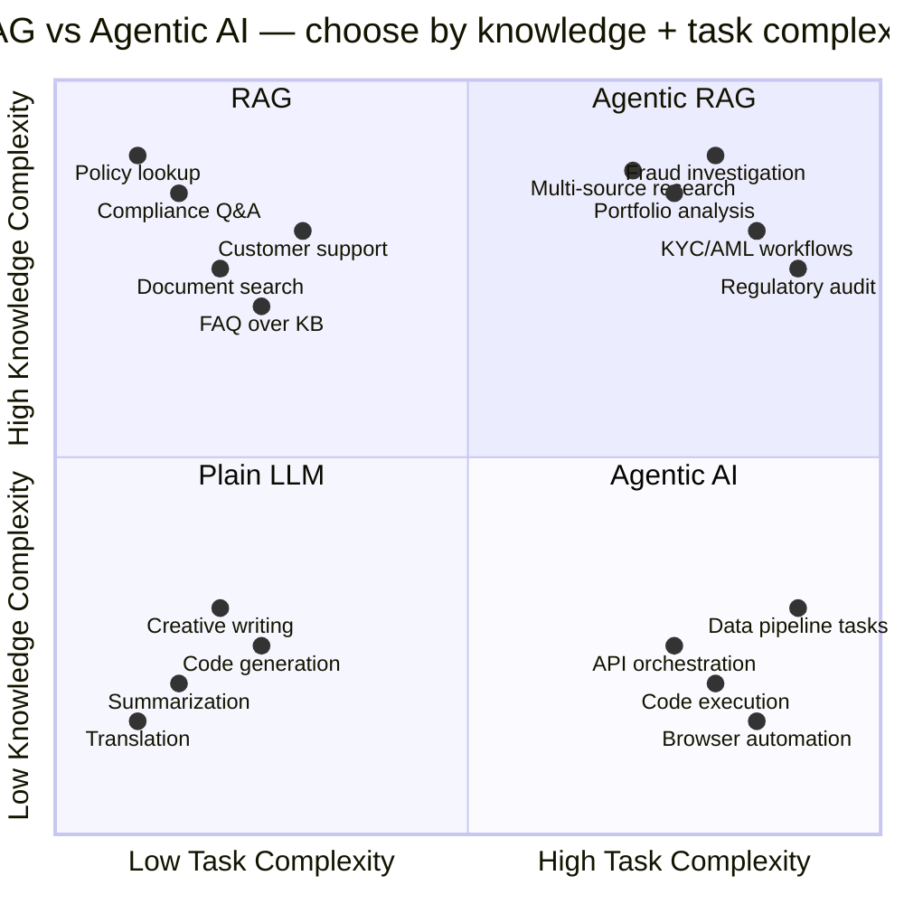
```mermaid
quadrantChart
    title RAG vs Agentic AI — choose by knowledge + task complexity
    x-axis Low Task Complexity --> High Task Complexity
    y-axis Low Knowledge Complexity --> High Knowledge Complexity
    quadrant-1 Agentic RAG
    quadrant-2 RAG
    quadrant-3 Plain LLM
    quadrant-4 Agentic AI
    Compliance Q&A: [0.15, 0.85]
    Document search: [0.20, 0.75]
    Policy lookup: [0.10, 0.90]
    FAQ over KB: [0.25, 0.70]
    Customer support: [0.30, 0.80]
    Fraud investigation: [0.80, 0.90]
    Portfolio analysis: [0.75, 0.85]
    KYC/AML workflows: [0.85, 0.80]
    Regulatory audit: [0.90, 0.75]
    Multi-source research: [0.70, 0.88]
    Summarization: [0.15, 0.20]
    Translation: [0.10, 0.15]
    Code generation: [0.25, 0.25]
    Creative writing: [0.20, 0.30]
    Code execution: [0.80, 0.20]
    Browser automation: [0.85, 0.15]
    API orchestration: [0.75, 0.25]
    Data pipeline tasks: [0.90, 0.30]
```

Always follow the Mermaid block with this ASCII fallback for contexts where Mermaid doesn't render:

```
                    HIGH knowledge complexity
                            │
          RAG               │         Agentic RAG
    (retrieve + answer)     │    (plan + retrieve + act)
    • Compliance Q&A        │    • Fraud investigation
    • Document search       │    • Portfolio analysis
    • Policy lookup         │    • KYC / AML workflows
                            │
────────────────────────────┼────────────────────────────
                            │
      Plain LLM             │       Agentic AI
    (no retrieval)          │    (plan + act, no docs)
    • Summarization         │    • Code execution
    • Translation           │    • API orchestration
    • Code generation       │    • Browser automation
                            │
                    LOW knowledge complexity
```

### A.2 — Design Layers Summary

**Target:** README.md, Section "Production design layers"

This is a summary table (not a diagram). The full Mermaid flowcharts for each layer go in `docs/architecture/design_layers.md`.

```markdown
| Layer | Name | Priority | One-line summary |
|-------|------|----------|-----------------|
| 1 | Data & Ingestion | 🔴 Critical | Sets the quality ceiling for everything downstream |
| 2 | Embedding | 🔴 Critical | Defines what "similar" means in your system |
| 3 | Index & Storage | 🟡 Important | Determines retrieval speed and scale limits |
| 4 | Retrieval | 🔴 Critical | Highest-ROI layer to tune — start here |
| 5 | Generation | 🟡 Important | How you pack and use retrieved context |
| 6 | Evaluation | 🔴 Critical | Cannot improve what you don't measure |
| 7 | Latency & Cost | 🟡 Important | The layer that kills POCs in production |
| 8 | Security & Ops | 🔴 Critical | Non-negotiable in fintech |
```

### A.3 — Pattern Summary Table

**Target:** README.md, Section "The 26 RAG patterns" (used as a compact reference table)

```markdown
| # | Pattern | Category | Core idea | Module |
|---|---------|----------|-----------|--------|
| 1 | Naive RAG | Foundational | Chunk → embed → retrieve → generate | [→](modules/01_naive_rag/) |
| 2 | Advanced RAG | Foundational | Pre/post retrieval processing | [→](modules/02_advanced_rag/) |
| 3 | Hybrid RAG | Retrieval | BM25 + dense + RRF fusion | [→](modules/03_hybrid_rag/) |
| 4 | RAG Fusion | Retrieval | Multi-query + RRF | [→](modules/04_rag_fusion/) |
| 5 | Multi-Query | Retrieval | N query perspectives | [→](modules/05_multi_query_rag/) |
| 6 | HyDE | Retrieval | Hypothetical doc embedding | [→](modules/06_hyde/) |
| 7 | Step-Back | Retrieval | Abstract before retrieve | [→](modules/07_step_back_rag/) |
| 8 | FLARE | Retrieval | Forward-looking active retrieval | [→](modules/08_flare/) |
| 9 | Ensemble | Retrieval | Multi-retriever voting | [→](modules/09_ensemble_rag/) |
| 10 | Parent Document | Indexing | Small index, large return | [→](modules/10_parent_document/) |
| 11 | Sentence Window | Indexing | Sentence embed, window return | [→](modules/11_sentence_window/) |
| 12 | RAPTOR | Indexing | Recursive tree abstraction | [→](modules/12_raptor/) |
| 13 | Contextual RAG | Indexing | Context-prepended chunks | [→](modules/13_contextual_rag/) |
| 14 | Multi-Vector | Indexing | Multiple embeddings per doc | [→](modules/14_multi_vector_rag/) |
| 15 | Long-Context | Indexing | Full doc context stuffing | [→](modules/15_long_context_rag/) |
| 16 | Self-RAG | Reasoning | Reflection tokens | [→](modules/16_self_rag/) |
| 17 | CRAG | Reasoning | Grade + fallback loop | [→](modules/17_corrective_rag/) |
| 18 | IRCoT | Reasoning | Interleaved CoT + retrieval | [→](modules/18_ircot/) |
| 19 | Speculative | Reasoning | Draft → verify | [→](modules/19_speculative_rag/) |
| 20 | Adaptive | Reasoning | Complexity-based routing | [→](modules/20_adaptive_rag/) |
| 21 | Modular | Architecture | Plug-in components | [→](modules/21_modular_rag/) |
| 22 | Agentic | Architecture | ReAct + tools | [→](modules/22_agentic_rag/) |
| 23 | Multi-Hop | Architecture | Bridge entity chains | [→](modules/23_multi_hop_rag/) |
| 24 | Graph RAG | Specialized | KG + vector hybrid | [→](modules/24_graph_rag/) |
| 25 | Multi-Modal | Specialized | Vision + text retrieval | [→](modules/25_multimodal_rag/) |
| 26 | Temporal | Specialized | Time-weighted retrieval | [→](modules/26_temporal_rag/) |
```

---

## Part B — Design Layer Diagrams

**Target:** `docs/architecture/design_layers.md` (one diagram per layer)

These detailed flowcharts describe each of the 8 production design layers. They do NOT go in README.md (which links to this doc instead).

### Layer 1: Data & Ingestion

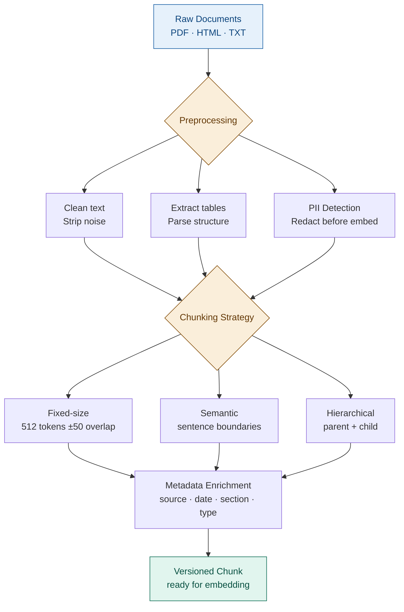
```mermaid
flowchart TD
    A[Raw Documents\nPDF · HTML · TXT] --> B{Preprocessing}
    B --> C[Clean text\nStrip noise]
    B --> D[Extract tables\nParse structure]
    B --> E[PII Detection\nRedact before embed]
    C --> F{Chunking Strategy}
    D --> F
    E --> F
    F --> G[Fixed-size\n512 tokens ±50 overlap]
    F --> H[Semantic\nsentence boundaries]
    F --> I[Hierarchical\nparent + child]
    G --> J[Metadata Enrichment\nsource · date · section · type]
    H --> J
    I --> J
    J --> K[Versioned Chunk\nready for embedding]

    style A fill:#E6F1FB,stroke:#185FA5,color:#0C447C
    style K fill:#E1F5EE,stroke:#0F6E56,color:#085041
    style F fill:#FAEEDA,stroke:#854F0B,color:#633806
    style B fill:#FAEEDA,stroke:#854F0B,color:#633806
```

### Layer 2: Embedding

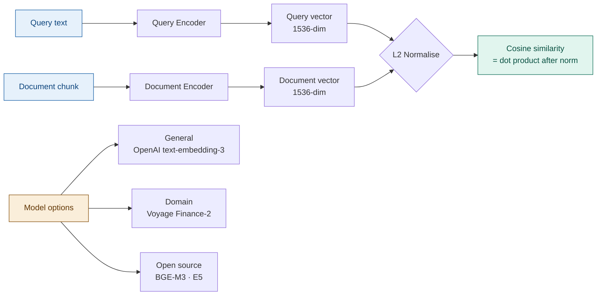
```mermaid
flowchart LR
    A[Query text] --> B[Query Encoder]
    C[Document chunk] --> D[Document Encoder]
    B --> E[Query vector\n1536-dim]
    D --> F[Document vector\n1536-dim]
    E --> G{L2 Normalise}
    F --> G
    G --> H[Cosine similarity\n= dot product after norm]

    I[Model options] --> J[General\nOpenAI text-embedding-3]
    I --> K[Domain\nVoyage Finance-2]
    I --> L[Open source\nBGE-M3 · E5]

    style A fill:#E6F1FB,stroke:#185FA5,color:#0C447C
    style C fill:#E6F1FB,stroke:#185FA5,color:#0C447C
    style H fill:#E1F5EE,stroke:#0F6E56,color:#085041
    style I fill:#FAEEDA,stroke:#854F0B,color:#633806
```

### Layer 3: Index & Storage

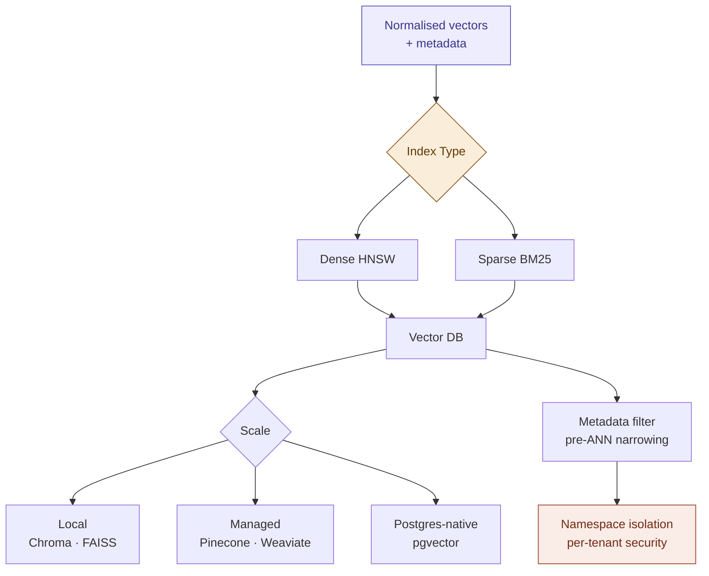
```mermaid
flowchart TD
    A[Normalised vectors\n+ metadata] --> B{Index Type}
    B --> C[Dense HNSW]
    B --> D[Sparse BM25]
    C --> E[Vector DB]
    D --> E
    E --> F{Scale}
    F --> G[Local\nChroma · FAISS]
    F --> H[Managed\nPinecone · Weaviate]
    F --> I[Postgres-native\npgvector]
    E --> J[Metadata filter\npre-ANN narrowing]
    J --> K[Namespace isolation\nper-tenant security]

    style A fill:#EEEDFE,stroke:#534AB7,color:#3C3489
    style B fill:#FAEEDA,stroke:#854F0B,color:#633806
    style K fill:#FAECE7,stroke:#993C1D,color:#712B13
```

### Layer 4: Retrieval

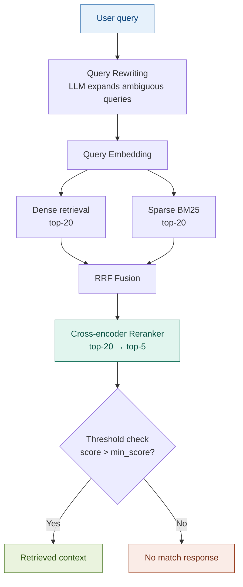
```mermaid
flowchart TD
    Q[User query] --> QR[Query Rewriting\nLLM expands ambiguous queries]
    QR --> QE[Query Embedding]
    QE --> R1[Dense retrieval\ntop-20]
    QE --> R2[Sparse BM25\ntop-20]
    R1 --> F[RRF Fusion]
    R2 --> F
    F --> RR[Cross-encoder Reranker\ntop-20 → top-5]
    RR --> T{Threshold check\nscore > min_score?}
    T -->|Yes| CTX[Retrieved context]
    T -->|No| ND[No match response]

    style Q fill:#E6F1FB,stroke:#185FA5,color:#0C447C
    style RR fill:#E1F5EE,stroke:#0F6E56,color:#085041
    style CTX fill:#EAF3DE,stroke:#3B6D11,color:#27500A
    style ND fill:#FAECE7,stroke:#993C1D,color:#712B13
```

### Layer 5: Generation

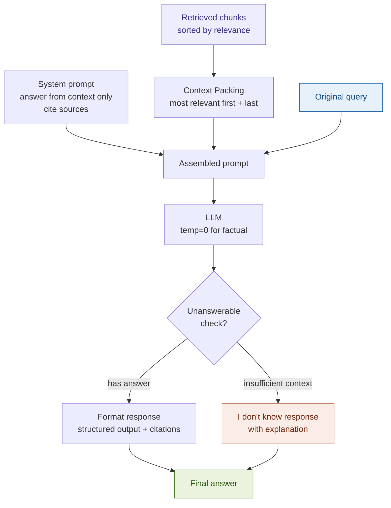
```mermaid
flowchart TD
    CTX[Retrieved chunks\nsorted by relevance] --> PACK[Context Packing\nmost relevant first + last]
    SYS[System prompt\nanswer from context only\ncite sources] --> PROMPT[Assembled prompt]
    PACK --> PROMPT
    Q[Original query] --> PROMPT
    PROMPT --> LLM[LLM\ntemp=0 for factual]
    LLM --> CHK{Unanswerable\ncheck?}
    CHK -->|has answer| FMT[Format response\nstructured output + citations]
    CHK -->|insufficient context| IDK[I don't know response\nwith explanation]
    FMT --> A[Final answer]
    IDK --> A

    style CTX fill:#EEEDFE,stroke:#534AB7,color:#3C3489
    style Q fill:#E6F1FB,stroke:#185FA5,color:#0C447C
    style A fill:#EAF3DE,stroke:#3B6D11,color:#27500A
    style IDK fill:#FAECE7,stroke:#993C1D,color:#712B13
```

### Layer 6: Evaluation

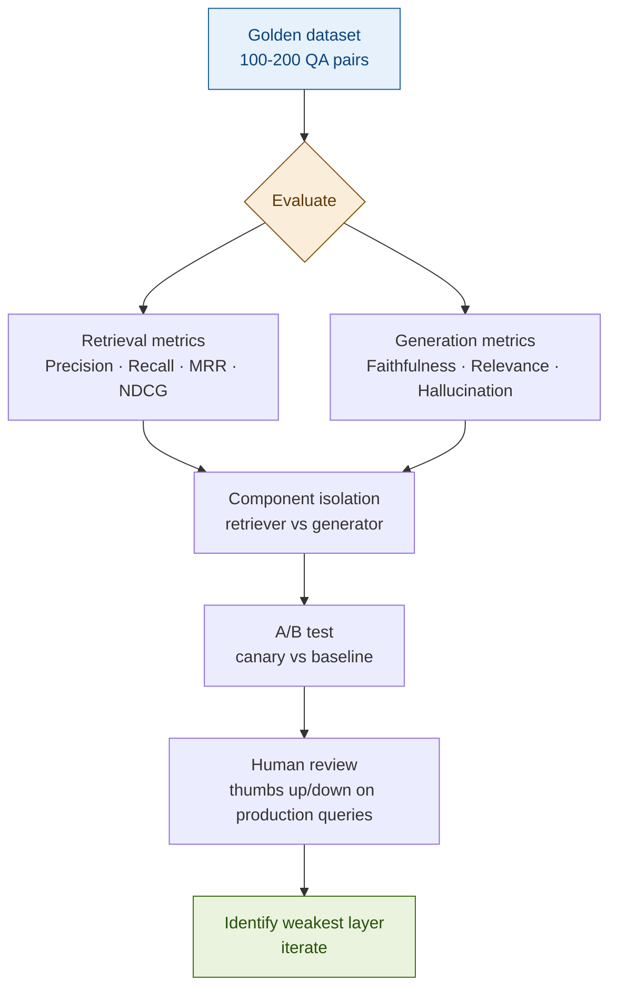
```mermaid
flowchart TD
    GOLDEN[Golden dataset\n100-200 QA pairs] --> EVAL{Evaluate}
    EVAL --> RET_M[Retrieval metrics\nPrecision · Recall · MRR · NDCG]
    EVAL --> GEN_M[Generation metrics\nFaithfulness · Relevance · Hallucination]
    RET_M --> COMP[Component isolation\nretriever vs generator]
    GEN_M --> COMP
    COMP --> AB[A/B test\ncanary vs baseline]
    AB --> HITL[Human review\nthumbs up/down on production queries]
    HITL --> IMPROVE[Identify weakest layer\niterate]

    style GOLDEN fill:#E6F1FB,stroke:#185FA5,color:#0C447C
    style EVAL fill:#FAEEDA,stroke:#854F0B,color:#633806
    style IMPROVE fill:#EAF3DE,stroke:#3B6D11,color:#27500A
```

### Layer 7: Latency & Cost

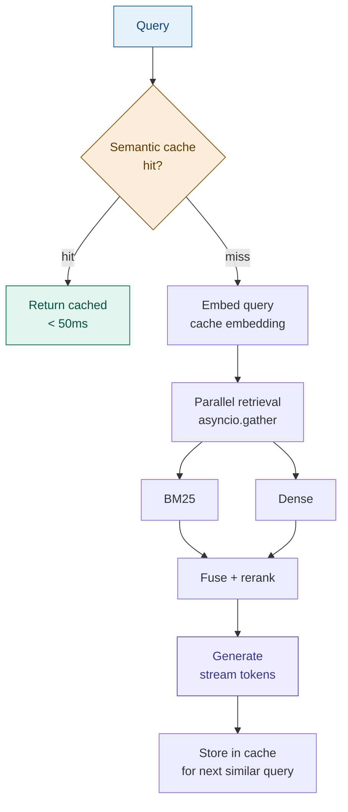
```mermaid
flowchart TD
    Q[Query] --> CACHE{Semantic cache\nhit?}
    CACHE -->|hit| CACHED[Return cached\n< 50ms]
    CACHE -->|miss| EMB[Embed query\ncache embedding]
    EMB --> PAR[Parallel retrieval\nasyncio.gather]
    PAR --> BM25[BM25] & DENSE[Dense]
    BM25 --> FUSE[Fuse + rerank]
    DENSE --> FUSE
    FUSE --> GEN[Generate\nstream tokens]
    GEN --> STORE[Store in cache\nfor next similar query]

    style Q fill:#E6F1FB,stroke:#185FA5,color:#0C447C
    style CACHED fill:#E1F5EE,stroke:#0F6E56,color:#085041
    style CACHE fill:#FAEEDA,stroke:#854F0B,color:#633806
    style GEN fill:#EEEDFE,stroke:#534AB7,color:#3C3489
```

### Layer 8: Security & Ops

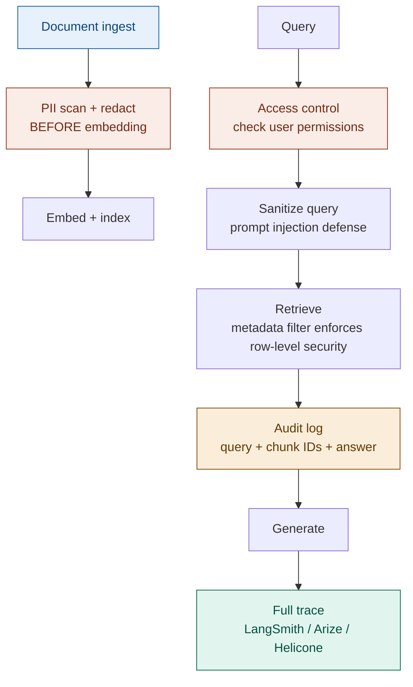
```mermaid
flowchart TD
    INGEST[Document ingest] --> PII[PII scan + redact\nBEFORE embedding]
    PII --> EMBED[Embed + index]

    Q[Query] --> AUTH[Access control\ncheck user permissions]
    AUTH --> SANITIZE[Sanitize query\nprompt injection defense]
    SANITIZE --> RETRIEVE[Retrieve\nmetadata filter enforces row-level security]
    RETRIEVE --> AUDIT[Audit log\nquery + chunk IDs + answer]
    AUDIT --> GEN[Generate]
    GEN --> TRACE[Full trace\nLangSmith / Arize / Helicone]

    style INGEST fill:#E6F1FB,stroke:#185FA5,color:#0C447C
    style PII fill:#FAECE7,stroke:#993C1D,color:#712B13
    style AUTH fill:#FAECE7,stroke:#993C1D,color:#712B13
    style AUDIT fill:#FAEEDA,stroke:#854F0B,color:#633806
    style TRACE fill:#E1F5EE,stroke:#0F6E56,color:#085041
```

---

## Part C — Per-Pattern Architecture Diagrams

**Target:** Each diagram goes in:
1. `README.md` — in the relevant pattern section (primary discovery surface)
2. `modules/XX_pattern/SKILL.md` — under the `## Architecture` section (deep reference)

Below is the complete catalog. When building a module's SKILL.md, copy the relevant diagram into it.

---

### Pattern 01 — Naive RAG

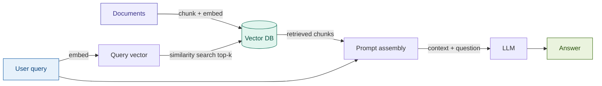
```mermaid
flowchart LR
    D[Documents] -->|chunk + embed| VDB[(Vector DB)]
    Q[User query] -->|embed| QV[Query vector]
    QV -->|similarity search top-k| VDB
    VDB -->|retrieved chunks| P[Prompt assembly]
    Q --> P
    P -->|context + question| LLM[LLM]
    LLM --> A[Answer]

    style D fill:#EEEDFE,stroke:#534AB7,color:#3C3489
    style Q fill:#E6F1FB,stroke:#185FA5,color:#0C447C
    style VDB fill:#E1F5EE,stroke:#0F6E56,color:#085041
    style A fill:#EAF3DE,stroke:#3B6D11,color:#27500A
```

### Pattern 02 — Advanced RAG

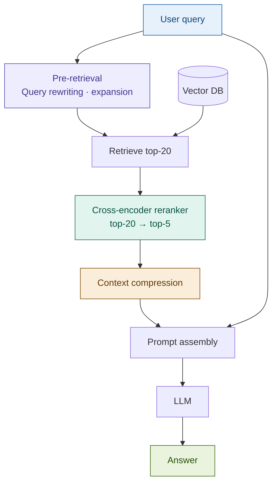
```mermaid
flowchart TD
    Q[User query] --> QR[Pre-retrieval\nQuery rewriting · expansion]
    QR --> R[Retrieve top-20]
    D[(Vector DB)] --> R
    R --> RR[Cross-encoder reranker\ntop-20 → top-5]
    RR --> CC[Context compression]
    CC --> P[Prompt assembly]
    Q --> P
    P --> LLM[LLM]
    LLM --> A[Answer]

    style Q fill:#E6F1FB,stroke:#185FA5,color:#0C447C
    style QR fill:#EEEDFE,stroke:#534AB7,color:#3C3489
    style RR fill:#E1F5EE,stroke:#0F6E56,color:#085041
    style CC fill:#FAEEDA,stroke:#854F0B,color:#633806
    style A fill:#EAF3DE,stroke:#3B6D11,color:#27500A
```

### Pattern 03 — Hybrid RAG

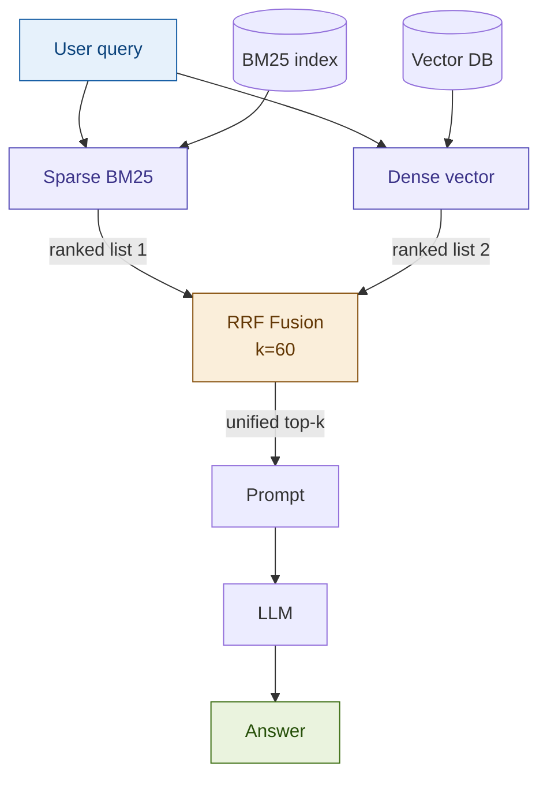
```mermaid
flowchart TD
    Q[User query] --> S1[Sparse BM25]
    Q --> S2[Dense vector]
    S1 -->|ranked list 1| F[RRF Fusion\nk=60]
    S2 -->|ranked list 2| F
    F -->|unified top-k| P[Prompt]
    P --> LLM[LLM]
    LLM --> A[Answer]
    D1[(BM25 index)] --> S1
    D2[(Vector DB)] --> S2

    style Q fill:#E6F1FB,stroke:#185FA5,color:#0C447C
    style S1 fill:#EEEDFE,stroke:#534AB7,color:#3C3489
    style S2 fill:#EEEDFE,stroke:#534AB7,color:#3C3489
    style F fill:#FAEEDA,stroke:#854F0B,color:#633806
    style A fill:#EAF3DE,stroke:#3B6D11,color:#27500A
```

### Pattern 04 — RAG Fusion

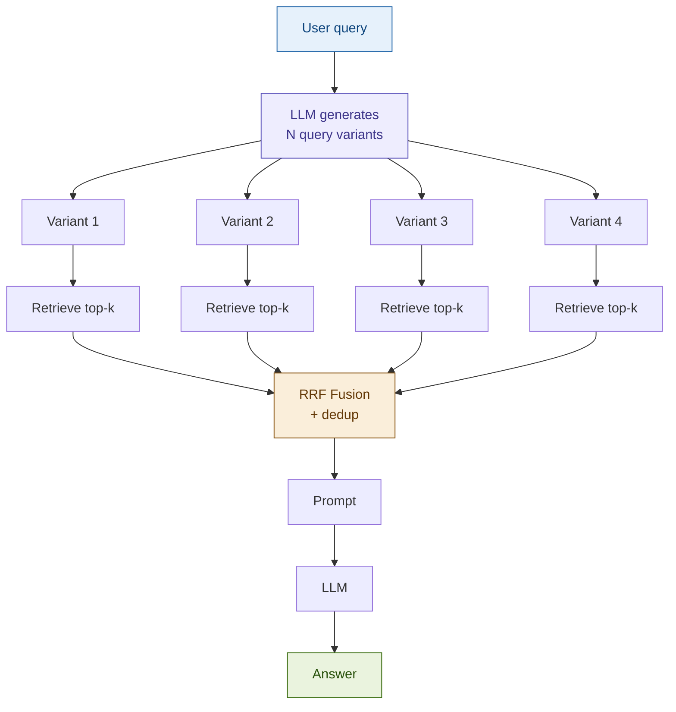
```mermaid
flowchart TD
    Q[User query] --> QG[LLM generates\nN query variants]
    QG --> Q1[Variant 1] & Q2[Variant 2] & Q3[Variant 3] & Q4[Variant 4]
    Q1 --> R1[Retrieve top-k]
    Q2 --> R2[Retrieve top-k]
    Q3 --> R3[Retrieve top-k]
    Q4 --> R4[Retrieve top-k]
    R1 & R2 & R3 & R4 --> F[RRF Fusion\n+ dedup]
    F --> P[Prompt] --> LLM[LLM] --> A[Answer]

    style Q fill:#E6F1FB,stroke:#185FA5,color:#0C447C
    style QG fill:#EEEDFE,stroke:#534AB7,color:#3C3489
    style F fill:#FAEEDA,stroke:#854F0B,color:#633806
    style A fill:#EAF3DE,stroke:#3B6D11,color:#27500A
```

### Pattern 05 — Multi-Query RAG

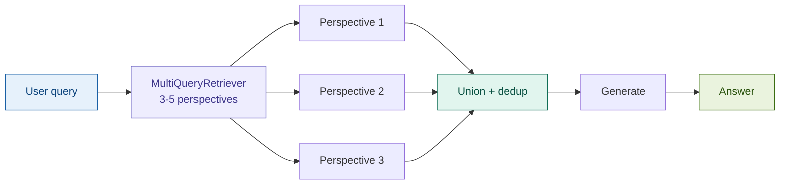
```mermaid
flowchart LR
    Q[User query] --> MQ[MultiQueryRetriever\n3-5 perspectives]
    MQ --> P1[Perspective 1] & P2[Perspective 2] & P3[Perspective 3]
    P1 & P2 & P3 --> U[Union + dedup]
    U --> G[Generate] --> A[Answer]

    style Q fill:#E6F1FB,stroke:#185FA5,color:#0C447C
    style MQ fill:#EEEDFE,stroke:#534AB7,color:#3C3489
    style U fill:#E1F5EE,stroke:#0F6E56,color:#085041
    style A fill:#EAF3DE,stroke:#3B6D11,color:#27500A
```

### Pattern 06 — HyDE

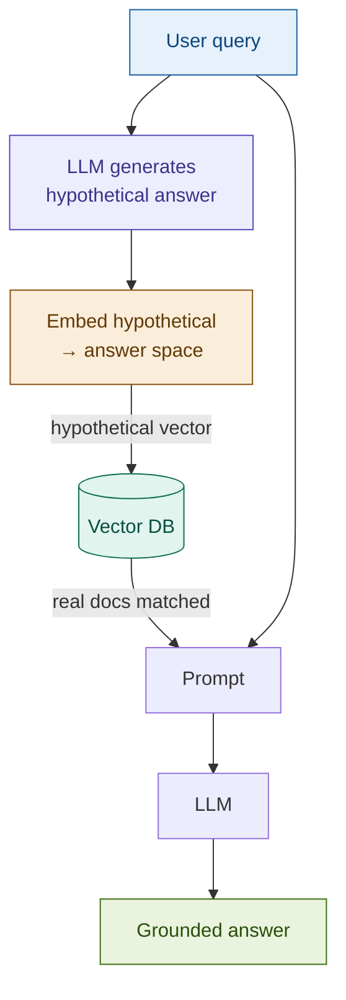
```mermaid
flowchart TD
    Q[User query] --> LLM1[LLM generates\nhypothetical answer]
    LLM1 --> HE[Embed hypothetical\n→ answer space]
    HE -->|hypothetical vector| VDB[(Vector DB)]
    VDB -->|real docs matched| P[Prompt]
    Q --> P
    P --> LLM2[LLM] --> A[Grounded answer]

    style Q fill:#E6F1FB,stroke:#185FA5,color:#0C447C
    style LLM1 fill:#EEEDFE,stroke:#534AB7,color:#3C3489
    style HE fill:#FAEEDA,stroke:#854F0B,color:#633806
    style VDB fill:#E1F5EE,stroke:#0F6E56,color:#085041
    style A fill:#EAF3DE,stroke:#3B6D11,color:#27500A
```

### Pattern 07 — Step-Back RAG

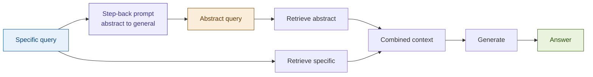
```mermaid
flowchart LR
    Q[Specific query] --> SB[Step-back prompt\nabstract to general]
    SB --> AQ[Abstract query]
    AQ --> R1[Retrieve abstract]
    Q --> R2[Retrieve specific]
    R1 & R2 --> C[Combined context]
    C --> G[Generate] --> A[Answer]

    style Q fill:#E6F1FB,stroke:#185FA5,color:#0C447C
    style SB fill:#EEEDFE,stroke:#534AB7,color:#3C3489
    style AQ fill:#FAEEDA,stroke:#854F0B,color:#633806
    style A fill:#EAF3DE,stroke:#3B6D11,color:#27500A
```

### Pattern 08 — FLARE

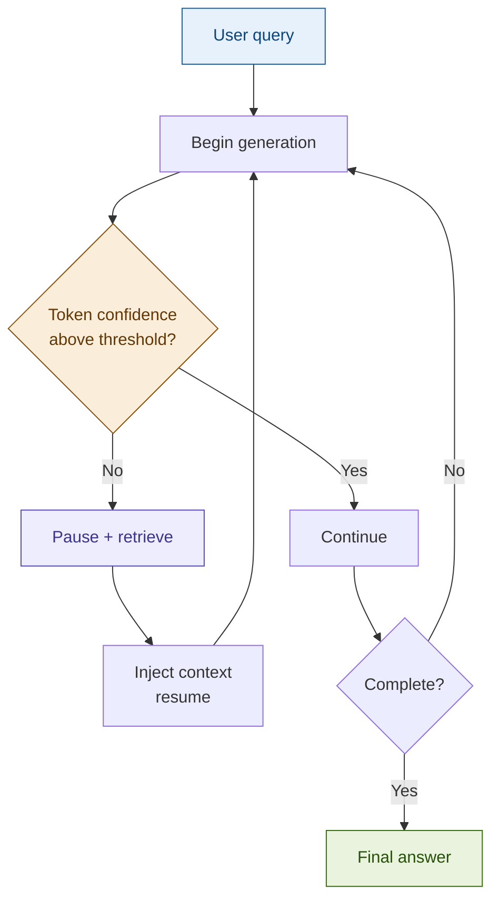
```mermaid
flowchart TD
    Q[User query] --> GEN[Begin generation]
    GEN --> CONF{Token confidence\nabove threshold?}
    CONF -->|Yes| CONT[Continue]
    CONF -->|No| RET[Pause + retrieve]
    RET --> INJECT[Inject context\nresume]
    INJECT --> GEN
    CONT --> DONE{Complete?}
    DONE -->|No| GEN
    DONE -->|Yes| A[Final answer]

    style Q fill:#E6F1FB,stroke:#185FA5,color:#0C447C
    style CONF fill:#FAEEDA,stroke:#854F0B,color:#633806
    style RET fill:#EEEDFE,stroke:#534AB7,color:#3C3489
    style A fill:#EAF3DE,stroke:#3B6D11,color:#27500A
```

### Pattern 09 — Ensemble RAG

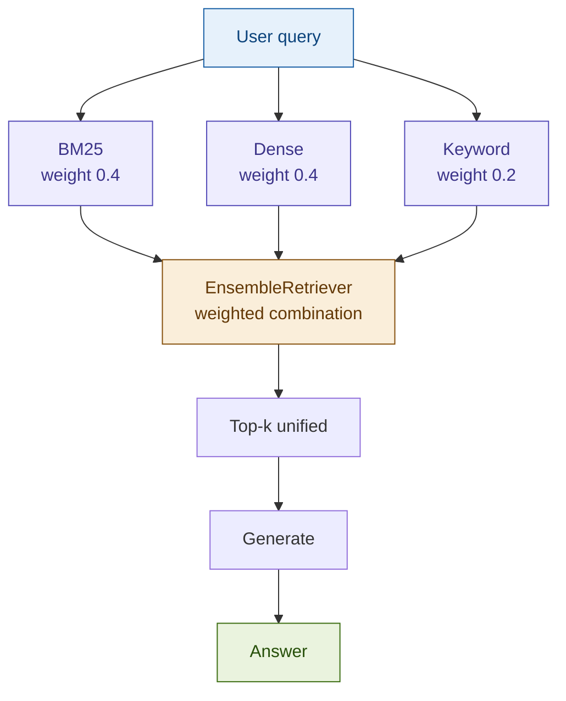
```mermaid
flowchart TD
    Q[User query] --> R1[BM25\nweight 0.4] & R2[Dense\nweight 0.4] & R3[Keyword\nweight 0.2]
    R1 & R2 & R3 --> E[EnsembleRetriever\nweighted combination]
    E --> TOP[Top-k unified] --> G[Generate] --> A[Answer]

    style Q fill:#E6F1FB,stroke:#185FA5,color:#0C447C
    style R1 fill:#EEEDFE,stroke:#534AB7,color:#3C3489
    style R2 fill:#EEEDFE,stroke:#534AB7,color:#3C3489
    style R3 fill:#EEEDFE,stroke:#534AB7,color:#3C3489
    style E fill:#FAEEDA,stroke:#854F0B,color:#633806
    style A fill:#EAF3DE,stroke:#3B6D11,color:#27500A
```

### Pattern 10 — Parent Document Retrieval

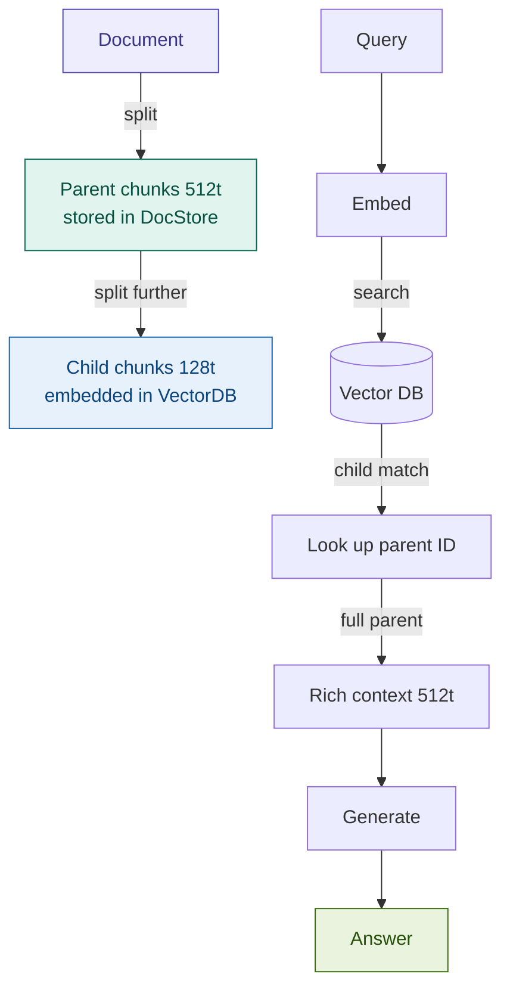
```mermaid
flowchart TD
    D[Document] -->|split| PAR[Parent chunks 512t\nstored in DocStore]
    PAR -->|split further| CHILD[Child chunks 128t\nembedded in VectorDB]
    Q[Query] --> E[Embed] -->|search| VDB[(Vector DB)]
    VDB -->|child match| LOOKUP[Look up parent ID]
    LOOKUP -->|full parent| CTX[Rich context 512t]
    CTX --> G[Generate] --> A[Answer]

    style D fill:#EEEDFE,stroke:#534AB7,color:#3C3489
    style CHILD fill:#E6F1FB,stroke:#185FA5,color:#0C447C
    style PAR fill:#E1F5EE,stroke:#0F6E56,color:#085041
    style A fill:#EAF3DE,stroke:#3B6D11,color:#27500A
```

### Pattern 11 — Sentence Window Retrieval

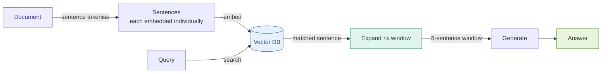
```mermaid
flowchart LR
    D[Document] -->|sentence tokenise| S[Sentences\neach embedded individually]
    S -->|embed| VDB[(Vector DB)]
    Q[Query] -->|search| VDB
    VDB -->|matched sentence| EXP[Expand ±k window]
    EXP -->|5-sentence window| G[Generate] --> A[Answer]

    style D fill:#EEEDFE,stroke:#534AB7,color:#3C3489
    style VDB fill:#E6F1FB,stroke:#185FA5,color:#0C447C
    style EXP fill:#E1F5EE,stroke:#0F6E56,color:#085041
    style A fill:#EAF3DE,stroke:#3B6D11,color:#27500A
```

### Pattern 12 — RAPTOR

```mermaid
flowchart TD
    D[Leaf chunks] -->|embed + cluster| C1[Cluster 1] & C2[Cluster 2] & C3[Cluster 3]
    C1 & C2 & C3 -->|LLM summarise| S[Level 1 summaries]
    S -->|cluster again| ROOT[Root summary]
    Q[Query] --> QL{Query type}
    QL -->|broad| ROOT
    QL -->|specific| D
    ROOT & D --> G[Generate] --> A[Answer]

    style D fill:#EEEDFE,stroke:#534AB7,color:#3C3489
    style ROOT fill:#E1F5EE,stroke:#0F6E56,color:#085041
    style QL fill:#FAEEDA,stroke:#854F0B,color:#633806
    style A fill:#EAF3DE,stroke:#3B6D11,color:#27500A
```

### Pattern 13 — Contextual RAG

```mermaid
flowchart TD
    D[Document] -->|split| CHUNKS[Raw chunks]
    CHUNKS --> CTX_GEN[Claude generates context\nper chunk]
    CTX_GEN --> ENRICH[Prepend context to chunk]
    ENRICH -->|embed enriched| VDB[(Vector DB)]
    Q[Query] -->|embed| VDB
    VDB --> G[Generate] --> A[Answer with\ndocument awareness]

    style D fill:#EEEDFE,stroke:#534AB7,color:#3C3489
    style CTX_GEN fill:#E1F5EE,stroke:#0F6E56,color:#085041
    style ENRICH fill:#FAEEDA,stroke:#854F0B,color:#633806
    style A fill:#EAF3DE,stroke:#3B6D11,color:#27500A
```

### Pattern 14 — Multi-Vector RAG

```mermaid
flowchart LR
    D[Document] --> V1[Full text embed]
    D -->|LLM| SUM[Summary embed]
    D -->|LLM| HQ[Question embeds]
    V1 & SUM & HQ -->|all → same doc_id| VDB[(Vector DB)]
    DS[(DocStore)] -.->|lookup| RET
    Q[Query] -->|embed| VDB --> RET[Return full doc]
    RET --> G[Generate] --> A[Answer]

    style D fill:#EEEDFE,stroke:#534AB7,color:#3C3489
    style VDB fill:#E6F1FB,stroke:#185FA5,color:#0C447C
    style DS fill:#E1F5EE,stroke:#0F6E56,color:#085041
    style A fill:#EAF3DE,stroke:#3B6D11,color:#27500A
```

### Pattern 15 — Long-Context RAG

```mermaid
flowchart LR
    D[(Large corpus)] --> R[Retrieve broadly\ntop-30 to top-50]
    Q[Query] --> R
    R -->|reorder by relevance| PACK[Pack into 200k window]
    PACK --> LLM[Claude 200k] --> A[Comprehensive answer]

    style D fill:#EEEDFE,stroke:#534AB7,color:#3C3489
    style Q fill:#E6F1FB,stroke:#185FA5,color:#0C447C
    style PACK fill:#FAEEDA,stroke:#854F0B,color:#633806
    style A fill:#EAF3DE,stroke:#3B6D11,color:#27500A
```

### Pattern 16 — Self-RAG

```mermaid
flowchart TD
    Q[Query] --> DEC{Retrieve?\nISREL}
    DEC -->|no| NRET[Generate directly]
    DEC -->|yes| RET[Retrieve top-k]
    RET --> GRADE{Relevant?\nISREL}
    GRADE -->|no| SKIP[Skip chunk]
    GRADE -->|yes| GEN[Generate]
    GEN --> SUPP{Supported?\nISSUP}
    SUPP -->|no| REGEN[Regenerate]
    SUPP -->|yes| UTIL{Useful?\nISUSE}
    UTIL -->|yes| A[Final answer]
    UTIL -->|no| NEXT[Try next chunk]

    style Q fill:#E6F1FB,stroke:#185FA5,color:#0C447C
    style DEC fill:#FAEEDA,stroke:#854F0B,color:#633806
    style REGEN fill:#FAECE7,stroke:#993C1D,color:#712B13
    style A fill:#EAF3DE,stroke:#3B6D11,color:#27500A
```

### Pattern 17 — Corrective RAG (CRAG)

```mermaid
flowchart TD
    Q[Query] --> RET[Retrieve from internal KB]
    RET --> GRADE[Relevance grader\nscore 1-3]
    GRADE --> DEC{Score?}
    DEC -->|≥ 2 CORRECT| REF[Refine: strip irrelevant]
    DEC -->|1-2 AMBIGUOUS| BOTH[Internal + web search]
    DEC -->|< 1 INCORRECT| WEB[Web search fallback]
    REF & BOTH & WEB --> GEN[Generate] --> A[Answer]

    style Q fill:#E6F1FB,stroke:#185FA5,color:#0C447C
    style GRADE fill:#EEEDFE,stroke:#534AB7,color:#3C3489
    style DEC fill:#FAEEDA,stroke:#854F0B,color:#633806
    style WEB fill:#FAECE7,stroke:#993C1D,color:#712B13
    style A fill:#EAF3DE,stroke:#3B6D11,color:#27500A
```

### Pattern 18 — IRCoT

```mermaid
flowchart TD
    Q[Complex query] --> COT1[CoT step 1]
    COT1 --> T1{Need fact?}
    T1 -->|yes| R1[Retrieve]
    R1 --> COT2[CoT step 2]
    T1 -->|no| COT2
    COT2 --> T2{Need fact?}
    T2 -->|yes| R2[Retrieve]
    R2 --> COT3[CoT step 3]
    T2 -->|no| COT3
    COT3 --> A[Answer with reasoning trace]

    style Q fill:#E6F1FB,stroke:#185FA5,color:#0C447C
    style COT1 fill:#EEEDFE,stroke:#534AB7,color:#3C3489
    style COT2 fill:#EEEDFE,stroke:#534AB7,color:#3C3489
    style R1 fill:#E1F5EE,stroke:#0F6E56,color:#085041
    style A fill:#EAF3DE,stroke:#3B6D11,color:#27500A
```

### Pattern 19 — Speculative RAG

```mermaid
flowchart LR
    Q[Query] --> DRAFT[Small LLM\ndraft answer]
    Q --> RET[Retrieve top-k]
    DRAFT & RET --> VER[Large LLM\nverify + correct]
    VER --> A[Final answer]

    style Q fill:#E6F1FB,stroke:#185FA5,color:#0C447C
    style DRAFT fill:#EEEDFE,stroke:#534AB7,color:#3C3489
    style RET fill:#E1F5EE,stroke:#0F6E56,color:#085041
    style VER fill:#FAEEDA,stroke:#854F0B,color:#633806
    style A fill:#EAF3DE,stroke:#3B6D11,color:#27500A
```

### Pattern 20 — Adaptive RAG

```mermaid
flowchart TD
    Q[Query] --> CLASS[Complexity classifier]
    CLASS --> DEC{Level?}
    DEC -->|0 simple| DIRECT[Direct LLM]
    DEC -->|1 moderate| SINGLE[Standard RAG]
    DEC -->|2 complex| MULTI[Multi-step RAG]
    DIRECT & SINGLE & MULTI --> A[Answer]

    style Q fill:#E6F1FB,stroke:#185FA5,color:#0C447C
    style CLASS fill:#EEEDFE,stroke:#534AB7,color:#3C3489
    style DEC fill:#FAEEDA,stroke:#854F0B,color:#633806
    style A fill:#EAF3DE,stroke:#3B6D11,color:#27500A
```

### Pattern 21 — Modular RAG

```mermaid
flowchart LR
    Q[Query] --> P[RAGPipeline\nFacade]
    P --> A_R[Retriever A] & B_R[Retriever B]
    A_R & B_R --> RR[Reranker]
    RR --> G[Generator] --> ANS[Answer]
    SWAP[Swap components\nvia Builder] -.-> B_R
    SWAP2[Swap reranker] -.-> RR

    style Q fill:#E6F1FB,stroke:#185FA5,color:#0C447C
    style P fill:#EEEDFE,stroke:#534AB7,color:#3C3489
    style RR fill:#E1F5EE,stroke:#0F6E56,color:#085041
    style SWAP fill:#FAEEDA,stroke:#854F0B,color:#633806
    style ANS fill:#EAF3DE,stroke:#3B6D11,color:#27500A
```

### Pattern 22 — Agentic RAG

```mermaid
flowchart TD
    Q[Complex query] --> AGENT[ReAct Agent]
    AGENT --> THINK[Think: what do I need?]
    THINK --> TOOL{Choose tool}
    TOOL --> RET[retrieve_docs] & ESG[get_esg_ratings] & PORT[get_portfolio]
    RET & ESG & PORT --> OBS[Observe]
    OBS --> THINK2{Enough?}
    THINK2 -->|no| TOOL
    THINK2 -->|yes| GEN[Generate] --> A[Answer]

    style Q fill:#E6F1FB,stroke:#185FA5,color:#0C447C
    style AGENT fill:#EEEDFE,stroke:#534AB7,color:#3C3489
    style TOOL fill:#FAEEDA,stroke:#854F0B,color:#633806
    style A fill:#EAF3DE,stroke:#3B6D11,color:#27500A
```

### Pattern 23 — Multi-Hop RAG

```mermaid
flowchart LR
    Q[Bridge question] --> H1[Hop 1\nFind entity]
    H1 -->|bridge entity| H2[Hop 2\nFind jurisdiction]
    H2 -->|bridge entity| H3[Hop 3\nFind regulations]
    H3 --> CHAIN[Full reasoning chain]
    CHAIN --> G[Generate] --> A[Answer with provenance]

    style Q fill:#E6F1FB,stroke:#185FA5,color:#0C447C
    style H1 fill:#EEEDFE,stroke:#534AB7,color:#3C3489
    style H2 fill:#EEEDFE,stroke:#534AB7,color:#3C3489
    style H3 fill:#EEEDFE,stroke:#534AB7,color:#3C3489
    style A fill:#EAF3DE,stroke:#3B6D11,color:#27500A
```

### Pattern 24 — Graph RAG

```mermaid
flowchart TD
    D[Documents] -->|entity extraction| KG[(Knowledge Graph)]
    D -->|embedding| VDB[(Vector DB)]
    Q[Query] --> LOCAL[Local: entity neighborhood] & GLOBAL[Global: community summaries] & VEC[Vector search]
    KG --> LOCAL & GLOBAL
    VDB --> VEC
    LOCAL & GLOBAL & VEC --> F[Fused context]
    F --> G[Generate] --> A[Answer]

    style D fill:#EEEDFE,stroke:#534AB7,color:#3C3489
    style KG fill:#FAEEDA,stroke:#854F0B,color:#633806
    style VDB fill:#E6F1FB,stroke:#185FA5,color:#0C447C
    style A fill:#EAF3DE,stroke:#3B6D11,color:#27500A
```

### Pattern 25 — Multi-Modal RAG

```mermaid
flowchart TD
    D[PDF] --> EXT[Extract]
    EXT --> TXT[Text] & IMG[Images] & TBL[Tables]
    TXT -->|embed| VTXT[(Text index)]
    IMG -->|vision LLM → describe → embed| VIMG[(Image index)]
    TBL -->|markdown → embed| VTBL[(Table index)]
    Q[Query] --> VTXT & VIMG & VTBL
    VTXT & VIMG & VTBL --> F[Fused context]
    F --> LLM[Vision LLM] --> A[Answer]

    style D fill:#EEEDFE,stroke:#534AB7,color:#3C3489
    style EXT fill:#FAEEDA,stroke:#854F0B,color:#633806
    style F fill:#E1F5EE,stroke:#0F6E56,color:#085041
    style A fill:#EAF3DE,stroke:#3B6D11,color:#27500A
```

### Pattern 26 — Temporal RAG

```mermaid
flowchart TD
    D[Documents + timestamps] -->|index with date metadata| IDX[(Index)]
    Q[Time-sensitive query] --> FILTER{Time filter}
    FILTER -->|hard: date > cutoff| VDB[Filtered search]
    FILTER -->|soft: recency decay| DECAY[Score × recency weight]
    VDB & DECAY --> RANK[Re-rank by relevance + recency]
    RANK --> G[Generate] --> A[Time-aware answer]

    style D fill:#EEEDFE,stroke:#534AB7,color:#3C3489
    style FILTER fill:#FAEEDA,stroke:#854F0B,color:#633806
    style RANK fill:#E1F5EE,stroke:#0F6E56,color:#085041
    style A fill:#EAF3DE,stroke:#3B6D11,color:#27500A
```

---

## Part D — Diagram Placement Rules

| Diagram | Target file | Notes |
|---------|-------------|-------|
| RAG vs Agentic quadrant (A.1) | `README.md` | Both Mermaid + ASCII fallback |
| Design layers summary table (A.2) | `README.md` | Table only, link to full docs |
| Pattern summary table (A.3) | `README.md` | Optional compact reference; diagrams are in each section |
| Layer 1–8 flowcharts (B) | `docs/architecture/design_layers.md` | Full detail per layer |
| Pattern 01–26 flowcharts (C) | `README.md` + `modules/XX_pattern/SKILL.md` | One diagram per pattern in both locations |

**The rule:** README.md is the primary visual learning surface. Every pattern diagram appears there. SKILL.md is the deep reference — it repeats the same diagram alongside the full explanation.
