# RAG Patterns in Practice

**A hands-on workshop covering all 26 RAG patterns — from Naive to Agentic — with runnable notebooks, architecture diagrams, and fintech examples.**

[](https://github.com/sunilpradhansharma/production-rag-patterns-in-practice/actions/workflows/ci.yml)
[](https://www.python.org/downloads/)
[](#pattern-catalog)
[](https://www.linkedin.com/in/sunil-p-sharma/)

> **Live site:** [sunilpradhansharma.github.io/production-rag-patterns-in-practice](https://sunilpradhansharma.github.io/production-rag-patterns-in-practice/)
> Browse all 26 patterns, filter by category, view animated architecture diagrams, and jump directly to notebooks — no setup required.

---

## What this workshop is

This repository is a practical learning lab for engineers building production RAG systems. For every pattern you get:

- **A runnable Jupyter notebook** — self-contained, fintech domain, executable cell by cell
- **An architecture diagram** — Mermaid flowchart showing exactly how the pattern works
- **A clear explanation** — what problem it solves, when to use it, what tradeoffs to expect
- **Fintech examples** — compliance Q&A, fraud detection, risk analysis, regulatory search

**Target audience:** Engineers and ML practitioners building RAG systems who want to understand the landscape, pick the right pattern, and run working code.

---

## Quick start

```bash
git clone https://github.com/sunilpradhansharma/production-rag-patterns-in-practice.git
cd production-rag-patterns-in-practice
pip install -r requirements.txt
jupyter lab modules/01_naive_rag/demo.ipynb
```

You need two API keys in a `.env` file at the repo root:

```
ANTHROPIC_API_KEY=sk-ant-...   # required — LLM generation
OPENAI_API_KEY=sk-...          # required — embeddings
TAVILY_API_KEY=tvly-...        # optional — web search (modules 17, 22)
```

Copy `.env.example` to `.env` and fill in your keys. Full setup instructions: [docs/workshop/setup_guide.md](docs/workshop/setup_guide.md)

---

## Who this is for

| Profile | How to use this repo |
|---------|---------------------|
| **New to RAG** | Start with `01_naive_rag`, work through the Beginner path |
| **Already using RAG in production** | Jump to the pattern that matches your current pain point |
| **Preparing a workshop or talk** | Use the 90-minute curated path and pre-built slides |
| **Exploring advanced patterns** | Browse the Reasoning and Specialized categories |

---

## When to use RAG vs Agentic AI

Before choosing a pattern, the first question is: **do you even need RAG?**

- **RAG** = "What does my knowledge base say about this?" — lookup + synthesis, fixed flow
- **Agentic AI** = "What steps do I need to accomplish this goal?" — planning + execution loop
- **Agentic RAG** = both: multi-step execution where each step needs knowledge retrieval

**Three signals that tell you which to use:**

1. Does the answer already exist somewhere, or must it be produced through action? (exists → RAG, must be created → Agentic)
2. Is the path to the answer fixed or variable? (fixed → RAG, variable → Agentic)
3. Does the system need to describe the world or change it? (describe → RAG, act → Agentic)

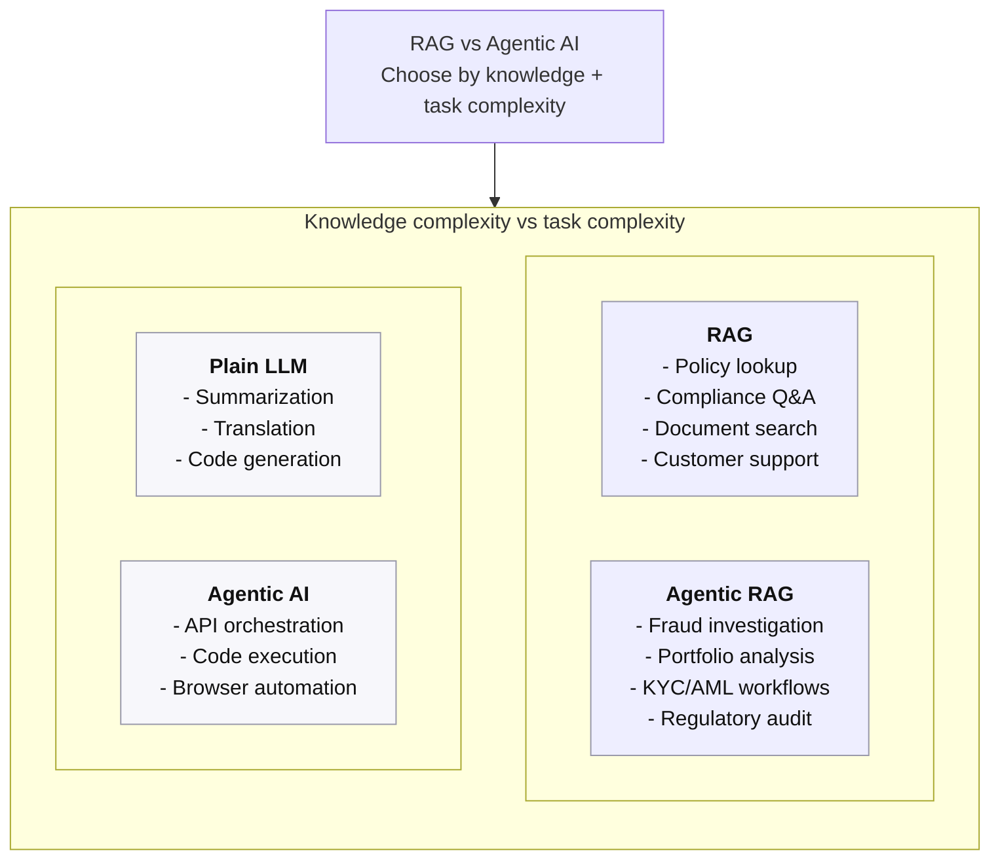

<details>
<summary>ASCII fallback (if Mermaid doesn't render)</summary>

```
                    HIGH knowledge complexity
                            │
          RAG               │         Agentic RAG
    (retrieve + answer)     │    (plan + retrieve + act)
    • Compliance Q&A        │    • Fraud investigation
    • Document search       │    • Portfolio analysis
    • Policy lookup         │    • KYC / AML workflows
                            │
────────────────────────────┼────────────────────────────
                            │
      Plain LLM             │       Agentic AI
    (no retrieval)          │    (plan + act, no docs)
    • Summarization         │    • Code execution
    • Translation           │    • API orchestration
    • Code generation       │    • Browser automation
                            │
                    LOW knowledge complexity
```
</details>

| Fintech use case | Approach | Why |
|------------------|----------|-----|
| Compliance Q&A over internal policies | RAG | Answer exists in docs; fixed retrieval path |
| Regulatory document search | RAG | Keyword + semantic lookup; no planning needed |
| Customer FAQ chatbot | RAG | Knowledge base answers; single-shot retrieval |
| Fraud investigation across data sources | Agentic RAG | Multi-step: pull transactions → check patterns → cross-reference watchlists |
| Portfolio alignment analysis | Agentic RAG | Needs holdings data + ESG ratings + risk profile; iterative reasoning |
| KYC/AML due diligence | Agentic RAG | Entity resolution across multiple databases; variable path |
| Trade execution automation | Agentic AI | Actions required; no document lookup |
| Internal summarization | Plain LLM | Content already in prompt; no retrieval needed |

---

## Learning paths

### Beginner — understand the foundations (3 modules, ~2 hours)

```
01_naive_rag  →  02_advanced_rag  →  03_hybrid_rag
```

| Step | What you learn |
|------|---------------|
| [01 Naive RAG](modules/01_naive_rag/) | How RAG works end-to-end; chunk → embed → retrieve → generate |
| [02 Advanced RAG](modules/02_advanced_rag/) | Query rewriting, cross-encoder reranking, context compression |
| [03 Hybrid RAG](modules/03_hybrid_rag/) | BM25 + dense fusion via RRF; the single best retrieval upgrade |

> After this path you can build a production-grade RAG system for most fintech Q&A use cases.

---

### Intermediate — improve indexing and self-correction (7 modules, ~4 hours)

```
01 → 02 → 03  +  10_parent_document  →  13_contextual_rag  →  16_self_rag  →  17_corrective_rag
```

| Step | What you learn |
|------|---------------|
| [10 Parent Document](modules/10_parent_document/) | Index small chunks; return large parents — best of both precision and context |
| [13 Contextual RAG](modules/13_contextual_rag/) | Prepend document context to each chunk; 49% fewer retrieval failures |
| [16 Self-RAG](modules/16_self_rag/) | Model critiques its own retrieval and generation quality |
| [17 Corrective RAG](modules/17_corrective_rag/) | Automatic web fallback when the corpus cannot answer the query |

> After this path you can handle long regulatory documents and self-checking compliance answers.

---

### Advanced — the full Tier 1 path (10 modules, ~8 hours)

```
Beginner + Intermediate  +  06_hyde  →  20_adaptive_rag  →  22_agentic_rag
```

| Step | What you learn |
|------|---------------|
| [06 HyDE](modules/06_hyde/) | Embed a hypothetical answer instead of the query — bridges vocabulary gap |
| [20 Adaptive RAG](modules/20_adaptive_rag/) | Classify queries and route to the cheapest pattern that can answer them |
| [22 Agentic RAG](modules/22_agentic_rag/) | LLM agent with retrieve / web search / calculate tools — the capstone pattern |

> After this path you understand the full design space and can select and compose patterns for any use case.

---

## Workshop flow (90 minutes)

| Time | Segment | Patterns | Mode |
|------|---------|----------|------|
| 0:00–0:10 | Foundations | Naive RAG, Advanced RAG | Slides + live demo |
| 0:10–0:25 | Indexing | Parent Document, Contextual RAG | Slides + live demo |
| 0:25–0:40 | Retrieval | Hybrid RAG, HyDE | Slides + live demo |
| 0:40–0:55 | Reasoning | Self-RAG, Corrective RAG | Slides + live demo |
| 0:55–1:10 | Architecture | Adaptive RAG, Agentic RAG | Slides + live demo |
| 1:10–1:20 | Synthesis | Pattern selection, design layers | Slides |
| 1:20–1:30 | Q&A | Resources, next steps | Discussion |

Workshop materials: [docs/workshop/](docs/workshop/)

---

## Pattern selection guide

Not sure which pattern fits your problem?

```
Is your query simple and keyword-heavy?
  → Hybrid RAG (BM25 + dense)

Do you have long documents (contracts, reports)?
  → Parent Document or Sentence Window

Is retrieval quality poor despite good docs?
  → Corrective RAG or Self-RAG

Do you need multi-step reasoning across sources?
  → IRCoT or Agentic RAG

Are entity relationships central to your queries?
  → Graph RAG

Do your documents change frequently?
  → Temporal RAG

Do you have charts, tables, or images in PDFs?
  → Multi-Modal RAG

Want zero infrastructure to start?
  → Long-Context RAG (stuff everything into a 200k context window)

Need to optimize cost for mixed-complexity traffic?
  → Adaptive RAG (route by query complexity)
```

Full decision guide: [docs/architecture/pattern_selection.md](docs/architecture/pattern_selection.md)

---

## Fintech use cases

Every module uses the same synthetic fintech corpus — Basel III regulatory text, ISDA contract excerpts, earnings reports, and internal loan policy documents. Here is how each major fintech domain maps to specific patterns.

### Regulatory compliance

| Problem | Pattern | Why |
|---------|---------|-----|
| "What does Basel III say about CET1 minimums?" | [Hybrid RAG (03)](modules/03_hybrid_rag/) | "CET1" is an exact term; BM25 finds it reliably |
| "What was the leverage ratio requirement before the 2019 amendment?" | [Temporal RAG (26)](modules/26_temporal_rag/) | Point-in-time query across version chain |
| "Is this loan application compliant with all underwriting rules?" | [IRCoT (18)](modules/18_ircot/) | Each rule requires a separate retrieval step |
| "Map all obligations that apply to this counterparty" | [Graph RAG (24)](modules/24_graph_rag/) | Obligation chains are relational, not keyword-searchable |

### Credit and lending

| Problem | Pattern | Why |
|---------|---------|-----|
| "What FICO score do I need for a personal loan?" | [Naive RAG (01)](modules/01_naive_rag/) or [Hybrid RAG (03)](modules/03_hybrid_rag/) | Simple factual lookup |
| "Does this HELOC application meet all eligibility criteria?" | [Corrective RAG (17)](modules/17_corrective_rag/) | Self-verifies before returning an answer |
| "What was the underwriting policy on the date this loan was approved?" | [Temporal RAG (26)](modules/26_temporal_rag/) | Audit requires point-in-time accuracy |
| "Extract all covenants from this loan agreement" | [Contextual RAG (13)](modules/13_contextual_rag/) | Dense legal text; each clause needs document context to be retrievable |

### Document intelligence

| Problem | Pattern | Why |
|---------|---------|-----|
| "What does Figure 3 in the earnings report show?" | [Multimodal RAG (25)](modules/25_multimodal_rag/) | Answer is in a chart, not prose |
| "Compare Meridian Bank's Q3 guidance vs actual revenue" | [Long-Context RAG (15)](modules/15_long_context_rag/) | Entire report fits in 200k-token window |
| "What did the prospectus say about management fees?" | [Parent Document (10)](modules/10_parent_document/) | Dense PDF; return full section for context |
| "Summarise all risk factors mentioned across these 10-K filings" | [RAPTOR (12)](modules/12_raptor/) | Hierarchical synthesis across multiple long docs |

### Risk and counterparty

| Problem | Pattern | Why |
|---------|---------|-----|
| "Which entities have exposure to Lehman Brothers?" | [Graph RAG (24)](modules/24_graph_rag/) | Entity relationship query |
| "Trace UBO from counterparty to jurisdiction to applicable sanctions" | [Multi-Hop RAG (23)](modules/23_multi_hop_rag/) | Fixed chain: entity → parent → jurisdiction → obligations |
| "What is the current credit outlook for this issuer?" | [Agentic RAG (22)](modules/22_agentic_rag/) | Requires live web data not in the static corpus |
| "Mixed query traffic across all of the above" | [Adaptive RAG (20)](modules/20_adaptive_rag/) | Routes each query to the cheapest capable pattern |

---

## Pattern catalog

All 26 patterns at a glance. Click any module link to jump to the full description with architecture diagram.

| # | Pattern | Category | Core idea | Tier |
|---|---------|----------|-----------|------|
| 01 | [Naive RAG](modules/01_naive_rag/) | Foundational | Chunk → embed → retrieve → generate | 1 |
| 02 | [Advanced RAG](modules/02_advanced_rag/) | Foundational | Rewrite + retrieve + rerank + compress | 1 |
| 03 | [Hybrid RAG](modules/03_hybrid_rag/) | Retrieval | BM25 + dense fused via RRF | 1 |
| 04 | [RAG Fusion](modules/04_rag_fusion/) | Retrieval | N query variants → N ranked lists → RRF | 2 |
| 05 | [Multi-Query RAG](modules/05_multi_query_rag/) | Retrieval | 3–5 query phrasings → union of results | 2 |
| 06 | [HyDE](modules/06_hyde/) | Retrieval | Embed a hypothetical answer, not the query | 1 |
| 07 | [Step-Back RAG](modules/07_step_back_rag/) | Retrieval | Abstract query → retrieve general + specific | 2 |
| 08 | [FLARE](modules/08_flare/) | Retrieval | Retrieve mid-generation when confidence drops | 3 |
| 09 | [Ensemble RAG](modules/09_ensemble_rag/) | Retrieval | Weighted combination of multiple retrievers | 2 |
| 10 | [Parent Document](modules/10_parent_document/) | Indexing | Index small children; return large parents | 1 |
| 11 | [Sentence Window](modules/11_sentence_window/) | Indexing | Index sentences; return surrounding window | 2 |
| 12 | [RAPTOR](modules/12_raptor/) | Indexing | Recursive summary tree for hierarchical retrieval | 2 |
| 13 | [Contextual RAG](modules/13_contextual_rag/) | Indexing | LLM prepends doc context to each chunk at index time | 1 |
| 14 | [Multi-Vector RAG](modules/14_multi_vector_rag/) | Indexing | Multiple embeddings per doc (text + summary + Q) | 2 |
| 15 | [Long-Context RAG](modules/15_long_context_rag/) | Retrieval | Skip chunking; put the whole doc in the window | 3 |
| 16 | [Self-RAG](modules/16_self_rag/) | Reasoning | Model critiques its own retrieval + generation | 1 |
| 17 | [Corrective RAG](modules/17_corrective_rag/) | Reasoning | Grade relevance; fall back to web if corpus fails | 1 |
| 18 | [IRCoT](modules/18_ircot/) | Reasoning | Interleave retrieval and chain-of-thought steps | 3 |
| 19 | [Speculative RAG](modules/19_speculative_rag/) | Reasoning | Draft speculatively; verify with retrieval | 2 |
| 20 | [Adaptive RAG](modules/20_adaptive_rag/) | Orchestration | Classify query → route to cheapest capable pattern | 1 |
| 21 | [Modular RAG](modules/21_modular_rag/) | Orchestration | Composable pipeline — swap any module | 2 |
| 22 | [Agentic RAG](modules/22_agentic_rag/) | Orchestration | LLM agent with retrieve / web search / calculate tools | 1 |
| 23 | [Multi-Hop RAG](modules/23_multi_hop_rag/) | Specialized | Fixed reasoning chain: A → B → C | 2 |
| 24 | [Graph RAG](modules/24_graph_rag/) | Specialized | Entity graph + BFS traversal + vector search | 3 |
| 25 | [Multimodal RAG](modules/25_multimodal_rag/) | Specialized | Text + tables + chart descriptions in one index | 3 |
| 26 | [Temporal RAG](modules/26_temporal_rag/) | Specialized | Time-decay scoring + document version filtering | 3 |

**Tier 1** = workshop demo-ready · **Tier 2** = extended reference · **Tier 3** = specialized

---

## The 26 RAG patterns

---

### Foundational

---

#### 01 — Naive RAG

The baseline every other pattern builds on. Chunks documents, embeds them, retrieves the top-k most similar chunks, and passes them to an LLM.

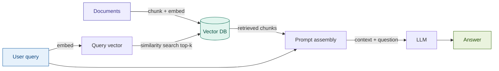

**When to use:** Starting point for any RAG project. FAQ systems, policy lookup, customer support where queries are straightforward.

**Tradeoffs:** Fast to build. Fails on exact-match queries (no keyword search), long documents (chunk boundary issues), and vague queries (semantic drift).

[→ Module](modules/01_naive_rag/)

---

#### 02 — Advanced RAG

Adds pre-retrieval query processing (rewriting, expansion) and post-retrieval enhancement (reranking, context compression) around the Naive RAG core.

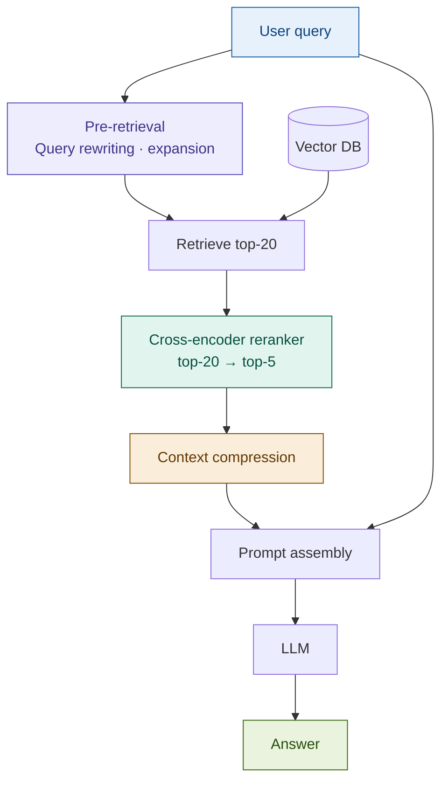

**When to use:** When Naive RAG gives you low-precision answers. Adding a reranker alone often yields the single biggest quality jump.

**Tradeoffs:** The reranker adds 200–600ms latency. Query rewriting can alter user intent if not carefully prompted.

[→ Module](modules/02_advanced_rag/)

---

### Retrieval Enhancement

---

#### 03 — Hybrid RAG

Runs both keyword (BM25) and semantic (dense vector) search in parallel, then merges the ranked lists using Reciprocal Rank Fusion (RRF).

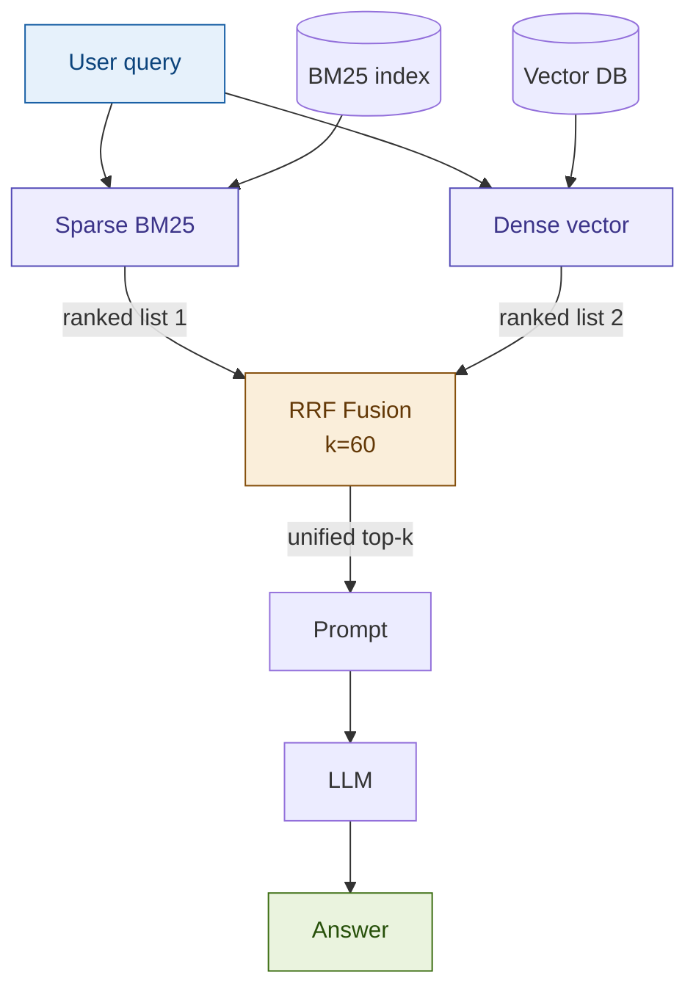

**When to use:** Documents with exact terminology (regulatory clauses, contract terms, SWIFT codes). Any production RAG system — hybrid nearly always beats either alone.

**Tradeoffs:** Two indexes to maintain. RRF weights may need domain-specific tuning. BM25 index doesn't update incrementally.

[→ Module](modules/03_hybrid_rag/)

---

#### 04 — RAG Fusion

An LLM generates N query variants from the original query. Each variant retrieves its own results. All results are merged via RRF to expose documents that any single query would miss.

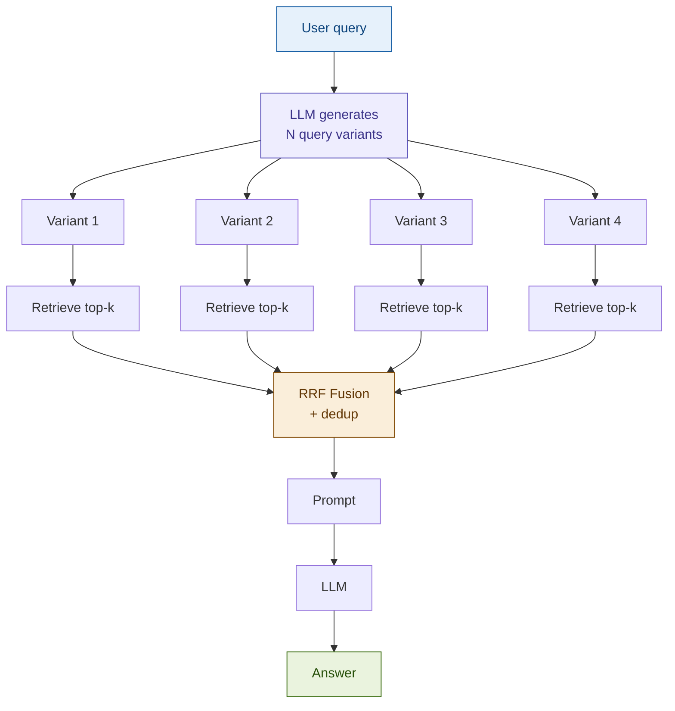

**When to use:** Queries with ambiguous phrasing or multiple synonyms. Comprehensive research queries where recall matters more than speed.

**Tradeoffs:** N × retrieval cost + 1 LLM call for variant generation. Adds meaningful latency.

[→ Module](modules/04_rag_fusion/)

---

#### 05 — Multi-Query RAG

Generates 3–5 different phrasings of the user's question, retrieves for each, and takes the union of results (with deduplication).

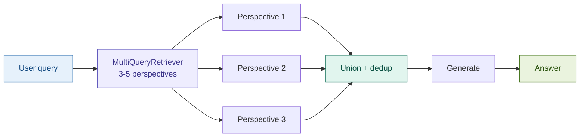

**When to use:** When users ask the same thing in many ways. Good for knowledge bases where the same concept appears under different names.

**Tradeoffs:** Simpler than RAG Fusion (no RRF merging). Lower precision — the union can include weakly-related documents.

[→ Module](modules/05_multi_query_rag/)

---

#### 06 — HyDE (Hypothetical Document Embeddings)

Instead of embedding the query directly, asks an LLM to write a hypothetical answer. Embeds that hypothetical answer and uses it to search — matching the "answer space" rather than the "question space."

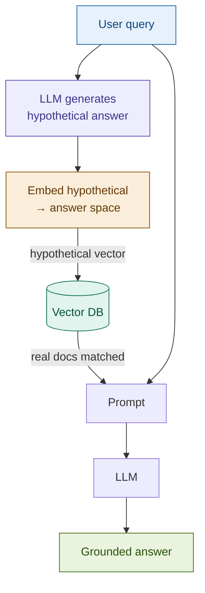

**When to use:** When queries are short and vague but the answer documents are long and detailed. Especially effective for technical and regulatory corpora.

**Tradeoffs:** Adds 1 extra LLM call per query. If the hypothetical is factually wrong, it can retrieve off-topic documents.

[→ Module](modules/06_hyde/)

---

#### 07 — Step-Back RAG

Abstracts the specific query to a general principle first, retrieves context for both the general and specific versions, then synthesizes a more complete answer.

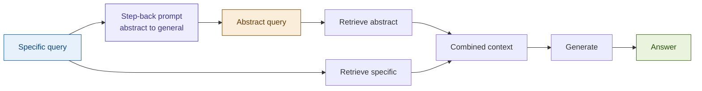

**When to use:** Questions that are highly specific but require general background to answer correctly. Regulatory interpretation questions.

**Tradeoffs:** The abstraction step adds latency and an extra retrieval pass. Works best when your corpus has both detailed and overview-level content.

[→ Module](modules/07_step_back_rag/)

---

#### 08 — FLARE (Forward-Looking Active REtrieval)

Retrieves dynamically during generation. When the model's token confidence drops below a threshold, it pauses generation, retrieves additional context, and continues.

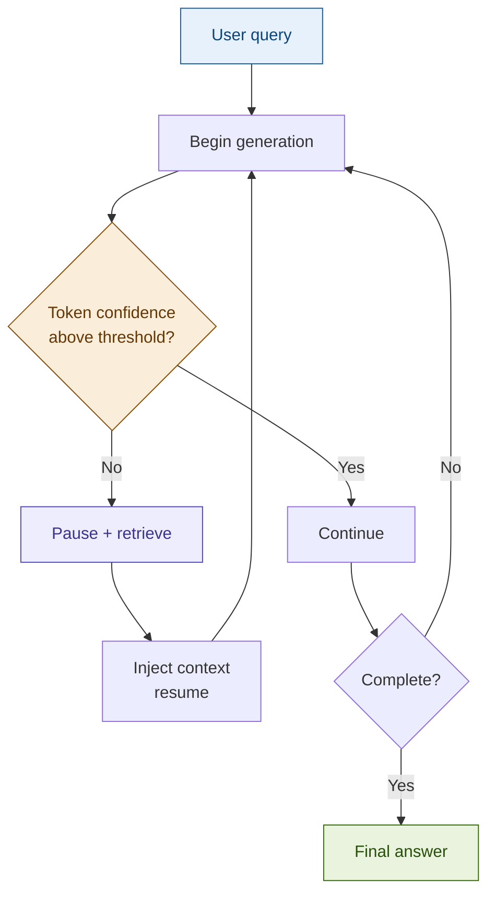

**When to use:** Long-form generation tasks where it's hard to predict upfront which facts will be needed. Research summaries, multi-section reports.

**Tradeoffs:** Complex to implement. Multiple round-trips to the LLM increase latency. Confidence thresholds require calibration.

[→ Module](modules/08_flare/)

---

#### 09 — Ensemble RAG

Runs multiple retrievers (e.g. BM25, dense, keyword) in parallel and combines results using weighted voting.

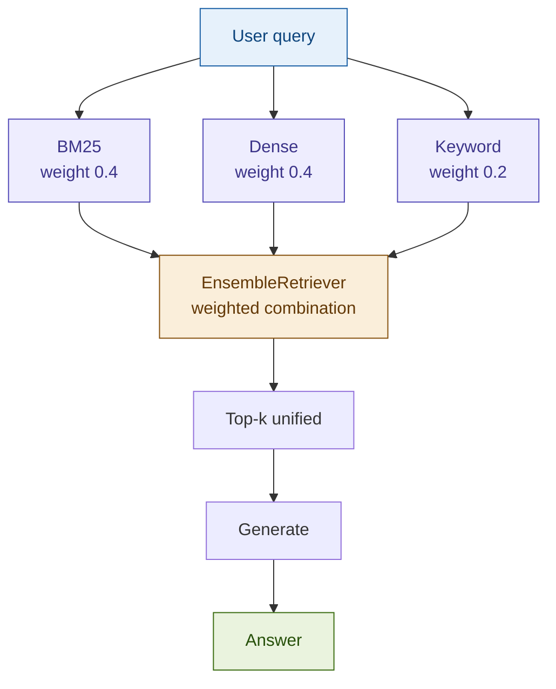

**When to use:** When you want to combine more than two retrieval strategies with different relative weights.

**Tradeoffs:** Weight tuning is required. More retrievers = more latency. Similar to Hybrid RAG but more general.

[→ Module](modules/09_ensemble_rag/)

---

### Indexing & Chunking

---

#### 10 — Parent Document Retrieval

Indexes small child chunks for precise matching, but returns the full parent chunk at generation time for rich context.

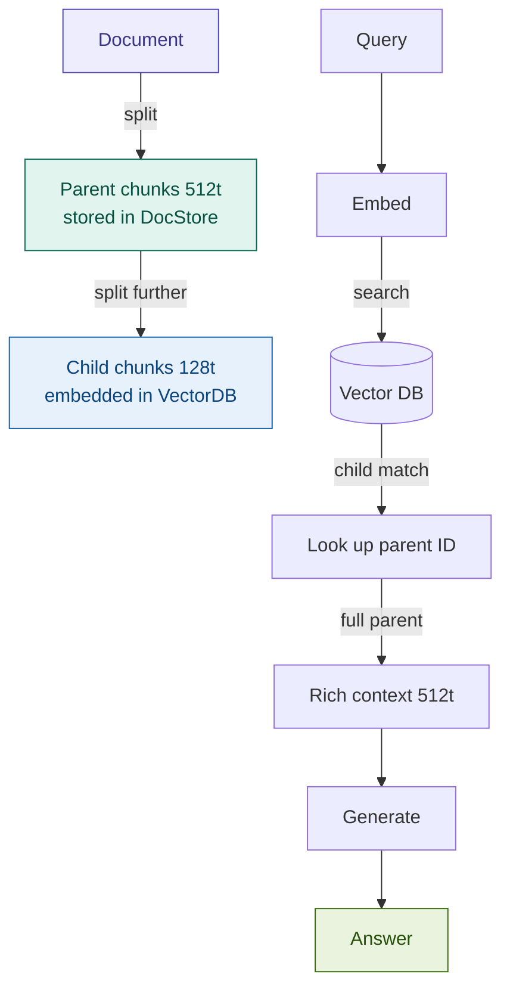

**When to use:** Long structured documents (contracts, reports, policy manuals) where you need precision to find the right section but context to answer correctly.

**Tradeoffs:** Requires maintaining a docstore alongside the vector DB. More complex indexing pipeline.

[→ Module](modules/10_parent_document/)

---

#### 11 — Sentence Window Retrieval

Embeds each sentence individually for high-precision matching, then expands to a ±k sentence window at retrieval time for context.

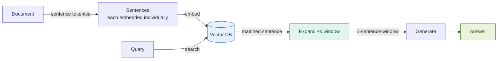

**When to use:** When exact sentence-level matching matters but you still need surrounding context. Good for regulatory text and dense technical documents.

**Tradeoffs:** Large index (one vector per sentence). Window expansion may pull in unrelated content near sentence boundaries.

[→ Module](modules/11_sentence_window/)

---

#### 12 — RAPTOR

Recursively clusters leaf chunks, summarizes each cluster, then builds a tree of summaries. At query time, retrieves from the appropriate level of the tree.

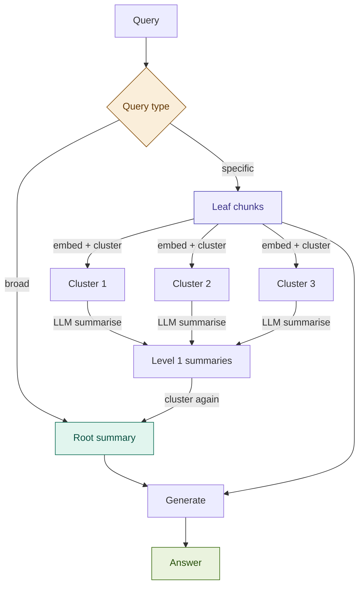

**When to use:** Large corpora where queries span both broad themes and specific details. Financial reports, research repositories.

**Tradeoffs:** Expensive to build (many LLM summarization calls). Index must be rebuilt when documents change significantly.

[→ Module](modules/12_raptor/)

---

#### 13 — Contextual RAG

Before embedding, uses an LLM to generate a short context description for each chunk explaining its place in the broader document. The enriched chunk is embedded and retrieved.

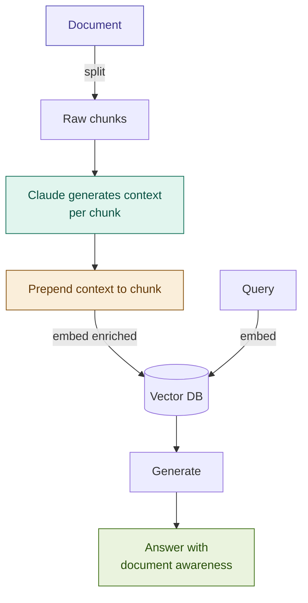

**When to use:** Documents where chunks lose meaning when taken out of context. Dense regulatory documents, lengthy contracts, technical manuals.

**Tradeoffs:** High upfront cost (1 LLM call per chunk during indexing). Retrieval quality improvement is significant — Anthropic reported 49% reduction in retrieval failures.

[→ Module](modules/13_contextual_rag/)

---

#### 14 — Multi-Vector RAG

Stores multiple embeddings per document — the full text, an LLM-generated summary, and question embeddings — all pointing to the same source document.

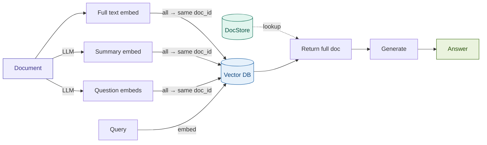

**When to use:** When users may phrase queries like answers, like summaries, or like questions — and you want to match all of them to the same source.

**Tradeoffs:** 3× the index size. Multiple LLM calls at indexing time. Significant upfront investment for better recall.

[→ Module](modules/14_multi_vector_rag/)

---

#### 15 — Long-Context RAG

Retrieves broadly (top-30 to top-50 chunks) and stuffs everything into a long-context LLM window instead of carefully selecting a few chunks.

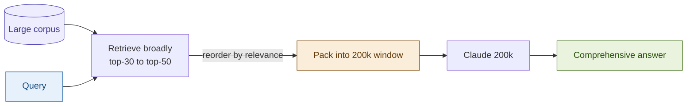

**When to use:** When comprehensive coverage matters more than latency. Regulatory audits that need to consider everything. Good starting point before investing in a more complex retrieval pipeline.

**Tradeoffs:** High token cost per query. LLM attention quality degrades in the middle of very long contexts ("lost in the middle" problem).

[→ Module](modules/15_long_context_rag/)

---

### Reasoning & Self-Correction

---

#### 16 — Self-RAG

The model generates special reflection tokens during inference to decide: should I retrieve? Is this chunk relevant? Is my answer grounded? Is it useful?

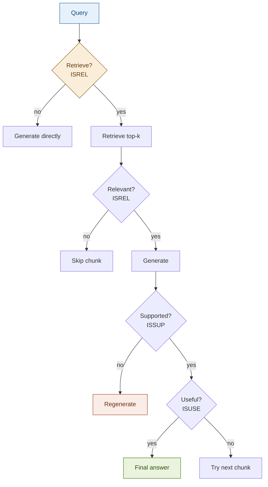

**When to use:** When hallucination rate needs to be minimized. High-stakes domains where every factual claim must be grounded in retrieved evidence.

**Tradeoffs:** Requires a fine-tuned model that understands the reflection token protocol. More complex inference logic. Significant accuracy improvement when done correctly.

[→ Module](modules/16_self_rag/)

---

#### 17 — Corrective RAG (CRAG)

Retrieves from the internal knowledge base, then grades the retrieved documents for relevance. Low-quality results trigger a web search fallback or refinement before generating.

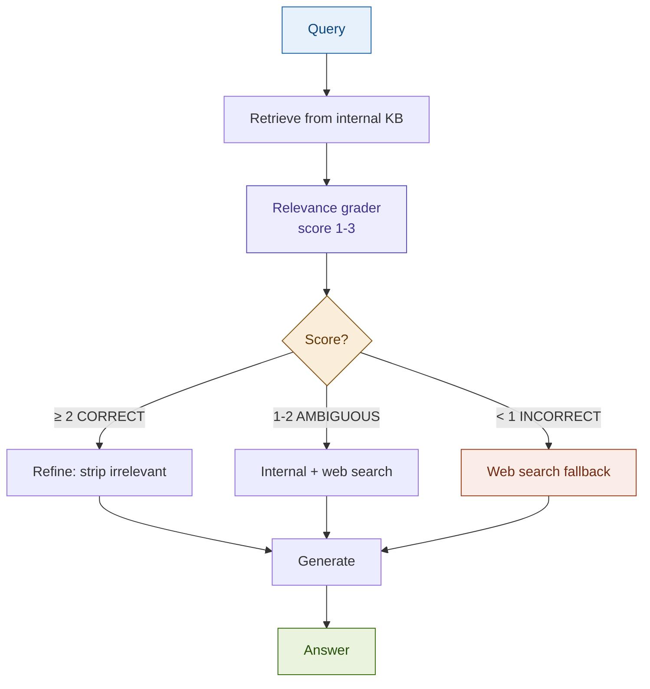

**When to use:** When your internal knowledge base may not cover all queries. Systems where graceful fallback to web search is acceptable.

**Tradeoffs:** Web search fallback adds latency and cost (Tavily API). The grader itself needs to be reliable — a bad grader makes the whole system worse.

[→ Module](modules/17_corrective_rag/)

---

#### 18 — IRCoT (Interleaved Retrieval with Chain-of-Thought)

Interleaves chain-of-thought reasoning steps with retrieval. Each reasoning step may trigger a retrieval call if a fact is needed, and retrieved facts inform the next reasoning step.

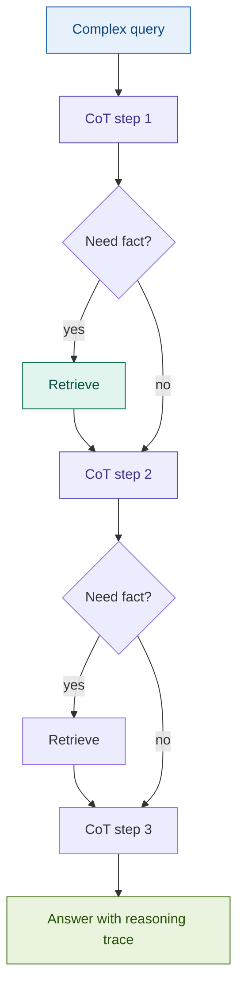

**When to use:** Multi-hop questions that require connecting facts across multiple documents. Complex regulatory analysis, cross-entity financial research.

**Tradeoffs:** Variable number of retrieval calls — hard to predict latency. Requires capable reasoning LLM.

[→ Module](modules/18_ircot/)

---

#### 19 — Speculative RAG

A small, fast LLM drafts an answer. A large, accurate LLM verifies it against retrieved documents and corrects any errors.

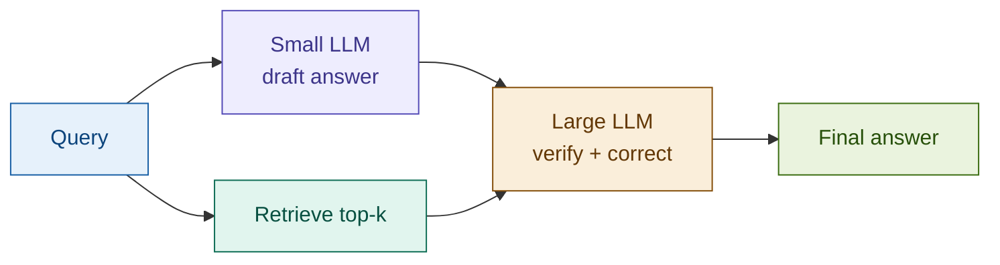

**When to use:** When you need high-accuracy answers but want to reduce large-model token usage. Batch processing where draft quality is usually good enough.

**Tradeoffs:** Two LLM calls per query. The verification step may change a correct draft answer unnecessarily.

[→ Module](modules/19_speculative_rag/)

---

#### 20 — Adaptive RAG

Classifies each query by complexity, then routes it to the appropriate strategy: direct LLM for simple queries, standard RAG for moderate, multi-step RAG for complex.

```mermaid
flowchart TD
    Q[Query] --> CLASS[Complexity classifier]
    CLASS --> DEC{Level?}
    DEC -->|0 simple| DIRECT[Direct LLM]
    DEC -->|1 moderate| SINGLE[Standard RAG]
    DEC -->|2 complex| MULTI[Multi-step RAG]
    DIRECT & SINGLE & MULTI --> A[Answer]

    style Q fill:#E6F1FB,stroke:#185FA5,color:#0C447C
    style CLASS fill:#EEEDFE,stroke:#534AB7,color:#3C3489
    style DEC fill:#FAEEDA,stroke:#854F0B,color:#633806
    style A fill:#EAF3DE,stroke:#3B6D11,color:#27500A
```

**When to use:** Production systems with mixed query complexity. Optimizes cost by not over-engineering simple queries while still handling complex ones correctly.

**Tradeoffs:** Classifier must be reliable — misclassification sends queries down the wrong path. Additional complexity in routing logic.

[→ Module](modules/20_adaptive_rag/)

---

### Architectural Patterns

---

#### 21 — Modular RAG

Decomposes the pipeline into swappable components with strict interfaces. Retrievers, rerankers, and generators can be swapped at runtime without changing other components.

```mermaid
flowchart LR
    Q[Query] --> P[RAGPipeline\nFacade]
    P --> A_R[Retriever A] & B_R[Retriever B]
    A_R & B_R --> RR[Reranker]
    RR --> G[Generator] --> ANS[Answer]
    SWAP[Swap components\nvia Builder] -.-> B_R
    SWAP2[Swap reranker] -.-> RR

    style Q fill:#E6F1FB,stroke:#185FA5,color:#0C447C
    style P fill:#EEEDFE,stroke:#534AB7,color:#3C3489
    style RR fill:#E1F5EE,stroke:#0F6E56,color:#085041
    style SWAP fill:#FAEEDA,stroke:#854F0B,color:#633806
    style ANS fill:#EAF3DE,stroke:#3B6D11,color:#27500A
```

**When to use:** When you need to A/B test retrieval strategies, support multiple deployment configurations, or build a reusable RAG framework.

**Tradeoffs:** More upfront architecture work. Interface design decisions are hard to change later.

[→ Module](modules/21_modular_rag/)

---

#### 22 — Agentic RAG

A ReAct agent decides what to retrieve and when, using retrieval as one of several tools. The agent loops through Think → Act → Observe until it has enough information to answer.

```mermaid
flowchart TD
    Q[Complex query] --> AGENT[ReAct Agent]
    AGENT --> THINK[Think: what do I need?]
    THINK --> TOOL{Choose tool}
    TOOL --> RET[retrieve_docs] & ESG[get_esg_ratings] & PORT[get_portfolio]
    RET & ESG & PORT --> OBS[Observe]
    OBS --> THINK2{Enough?}
    THINK2 -->|no| TOOL
    THINK2 -->|yes| GEN[Generate] --> A[Answer]

    style Q fill:#E6F1FB,stroke:#185FA5,color:#0C447C
    style AGENT fill:#EEEDFE,stroke:#534AB7,color:#3C3489
    style TOOL fill:#FAEEDA,stroke:#854F0B,color:#633806
    style A fill:#EAF3DE,stroke:#3B6D11,color:#27500A
```

**When to use:** Multi-step tasks that require reasoning about what to retrieve next. Fraud investigation, portfolio analysis, KYC workflows.

**Tradeoffs:** Non-deterministic execution path. Hard to predict latency. Needs guardrails and human-in-the-loop checkpoints in regulated environments.

[→ Module](modules/22_agentic_rag/)

---

#### 23 — Multi-Hop RAG

Chains multiple retrieval steps, using the result of each hop to form the query for the next. Each hop traverses a bridge entity connecting document sources.

```mermaid
flowchart LR
    Q[Bridge question] --> H1[Hop 1\nFind entity]
    H1 -->|bridge entity| H2[Hop 2\nFind jurisdiction]
    H2 -->|bridge entity| H3[Hop 3\nFind regulations]
    H3 --> CHAIN[Full reasoning chain]
    CHAIN --> G[Generate] --> A[Answer with provenance]

    style Q fill:#E6F1FB,stroke:#185FA5,color:#0C447C
    style H1 fill:#EEEDFE,stroke:#534AB7,color:#3C3489
    style H2 fill:#EEEDFE,stroke:#534AB7,color:#3C3489
    style H3 fill:#EEEDFE,stroke:#534AB7,color:#3C3489
    style A fill:#EAF3DE,stroke:#3B6D11,color:#27500A
```

**When to use:** Questions that require connecting information across multiple documents through bridge entities. Cross-jurisdiction regulatory research, entity-linked compliance queries.

**Tradeoffs:** Error compounds across hops — a wrong entity in hop 1 sends all subsequent hops off-track. Latency scales with the number of hops.

[→ Module](modules/23_multi_hop_rag/)

---

### Specialized

---

#### 24 — Graph RAG

Builds a knowledge graph from documents (entity extraction + relationships), then combines graph traversal with vector search for entity-aware retrieval.

```mermaid
flowchart TD
    D[Documents] -->|entity extraction| KG[(Knowledge Graph)]
    D -->|embedding| VDB[(Vector DB)]
    Q[Query] --> LOCAL[Local: entity neighborhood] & GLOBAL[Global: community summaries] & VEC[Vector search]
    KG --> LOCAL & GLOBAL
    VDB --> VEC
    LOCAL & GLOBAL & VEC --> F[Fused context]
    F --> G[Generate] --> A[Answer]

    style D fill:#EEEDFE,stroke:#534AB7,color:#3C3489
    style KG fill:#FAEEDA,stroke:#854F0B,color:#633806
    style VDB fill:#E6F1FB,stroke:#185FA5,color:#0C447C
    style A fill:#EAF3DE,stroke:#3B6D11,color:#27500A
```

**When to use:** When entity relationships are central to queries. Corporate structure analysis, counterparty risk, regulatory network analysis.

**Tradeoffs:** Heavy upfront cost: entity extraction, relationship extraction, graph construction. Graph must be kept in sync as documents change.

[→ Module](modules/24_graph_rag/)

---

#### 25 — Multi-Modal RAG

Indexes text, images, and tables from documents separately, and retrieves across modalities to answer questions that require visual or tabular information.

```mermaid
flowchart TD
    D[PDF] --> EXT[Extract]
    EXT --> TXT[Text] & IMG[Images] & TBL[Tables]
    TXT -->|embed| VTXT[(Text index)]
    IMG -->|vision LLM → describe → embed| VIMG[(Image index)]
    TBL -->|markdown → embed| VTBL[(Table index)]
    Q[Query] --> VTXT & VIMG & VTBL
    VTXT & VIMG & VTBL --> F[Fused context]
    F --> LLM[Vision LLM] --> A[Answer]

    style D fill:#EEEDFE,stroke:#534AB7,color:#3C3489
    style EXT fill:#FAEEDA,stroke:#854F0B,color:#633806
    style F fill:#E1F5EE,stroke:#0F6E56,color:#085041
    style A fill:#EAF3DE,stroke:#3B6D11,color:#27500A
```

**When to use:** Documents with charts, tables, or diagrams that carry essential information. Financial reports with visualizations, regulatory documents with structured tables.

**Tradeoffs:** Complex extraction pipeline. Vision LLM calls add significant cost. Image description quality directly affects retrieval quality.

[→ Module](modules/25_multimodal_rag/)

---

#### 26 — Temporal RAG

Applies time-based filtering and recency weighting to retrieval. Older documents score lower; outdated documents can be excluded entirely.

```mermaid
flowchart TD
    D[Documents + timestamps] -->|index with date metadata| IDX[(Index)]
    Q[Time-sensitive query] --> FILTER{Time filter}
    FILTER -->|hard: date > cutoff| VDB[Filtered search]
    FILTER -->|soft: recency decay| DECAY[Score × recency weight]
    VDB & DECAY --> RANK[Re-rank by relevance + recency]
    RANK --> G[Generate] --> A[Time-aware answer]

    style D fill:#EEEDFE,stroke:#534AB7,color:#3C3489
    style FILTER fill:#FAEEDA,stroke:#854F0B,color:#633806
    style RANK fill:#E1F5EE,stroke:#0F6E56,color:#085041
    style A fill:#EAF3DE,stroke:#3B6D11,color:#27500A
```

**When to use:** Domains where information expires: regulatory guidance, interest rates, market data, compliance requirements that change over time.

**Tradeoffs:** Requires timestamp metadata on all documents. Recency decay parameters need tuning for each domain. May suppress correct older documents.

[→ Module](modules/26_temporal_rag/)

---

## Production design layers

Every RAG system has 8 design layers. Skipping any one creates a ceiling on quality.

| Layer | Name | Priority | One-line summary |
|-------|------|----------|-----------------|
| 1 | Data & Ingestion | Critical | Sets the quality ceiling for everything downstream |
| 2 | Embedding | Critical | Defines what "similar" means in your system |
| 3 | Index & Storage | Important | Determines retrieval speed and scale limits |
| 4 | Retrieval | Critical | Highest-ROI layer to tune — start here |
| 5 | Generation | Important | How you pack and use retrieved context |
| 6 | Evaluation | Critical | Cannot improve what you don't measure |
| 7 | Latency & Cost | Important | The layer that kills POCs in production |
| 8 | Security & Ops | Critical | Non-negotiable in fintech |

Full details with architecture diagrams: [docs/architecture/design_layers.md](docs/architecture/design_layers.md)

---

## Setup details

See [docs/workshop/setup_guide.md](docs/workshop/setup_guide.md) for the full attendee setup checklist, pre-flight test, and troubleshooting guide.

### Required API keys

| Key | Required | Used for |
|-----|----------|----------|
| `ANTHROPIC_API_KEY` | Yes | LLM generation (Claude) |
| `OPENAI_API_KEY` | Yes | Embeddings (text-embedding-3-small) |
| `COHERE_API_KEY` | No | Reranking (Advanced RAG, Modular RAG) |
| `TAVILY_API_KEY` | No | Web search fallback (Corrective RAG, Agentic RAG) |

---

## Repository structure

```
rag-patterns-in-practice/
├── modules/          # 26 pattern directories (SKILL.md + notebook + slides)
├── shared/           # Reusable Python library shared across modules
├── docs/
│   ├── architecture/ # Design layers, pattern selection guide
│   └── workshop/     # Run of show, setup guide, cheatsheet
├── CLAUDE.md         # Project brain (build instructions)
├── RAG_WORKSHOP_PLAN.md  # Full build plan
└── progress.md       # Module completion tracker
```

Each module directory is self-contained:

```
modules/01_naive_rag/
├── SKILL.md          # What this pattern is, why, how, tradeoffs
├── demo.ipynb        # 6-cell runnable notebook
├── slides.md         # Workshop slide content
├── README.md         # Speaker notes + timing
└── tests/
    └── test_naive_rag.py
```

---

## Contributing

Contributions are welcome. Please read [CONTRIBUTING.md](CONTRIBUTING.md) before opening a pull request — it covers the 4-phase module build process (SKILL.md → slides → notebook → tests), the notebook cell standard, and the fintech domain requirements every new pattern must meet.

---

## References

- Lewis et al., "Retrieval-Augmented Generation for Knowledge-Intensive NLP Tasks", NeurIPS 2020 — [arxiv.org/abs/2005.11401](https://arxiv.org/abs/2005.11401)
- Gao et al., "Retrieval-Augmented Generation for Large Language Models: A Survey", 2023 — [arxiv.org/abs/2312.10997](https://arxiv.org/abs/2312.10997)
- Asai et al., "Self-RAG: Learning to Retrieve, Generate, and Critique through Self-Reflection", NeurIPS 2023 — [arxiv.org/abs/2310.11511](https://arxiv.org/abs/2310.11511)
- Yan et al., "Corrective Retrieval Augmented Generation", ICLR 2024 — [arxiv.org/abs/2401.15884](https://arxiv.org/abs/2401.15884)
- Edge et al., "From Local to Global: A Graph RAG Approach", Microsoft Research 2024 — [arxiv.org/abs/2404.16130](https://arxiv.org/abs/2404.16130)
- Anthropic, "Introducing Contextual Retrieval", 2024 — [anthropic.com/news/contextual-retrieval](https://www.anthropic.com/news/contextual-retrieval)

---

## License

Copyright © Sunil Pradhan Sharma. All rights reserved.

This repository is made available for personal and educational use. Any redistribution, commercial use, or derivative works require explicit written permission from the author.
