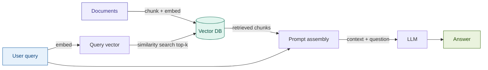

# Naive RAG

## What it is

Naive RAG is the simplest complete implementation of Retrieval-Augmented Generation:
split your documents into chunks, embed each chunk, store the embeddings in a vector
database, and at query time embed the question, retrieve the most similar chunks, and
hand them to a language model to generate a grounded answer. It was introduced by Lewis
et al. (2020) as a way to give language models access to dynamic external knowledge without
retraining, by combining a non-parametric retriever (the vector store) with a parametric
generator (the LLM). Every more sophisticated RAG pattern in this repository is an
extension or modification of this baseline — understanding where Naive RAG succeeds and
where it breaks is the prerequisite for everything else.

## Source

Lewis, Patrick, Ethan Perez, Aleksandra Piktus, Fabio Petroni, Vladimir Karpukhin,
Naman Goyal, Heinrich Küttler, et al. "Retrieval-Augmented Generation for
Knowledge-Intensive NLP Tasks." *Advances in Neural Information Processing Systems*
(NeurIPS) 33 (2020): 9459–9474.

URL: https://arxiv.org/abs/2005.11401

## When to use it

- **Your knowledge base is stable and queryable one chunk at a time.** Naive RAG
  works well when each user question can be fully answered by a single retrieved
  passage — product FAQs, policy sections, and structured reference documents all
  fit this profile.
- **You need a working baseline fast.** Before investing in query rewriting, reranking,
  or contextual indexing, establish Naive RAG as a measurable lower bound. Every
  latency and quality improvement in later patterns is measured against this baseline.
- **The query vocabulary roughly matches the document vocabulary.** If your users
  and documents use the same terminology (e.g., a support agent searching internal
  runbooks written for that same audience), cosine similarity over embeddings is
  usually sufficient.
- **Fintech trigger — structured policy Q&A with a compliance team.** Internal
  audiences asking well-formed questions against fixed-format documents (loan policy
  manuals, regulatory handbooks, product eligibility rules) are the ideal Naive RAG
  workload. The document vocabulary is technical and consistent; queries are precise;
  and the answers map to discrete sections. A junior compliance analyst asking
  "What is the minimum FICO score for a personal loan?" against `fintech_policy.txt`
  will get a correct answer from top-5 cosine retrieval without any additional machinery.
- **Cost and operational simplicity are primary constraints.** Naive RAG has no
  secondary LLM calls beyond the final generation step, making it the cheapest pattern
  per query. If you are prototyping, presenting a proof-of-concept, or running in an
  environment where API budget is tight, start here.

## When NOT to use it

- **The answer requires synthesising information from multiple sections.** If answering
  "How does the hardship accommodation process interact with the charge-off timeline?"
  requires reading both Section 4 (underwriting) and Section 8 (default remediation)
  of your policy document, a single top-5 retrieval pass will usually miss at least
  one necessary chunk. Use Parent Document Retrieval (Module 10) or Multi-Hop RAG
  (Module 23) instead.
- **Domain vocabulary in queries diverges from document phrasing.** A customer asking
  "what happens if I miss payments?" will not reliably retrieve the section titled
  "Default Remediation Process" — the semantic distance between the query and the
  answer passage is too large for pure embedding similarity. Use Hybrid RAG (Module 03)
  to add BM25 keyword matching, or HyDE (Module 06) to bridge the vocabulary gap.
- **The system must decline to answer when context is insufficient.** Naive RAG always
  returns top-k chunks regardless of relevance, and LLMs will often fabricate an
  answer rather than say "I don't know." If your use case requires explicit
  unanswerable detection — regulatory advice, medical information, legal guidance —
  use Self-RAG (Module 16) or Corrective RAG (Module 17), which grade retrieval
  quality before generating.

## Architecture

**Indexing path** (run once, offline): Documents → chunk → embed each chunk → persist
in vector store.

**Query path** (run at inference time): User query → embed → cosine similarity search
→ retrieve top-k chunks → assemble prompt → LLM → answer.

## Key components

| Component | Purpose | Default implementation |
|-----------|---------|----------------------|
| **Text splitter** | Divide documents into retrievable units while preserving sentence boundaries | `RecursiveCharacterTextSplitter(chunk_size=512, chunk_overlap=64)` |
| **Embedder** | Convert text to a dense vector that captures semantic meaning | `OpenAIEmbeddings(model="text-embedding-3-small")` — 1536 dimensions |
| **Vector store** | Index chunk vectors for fast approximate nearest-neighbour search | `Chroma` (local, persistent, no infra required) |
| **Retriever** | Query the vector store and return the top-k most similar chunks | `VectorStoreRetriever(search_type="similarity", k=5)` |
| **Prompt template** | Combine retrieved context and user question into a structured LLM input | System instruction + `{context}` + `{question}` |
| **LLM** | Generate a grounded, coherent answer conditioned on the retrieved context | `claude-sonnet-4-6` via Anthropic Messages API |

## Step-by-step

Steps 1–3 map to notebook **Cell 3 (Core)**. Steps 4–5 map to **Cell 4 (Run)**.
Step 6 maps to **Cell 5 (Inspect)**.

1. **Load and chunk the document.** Read the source document as plain text. Apply
   `RecursiveCharacterTextSplitter` with `chunk_size=512` tokens and `chunk_overlap=64`
   tokens. The overlap prevents answers from being cut in half at a chunk boundary.
   For `fintech_policy.txt` (≈1,700 words), this produces roughly 12–15 chunks.

2. **Embed each chunk.** Call `OpenAIEmbeddings.embed_documents(chunks)` to get a
   1536-dimensional vector for each chunk. These vectors represent the *meaning* of
   each passage in a continuous semantic space.

3. **Persist in Chroma.** Create a `Chroma` collection from the embedded chunks.
   Chroma stores both the raw text and the vectors, handles nearest-neighbour search,
   and persists to disk so the index survives between notebook runs.

4. **Retrieve top-k at query time.** Embed the user's query with the same embedder
   (the model must match — mixing embedders invalidates similarity scores). Run
   `collection.similarity_search_with_score(query, k=5)`. Chroma returns chunks sorted
   by cosine distance (lower = more similar); convert to similarity score as `1 − distance`.

5. **Assemble the prompt and generate.** Concatenate the retrieved chunks into a context
   block, prefixed with their source and score. Pass context + question to Claude using
   the Anthropic Messages API. Instruct the model to answer only from the provided
   context and to indicate if the context is insufficient.

6. **Inspect the output.** Print each retrieved chunk with its score, character offset,
   and source section heading. Measure and log total wall-clock time split into
   embed time, retrieval time, and generation time. Flag any chunk whose score is below
   a relevance threshold (e.g., < 0.70) as a potential quality risk.

## Fintech use cases

- **Policy Q&A for retail lending teams.** Underwriters and relationship managers ask
  natural-language questions against internal policy documents — "What is the maximum
  DTI for a personal loan?", "Who must approve a FICO exception below 620?", "How long
  must we retain denied application files?" — and Naive RAG retrieves the relevant
  policy clause and generates a cited answer. `fintech_policy.txt` is the reference
  document for this use case in the workshop.

- **Regulatory handbook lookup.** Compliance teams query Basel III capital requirement
  documents to surface specific ratio thresholds, buffer definitions, and exposure
  class risk weights. The structured, section-numbered format of regulatory text suits
  Naive RAG well: questions are precise, answers are self-contained within a single
  clause, and retrieval failures are visible (wrong section cited).

- **Customer support knowledge base.** Tier-1 support agents use Naive RAG over product
  documentation to answer customer questions about fee schedules, eligibility, account
  features, and dispute processes. Response latency is low (typically < 2 seconds
  end-to-end) and the implementation requires no infrastructure beyond a vector database,
  making it practical to deploy alongside existing support tooling.

## Tradeoffs

| Dimension | Rating | Notes |
|-----------|--------|-------|
| Retrieval quality | ★★☆☆☆ | Cosine similarity over a single embedding model misses keyword-exact matches and struggles when query vocabulary diverges from document phrasing. No reranking step; top-1 is frequently wrong on ambiguous queries. |
| Latency | ★★★★☆ | Two embedding calls (index + query) plus one LLM call. No secondary LLM calls for rewriting, grading, or correction. Typical end-to-end latency: 800 ms–2 s at moderate context length. |
| Cost | ★★★☆☆ | Embedding is inexpensive (text-embedding-3-small: ~$0.00002/1K tokens). Indexing cost is paid once. Per-query cost is dominated by the LLM generation call; with 5 × 512-token chunks as context, expect ~3,000–4,000 input tokens per query. |
| Complexity | ★★☆☆☆ | Four components (splitter, embedder, vector store, LLM) with well-documented defaults. Minimal configuration surface. The main source of complexity is choosing chunk size — too small loses context, too large dilutes the signal. |

## Common pitfalls

- **Chunk boundaries cut critical context.** A 512-token hard split at the middle of a
  table row, a numbered list item, or a multi-sentence definition leaves one chunk with
  an incomplete fact and another with a dangling qualifier. Use `RecursiveCharacterTextSplitter`
  (splits on `\n\n`, then `\n`, then `.` before falling back to character count) and
  set `chunk_overlap ≥ 10%` of `chunk_size`. For heavily structured documents, consider
  Section-aware splitting before switching to Parent Document Retrieval.

- **Semantic drift between query and document phrasing.** The embedding model maps
  "missed payment" and "delinquency" to nearby vectors — but not identical ones.
  At the margin, the correct chunk (titled "Default Remediation Process") may rank
  below a less relevant chunk that happens to use the same surface words as the query.
  Monitor score distributions in Cell 5; if the gap between rank-1 and rank-5 scores
  is small (< 0.05), retrieval quality is likely inconsistent across queries.

- **No unanswerable handling.** When no retrieved chunk contains the answer, the LLM
  will often generate a plausible-sounding but fabricated response rather than
  declining. Mitigate by: (a) adding an explicit system instruction — "If the context
  does not contain enough information to answer, say 'I cannot find this in the
  provided documents'"; (b) filtering chunks below a minimum relevance score before
  passing them to the LLM; (c) moving to Self-RAG (Module 16) if reliable
  unanswerable detection is a hard requirement.

- **Index-time embedding model mismatch.** If you re-index with a different embedding
  model than the one used at query time, all similarity scores become meaningless.
  Treat the embedding model as a part of the index schema: record it in metadata,
  and rebuild the index from scratch when changing models rather than adding new
  chunks with a different embedder.

## Related patterns

- **[02 Advanced RAG](../02_advanced_rag/SKILL.md)** — The natural first upgrade.
  Advanced RAG wraps Naive RAG with query rewriting before retrieval and a cross-encoder
  reranker after retrieval. It addresses the semantic drift and rank-quality pitfalls
  described above without changing the core indexing approach. Swap in as soon as Naive
  RAG's retrieval quality proves insufficient on your evaluation set.

- **[03 Hybrid RAG](../03_hybrid_rag/SKILL.md)** — Combines Naive RAG's dense vector
  retrieval with BM25 sparse keyword search using Reciprocal Rank Fusion. The most
  impactful single improvement for fintech documents, where users often query by exact
  regulatory term or product name (e.g., "FICO 8", "Tier 1 capital ratio", "HELOC").
  Dense retrieval handles paraphrases; sparse retrieval handles exact terms; fusion
  captures both.
