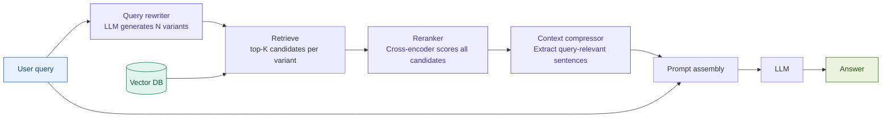

# Advanced RAG

## What it is

Advanced RAG extends Naive RAG with processing stages on both sides of the retrieval
step: **pre-retrieval** transforms the user's query before it touches the vector store,
and **post-retrieval** filters and compresses what comes back before it reaches the LLM.
The result is a pipeline — query rewriting → retrieve → rerank → compress → generate —
where each stage corrects a specific failure mode of Naive RAG. The core insight is that
the raw user query is often a poor retrieval signal, and the raw retrieved chunks are
often noisier than the LLM needs: addressing both problems together produces measurably
better answers than addressing either alone. Gao et al. (2023) codified these pre- and
post-retrieval stages in a comprehensive survey of RAG architectures, distinguishing
Advanced RAG from Naive RAG on precisely these grounds.

## Source

Gao, Yunfan, Yun Xiong, Xinyu Gao, Kangxiang Jia, Jinliu Pan, Yuxi Bi, Yi Dai,
Jiawei Sun, and Haofen Wang. "Retrieval-Augmented Generation for Large Language Models:
A Survey." *arXiv preprint* arXiv:2312.10997 (2023).

URL: https://arxiv.org/abs/2312.10997

## When to use it

- **Naive RAG retrieval quality is measurably insufficient.** If your evaluation set
  shows that top-1 retrieval accuracy falls below ~70%, the raw query is likely a poor
  retrieval signal. Query rewriting + reranking will recover significant precision before
  you invest in more structural changes like indexing strategy.
- **Queries use business vocabulary that diverges from document phrasing.** Analysts
  asking "what's our CET1 headroom vs. the regulatory floor?" may not surface the clause
  titled "Minimum Common Equity Tier 1 Capital Ratio Requirements." A rewritten query —
  "Common Equity Tier 1 capital ratio minimum requirement buffer" — will.
- **LLM context windows are a binding constraint.** When retrieved chunks collectively
  exceed 8K–16K tokens, feeding all of them verbatim to the LLM inflates cost and
  can degrade generation quality as the model attends to irrelevant text. Context
  compression condenses each chunk to only its query-relevant sentences before assembly.
- **Fintech trigger — regulatory document search with cross-reference queries.** Basel III,
  ISDA master agreements, and earnings transcripts are written in precise legal or
  accounting language that analysts query obliquely. A compliance officer asking "what
  triggers a countercyclical buffer increase?" needs query rewriting to bridge the gap
  between colloquial phrasing and the regulatory text's terminology, and reranking to
  surface the exact buffer-trigger clause over related-but-wrong passages about capital
  conservation buffers.
- **You need a quality upgrade with no infrastructure change.** Advanced RAG reuses the
  same vector store and embedder as Naive RAG — only the query path changes. It is the
  least invasive production upgrade available.

## When NOT to use it

- **Latency is a hard constraint below ~2 seconds.** The reranking step (especially a
  cross-encoder reranker via API) adds 300–600 ms per query. In real-time trading desk
  tools or sub-second response UIs, this is prohibitive. Use Hybrid RAG (Module 03)
  for a quality improvement with no secondary API call.
- **Query rewriting reliably changes user intent.** If your user population issues
  precise, unambiguous queries (e.g., a structured query builder UI, a form with
  dropdown fields), rewriting can introduce semantic drift — the rewritten query
  retrieves plausible but subtly different content. Monitor with an intent-preservation
  eval before shipping query rewriting to production.
- **Context compression is too aggressive for your document type.** LLM-based extractive
  compression works well on prose but fails on tables, numbered lists, and cross-reference
  structures (e.g., "See §4.2(b)"). If your knowledge base is table-heavy (earnings
  models, risk matrices), skip compression and use Parent Document Retrieval (Module 10)
  to control context size structurally instead.

## Architecture

**Pre-retrieval** (left of the vector DB): The original query is rewritten into N
variants (default 3) that approach the same information need from different angles —
synonyms, expanded terminology, alternative phrasing. All variants are used to retrieve
candidates; duplicates are deduplicated before reranking.

**Post-retrieval** (right of the vector DB): A cross-encoder reranker scores every
candidate against the original query (not the rewritten variants) and re-orders them.
A context compressor then extracts only the sentences from each top-ranked chunk that
directly address the query, reducing the prompt payload before generation.

## Key components

| Component | Purpose | Default implementation |
|-----------|---------|----------------------|
| **Query rewriter** | Generate N alternative phrasings that improve retrieval recall | `claude-sonnet-4-6` via Anthropic Messages API — prompted to produce 3 query variants |
| **Vector retriever** | Run similarity search for each rewritten query variant | `Chroma.similarity_search(k=10)` per variant; deduplicate on chunk ID |
| **Reranker** | Re-score all retrieved candidates against the original query using a cross-encoder | `CohereRerank(model="rerank-english-v3.0", top_n=3)` or `FlashrankRerank` for offline use |
| **Context compressor** | Extract only query-relevant sentences from each top-ranked chunk | `LLMChainExtractor` (LangChain) — calls LLM once per chunk to extract relevant sentences |
| **Prompt template** | Assemble compressed context + original query for final generation | System instruction + `{compressed_context}` + `{original_question}` |
| **LLM** | Generate a grounded answer from compressed, high-precision context | `claude-sonnet-4-6` via Anthropic Messages API |

## Step-by-step

Steps 1–2 map to notebook **Cell 3 (Core)**. Steps 3–4 map to **Cell 4 (Run)**.
Step 5 maps to **Cell 5 (Inspect)**. Step 6 maps to **Cell 6 (Fintech)**.

1. **Rewrite the query.** Send the user's original query to Claude with a prompt that
   instructs it to generate 3 alternative phrasings: one using formal regulatory
   terminology, one using synonyms of the key concepts, and one decomposed into the
   most specific sub-question. Collect all 3 variants alongside the original.

2. **Retrieve candidates for each variant.** Run `similarity_search(k=10)` against the
   Chroma vector store once per query variant (including the original). Pool all results,
   deduplicate by chunk content hash, and pass the deduplicated set — typically 15–25
   unique chunks — to the reranker.

3. **Rerank with a cross-encoder.** Pass the deduplicated candidates to the Cohere Rerank
   API along with the **original** user query (not a rewritten variant — the reranker
   scores against what the user actually asked). Return the top 3 chunks by reranker
   score. The cross-encoder jointly encodes the query and each candidate, producing a
   relevance score that is far more accurate than cosine similarity alone.

4. **Compress each top-ranked chunk.** For each of the 3 top-ranked chunks, call
   `LLMChainExtractor` with the original query. The extractor prompts the LLM to return
   only the sentences in the chunk that directly answer or support the query. This
   typically reduces each chunk from ~512 tokens to ~80–150 tokens — a 60–85% reduction
   — while retaining the most relevant information.

5. **Assemble prompt and generate.** Concatenate the 3 compressed chunks into a context
   block. Prepend a system instruction that tells the model to cite specific sections and
   to indicate if the context is insufficient. Pass to Claude for final generation.

6. **Inspect and compare.** Print the retrieved candidates before and after reranking to
   show rank changes. Print each chunk before and after compression to show what was
   retained vs. discarded. Log timing split across rewrite, retrieval, rerank,
   compression, and generation phases.

## Fintech use cases

- **Basel III capital requirement search.** A risk analyst asks "what capital requirements
  apply to Tier 1 banks under Basel III?" The query rewriter expands this to include
  "minimum CET1 ratio", "capital conservation buffer", and "Tier 1 leverage ratio
  requirement." Retrieval pools candidates from all variants; reranking surfaces the
  minimum CET1 requirement clause (4.5% plus 2.5% conservation buffer) as the top result
  over related-but-less-relevant passages about the countercyclical buffer. `basel_iii_excerpt.txt`
  is the reference document for this use case in the workshop.

- **Earnings call Q&A with context compression.** An analyst asks "what guidance did
  management give on net interest margin for Q3?" against an earnings transcript. Without
  compression, the LLM receives the full CFO remarks section (~2,000 tokens) including
  unrelated commentary on operating expenses and headcount. With compression, the context
  is reduced to the 3 sentences where NIM guidance appears — tighter, cheaper, and more
  likely to produce a precise citation. `earnings_report.txt` is the reference document.

- **ISDA agreement clause lookup.** Legal and risk teams query ISDA master agreement
  excerpts for specific event-of-default triggers. The formal legal phrasing in the
  document diverges significantly from how analysts pose questions ("what counts as a
  credit event?"). Query rewriting bridges this vocabulary gap by generating a variant
  that mirrors the document's own terminology ("Events of Default — Cross Default
  threshold breach").

## Tradeoffs

| Dimension | Rating | Notes |
|-----------|--------|-------|
| Retrieval quality | ★★★★☆ | Cross-encoder reranking over multi-variant candidates reliably outperforms cosine-only retrieval on ambiguous or domain-specific queries. Typical improvement: +15–25% top-3 recall on regulatory text. |
| Latency | ★★★☆☆ | Three additional API calls vs. Naive RAG: query rewrite (~300 ms), rerank API (~300–600 ms), compression calls (~200 ms × top_n). Total pipeline: 1.5–3 s. Acceptable for async retrieval; borderline for interactive chat. |
| Cost | ★★★☆☆ | LLM rewrite call: ~500 input tokens. Cohere Rerank: priced per 1,000 searches (~$1/1K). Compression: 1 LLM call per top-n chunk (~300–500 tokens each). Total per-query cost is 3–5× Naive RAG. Justified when quality is the primary metric. |
| Complexity | ★★☆☆☆ | Two new external dependencies (reranker, LLM-based compressor). Adds 3 failure points vs. Naive RAG. Query rewriting and compression are prompt-sensitive — small prompt changes can degrade behavior. Configuration surface is wider but still bounded. |

## Common pitfalls

- **Reranker API latency is underestimated.** In production, the Cohere Rerank API
  adds 300–600 ms median and can spike to 1–2 s under load. Budget this explicitly
  in your SLA. For latency-sensitive applications, use a local cross-encoder
  (`FlashrankRerank` with `ms-marco-MiniLM-L-12-v2`) at the cost of slightly lower
  reranking accuracy — still significantly better than cosine-only retrieval.

- **Query rewriting drifts away from user intent.** Instructing the LLM to "rephrase
  for better retrieval" can produce variants that expand the query into adjacent topics.
  A question about "minimum Tier 1 capital ratio" might spawn a variant about "capital
  adequacy requirements generally" — which retrieves tangentially related paragraphs
  about market risk capital that crowd out the most relevant clause. Constrain the
  rewriter prompt: generate synonyms and terminology variants, not conceptual
  generalizations.

- **Over-compression strips essential qualifiers.** Regulatory and legal text routinely
  uses nested conditions: "the buffer applies *unless* the institution is designated
  as a G-SIB *and* operates in a qualifying jurisdiction." LLM-based extractive
  compressors sometimes discard the "unless" clause as less directly relevant to the
  surface query, producing a dangerously incomplete answer. Add a post-compression
  validation step: check that conditional words (unless, except, provided that, subject
  to) are preserved in the compressed output, or skip compression for documents where
  qualifiers are structurally critical.

- **Deduplication across query variants is skipped.** If you retrieve top-10 for 4
  query variants without deduplicating, you hand the reranker 40 candidates — many of
  which are identical chunks. The reranker sees the same text scored against itself
  multiple times, wasting API quota and distorting score distributions. Always
  deduplicate on chunk content hash before passing to the reranker.

## Related patterns

- **[03 Hybrid RAG](../03_hybrid_rag/SKILL.md)** — Complements Advanced RAG by improving
  what gets retrieved in the first place. Hybrid RAG adds BM25 sparse retrieval to dense
  vector retrieval; Advanced RAG improves ranking and compression after retrieval. In
  production fintech systems, combining both (Hybrid retrieval → cross-encoder reranking
  → compression) is a common baseline for regulatory document Q&A.

- **[17 Corrective RAG](../17_corrective_rag/SKILL.md)** — Takes Advanced RAG's reranking
  idea further: instead of just reordering candidates, Corrective RAG grades each
  retrieved chunk as relevant, irrelevant, or ambiguous, and triggers a web search fallback
  when no chunk clears the relevance threshold. Use Corrective RAG when Advanced RAG's
  reranked top-k still fails to answer the query reliably — the grading step is explicit
  where Advanced RAG's reranking is implicit.

- **[06 HyDE](../06_hyde/SKILL.md)** — An alternative pre-retrieval strategy: instead of
  rewriting the query, HyDE generates a hypothetical answer document and uses that for
  retrieval. HyDE works better when the vocabulary gap between query and document is
  extreme; query rewriting works better when the gap is moderate and you want to preserve
  the user's original intent as the reranker's target. They can be combined: use HyDE
  for retrieval, then rerank candidates against the original query.
