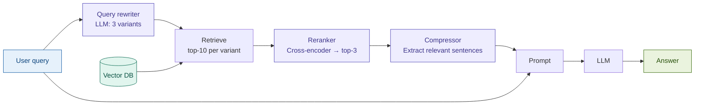

# 02: Advanced RAG — Fix Naive Failures

---

## The problem with Naive RAG

Your user asks: *"What triggers a countercyclical buffer increase under Basel III?"*

Naive RAG embeds that exact string and retrieves the closest chunks by cosine distance.

**Two things go wrong:**
- The query vocabulary doesn't match the document's legal phrasing → wrong chunks retrieved
- The top-10 results include related-but-wrong passages → the LLM reads noise alongside signal

Advanced RAG fixes both — before retrieval and after it.

---

## What Advanced RAG adds

**Pre-retrieval:** rewrite the query into 3 variants using formal terminology,
synonyms, and the most specific sub-question — cast a wider net.

**Post-retrieval:** rerank all candidates with a cross-encoder, then compress
each surviving chunk to only its query-relevant sentences.

---

## The key insight

> Query rewriting + cross-encoder reranking dramatically improves retrieval precision —
> typically +15–25% top-3 recall on regulatory and legal text.

The raw user query is a poor retrieval signal.
A cross-encoder is a much better relevance judge than cosine similarity.
Compression reduces noise before the LLM sees anything.

Each stage corrects a specific Naive RAG failure — none of them require changing
the underlying vector store or embedder.

---

## Fintech use case: Basel III regulatory search

**Query:** *"What capital requirements apply to Tier 1 banks under Basel III?"*

| Stage | What happens |
|-------|-------------|
| Rewrite | Generates variants: "minimum CET1 ratio requirement", "capital conservation buffer threshold", "Tier 1 leverage ratio Basel" |
| Retrieve | Pools ~25 unique candidates across all 4 queries (3 variants + original) |
| Rerank | Cross-encoder scores each candidate against the original query — surfaces the CET1 minimum clause (4.5% + 2.5% buffer) as rank 1 |
| Compress | Extracts the 2 sentences defining the ratio from a 400-token chunk — drops unrelated context about implementation timelines |
| Generate | Claude cites the precise ratio with the correct buffer breakdown |

**Without Advanced RAG:** the top result is a passage about the countercyclical buffer —
related topic, wrong answer. The LLM hedges or hallucates the exact threshold.

---

## Tradeoffs

| What improves | What it costs |
|--------------|--------------|
| Retrieval precision: +15–25% top-3 recall | Latency: +1–2 s per query (rewrite + rerank + compress) |
| Context quality: 60–85% token reduction via compression | Cost: 3–5× Naive RAG per query (extra LLM + reranker calls) |
| Answer precision: fewer hallucinations on exact thresholds | Complexity: 3 new failure points, prompt-sensitive components |

**When it's worth it:** regulatory Q&A, risk report lookup, compliance audits —
anywhere answer precision matters more than sub-second latency.

**When to skip it:** real-time trading desk tools, simple FAQ with consistent
vocabulary, table-heavy documents where compression destroys structure.
