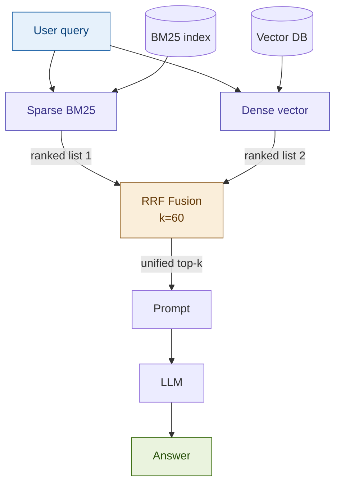

# Hybrid RAG

## What it is

Hybrid RAG combines two fundamentally different retrieval signals — sparse BM25 keyword matching and dense vector semantic search — and merges their ranked results using Reciprocal Rank Fusion (RRF). BM25 excels at exact token overlap: it finds documents that share the precise words in the query. Dense retrieval excels at semantic proximity: it finds documents that mean the same thing even when phrased differently. RRF fuses the two ranked lists by summing reciprocal rank scores (`1 / (k + rank)`, default `k=60`), producing a unified top-k that benefits from both retrieval modalities without requiring score normalization or learned combination weights.

## Source

Ma et al., "Hybrid Search with BM25 and Dense Retrieval", 2023.
URL: https://arxiv.org/abs/2301.07895

## When to use it

- Queries mix exact terminology with conceptual intent — e.g., "What does clause 8(a)(ii) say about *close-out netting*?" requires both exact clause reference and semantic understanding.
- The document corpus contains **legal, regulatory, or standards text** where precise term matching is legally significant (ISDA, SWIFT MT/MX, Basel III, IFRS).
- Dense-only retrieval misses exact identifiers: article numbers, product codes, ISO message types, CUSIP/ISIN identifiers.
- You are seeing recall failures on queries that include rare or domain-specific tokens that fall outside the embedding model's training distribution.
- The query population is heterogeneous — some queries are keyword lookups, others are conceptual — and you cannot predict which type will arrive at runtime.

## When NOT to use it

- The query set is **purely semantic** (no exact-match requirements): adding BM25 overhead for conceptual Q&A over general prose adds latency with marginal recall gain.
- The corpus is **very small** (< 500 documents): BM25 IDF weighting is unreliable on tiny corpora, and dense retrieval alone is sufficient.
- **Latency budget is tight**: parallel BM25 + vector retrieval roughly doubles retrieval time versus a single-modality approach. If p95 latency < 200ms is required, profile carefully before adopting.

## Architecture

## Key components

| Component | Purpose | Default implementation |
|-----------|---------|----------------------|
| `BM25Retriever` | Sparse keyword ranking over tokenized corpus | `rank_bm25.BM25Okapi` |
| `DenseRetriever` | Semantic embedding search | `langchain_community.vectorstores.Chroma` + `OpenAIEmbeddings` |
| `RRFCombiner` | Fuses two ranked lists via Reciprocal Rank Fusion | Custom: `score = Σ 1/(k + rank_i)`, `k=60` |
| Tokenizer | BM25 document and query tokenization | `str.lower().split()` (extend with domain stopword list) |

## Step-by-step

1. **Index — BM25**: Tokenize all chunks, build `BM25Okapi` over the token lists. Store chunk text alongside for retrieval.
2. **Index — Dense**: Embed all chunks with `text-embedding-3-small`, store vectors in Chroma.
3. **Query — parallel retrieval**: For each incoming query, fire both BM25 (top-N) and dense (top-N) retrieval simultaneously.
4. **RRF fusion**: Assign each chunk a score `Σ 1/(k + rank)` across the two ranked lists. Chunks appearing in both lists are rewarded — they score from two reciprocal rank contributions.
5. **Deduplicate and re-rank**: Sort by descending RRF score, deduplicate on chunk ID, return top-k to the prompt.
6. **Generate**: Pass the unified top-k chunks to the LLM with the original query.

## Fintech use cases

- **Margin call triggers (ISDA)**: A query like "Find all references to 'margin call' triggers in the ISDA agreement" needs BM25 for the exact phrase "margin call" and dense retrieval for semantically related clauses about collateral obligations and credit support annex terms.
- **Contract review (SWIFT/ISO messaging)**: Lookup of ISO 20022 message field names (e.g., `<TtlNetEntryAmt>`) benefits from exact token match; understanding the business context of settlement netting requires semantic search.
- **Regulatory clause lookup (Basel III, IFRS 9)**: Auditors searching for specific article references (e.g., "Article 92(3)") combined with conceptual questions ("What are the RWA floors?") need both modalities to retrieve the right paragraph.
- **AML/KYC policy search**: Compliance queries often combine exact regulatory identifiers (FATF Recommendation 10) with conceptual intent (customer due diligence obligations), exactly the hybrid sweet spot.

## Tradeoffs

| Dimension | Rating | Notes |
|-----------|--------|-------|
| Retrieval quality | ★★★★★ | Consistently outperforms either modality alone on MRR and Recall@k in mixed-query workloads |
| Latency | ★★★☆☆ | Parallel retrieval ~1.5–2× single-modality; BM25 is fast in-memory, main overhead is dual index lookup |
| Cost | ★★★★☆ | No extra LLM calls; marginal embedding cost unchanged; BM25 is CPU-only, no API cost |
| Complexity | ★★☆☆☆ | Two indexes to build, maintain, and keep in sync; RRF k-parameter requires per-domain tuning |
| Fintech relevance | ★★★★★ | Exact clause/article references are ubiquitous in financial documents — sparse retrieval is not optional |

## Common pitfalls

- **Skipping RRF k-tuning**: The default `k=60` from the original paper was calibrated on web search. For short legal corpora with fewer than 10k chunks, `k=10–30` often performs better. Always evaluate MRR on a held-out query set before deploying.
- **Asymmetric top-N before fusion**: If you retrieve top-5 from BM25 and top-100 from dense, RRF cannot meaningfully fuse them — chunks ranked 6–100 in BM25 are invisible. Use the same `N` (typically 20–50) for both retrievers before fusion, then trim to top-k after.
- **Not deduplicating**: The same chunk can appear in both BM25 and dense results. Without deduplication after fusion, the same text gets sent to the LLM twice, wasting context window tokens.
- **Stale BM25 index**: `BM25Okapi` is built in-memory at startup and does not support incremental document addition. When the corpus updates, the entire BM25 index must be rebuilt. If this is not operationalized, the two indexes will diverge.
- **Token mismatch between indexes**: BM25 tokenization (whitespace + lowercasing) and the embedding model's tokenizer (BPE subwords) can disagree on how to split domain-specific terms like "CDS" vs "credit default swap". Normalize query terms consistently before sending to BM25.

## Related patterns

- **04 RAG Fusion**: Extends Hybrid RAG by generating multiple query variants before retrieval, then applying RRF across those variant result sets. Combine with Hybrid RAG for maximum recall: generate variants → retrieve hybrid for each → fuse all ranked lists.
- **09 Ensemble RAG**: A generalization of Hybrid RAG to N retrievers (not just two). Useful when adding a third signal such as a re-ranked BM25F index with field-weighted scoring (title vs. body vs. metadata).
- **02 Advanced RAG**: The reranker stage in Advanced RAG (cross-encoder or Cohere Rerank) can be applied *after* Hybrid RAG fusion for a two-stage pipeline: broad hybrid recall → precision reranking.
- **13 Contextual RAG**: Anthropic's context-prepended chunks improve dense retrieval quality; Hybrid RAG can sit beneath Contextual RAG to handle the exact-match gap that contextual embeddings do not fully close.
