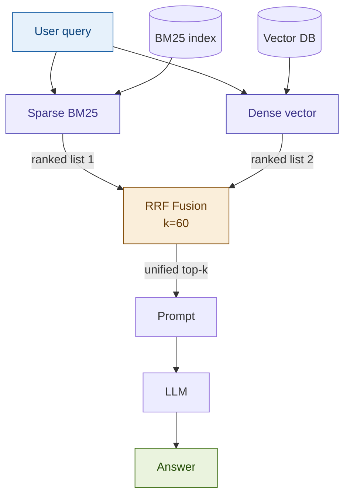

# 03: Hybrid RAG — Best of Both Worlds

---

## The Problem with Vectors Alone

Dense retrieval is powerful — but it fails on exact references.

> *"Find all margin call triggers in clause 8(a)(ii)"*

A vector search returns **semantically similar** chunks.
It may miss the chunk that literally contains **"clause 8(a)(ii)"** if that string isn't well-represented in embedding space.

In financial documents, exact identifiers **are** the answer.

---

## Two Retrieval Signals, One Result

| Signal | Strength | Weakness |
|--------|----------|----------|
| **BM25 (sparse)** | Exact keyword matches, rare tokens, article numbers | No semantic understanding |
| **Dense vectors** | Synonyms, paraphrases, conceptual similarity | Drifts on exact identifiers |
| **Hybrid (both)** | Maximum recall across both dimensions | Two indexes to maintain |

---

## Architecture



---

## The Key Insight: Reciprocal Rank Fusion

No score normalization. No learned weights. Just rank positions.

```
RRF score = Σ  1 / (k + rank_i)     k = 60
```

A chunk appearing in **both** lists scores from two contributions.
Chunks strong in only one modality still surface — nothing is lost.

---

## Fintech Demo: ISDA Margin Call Lookup

**Query:** *"Find all references to 'margin call' triggers in the ISDA agreement"*

| Retriever | What it finds |
|-----------|--------------|
| BM25 only | Chunks containing the exact phrase "margin call" |
| Dense only | Chunks about collateral obligations, credit support annex |
| **Hybrid** | **Both** — exact phrase hits *and* semantically related clauses |

The compliance team needs both. Missing either is a risk.

---

## Tradeoffs

| Dimension | Rating | Notes |
|-----------|--------|-------|
| Retrieval quality | ★★★★★ | Consistently best MRR on mixed-query workloads |
| Latency | ★★★☆☆ | ~1.5–2× single-modality; BM25 is fast in-memory |
| Cost | ★★★★☆ | No extra LLM calls; BM25 is CPU-only |
| Complexity | ★★☆☆☆ | Two indexes, RRF k requires per-domain tuning |

**When to skip it:** purely conceptual queries, very small corpora, sub-200ms latency requirements.

---

## What's Next

We've improved **how we retrieve**.

Next: improve **what we index** — so retrieval starts with better chunks.

→ **Module 10: Parent Document Retrieval**
