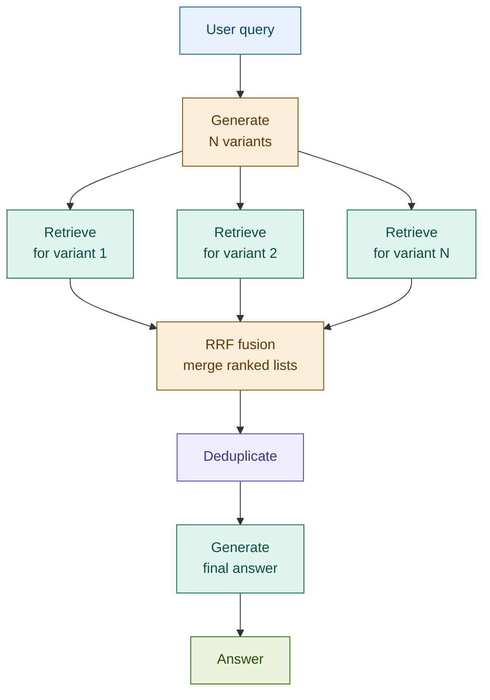

# RAG Fusion

## What it is

RAG Fusion addresses a fundamental limitation of single-query retrieval: a user's phrasing of a question is one of many valid phrasings, and different phrasings surface different documents. The pattern generates N rephrasings of the original query from different angles, retrieves a separate ranked list of documents for each rephrasing, and merges all lists into a single fused ranking using Reciprocal Rank Fusion (RRF) before generating the final answer.

The key insight: documents indexed with different terminology than the user's query will be missed by single-query retrieval. A compliance analyst asking "reporting obligations for suspicious transactions" may miss documents indexed under "SAR filing requirements", "unusual activity reporting", or "AML disclosure thresholds" — all covering the same information. RAG Fusion retrieves across all of these simultaneously.

RRF combines the ranked lists without requiring score normalisation across retrievals. Each document's fused score is the sum of its reciprocal rank positions across all lists: `score = Σ 1/(k + rank)` with `k=60` as the standard smoothing constant. Documents that appear in multiple lists receive additive boosts; documents that appear in only one list are not discarded.

## Source

Rackauckas, Zackary. "Forget RAG, the Future is RAG-Fusion." Towards Data Science, 2023.
URL: https://towardsdatascience.com/forget-rag-the-future-is-rag-fusion-1147298d8ad1

Shi, Surber, et al. "RAG-Fusion: A New Take on Retrieval-Augmented Generation." 2024.
URL: https://arxiv.org/abs/2402.03367

## When to use it

- **Vocabulary mismatch between users and documents**: compliance analysts say "suspicious transaction reporting"; policy documents say "SAR filing obligations". RAG Fusion retrieves across both terminologies in parallel.
- **Market research requiring perspective diversity**: a query about credit risk exposure benefits from variants that probe "counterparty risk", "default probability", "credit concentration" — each surface different relevant documents.
- **AML and fraud detection**: transaction monitoring policies use inconsistent terminology across jurisdictions and internal guidelines. Variant generation bridges these synonyms without manual synonym expansion.
- **When single-query results feel incomplete**: if baseline RAG consistently misses known relevant documents, RAG Fusion is the lowest-complexity fix before moving to hybrid retrieval.

## When NOT to use it

- **Latency-critical applications**: N variants × retrieval time adds directly to response latency. At N=4 and k=5, you run 20 retrieval operations instead of 5.
- **Well-specified single-angle queries**: "What is the CET1 ratio requirement under Basel III Article 92?" has no synonym problem. Generating variants adds cost with no retrieval gain.
- **High-volume, cost-sensitive pipelines**: the variant-generation LLM call and N×retrieval scale linearly with query volume. Gate with a complexity check at high scale.

## Architecture

**RRF formula**: `score(doc) = Σ_i 1 / (60 + rank_i(doc))` — summed across all N retrieval lists where the document appears. Documents in multiple lists score higher; the constant 60 prevents high-rank documents from dominating.

## Key components

| Component | Purpose | Default implementation |
|-----------|---------|----------------------|
| Query variant generator | Produces N rephrasings from different angles | Prompted `claude-haiku-4-5-20251001` — one call returns all N variants |
| Per-variant retriever | Dense similarity search for each variant | `Chroma.similarity_search` with `k=5` per variant |
| RRF merger | Combines N ranked lists into one fused ranking | 10-line Python function; no external dependency |
| Deduplicator | Removes duplicate chunks before generation | `set()` keyed on first-80-chars content prefix |
| Generator | Final answer from fused context | `claude-sonnet-4-6` with top-5 fused chunks |

## Step-by-step

1. **Receive query** — accept the user's natural language question.
2. **Generate variants** — call the variant generator with the original query. It returns N rephrasings that preserve the information need but vary vocabulary, framing, and angle. Always include the original query in the retrieval pool.
3. **Retrieve per variant** — run a separate similarity search for each variant (original + N rephrasings). Each search returns a ranked list of top-k documents.
4. **RRF fusion** — compute the RRF score for every unique document across all N+1 ranked lists. Sort descending by fused score.
5. **Deduplicate** — remove chunks that appear multiple times (identical content, different vector IDs). The RRF score already amplifies their signal; keep only the first occurrence.
6. **Generate** — pass the top-5 fused chunks (with RRF scores for transparency) to the generator LLM. Produce the final answer.

## Fintech use cases

- **AML synonym coverage**: the workshop demo query — "What are the reporting obligations for suspicious transactions?" — retrieves under at least four terminological variants: "SAR filing requirements", "unusual activity reports", "AML disclosure obligations", "financial crime notification duties". Single-query retrieval on any one of these misses the other three. RAG Fusion covers all.
- **Market research with perspective diversity**: a credit analyst querying "credit risk exposure in our loan book" benefits from variants probing "default risk concentration", "counterparty credit limits", "loan portfolio impairment thresholds". Each variant surfaces a different relevant segment of the internal policy corpus.
- **Multi-jurisdiction regulatory compliance**: a compliance team checking obligations across FATF, FinCEN, and FCA guidance uses inconsistent terminology. RAG Fusion retrieves across all jurisdictional phrasings simultaneously without requiring manual synonym tables.

## Tradeoffs

| Dimension | Rating | Notes |
|-----------|--------|-------|
| Retrieval quality | ★★★★☆ | Multi-perspective coverage outperforms single-query on vocabulary-mismatched corpora |
| Answer quality | ★★★★☆ | Richer context from diverse angles improves completeness for open-ended questions |
| Latency | ★★☆☆☆ | N variant retrievals run sequentially by default; parallelise for production use |
| Cost | ★★★☆☆ | One Haiku call for variants; N × retrieval cost; generation cost unchanged |
| Complexity | ★★☆☆☆ | RRF is 10 lines; the pattern is one of the simplest retrieval enhancements |

## Common pitfalls

- **Query drift in variants**: the variant generator can produce queries that stray from the original intent, especially for short or ambiguous queries. Validate by printing variants and checking they remain on-topic. Keep N ≤ 5 and use an explicit prompt constraint: "preserve the information need exactly".
- **Duplicates inflating scores**: without deduplication, the same chunk appears multiple times in the fused list. Its RRF score is already boosted by appearing in multiple ranked lists — do not count it again. Always deduplicate before truncating to top-k.
- **N × retrieval cost at scale**: with N=4 variants and k=5 per variant, you run 25 retrieval operations. At high query volume, this adds up. Parallelise retrievals with `asyncio.gather` or use a batch retrieval API.

## Related patterns

- **05 Multi-Query RAG**: the closest sibling — Multi-Query generates sub-questions that decompose the original query into distinct aspects, while RAG Fusion generates rephrasings that preserve the full information need. Use RAG Fusion when the problem is vocabulary mismatch; use Multi-Query when the problem is query complexity.
- **03 Hybrid RAG**: RAG Fusion and Hybrid RAG both use RRF fusion but at different stages. Hybrid RAG fuses BM25 and dense retrieval results for a single query. RAG Fusion fuses dense retrieval results for multiple query variants. They compose cleanly: run Hybrid RAG for each variant, then fuse all lists with RRF.
- **02 Advanced RAG**: RAG Fusion extends Advanced RAG's query rewriting step — instead of rewriting once, it generates N parallel rewrites and retrieves for all of them.
