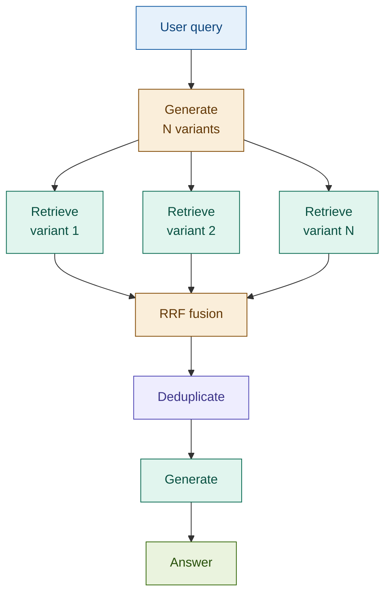

# 04: RAG Fusion — More Angles, Better Coverage

---

## The Problem: One Phrasing, One Slice of the Corpus

Single-query RAG retrieves what matches *your* words. Documents indexed under different vocabulary are silently missed.

A compliance analyst asking "reporting obligations for suspicious transactions" may miss documents indexed as:

| Document terminology | Single-query retrieves it? |
|---------------------|---------------------------|
| "SAR filing requirements" | ✗ — different words |
| "unusual activity reporting" | ✗ — different framing |
| "AML disclosure thresholds" | ✗ — different angle |
| "suspicious transaction reporting obligations" | ✓ — exact match |

One query = one perspective. One perspective = incomplete coverage.

---

## The Solution: Generate Variants, Retrieve in Parallel, Fuse

RAG Fusion generates N rephrasings of the original query, retrieves a ranked list for each, then merges all lists into one ranking using Reciprocal Rank Fusion.

```
Query → Generate N variants → Retrieve for each → RRF merge → Deduplicate → Generate
```

**Reciprocal Rank Fusion** scores each document by summing its reciprocal rank positions across all retrieval lists: `score = Σ 1 / (60 + rank)`. Documents that surface in multiple lists receive additive boosts. The constant 60 prevents any single top-ranked document from dominating.

The result: vocabulary-mismatched documents are caught. The generator sees a richer, more complete context.

---

## Architecture



---

## Fintech: AML Synonym Coverage

**Query:** *"What are the reporting obligations for suspicious transactions?"*

| Variant | Terminology angle |
|---------|------------------|
| Original | "reporting obligations for suspicious transactions" |
| Variant 1 | "SAR filing requirements for financial institutions" |
| Variant 2 | "unusual activity reporting duties under AML rules" |
| Variant 3 | "disclosure thresholds for suspected money laundering" |
| Variant 4 | "financial crime notification obligations" |

Each variant retrieves different documents. RRF fusion surfaces all of them. The generator sees the complete AML picture — not just what matched the analyst's exact phrasing.

---

## Tradeoffs

| Dimension | Rating | Notes |
|-----------|--------|-------|
| Retrieval quality | ★★★★☆ | Multi-perspective coverage catches vocabulary-mismatched documents |
| Answer quality | ★★★★☆ | Richer context improves completeness for open-ended queries |
| Latency | ★★☆☆☆ | N retrieval calls — parallelise for production |
| Cost | ★★★☆☆ | One Haiku call for variants; retrieval scales linearly with N |
| Complexity | ★★☆☆☆ | RRF is 10 lines — one of the simplest retrieval enhancements |

**When to skip**: single-angle queries with no synonym problem, or latency-critical paths where N × retrieval is unacceptable.

→ **Module 05: Multi-Query RAG** — instead of rephrasing, decompose the query into sub-questions.
