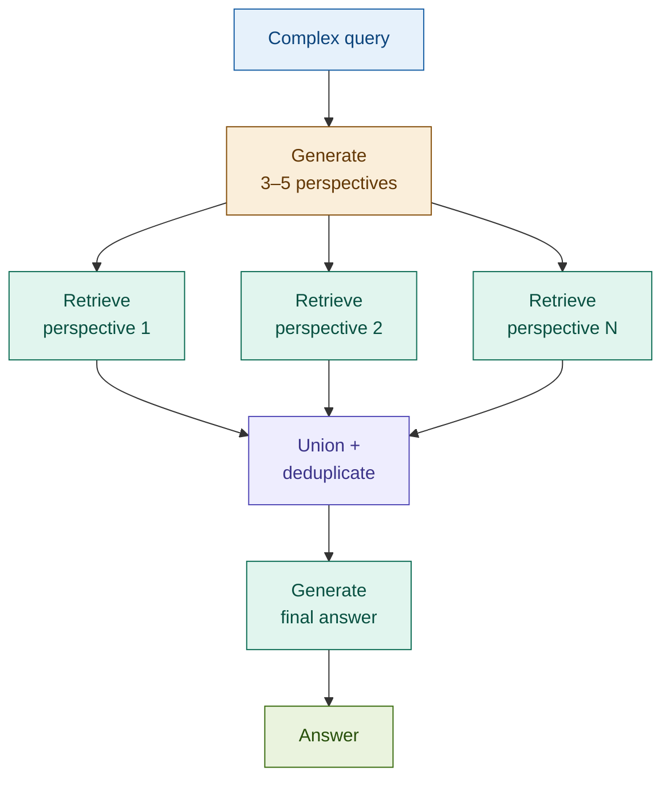

# Multi-Query RAG

## What it is

Multi-Query RAG compensates for a fundamental limitation of dense retrieval: a single embedding captures one point in vector space, missing documents that express the same information differently. The pattern generates 3–5 distinct query perspectives from the original question, runs a separate retrieval for each, then unions and deduplicates the results before passing the full context to the generator. The key insight is that query diversity in embedding space expands the retrieval neighbourhood — documents that are semantically distant from one phrasing are often semantically close to another.

## Source

LangChain MultiQueryRetriever documentation and underlying research, 2023.
URL: https://python.langchain.com/docs/modules/data_connection/retrievers/MultiQueryRetriever

## When to use it

- **Complex multi-part questions**: when the original query contains multiple distinct aspects that a single embedding cannot represent simultaneously (e.g., "What are the capital requirements and disclosure timelines under Basel III?").
- **When the original query is too broad**: a vague query like "tell me about credit risk" maps to one embedding centroid; perspectives such as "credit risk measurement methods" and "credit risk mitigation techniques" each map to tighter, more useful neighbourhoods.
- **Comparative analysis**: queries comparing two or more entities benefit from sub-queries that isolate each entity, then retrieve targeted context for comparison.
- **Portfolio and multi-product lookups**: a single customer query about their holdings may span equity, fixed income, and derivatives products — each with different terminology in the document corpus.
- **When single-query results feel incomplete**: if known relevant documents are consistently missing from baseline retrieval, Multi-Query is a low-complexity first fix before resorting to hybrid retrieval.

## When NOT to use it

- **Simple single-aspect queries**: "What is the CET1 ratio requirement under Basel III?" has one clear answer in one section. Generating perspectives adds cost with no retrieval gain.
- **When query decomposition is unclear**: very short or highly ambiguous queries often produce semantically similar (not diverse) perspectives, reducing the pattern to redundant retrieval at extra cost.
- **Latency-critical paths**: N retrievals run sequentially by default. At N=4, this multiplies retrieval latency by up to 4×. Parallelise with `asyncio.gather` or gate the pattern behind a complexity classifier.

## Architecture

**Key difference from RAG Fusion**: Multi-Query unions results without rank-weighting. RAG Fusion uses Reciprocal Rank Fusion to score documents by their rank position across all lists. Use Multi-Query when you need diverse perspectives; use RAG Fusion when rank quality matters and you want to weight by retrieval confidence.

## Key components

| Component | Purpose | Default implementation |
|-----------|---------|----------------------|
| Query decomposer | Generates N diverse perspectives from the original query | Prompted `claude-haiku-4-5-20251001` — one call returns all N perspectives |
| Per-perspective retriever | Dense similarity search for each perspective | `Chroma.similarity_search` with `k=4` per perspective |
| Union + deduplicator | Merges all result lists, removes duplicates | `set()` keyed on first-80-chars content prefix; no rank weighting |
| Generator | Final answer from the full deduplicated context | `claude-sonnet-4-6` with top-8 unique chunks |

## Step-by-step

1. **Receive query** — accept the user's natural language question. Log the original phrasing.
2. **Generate perspectives** — call the query decomposer with the original query. It returns N rephrasings that each probe a different aspect or terminology cluster. Always retain the original query in the retrieval pool.
3. **Retrieve per perspective** — run a separate similarity search for each perspective (original + N rephrasings). Each search returns a ranked list of top-k documents.
4. **Union and deduplicate** — merge all result lists into a single set, removing duplicates by content key. Unlike RAG Fusion, no rank-based scoring is applied — all unique chunks are treated equally.
5. **Truncate context** — cap at 8 unique chunks to stay within context budget. If more chunks are needed, switch to RAG Fusion for rank-guided selection.
6. **Generate** — pass the deduplicated chunks to the generator LLM. Produce the final answer.

## Fintech use cases

- **Regulatory compliance across multiple rules**: a compliance officer asks "What are our obligations under FATF Recommendation 16 and FinCEN CTR rules?" Multi-Query generates a perspective for each rule, retrieving targeted sections from each regulatory document rather than a blended centroid between them.
- **Cross-product comparison**: a query like "How does early redemption work for fixed deposits versus structured notes?" decomposes naturally into one perspective per product. Each retrieves product-specific terms and conditions without interference.
- **Multi-timeframe analysis**: "How did net interest margin perform over the last three quarters and what is the forward guidance?" generates perspectives for each time period plus one for forward guidance — each maps to different sections of the earnings report.
- **Portfolio risk lookup**: "What are the risk factors for my equity and bond holdings?" decomposes by asset class, retrieving risk disclosures from equity and fixed-income sections separately.

## Tradeoffs

| Dimension | Rating | Notes |
|-----------|--------|-------|
| Retrieval quality | ★★★★☆ | Diverse perspectives expand coverage beyond single-embedding limitations |
| Answer quality | ★★★★☆ | Richer, multi-aspect context improves completeness for complex queries |
| Latency | ★★☆☆☆ | N sequential retrievals; parallelise with `asyncio.gather` for production use |
| Cost | ★★★☆☆ | One Haiku call for perspective generation; N × retrieval; generation cost unchanged |
| Complexity | ★★★☆☆ | Union logic is simpler than RRF; perspective quality depends on prompt engineering |

## Common pitfalls

- **Semantically similar (not diverse) perspectives**: a poorly prompted decomposer produces near-identical rephrasings rather than genuinely different angles. This degrades to redundant retrieval. Validate by printing perspectives and checking they map to distinct aspect clusters.
- **Aggregation can be lossy**: union without rank weighting treats a chunk retrieved at rank 1 the same as one at rank 8. For queries where retrieval confidence matters, replace the union step with RRF (effectively becoming RAG Fusion).
- **Context window overflow**: N perspectives × k chunks can produce a very large union. Always cap the final context at a fixed chunk count (e.g., 8) before passing to the generator. Log how many unique chunks were retrieved vs used.
- **Higher token cost at scale**: each perspective generates a separate LLM call for retrieval scoring and a longer context for generation. At high query volume, gate with a complexity classifier so simple queries use single-query retrieval.

## Related patterns

- **04 RAG Fusion**: the closest sibling — RAG Fusion generates rephrasings of the *same* question and uses RRF to weight results by rank. Multi-Query decomposes into *different* perspectives and unions without weighting. Use RAG Fusion when the problem is vocabulary mismatch; use Multi-Query when the problem is query complexity or multi-aspect coverage.
- **23 Multi-Hop RAG**: Multi-Query generates all perspectives upfront and retrieves in parallel. Multi-Hop RAG retrieves iteratively — each retrieval step informs the next query. Use Multi-Query when sub-questions are known upfront; use Multi-Hop when the second question depends on what the first retrieval reveals.
- **02 Advanced RAG**: Multi-Query extends Advanced RAG's query rewriting step — instead of one rewrite, it generates N parallel perspectives and retrieves for all of them.
