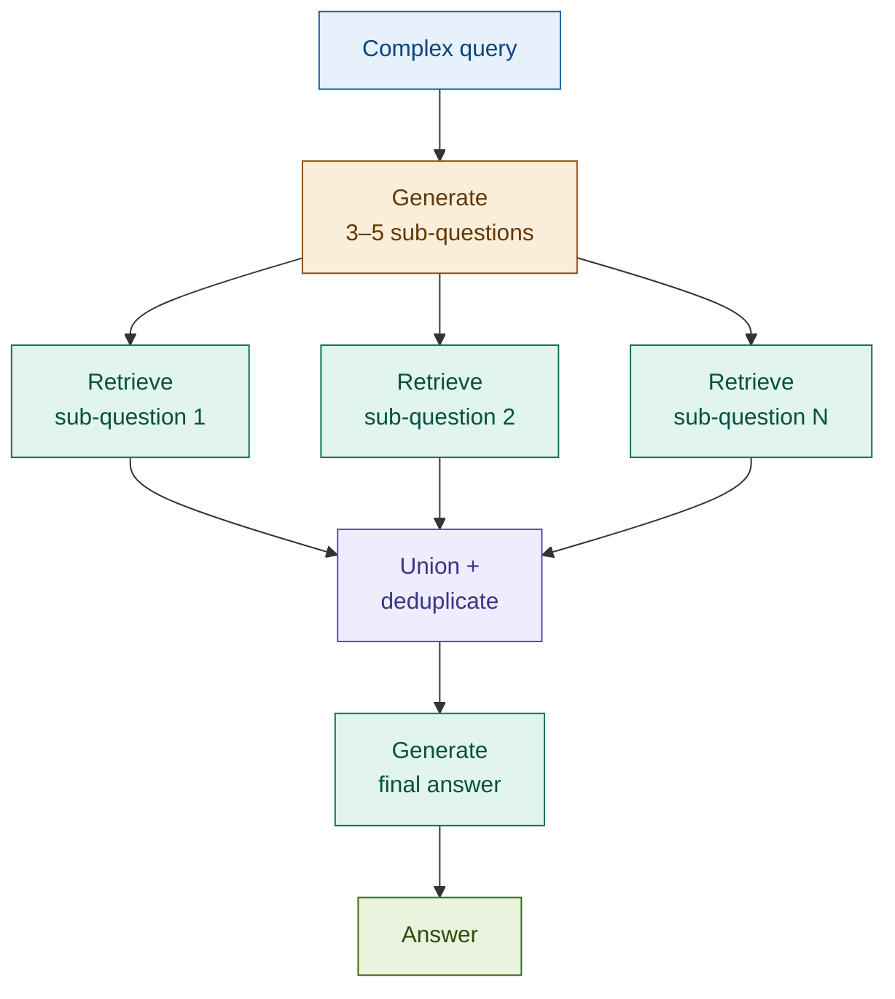

# 05: Multi-Query RAG — Decompose Complex Questions

---

## The Problem: Complex Queries Map to One Point in Vector Space

A multi-faceted question produces a single embedding — a centroid between all its aspects. Documents relevant to any one aspect may be too far from that centroid to be retrieved.

**Query:** *"What are our capital adequacy obligations under Basel III and our AML reporting duties under FATF?"*

A single embedding averages across both frameworks. Chunks specific to Basel III capital ratios and chunks specific to FATF Recommendation 16 both sit far from the blended centroid — both get missed.

**Decomposition improves recall for multi-faceted questions.**

---

## The Solution: Break It Down, Retrieve in Parts

Generate 3–5 sub-questions from the original query. Each maps to a tighter, more specific region of the embedding space. Retrieve for each sub-question, then union the results.

```
Complex question
  │
  ├─→ Sub-question 1: "Basel III capital adequacy requirements" ──→ Retrieve
  │
  ├─→ Sub-question 2: "FATF AML reporting obligations"          ──→ Retrieve
  │
  └─→ Sub-question 3: "regulatory capital calculation methods"  ──→ Retrieve
                                                                        │
                                                          Union + dedup ↓
                                                              Generate answer
```

---

## Architecture



---

## Fintech: Regulatory Compliance Across Frameworks

**Query:** *"What are our Basel III capital and FATF AML obligations?"*

| Sub-question | Retrieves |
|-------------|-----------|
| "Basel III minimum capital ratio requirements" | CET1, Tier 1, total capital ratio rules |
| "FATF Recommendation 16 wire transfer obligations" | Originator/beneficiary data requirements |
| "regulatory reporting timelines for financial institutions" | Submission deadlines across both frameworks |

Each sub-question retrieves a focused cluster. The union gives compliance teams a complete picture from a single query.

---

## Tradeoffs

| Dimension | Rating | Notes |
|-----------|--------|-------|
| Retrieval coverage | ★★★★☆ | Decomposition expands coverage for multi-aspect queries |
| Answer completeness | ★★★★☆ | Each sub-question contributes distinct context |
| Latency | ★★☆☆☆ | N retrieval calls — parallelise for production |
| Cost | ★★★☆☆ | One LLM call for decomposition + N × retrieval |
| Complexity | ★★★☆☆ | Union logic is simple; sub-question quality depends on prompt |

**When to skip**: unambiguous single-aspect queries, or when sub-question diversity is hard to guarantee.

→ **Module 07: Step-Back RAG** — instead of decomposing down, abstract up to a broader question first.
