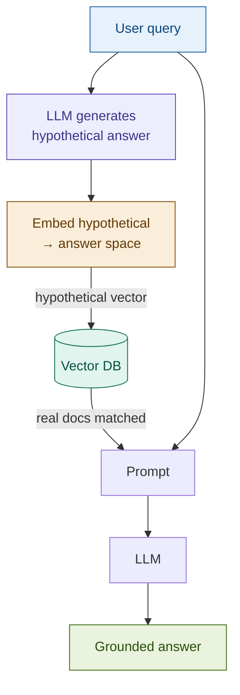

# HyDE (Hypothetical Document Embeddings)

> **The elegant insight**: a question and its answer occupy different positions in embedding space. HyDE moves the search vector from the question's neighborhood into the answer's neighborhood — before retrieval even begins.

## What it is

Every dense retrieval system embeds the user's query and searches for the nearest document vectors. This works well when queries and documents share vocabulary. It breaks down when the query is a short, abstract question and the documents are long, concrete passages — the embedding model places them far apart in vector space despite being semantically related.

HyDE resolves this asymmetry with a single insight: instead of embedding the query, generate a *hypothetical answer* to the query and embed that instead. A hypothetical answer to "What is the Basel III leverage ratio requirement?" looks like *"The Basel III framework requires banks to maintain a minimum Tier 1 leverage ratio of 3.0%, calculated as Tier 1 capital divided by total exposure..."* — language that closely resembles the actual document passages that contain the answer. The hypothetical answer's embedding vector lands in the same region of embedding space as the real answer documents, dramatically improving retrieval precision.

The hypothetical answer is *never shown to the user*. It is discarded after retrieval. The final answer is generated from the real retrieved documents using the original query — so factual errors in the hypothetical do not propagate to the user.

## Source

Gao et al., "Precise Zero-Shot Dense Retrieval without Relevance Labels", ACL 2023.
URL: https://arxiv.org/abs/2212.10496

## When to use it

- The query is a **short, abstract question** and documents are **long, answer-form passages** — the classic retrieval asymmetry that dense search handles poorly (e.g., "What triggers a margin call?" vs a 500-word CSA section that never uses the word "trigger").
- **Zero-shot retrieval over new domains**: when query logs are sparse and there is no training data to fine-tune retriever embeddings, HyDE provides an immediate improvement by leveraging the LLM's domain knowledge to generate answer-like search vectors.
- The corpus vocabulary is **formal or technical** — regulatory documents, academic papers, legal agreements — where query phrasing ("how do I…", "what is…") diverges from document phrasing ("the party shall…", "pursuant to Article…").
- Queries are **conceptual or open-ended** rather than lookup-oriented: "explain the implications of" rather than "find the clause about".

## When NOT to use it

- **Factual lookups where the query already sounds like the answer**: "What is the CET1 ratio in Article 1.1?" embeds well as-is — the query already contains the answer-domain vocabulary. HyDE adds latency with no benefit.
- The **LLM has no knowledge of the domain**: if the LLM cannot generate a plausible hypothetical answer, the resulting embedding vector is noise. HyDE requires at least partial domain coverage from the LLM's training data.
- **Latency is the primary constraint**: HyDE adds one full LLM call before retrieval. On a 500ms latency budget, this is prohibitive. Measure first.
- The **index is very small** (< 500 chunks): with a small corpus, basic cosine search over the plain query already saturates precision — HyDE's improvement is minimal.

## Architecture

**Critical detail**: the original query `Q` still goes to the final generation prompt. Only the *retrieval vector* is replaced by the hypothetical embedding. The user's question is never substituted.

## Key components

| Component | Purpose | Default implementation |
|-----------|---------|----------------------|
| HyDE generator | Calls the LLM to produce a hypothetical answer | `claude-haiku-4-5-20251001` — fast, cheap; quality of retrieval matters more than quality of hypothesis |
| Hypothetical embedder | Embeds the generated hypothetical answer text | Same model as the corpus: `OpenAIEmbeddings(model="text-embedding-3-small")` |
| Vector store | Holds corpus embeddings; queried with hypothetical vector | `Chroma` |
| Generation LLM | Produces the real answer from retrieved documents | `claude-sonnet-4-6` |
| Hallucination guard | Ensures hypothetical answer is not surfaced to user | Architectural: hypothetical text is never added to the generation prompt |

## Step-by-step

1. **Receive query**: accept the user's natural language question as-is.
2. **Generate hypothetical answer**: call the LLM with a prompt instructing it to write a passage *as if it were from the corpus* — authoritative, concrete, answer-form. Do not ask it to hedge or qualify; the goal is vocabulary matching, not accuracy.
3. **Embed the hypothetical**: embed the generated text with the same embedding model used at index time. This vector lands in the "answer space" of the corpus.
4. **Retrieve with hypothetical vector**: run `similarity_search` using the hypothetical embedding, not the query embedding.
5. **Discard the hypothetical**: the generated text is now irrelevant. It played its role.
6. **Generate real answer**: pass the original query + retrieved real documents to the LLM. The final answer is grounded in real source material.

## Fintech use cases

- **Conceptual risk queries over new regulatory domains**: a compliance team onboarding to a new jurisdiction (e.g., MAS TRM guidelines, FINRA Rule 4210) can query unfamiliar regulations without needing domain-specific query vocabulary. HyDE generates a plausible passage in the target document style, pulling back real clauses even when the analyst doesn't yet know the right terminology.
- **"What if" scenario search**: queries like "What happens to variation margin requirements when market volatility exceeds threshold?" are hypothetical by nature. The LLM can generate a hypothetical answer in ISDA/CSA language, retrieving the specific clause that actually governs this scenario.
- **Zero-shot coverage of new product FAQs**: when a bank launches a new structured product and documentation is sparse, HyDE allows customer-service RAG to bootstrap without a curated query–answer training set.
- **Open Banking / PSD2 conceptual queries**: "How does open banking affect data sharing consent?" is too abstract for plain query embedding over technical API documentation. A HyDE hypothetical bridges the query style ("how does X affect Y?") to the document style ("the AISP is required to obtain explicit consent…").

## Tradeoffs

| Dimension | Rating | Notes |
|-----------|--------|-------|
| Retrieval quality | ★★★★☆ | Strong improvement on abstract/conceptual queries; limited gain on exact-match lookups |
| Latency | ★★☆☆☆ | Two LLM calls + one extra embedding operation before retrieval; adds 500ms–2s depending on model |
| Cost | ★★☆☆☆ | Second LLM call per query; use the cheapest capable model for hypothesis generation |
| Complexity | ★★☆☆☆ | Minimal — just one extra function call before retrieval; no index changes required |
| Fintech relevance | ★★★☆☆ | Highest value for conceptual queries and new domain coverage; less useful for direct clause lookup |

## Common pitfalls

- **Surfacing the hypothetical to the user**: the most common implementation mistake. If the hypothetical answer is accidentally included in the generation prompt context, the LLM may present fabricated details as facts. Enforce the architectural boundary: hypothetical text goes to the embedder, never to the generation prompt.
- **Over-hedging the hypothetical prompt**: prompting the LLM to "generate a possible answer, but note you may be wrong" produces a short, hedged, poorly-anchored embedding that performs worse than a direct query. The hypothetical prompt should ask for a confident, concrete passage in document style.
- **Using a slow model for hypothesis generation**: HyDE's added latency is dominated by the hypothesis LLM call. Using claude-sonnet for the hypothesis and claude-haiku for generation is a common inversion. Reverse it: cheap fast model for hypothesis (vocabulary matching, not reasoning), capable model for final answer.
- **Applying HyDE to lookup queries**: "What is Article 3.1?" already contains the answer-space vocabulary. Generating a hypothetical answer for it adds latency and rarely improves retrieval. Consider a routing layer that bypasses HyDE for queries that already contain document identifiers.
- **Not comparing against baseline**: HyDE does not always help. Always run a side-by-side comparison (plain query embedding vs hypothetical embedding) on a held-out query set before deploying. On short, keyword-heavy queries it can perform *worse* than the baseline.

## Related patterns

- **05 Multi-Query RAG**: generates *N query variants* to expand recall. HyDE generates *one answer-form document* to shift the search vector. They address different failure modes — Multi-Query for when the query meaning is ambiguous; HyDE for when the query form is mismatched to document form. They can be combined: generate N hypothetical answers, average or RRF their retrieved results.
- **07 Step-Back RAG**: also intervenes at the query stage, but abstracts to a *more general* question rather than generating a hypothetical answer. Step-Back handles "too specific" queries; HyDE handles "wrong vocabulary" queries. Both add one LLM call before retrieval.
- **02 Advanced RAG**: HyDE improves the retrieval stage; Advanced RAG's query rewriting also modifies the query before retrieval. Pairing HyDE with post-retrieval reranking (Advanced RAG stage 3) compounds the improvement: better candidates retrieved + better ordering applied.
- **13 Contextual RAG**: Contextual RAG makes the *index* richer; HyDE makes the *query vector* richer. They operate on opposite ends of the retrieval pipeline and compose cleanly — contextual chunks are easier for a hypothetical vector to match.
