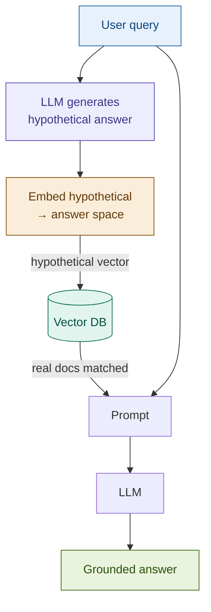

# 06: HyDE — Search for Answers, Not Questions

---

## The Problem: Questions and Answers Live Apart

When you embed a question and its answer, they land in different regions of vector space.

```
Query:    "What factors increase credit default risk?"
          → [question space — abstract, interrogative]

Document: "Credit default risk increases when debt-to-income ratios
           exceed 43%, collateral values decline..."
          → [answer space — concrete, declarative]
```

Dense retrieval runs on cosine similarity. **The gap is the problem.**

---

## The Insight: Generate Before You Search

Embed a *hypothetical answer* instead of the query.

```
Step 1 — Generate: LLM writes a declarative passage answering the query
Step 2 — Embed:    hypothetical_vector → lands in answer space ✓
Step 3 — Retrieve: find real documents near that vector
Step 4 — Generate: real answer from real documents
Step 5 — Discard:  the hypothetical was only a search key
```

The hypothetical can be factually wrong. It only needs to be **stylistically right**.

---

## Architecture



The original query goes **directly to generation** — only the *retrieval vector* is swapped.

---

## Fintech Demo: Credit Default Risk

**Query:** *"What factors increase credit default risk?"*

| Retrieval | Search vector |
|-----------|--------------|
| Plain query | "what factors increase credit default risk" — interrogative, abstract |
| HyDE | "Credit default risk is elevated by high DTI ratios, declining collateral..." — declarative, vocabulary-matched |

The corpus is written in declarative prose. HyDE lands next to it. The plain query does not.

**The elegance:** no index changes, no new infrastructure — one extra LLM call.

---

## Tradeoffs

| Dimension | Rating | Notes |
|-----------|--------|-------|
| Retrieval quality | ★★★★☆ | Strong on abstract queries; minimal gain on exact lookups |
| Latency | ★★☆☆☆ | Two LLM calls — adds 500ms–2s |
| Cost | ★★☆☆☆ | Use cheapest model for hypothesis; capable model for generation |
| Complexity | ★★☆☆☆ | One extra function call, no index changes |

**Critical rule:** the hypothetical is a search key — never include it in the generation prompt.

→ **Module 16: Self-RAG** — what if the system reflects on whether it retrieved the right thing?
