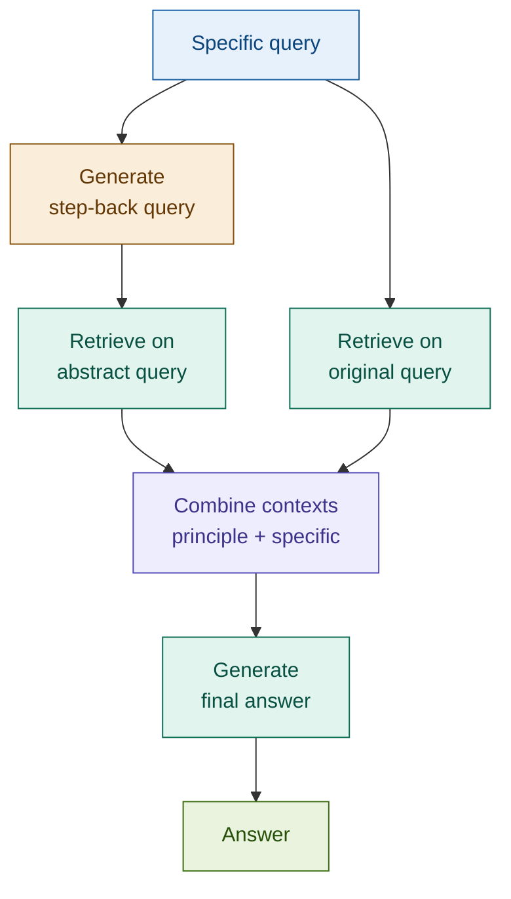

# Step-Back RAG

## What it is

Step-Back RAG addresses a failure mode that Multi-Query and RAG Fusion cannot fix: a query so specific that no chunk in the corpus directly matches it, even though the answer is derivable from general principles that *are* indexed. The pattern generates a higher-level "step-back" version of the original query — one that abstracts away the specific details to expose the underlying concept or rule — retrieves on that abstract query to establish foundational context, then combines it with retrieval on the original query to produce an answer grounded in both the principle and the specific case.

The key insight from Zheng et al. (ICLR 2024): LLMs perform better when given the general rule before being asked to apply it to a specific instance. Step-Back RAG implements this in the retrieval layer — fetch the principle first, then answer the specific question with that principle in context.

## Source

Zheng et al., "Take a Step Back: Evoking Reasoning via Abstraction in Large Language Models." ICLR 2024.
URL: https://arxiv.org/abs/2310.06117

## When to use it

- **Overly specific queries that need broader context**: "Is a knock-in barrier option with a 0.65 delta ITM at expiry exercisable?" requires understanding general barrier option mechanics before the specific case can be reasoned about. Single-query retrieval on the specific phrasing may miss the general rule.
- **When general principles help interpret specific cases**: regulatory edge cases, unusual contract clauses, or niche product configurations all benefit from retrieving the applicable framework before the specific instance.
- **Conceptual questions dressed as factual ones**: "Why did Basel III increase CET1 requirements?" benefits from retrieving the general post-crisis capital adequacy rationale, not just the specific ratio threshold.
- **When single-query retrieval consistently misses**: if baseline RAG returns technically relevant but shallow chunks, step-back retrieval adds the foundational context the answer requires.
- **Complex derivatives and structured products**: queries about specific instrument configurations (knock-in, barrier, callable, convertible) benefit from retrieving the general instrument class rules first.

## When NOT to use it

- **Simple factual lookups**: "What is the CET1 minimum under Basel III?" has a direct answer in the corpus. The abstraction step adds latency and cost with no benefit.
- **When specificity is required**: a query about a named counterparty, a specific transaction ID, or a precise date should not be abstracted — the specifics are the point.
- **Low-level implementation details**: questions about specific system configurations, API parameters, or exact code behaviour are degraded by abstraction, not helped.

## Architecture

**Two retrievals run in parallel**: one on the abstract step-back query (principle context), one on the original specific query (direct context). Both are passed to the generator — the principle grounds the reasoning; the specific retrieval anchors it to the actual case.

## Key components

| Component | Purpose | Default implementation |
|-----------|---------|----------------------|
| Abstraction generator | Rewrites the specific query into a higher-level, principle-level question | Prompted `claude-haiku-4-5-20251001` — one call returns the step-back query |
| Abstract retriever | Dense similarity search on the step-back query | `Chroma.similarity_search` with `k=4` — retrieves general principle chunks |
| Specific retriever | Dense similarity search on the original query | `Chroma.similarity_search` with `k=3` — retrieves case-specific chunks |
| Context combiner | Merges principle context + specific context for the generator | Concatenation with section labels; deduplication by content key |
| Generator | Final answer grounded in both principle and specific context | `claude-sonnet-4-6` with labelled dual context |

## Step-by-step

1. **Receive query** — accept the user's specific question. Log it for comparison with the step-back version.
2. **Generate step-back query** — call the abstraction generator. The prompt instructs the model to identify the general concept, rule, or framework that the specific question is an instance of. A good step-back query is broader, shorter, and terminologically general.
3. **Retrieve on both queries in parallel** — run similarity search on the step-back query (principle context, k=4) and on the original query (specific context, k=3). These retrieve different sections of the corpus.
4. **Combine contexts** — concatenate the two result sets with clear section labels ("General principle:", "Specific case:"). Deduplicate by content key to avoid repeating chunks that appear in both sets.
5. **Generate** — pass the combined context to the generator. The system prompt instructs it to use the principle context to reason about the specific case. Produce the final answer.

## Fintech use cases

- **Specific regulation → general principle**: "Does Article 92(1)(a) of the CRR apply to our Tier 2 instrument issued in 2019?" — the step-back query becomes "What are the general eligibility criteria for Tier 2 capital instruments under the CRR?" Retrieving the general criteria first gives the model the framework to evaluate the specific case.
- **Edge-case insurance claims → general coverage rules**: a claim about a named peril exclusion in a specific policy configuration is answered better when the general exclusion doctrine is retrieved first.
- **Niche derivative product queries → general instrument class**: "Is a knock-in barrier option with a 0.65 delta ITM at expiry exercisable?" — the step-back query becomes "How do barrier option exercise conditions work generally?" Retrieving the general mechanics before the specific configuration grounds the answer correctly.
- **Case-specific analysis → framework understanding**: a compliance officer asking about a specific transaction's AML classification benefits from first retrieving the general typology of suspicious transaction patterns, then applying it to the specific case.

## Tradeoffs

| Dimension | Rating | Notes |
|-----------|--------|-------|
| Retrieval quality | ★★★★☆ | Principle-first retrieval significantly improves answers for conceptual and edge-case queries |
| Answer quality | ★★★★☆ | Grounding in general principle reduces reasoning errors on specific cases |
| Latency | ★★★☆☆ | Two retrieval calls (parallelisable) + one LLM call for abstraction |
| Cost | ★★★☆☆ | One Haiku call for step-back generation; two retrievals; generation cost unchanged |
| Complexity | ★★☆☆☆ | The abstraction prompt is the only non-trivial component; retrieval and combination are straightforward |

## Common pitfalls

- **Abstraction too vague**: a step-back query like "How do financial instruments work?" retrieves nothing useful. The abstraction should be one level up from the specific, not maximally general. Validate by printing the step-back query and checking it is still meaningfully scoped.
- **Losing important specifics**: the step-back query should complement the original retrieval, not replace it. Always run both retrievals and include both contexts. The original query anchors the answer to the actual case; removing it risks a generic answer that misses the specific details.
- **Works best for conceptual queries**: Step-Back RAG adds overhead with no gain for direct factual lookups. Gate with a query classifier that routes specific, single-fact queries to standard retrieval and reserves step-back for conceptual or edge-case queries.
- **Requires strong abstraction capability**: the abstraction generator needs to identify the correct parent concept. Weaker models may produce step-back queries that are synonymous with the original (no benefit) or nonsensically vague (harmful). Use at minimum a capable small model with few-shot examples.

## Related patterns

- **06 HyDE**: both patterns modify the query before retrieval using an LLM call, but in opposite directions. HyDE generates a hypothetical answer to move the query embedding toward the document embedding space. Step-Back RAG abstracts the query upward to retrieve general principles. They compose well: use HyDE for dense retrieval precision; use Step-Back for conceptual grounding.
- **05 Multi-Query RAG**: Multi-Query decomposes a complex query into multiple targeted sub-questions. Step-Back does the opposite — it abstracts a specific query into one broader question. For a query that is both complex *and* highly specific, consider combining both: Step-Back for the principle context, Multi-Query for the specific sub-questions.
- **20 Adaptive RAG**: Adaptive RAG's routing logic can use query specificity as a signal — highly specific queries with low direct-retrieval confidence are routed to Step-Back RAG automatically. Step-Back is a natural sub-strategy in an adaptive pipeline.
