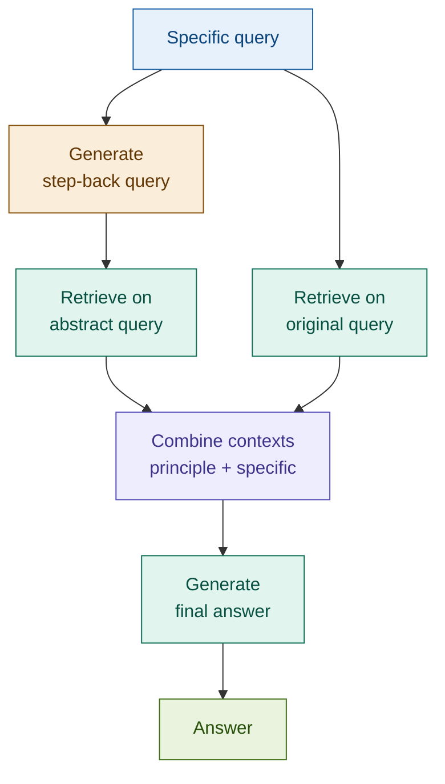

# 07: Step-Back RAG — Abstract Then Answer

---

## The Problem: Too Specific to Retrieve, Too Narrow to Reason

Some queries are so specific that no chunk directly matches them — yet the answer is derivable from general principles that *are* indexed. Single-query retrieval on the specific phrasing misses the relevant context entirely.

**Query:** *"Is a knock-in barrier option with a 0.65 delta ITM at expiry exercisable?"*

The corpus has no chunk about this exact configuration. But it *does* have chunks about barrier option exercise conditions in general. Single-query retrieval misses them because the embeddings don't align.

High-level context improves specific answers.

---

## The Solution: Step Back, Then Answer

Generate a higher-level version of the query — one level of abstraction up, exposing the general principle. Retrieve on that. Then retrieve on the original too. Combine both contexts for generation.

```
Specific query
  │
  ├─→ Step-back: "How do barrier option exercise conditions work?"
  │       └─→ Retrieve general principle context
  │
  └─→ Original: "knock-in barrier option 0.65 delta ITM exercisable?"
          └─→ Retrieve specific case context
                              │
              Combine: principle + specific ↓
                          Generate answer
```

The generator sees the rule *and* the case. It applies the principle to the specific configuration.

---

## Architecture



---

## Fintech: Specific Compliance Case → General Regulatory Principle

**Query:** *"Does our 2019 Tier 2 instrument meet Article 92(1)(a) eligibility?"*

| Step | Query | Retrieves |
|------|-------|-----------|
| Step-back | "What are the general eligibility criteria for Tier 2 capital under the CRR?" | Capital adequacy framework, instrument classification rules |
| Original | "Tier 2 instrument 2019 Article 92(1)(a) eligibility" | Specific article text, transitional provisions |
| Combined | Both passed to generator | Answer grounded in rule *and* specific provision |

Without the step-back, the model applies the specific article without the framework context. With it, the reasoning is grounded.

---

## Tradeoffs

| Dimension | Rating | Notes |
|-----------|--------|-------|
| Retrieval quality | ★★★★☆ | Principle-first retrieval improves answers for conceptual and edge-case queries |
| Answer quality | ★★★★☆ | General principle reduces reasoning errors on specific cases |
| Latency | ★★★☆☆ | One extra LLM call for abstraction; two retrievals (parallelisable) |
| Cost | ★★★☆☆ | One Haiku call for step-back; retrieval and generation cost unchanged |
| Complexity | ★★☆☆☆ | One abstraction prompt plus standard dual retrieval — minimal moving parts |

**When to skip**: direct factual lookups where the specific answer is indexed, or queries where the specific details are the point.

→ **Chunking strategies next** — we've optimised retrieval. Now let's optimise how documents are indexed.
