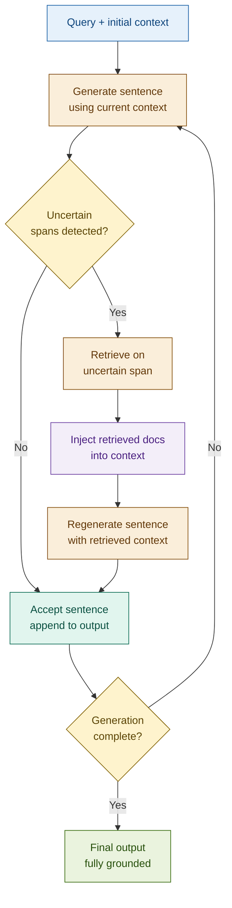

# FLARE (Forward-Looking Active Retrieval)

## What it is

FLARE generates text iteratively, sentence by sentence. After generating each sentence, it inspects the output for tokens the model produced with low confidence — typically detected by scanning for low-probability words or by prompting the model to flag spans it is uncertain about. When a low-confidence span is found, FLARE pauses generation, uses that span as a retrieval query to fetch relevant documents, injects the retrieved context, and then regenerates the uncertain sentence with that grounding. Generation then continues from the regenerated sentence. The cycle repeats until the full output is complete.

The key innovation is that retrieval is not a single upfront event but a dynamic process interleaved with generation. The generator itself decides when it needs help — uncertainty in the output is the trigger. This is fundamentally different from retrieve-then-generate pipelines: the model generates forward speculatively and uses its own uncertainty as a signal about where its parametric knowledge is insufficient.

Because most production LLM APIs (including Anthropic's) do not expose per-token log-probabilities, the practical implementation simulates uncertainty detection: the model generates a tentative sentence, then a second prompt asks it to flag any spans it is uncertain about. If uncertain spans exist, retrieval is triggered on those spans. If the model reports no uncertainty, the sentence is accepted and generation continues.

## Source

Jiang et al., "Active Retrieval Augmented Generation." EMNLP 2023.
URL: https://arxiv.org/abs/2305.06983

## When to use it

- **Long-form generation with uneven knowledge coverage**: when writing a multi-paragraph report, some paragraphs may require recent or specialised facts that the model cannot generate confidently, while others draw on stable domain knowledge. FLARE retrieves only where needed rather than front-loading all possible context.
- **Iterative report writing**: regulatory summaries, earnings commentaries, risk narratives — documents where each paragraph builds on the last and facts are scattered across multiple sources.
- **When uncertainty is a useful signal**: if the model reliably flags uncertainty on topics where its training data is sparse or stale (recent regulatory changes, specific numerical thresholds, entity-specific data), FLARE's trigger is well-calibrated.
- **Research and synthesis tasks**: assembling a coherent narrative from many source documents where the required facts are too numerous to load upfront without exceeding context limits.

## When NOT to use it

- **Short answers or single-fact lookups**: the iterative generation loop adds multiple LLM calls per sentence. For a one-sentence answer, standard RAG with a single upfront retrieval is faster and cheaper.
- **When full context is available upfront**: if all relevant documents fit in the context window and can be loaded at the start, standard RAG with pre-retrieved context is simpler and more predictable.
- **Latency-critical applications**: each retrieval pause adds at least one full round-trip (retrieval + LLM call). A 500-word output with three retrieval triggers takes approximately 3–5× longer than standard RAG. Not suitable for interactive, sub-second applications.
- **Domains where uncertainty detection is unreliable**: if the model does not reliably flag uncertainty on topics where it is actually wrong (e.g. it confidently generates incorrect figures), FLARE's trigger mechanism produces false negatives. Validate calibration before deploying.

## Architecture

Uncertain spans drive retrieval. Accepted sentences accumulate into the final output. The loop continues until the target length is reached or the model signals completion.

## Key components

| Component | Purpose | Default implementation |
|-----------|---------|----------------------|
| Iterative generator | Generates output sentence by sentence, maintaining accumulated context from prior sentences | Haiku for tentative sentences (speed); Sonnet for regeneration after retrieval (quality) |
| Uncertainty detector | Identifies spans in the generated sentence that the model is uncertain about | Second prompt to same model: "List any specific facts, figures, or claims in this sentence you are not confident about. Return an empty list if all confident." |
| Dynamic retriever | Fetches documents relevant to the uncertain span and injects them into context for regeneration | Chroma dense retrieval; uncertain span used as query verbatim |
| Retrieval trigger | Decides whether to retrieve based on uncertainty output | Retrieve if uncertainty list is non-empty; skip if model reports full confidence |
| Generation log | Records per-sentence decisions: accepted on first pass, or retrieved-and-regenerated | `list[SentenceResult]` for observability and cost accounting |

## Step-by-step

1. **Receive query and target length** — a prompt describing what to write (e.g. "Write a three-paragraph risk summary for the Q3 credit portfolio") and an approximate target (paragraph count or sentence count).
2. **Generate tentative sentence** — call the generator with the query and any accumulated prior output as context. Request exactly one sentence.
3. **Detect uncertainty** — call the uncertainty detector on the generated sentence. The prompt asks the model to list specific facts, figures, or claims it is uncertain about. An empty list means the sentence is accepted.
4. **Retrieve if uncertain** — if the uncertainty list is non-empty, form a retrieval query from the first uncertain span (or a concatenation of all spans). Retrieve top-k documents.
5. **Regenerate with context** — call the generator again with the original query, accumulated output, retrieved documents, and the uncertain sentence as context. Instruct it to rewrite the sentence using the provided documents.
6. **Accept and accumulate** — append the accepted (or regenerated) sentence to the output buffer. Record whether retrieval was triggered for this sentence.
7. **Check completion** — if the target length is reached or the model signals the output is complete, stop. Otherwise return to step 2 with the updated accumulated context.
8. **Return generation log** — the final output plus a per-sentence record of retrieval decisions, uncertain spans, and retrieved documents for observability.

## Fintech use cases

- **Long-form regulatory report generation**: a compliance team needs a multi-paragraph summary of the firm's Basel III capital position. The model can generate high-confidence sentences about the framework definitions from training data, but retrieves when it reaches specific ratio figures or recent regulatory amendments — facts that require current documents. The output cites the source of each retrieved fact.
- **Dynamic earnings commentary**: an analyst tool generates Q3 earnings commentary paragraph by paragraph. Sentences about macro context are generated from parametric knowledge; sentences about specific reported metrics (net interest margin, provision charges, EPS) trigger retrieval against the current earnings release and generate grounded figures.
- **Multi-paragraph risk narrative with embedded citations**: a credit risk system writes a narrative assessment of a borrower's sector. Stable industry background is generated without retrieval; sentences about recent defaults, rating changes, or sector-specific regulatory developments trigger retrieval and regenerate with the specific facts grounded in retrieved documents.

## Tradeoffs

| Dimension | Rating | Notes |
|-----------|--------|-------|
| Output quality | ★★★★☆ | Grounded where it matters — retrieval is triggered by the model's own uncertainty, not by heuristic pre-retrieval |
| Latency | ★☆☆☆☆ | Each retrieval-triggered sentence adds 2 LLM calls + 1 retrieval; a 5-sentence output with 3 triggers can take 10–15× standard RAG latency |
| Cost | ★★☆☆☆ | Multiple LLM calls per output; uncertainty detection is an additional call per sentence even when no retrieval occurs |
| Complexity | ★★★★★ | Sentence-level loop + uncertainty detection + conditional retrieval + context management across iterations; hardest implementation in the workshop |

## Common pitfalls

- **Uncertainty detection is calibration-dependent**: the model may not reliably flag uncertainty on topics where it is confidently wrong, and may flag uncertainty on topics where it is actually correct. Validate the uncertainty detector on known-correct and known-incorrect sentences before relying on its output as a trigger.
- **Excessive retrieval on low-confidence domains**: if the model has weak priors across the whole domain, it flags uncertainty in nearly every sentence and retrieves constantly. This degrades latency without improving quality. Set a `MAX_RETRIEVALS` per generation run as a ceiling.
- **Sentence boundary detection is fragile**: generating exactly one sentence at a time requires the model to stop cleanly at a sentence boundary. Models sometimes generate multiple sentences or incomplete sentences. Use explicit output format instructions and a post-processing step to split on sentence boundaries.
- **Context accumulation overflow**: each iteration adds the prior output plus any retrieved documents to the context. For long outputs with frequent retrieval, the context window fills quickly. Summarise or truncate accumulated prior context beyond a threshold rather than passing it all forward.
- **Retrieval query quality**: using the raw uncertain span verbatim as a retrieval query often works, but ambiguous spans ("the figure" or "recent changes") produce poor retrieval. Prompt the model to surface the specific entity or claim it is uncertain about rather than the surface text of the span.

## Related patterns

- **16 Self-RAG**: Self-RAG decides whether to retrieve before generating each passage (using the Retrieve? token). FLARE generates first and retrieves after detecting uncertainty. Both are adaptive about when to retrieve — Self-RAG is pre-generative, FLARE is post-generative. They are complementary: Self-RAG is faster (skips retrieval when not needed upfront), FLARE is more precise (retrieval is targeted at specific uncertain spans).
- **18 IRCoT** (Interleaved Retrieval with Chain-of-Thought): IRCoT interleaves retrieval with reasoning steps in a chain-of-thought. FLARE interleaves retrieval with text generation. Both are iterative; IRCoT is optimised for multi-step reasoning, FLARE for long-form text generation.
- **22 Agentic RAG**: an Agentic RAG system can implement FLARE-like behaviour — the agent generates text, decides when to call a retrieval tool, and continues. The agent is more flexible but less structured. FLARE's fixed sentence-level loop and uncertainty trigger are more interpretable and auditable.
