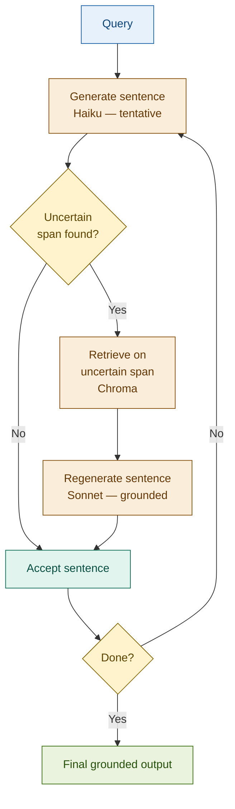

# 08: FLARE — Retrieve Only When Uncertain

---

## The Problem: Upfront Retrieval Is Wasteful for Long Generation

Standard RAG retrieves before generating. For long-form outputs — a 5-paragraph risk report, an earnings commentary — most sentences draw on stable domain knowledge the model already has. Retrieving context for the whole output upfront means loading documents that are only needed for one or two specific sentences.

| Approach | When retrieval happens | Problem |
|----------|----------------------|---------|
| Standard RAG | Once, before generation | Loads context for sentences that don't need it |
| FLARE | During generation, on demand | Adds latency per trigger; complex loop |
| No RAG | Never | Hallucination on specialised facts |

---

## The Solution: Generate, Detect Uncertainty, Retrieve on Demand

Generate text iteratively. After each sentence, detect uncertain spans. If uncertainty is found, pause and retrieve on that span before regenerating the sentence. If confident, accept and continue.

```
Query → [Basel III requires banks to maintain...     CONFIDENT → keep ]
      → [The minimum CET1 ratio is approximately...   UNCERTAIN → retrieve ]
                                                          ↓
                                                   [retrieve: "CET1 minimum ratio"]
                                                          ↓
      → [The minimum CET1 ratio is 4.5% of RWA,   GROUNDED → keep ]
      → [which applies to all G-SIBs globally...    CONFIDENT → keep ]
      → Final output: fully grounded where it matters
```

---

## Architecture



---

## Fintech: Compliance Report Generation

A regulatory affairs team generates a Basel III capital adequacy report. The model writes sentences about the regulatory framework confidently. When it reaches specific ratio thresholds, amendment dates, or entity-specific figures, it flags uncertainty and retrieves — producing a grounded report with pinpoint citations rather than loading the entire Basel III handbook upfront.

| Sentence type | Model confidence | FLARE action |
|--------------|-----------------|--------------|
| Framework definition ("Basel III requires...") | High | Accept — no retrieval |
| Specific ratio ("The CET1 minimum is...") | Low | Retrieve → regenerate with cited figure |
| Phase-in timeline ("Fully effective from...") | Low | Retrieve → regenerate with date |
| General conclusion ("Banks must therefore...") | High | Accept — no retrieval |

Two retrieval triggers for a four-sentence paragraph — vs loading the full document upfront.

---

## Tradeoffs

| Dimension | Rating | Notes |
|-----------|--------|-------|
| Output quality | ★★★★☆ | Retrieval targeted at actual knowledge gaps — not applied uniformly |
| Latency | ★☆☆☆☆ | Each trigger adds 2 LLM calls + retrieval; 3 triggers = ~10× standard RAG latency |
| Cost | ★★☆☆☆ | Uncertainty check on every sentence, even when no retrieval occurs |
| Complexity | ★★★★★ | Sentence-level loop + uncertainty detection + context management — hardest pattern in the workshop |

**Key insight: active retrieval reduces unnecessary retrieval calls — and improves grounding precision — by treating model uncertainty as the retrieval trigger rather than the query.**

→ **Module 09: Ensemble RAG** — FLARE adapts when to retrieve within a single pipeline. Ensemble RAG adapts how to combine results across multiple retrieval strategies running in parallel.
