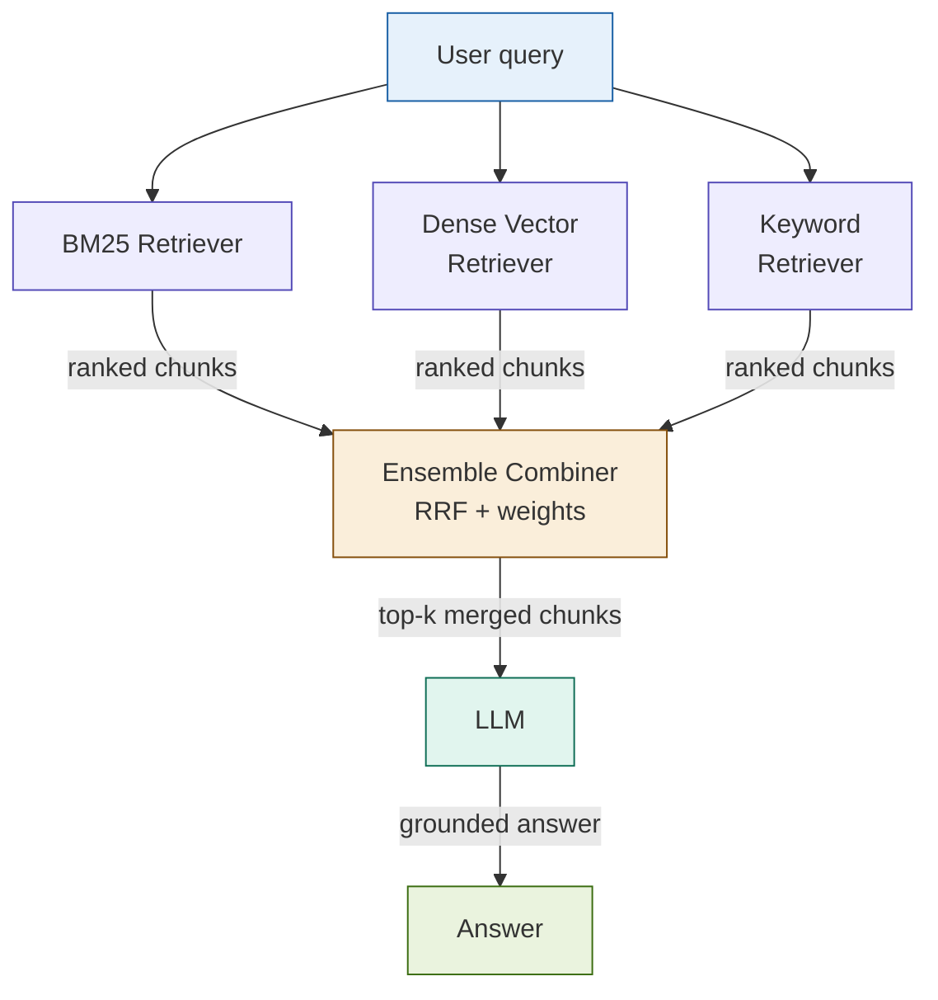

# Ensemble RAG

## What it is

Ensemble RAG runs multiple independent retrievers in parallel and combines their results through weighted voting or confidence scoring before passing context to the LLM. Rather than betting on a single retrieval strategy, the pattern exploits the complementary strengths of different retrievers — BM25 excels at exact keyword matching, dense vector search handles semantic similarity, and sparse keyword retrievers bridge the gap — so that a failure or blind spot in any one strategy is compensated by the others. LangChain's `EnsembleRetriever` is the canonical implementation: it accepts a list of retrievers and a corresponding weight vector, then merges ranked result lists using Reciprocal Rank Fusion (RRF).

## Source

LangChain EnsembleRetriever documentation, 2023–2024.
URL: https://python.langchain.com/docs/modules/data_connection/retrievers/ensemble

Foundational IR ensemble theory: Christopher D. Manning, Prabhakar Raghavan, Hinrich Schütze. *Introduction to Information Retrieval*, Cambridge University Press, 2008. Chapter 7 (scoring, term weighting, and the vector space model).

## When to use it

- No single retrieval strategy consistently wins across your query mix — some queries are keyword-heavy, others are semantic.
- The document corpus is heterogeneous: structured tables, dense regulatory text, short FAQ entries, and long contracts coexist.
- Answers are high-stakes and a missed document has serious downstream consequences (compliance citations, risk disclosures).
- You have multiple regulatory sources with different vocabulary (FINRA rules use different terminology than SEC releases for the same concept).
- You can absorb 2–4× retrieval latency in exchange for robustness.

## When NOT to use it

- Latency is a hard constraint — ensemble retrieval runs retrievers sequentially or in parallel but always waits for the slowest one.
- Cost is tightly controlled — you pay for embeddings across all strategies plus increased LLM context from higher-recall retrieval.
- A single retriever already saturates recall on your eval set — adding more retrievers yields diminishing returns and increases operational complexity.

## Architecture

## Key components

| Component | Purpose | Default implementation |
|-----------|---------|----------------------|
| BM25 Retriever | Exact keyword and term-frequency matching | `BM25Retriever` from `langchain_community` via `rank_bm25` |
| Dense Retriever | Semantic similarity via embedding vectors | `Chroma` + `OpenAIEmbeddings` wrapped in `VectorStoreRetriever` |
| Keyword Retriever | Lightweight token-overlap matching | `TFIDFRetriever` or custom sparse retriever |
| EnsembleRetriever | Merges ranked lists using RRF with per-retriever weights | `langchain.retrievers.EnsembleRetriever` |
| Weight vector | Controls each retriever's contribution to the final ranking | `[0.4, 0.4, 0.2]` (BM25, dense, keyword) |

## Step-by-step

1. **Build the BM25 index.** Tokenize your corpus and construct a BM25 index using `rank_bm25`. Wrap it in LangChain's `BM25Retriever`.
2. **Build the dense index.** Embed all documents using `text-embedding-3-small` and store in a Chroma collection. Wrap the collection in a `VectorStoreRetriever`.
3. **(Optional) Build a sparse keyword retriever.** Create a `TFIDFRetriever` over the same corpus for a lightweight third signal.
4. **Configure the EnsembleRetriever.** Pass all retrievers and their corresponding weights. Choose weights empirically — a common starting point is `[0.4, 0.4, 0.2]` (BM25, dense, keyword).
5. **Run ensemble retrieval.** Call `ensemble.get_relevant_documents(query)`. Internally, each retriever fetches `k` candidates; RRF merges and re-ranks the union.
6. **Generate with merged context.** Pass the top-k merged chunks to the LLM prompt.

These steps correspond to notebook cells 3–5.

## Fintech use cases

- **Multi-regulator compliance search:** A query about margin requirements must search FINRA, SEC, and CFTC documents simultaneously. BM25 catches exact rule numbers (e.g., "Rule 15c3-3"); dense search catches semantic variants ("customer protection rule", "reserve formula").
- **Cross-asset risk data retrieval:** A risk analyst querying for "credit exposure limits" needs to surface both exact policy language and semantically related passages about counterparty limits across multiple asset class policy documents.
- **Vendor-agnostic document search:** When a firm ingests documents from multiple vendors with inconsistent terminology, ensemble retrieval compensates for vocabulary drift that defeats any single retriever.
- **Earnings call Q&A:** Analysts ask both precise ("EPS guidance for Q3") and conceptual ("management confidence on margins") questions in the same session — BM25 and dense retrieval each handle one type better.

## Tradeoffs

| Dimension | Rating | Notes |
|-----------|--------|-------|
| Retrieval quality | ★★★★★ | Near-ceiling recall — covers blind spots of any single strategy |
| Latency | ★★☆☆☆ | Waits for the slowest retriever; parallelism helps but adds infra complexity |
| Cost | ★★☆☆☆ | 2–4× embedding compute; larger merged context increases LLM token usage |
| Complexity | ★★★★☆ | Three retrievers, weight tuning, RRF parameter choices, and two indexes to maintain |

## Common pitfalls

- **Weight tuning is domain-specific.** The default `[0.4, 0.4, 0.2]` is a starting point; without eval-set validation, you may be downweighting the retriever that matters most for your query distribution.
- **RRF constant `k` matters.** The RRF formula ranks by `1 / (k + rank)`. LangChain defaults to `k=60`. Lower values amplify top-rank differences; higher values flatten them. Tune on your eval set.
- **Diminishing returns after three retrievers.** A fourth retriever rarely improves recall meaningfully but doubles operational overhead and weight-space complexity.
- **Index staleness skew.** If your BM25 and dense indexes are not updated together on corpus changes, they will drift — ensemble results will silently degrade for new documents that only appear in one index.
- **Deduplication is not automatic.** The same chunk can appear in multiple retriever result sets. LangChain's EnsembleRetriever deduplicates by document ID, so consistent document IDs across indexes are mandatory.
- **Combining answers (not chunks) is even harder.** This SKILL describes chunk-level ensemble (combining retrieved context). Answer-level ensemble (running the full RAG pipeline N times and voting on final answers) is much more expensive and harder to calibrate — avoid unless you have a strong need and an eval harness to validate it.

## Related patterns

- **03 Hybrid RAG** — The closest sibling: Hybrid RAG fuses BM25 and dense retrieval using RRF, which is exactly what Ensemble RAG does with two retrievers. Ensemble RAG generalizes this to three or more retrievers and makes the weight vector explicit. Start with Hybrid RAG; graduate to Ensemble RAG when two retrievers are insufficient.
- **04 RAG Fusion** — RAG Fusion generates multiple query rewrites and fuses their results with RRF. Ensemble RAG uses a single query but multiple retrieval strategies. They compose naturally: run Ensemble RAG on each of RAG Fusion's query variants for maximum coverage, at significant cost.
- **21 Modular RAG** — Modular RAG treats retrievers as swappable components behind a shared interface. Ensemble RAG is a concrete retriever implementation that Modular RAG can host, allowing runtime swapping of the entire ensemble strategy.
