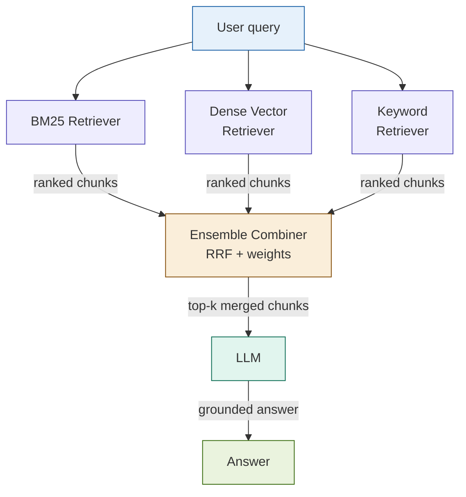

# 09: Ensemble RAG — Majority Vote for Quality

---

## The Problem

Every retrieval strategy has blind spots.

- BM25 misses semantic matches ("customer protection rule" ≠ "Rule 15c3-3")
- Dense search misses exact term matches (rule numbers, ticker symbols)
- No single strategy dominates across all query types

When the answer matters — compliance, risk, regulatory audit — a single retriever miss is a liability.

---

## The Concept

Run multiple independent retrieval strategies **in parallel**, then combine their outputs through weighted voting before passing context to the LLM.

```
Query
  ├── Strategy A: BM25 (keyword)     → ranked chunks
  ├── Strategy B: Dense (semantic)   → ranked chunks
  └── Strategy C: Keyword/Sparse     → ranked chunks
              ↓
     Weighted Combiner (RRF)
              ↓
       Top-k merged context
              ↓
            LLM → Answer
```

Each strategy votes by contributing ranked results. Reciprocal Rank Fusion (RRF) re-ranks the union by position, not score — so no score-scale calibration is needed across heterogeneous retrievers.

---

## Architecture



---

## Key Insight

> **Ensemble reduces single-strategy failures.**

A chunk ranked #12 by BM25 and #8 by dense search surfaces higher in the merged list than a chunk ranked #1 by only one strategy. Consensus across strategies is a stronger signal than dominance in one.

The pattern is robust to:
- Vocabulary mismatch between query and document
- Domain-specific jargon that defeats semantic embeddings
- Short, exact queries that dense search underserves

---

## Fintech Use Case: High-Stakes Compliance

**Scenario**: A compliance officer queries for margin call trigger conditions across FINRA, SEC, and CFTC source documents.

- FINRA uses "margin deficiency" — BM25 catches the exact term
- SEC filings use "collateral shortfall" — dense search catches the semantic match
- CFTC rules reference "variation margin" — keyword retriever surfaces the related term

Without ensemble: any single retriever misses at least one regulatory source.
With ensemble: all three surface, RRF merges, the LLM cites all three authorities.

**Why this matters**: A compliance answer that misses one regulator's position is a compliance failure, not a retrieval failure.

---

## Tradeoffs

| Dimension | Rating | Notes |
|-----------|--------|-------|
| Retrieval quality | ★★★★★ | Near-ceiling recall across query types |
| Latency | ★★☆☆☆ | Waits for slowest retriever; 2–3× baseline |
| Cost | ★★☆☆☆ | Multiple indexes + larger merged context |
| Complexity | ★★★★☆ | Weight tuning, index sync, deduplication |

**The honest position**: Ensemble RAG is the right answer for high-stakes retrieval where a missed document has downstream consequences. It is the wrong answer when latency or cost is the binding constraint.

---

## When to Reach for Ensemble RAG

- No single strategy wins consistently on your eval set
- Document corpus mixes terminology across regulatory bodies or asset classes
- A missed document has compliance or risk consequences
- You can absorb 2–4× retrieval overhead

**Don't use it when**: Hybrid RAG already saturates your recall metric — adding a third retriever yields diminishing returns at real cost.
