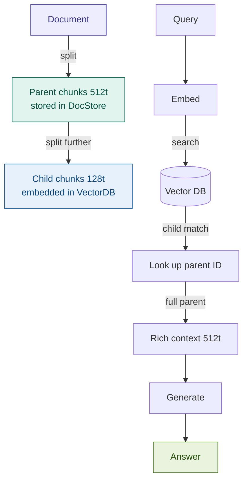

# Parent Document Retrieval

## What it is

Parent Document Retrieval solves a fundamental tension in chunking: small chunks score better in vector search (high signal-to-noise ratio), but small chunks give the LLM too little context to generate an accurate answer. The pattern resolves this by maintaining two separate chunk sizes — small *child* chunks are embedded and indexed for retrieval precision, while large *parent* chunks are stored in a document store for generation context. At query time, the vector index finds the best-matching child chunk; the retriever then looks up the parent that contains it and returns that richer context to the LLM. The split between what is *searched* and what is *read* is the core innovation.

## Source

LangChain `ParentDocumentRetriever`, Harrison Chase, 2023.
URL: https://python.langchain.com/docs/modules/data_connection/retrievers/parent_document_retriever

## When to use it

- Documents are **long and densely structured**: regulatory filings, loan agreements, prospectuses, policy manuals — where a single sentence is rarely self-explanatory without surrounding clauses.
- **Child chunks retrieved in isolation produce truncated or misleading answers**: a clause about early repayment penalties only makes sense with the preceding definition of "Repayment Date".
- Queries are **specific** (targeting a clause, figure, or term) but answers require **section-level context** (the surrounding conditions and exceptions that modify the clause).
- The document corpus is stable enough to afford a **two-tier storage architecture**: vector DB for child embeddings + doc store for parent text.
- You are already using `langchain` and want a production-ready retriever without building the parent-child mapping manually.

## When NOT to use it

- Documents are **short** (< 5 pages / < 3,000 tokens): chunking overhead is unnecessary, and full-document retrieval is simpler and sufficient.
- **Child chunks are self-contained**: structured data tables, FAQ entries, or product descriptions where each chunk answers a query independently without needing surrounding context.
- You cannot afford **dual storage**: environments with strict infrastructure constraints (no persistent doc store, stateless containers, serverless) make parent storage operationally awkward.

## Architecture

## Key components

| Component | Purpose | Default implementation |
|-----------|---------|----------------------|
| `ParentDocumentRetriever` | Orchestrates child search → parent lookup | `langchain.retrievers.ParentDocumentRetriever` |
| Child splitter | Splits parents into small chunks for embedding | `RecursiveCharacterTextSplitter(chunk_size=200)` |
| Parent splitter | Splits document into retrievable sections | `RecursiveCharacterTextSplitter(chunk_size=800)` |
| Vector store | Stores and searches child embeddings | `Chroma` + `OpenAIEmbeddings` |
| Doc store | Stores full parent text keyed by parent ID | `InMemoryByteStore` (dev) / Redis (prod) |
| Parent ID mapping | Links each child chunk back to its parent | Stored in child metadata as `doc_id` |

## Step-by-step

1. **Split into parents**: apply the parent splitter to the full document. Each parent chunk gets a unique `doc_id` and is written to the doc store.
2. **Split parents into children**: apply the child splitter to each parent. Each child chunk inherits its parent's `doc_id` as metadata.
3. **Embed and index children**: embed all child chunks and insert them into the vector store with `doc_id` in metadata.
4. **Query — child search**: embed the user query, run `similarity_search` against the child vector index, retrieve the top-k child matches.
5. **Parent lookup**: for each matched child, read `doc_id` from its metadata and fetch the corresponding parent text from the doc store.
6. **Deduplicate**: multiple child matches may share the same parent — deduplicate on `doc_id` before assembling the context.
7. **Generate**: pass the deduplicated parent texts (rich context) to the LLM with the original query.

## Fintech use cases

- **Basel III / CRR capital regulation**: a query for "CET1 ratio floor" targets a specific subsection sentence; the answer requires the parent section that defines risk-weighted assets, buffers, and exceptions in the surrounding clauses. Child retrieval finds the sentence; parent retrieval provides the full regulatory article.
- **Loan agreement Q&A**: "What are the early repayment penalties?" hits the child chunk containing the penalty schedule, but the correct answer requires the parent section that includes the definition of "Prepayment Event" and the conditions under which the schedule applies.
- **Prospectus and offering document navigation**: IPO or bond prospectuses are 200–400 pages of densely cross-referenced text. Child chunks allow precise term-level retrieval; parent return ensures risk factor paragraphs are not fragmented mid-sentence.
- **ISDA / CSA compliance review**: margin call trigger conditions span multiple sub-clauses. A child chunk may hit on "Minimum Transfer Amount"; the parent provides the full trigger formula and dispute resolution procedure.

## Tradeoffs

| Dimension | Rating | Notes |
|-----------|--------|-------|
| Retrieval quality | ★★★★☆ | Significantly better answer completeness vs flat chunking on long structured docs; still bounded by parent boundary choices |
| Latency | ★★★☆☆ | Two-step lookup adds one doc store read per retrieved child; negligible for in-memory store, meaningful for remote store |
| Cost | ★★★☆☆ | Dual storage: child embeddings in vector DB + parent text in doc store; indexing cost is unchanged (embed children only) |
| Complexity | ★★★☆☆ | Two splitters, two storage backends, parent ID wiring — more moving parts than flat Naive RAG; LangChain's `ParentDocumentRetriever` handles the plumbing |
| Fintech relevance | ★★★★★ | Long, clause-dense regulatory and contract documents are the primary production use case |

## Common pitfalls

- **Parent chunks too large**: if parents exceed ~800 tokens, multiple parent returns can overflow the LLM context window — especially when top-k returns 3–5 parents. Tune parent size with `max_tokens_per_parent * top_k < context_window * 0.7` as a rule of thumb.
- **Parent boundary not aligned to document structure**: splitting a Basel III article mid-sentence produces parents that lack complete clause logic. Prefer section-aware splitting (by `\n===` headers or paragraph breaks) over blind character counts for structured regulatory documents.
- **Child chunks too small**: child chunks of < 50 characters have insufficient semantic signal for the embedding model. A chunk that is just "Section 5(a)(i)" matches nothing meaningfully. Target 100–250 characters for children.
- **Forgetting deduplication**: if five child chunks all belong to the same parent, the LLM receives that parent five times, wasting context tokens. Always deduplicate on `doc_id` before assembling the prompt.
- **Production doc store choice**: `InMemoryByteStore` is appropriate for development and notebooks but is lost on process restart. In production, use a persistent store (Redis, DynamoDB) that is updated atomically with the vector index when documents are added or removed.

## Related patterns

- **11 Sentence Window**: a simpler variant of the same idea — embed individual sentences, return a ±N sentence window at query time. No doc store required; good when parent boundaries are hard to define but sentence context is sufficient. Use Sentence Window for simpler corpora; Parent Document for structured, clause-dense documents.
- **12 RAPTOR**: extends the hierarchy in the other direction — builds *abstractions* upward from chunks rather than returning raw parents. Use RAPTOR when queries are thematic or cross-section; use Parent Document when queries are specific and need clause-level context.
- **13 Contextual RAG**: embeds contextual metadata (section header, document summary) *into* each chunk at index time, improving embedding quality without a separate doc store. Contextual RAG and Parent Document are complementary: contextual enrichment of child chunks + parent return at query time is a high-quality production combination.
- **03 Hybrid RAG**: BM25 retrieval operates on child chunks directly. Running Hybrid RAG as the child retriever inside a Parent Document pipeline combines exact-term precision (BM25), semantic recall (dense), and context-rich generation (parent return) — the highest-quality indexing + retrieval stack before adding reranking.
