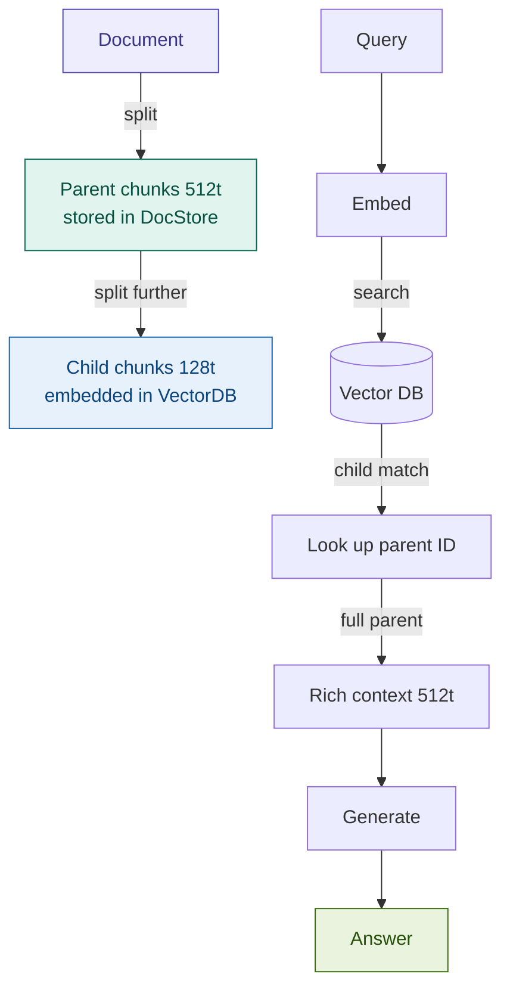

# 10: Parent Document — Best of Both Sizes

---

## The Chunking Dilemma

Every RAG system faces the same tension:

| Chunk size | Retrieval | Generation |
|------------|-----------|------------|
| **Small** | ✓ High precision — focused embedding signal | ✗ Missing context — clause lacks surrounding conditions |
| **Large** | ✗ Diluted signal — answer buried in noise | ✓ Rich context — full section available |

**You cannot optimise both with a single chunk size.**

Parent Document Retrieval uses two sizes simultaneously.

---

## The Pattern: Search Small, Read Large



**Two index layers. One query path.**

---

## Key Insight: Decouple Retrieval from Generation

The child chunk's job is to **match the query** — nothing more.
The parent chunk's job is to **answer the question** — with full context.

```
Child:  "...CET1 ratio must not fall below 4.5%..."          ← 128 tokens, high signal
Parent: "Article 92. Own funds requirements. [full section]"  ← 512 tokens, full context
```

The LLM never sees the child. It only sees the parent.

---

## Fintech Demo: Basel Capital Requirement

**Query:** *"What are the minimum CET1 capital requirements and when do buffer requirements apply?"*

| Retriever | What gets returned to the LLM |
|-----------|------------------------------|
| Flat chunking (500 chars) | Fragment of Article 92 — missing the buffer conditions |
| Parent Document | Full Article 92 section — requirement, buffer formula, and trigger conditions together |

Compliance teams need the full article. A fragment creates interpretation risk.

---

## Tradeoffs

| Dimension | Rating | Notes |
|-----------|--------|-------|
| Retrieval quality | ★★★★☆ | Significantly better answer completeness on long structured docs |
| Latency | ★★★☆☆ | One extra doc store lookup per retrieved child |
| Cost | ★★★☆☆ | Dual storage: child embeddings + parent text |
| Complexity | ★★★☆☆ | Two splitters, two backends, `doc_id` wiring |

**When to skip it:** short documents, self-contained chunks (FAQs, tables), strict stateless infra.

---

## What's Next

We have improved *what context the LLM receives* for a matched query.

The indexing strategies go deeper from here — RAPTOR builds abstractions upward,
Contextual RAG enriches every chunk before embedding.

→ **Module 13: Contextual RAG**
