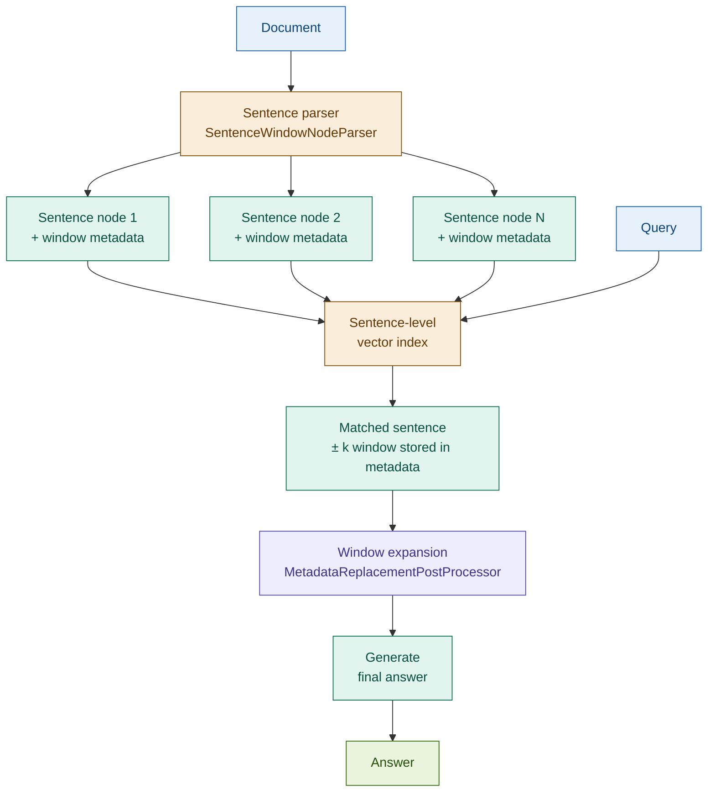

# Sentence Window Retrieval

## What it is

Sentence Window Retrieval decouples the unit of embedding from the unit of generation. Individual sentences are indexed and embedded — giving the retriever maximum precision to match the exact sentence most relevant to the query. At retrieval time, the matched sentence is expanded to include its surrounding window of ±k sentences before being passed to the generator — giving the model the context it needs to produce a coherent answer.

The key insight: embedding a paragraph averages signal across all its sentences; embedding a sentence sharpens the retrieval signal to the most relevant unit. The ±k window expansion then restores the surrounding context that makes that sentence interpretable. This yields precision at indexing and richness at generation — a combination that standard fixed-size chunking cannot achieve simultaneously.

## Source

LlamaIndex `SentenceWindowNodeParser` and `MetadataReplacementPostProcessor`, Jerry Liu, 2023.
URL: https://docs.llamaindex.ai/en/stable/examples/node_postprocessor/MetadataReplacementDemo/

## When to use it

- **Precise retrieval to specific sentences**: legal contracts, regulatory text, and earnings call transcripts where the most relevant information is often a single sentence surrounded by explanatory context.
- **Citations to specific sentences required**: when the system must surface the exact clause, ratio, or condition that grounds its answer — sentence-level indexing enables sentence-level citation.
- **Context surrounding matches is valuable**: the matched sentence alone is often incomplete. A covenant trigger sentence is only meaningful with the surrounding definition and consequence sentences — the window provides these.
- **Term sheet and contract extraction**: finding the exact clause (e.g., interest rate reset mechanism, redemption conditions) within a long agreement, then returning the surrounding paragraph for generation context.
- **KYC and audit trail applications**: compliance workflows that require grounding every generated claim to a specific sentence in source documents benefit from sentence-level precision.

## When NOT to use it

- **Documents are already short**: if each document is a few paragraphs, sentence-level indexing adds overhead with negligible precision gain. Standard chunking is sufficient.
- **Sentence boundaries don't align with concepts**: highly technical or tabular content where a concept spans multiple sentences as a unit (e.g., a table row description split across three sentences) may be degraded by sentence-level splits.
- **Low latency requirements**: building and querying a sentence-level index multiplies the node count significantly (a 400-word chunk may contain 15+ sentences). Index size and query time grow proportionally.

## Architecture

**Implementation note**: Each sentence node stores the surrounding ±k sentence window as metadata at parse time. At retrieval, `MetadataReplacementPostProcessor` replaces the matched sentence's text with its stored window before generation — the retrieval score was computed on the sentence, but generation uses the window.

## Key components

| Component | Purpose | Default implementation |
|-----------|---------|----------------------|
| `SentenceWindowNodeParser` | Splits document into sentence nodes; stores ±k window as node metadata | LlamaIndex; `window_size=3` (±3 sentences) |
| Sentence-level vector index | Embeds each sentence independently for maximum retrieval precision | LlamaIndex `VectorStoreIndex` with `text-embedding-3-small` |
| `MetadataReplacementPostProcessor` | At retrieval, replaces matched sentence text with stored window text | LlamaIndex post-processor; applied before generation |
| Generator | Final answer from window-expanded context | `claude-sonnet-4-6` via Anthropic SDK |

## Step-by-step

1. **Parse document into sentence nodes** — run `SentenceWindowNodeParser` with `window_size=k`. Each sentence becomes a node; its ±k surrounding sentences are stored in node metadata as `window` text.
2. **Build sentence-level vector index** — embed each sentence node. The index is larger than a standard chunk index (many more nodes) but each embedding is more precise.
3. **Retrieve matching sentences** — query the index. The retriever returns the top-k sentence nodes ranked by sentence-level embedding similarity — more precise than chunk-level retrieval.
4. **Expand to window** — apply `MetadataReplacementPostProcessor`: replace each retrieved sentence's text with its stored window (±k surrounding sentences). The retrieval score was earned by the sentence; generation uses the window.
5. **Generate** — pass window-expanded nodes as context to the generator. The model receives both the precise evidence sentence and its surrounding interpretive context.

## Fintech use cases

- **Exact clause citation in contracts**: a term sheet query "What is the interest rate reset mechanism?" retrieves the exact sentence defining the reset. The ±3 window provides the preceding definition and following consequence clauses — enough for the generator to explain the mechanism fully, with a sentence-level citation.
- **Precise regulatory language**: queries about specific Basel III provisions, ISDA definitions, or FinCEN thresholds retrieve the exact sentence containing the relevant figure. The surrounding window provides the regulatory context (which article, under what conditions) needed for a complete answer.
- **Earnings call transcript search**: analyst queries about specific guidance statements, margin commentary, or risk disclosures are matched at sentence level — preventing dilution from surrounding boilerplate — then expanded to include the interviewer's question and CEO's full response.
- **KYC document sentence-level audit trails**: compliance systems that must cite the exact sentence in a KYC document supporting a decision benefit from sentence-level precision and window-level context for human review.

## Tradeoffs

| Dimension | Rating | Notes |
|-----------|--------|-------|
| Retrieval precision | ★★★★★ | Sentence-level embedding isolates the most relevant evidence unit |
| Answer quality | ★★★★☆ | Window expansion provides generation context; answers are well-grounded |
| Latency | ★★★☆☆ | Larger index (many sentence nodes); retrieval is fast once built |
| Cost | ★★★☆☆ | More embeddings at index time; retrieval and generation cost unchanged |
| Complexity | ★★★☆☆ | Requires LlamaIndex; `MetadataReplacementPostProcessor` is non-obvious first time |

## Common pitfalls

- **Window boundary can cut important context**: a ±3 window may not include the clause header or the consequence clause that makes a sentence meaningful. Tune `window_size` on your corpus — larger windows for dense legal text, smaller for structured lists.
- **Sentence segmentation errors affect indexing**: spaCy and NLTK sentence splitters struggle with abbreviations, numbered lists, and formatted regulatory text. Validate the parsed sentence nodes before indexing; add custom sentence boundary rules if needed.
- **Metadata replacement adds query-time complexity**: `MetadataReplacementPostProcessor` must be applied in the correct position in the post-processor chain. Forgetting it means the generator receives only the matched sentence with no surrounding context — the most common integration mistake.
- **Index size grows with document length**: a 10,000-word document produces ~400–500 sentence nodes. At scale, monitor index storage and query latency; consider filtering to high-value document sections rather than indexing everything.

## Related patterns

- **10 Parent Document Retrieval**: the closest structural sibling — Parent Document indexes child chunks for retrieval and returns the parent chunk for generation. Sentence Window indexes sentences for retrieval and returns a sentence window for generation. The difference is granularity: Sentence Window operates at sentence level; Parent Document operates at chunk level. Use Sentence Window when sentence-level citation is required; use Parent Document when paragraph-level context is sufficient.
- **12 RAPTOR**: RAPTOR builds a hierarchical tree of summaries for top-down retrieval. Sentence Window builds fine-grained sentence nodes for bottom-up precision. They address opposite ends of the granularity spectrum; combining them is possible but complex.
- **14 Multi-Vector RAG**: Multi-Vector indexes multiple representations of the same document chunk (summary + original). Sentence Window indexes the finest-grained representation (individual sentence). They compose naturally: index both sentence nodes and chunk summaries to serve different query types.
