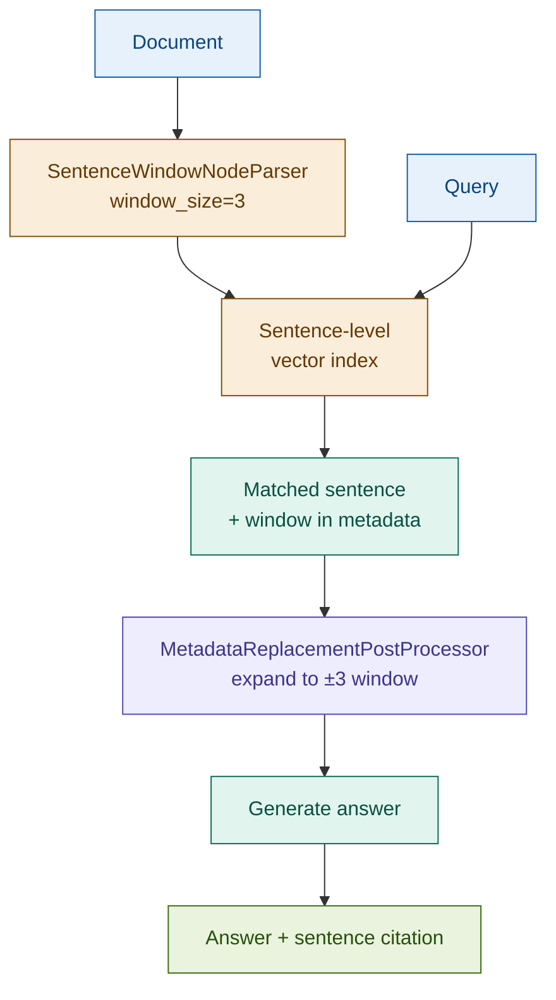

# 11: Sentence Window — Precision Retrieval, Contextual Generation

---

## The Problem: Chunk Embeddings Average Away Precision

Standard chunking embeds 400-word blocks. The embedding averages signal across every sentence in the chunk — including irrelevant ones. Retrieval pulls the right chunk but not necessarily the right sentence.

For contract and regulatory work, the right sentence matters:

| Query | What you want | What chunk retrieval gives you |
|-------|--------------|-------------------------------|
| "Interest rate reset mechanism" | Exact reset clause sentence | Full paragraph, diluted by surrounding definitions |
| "Redemption at par conditions" | Exact redemption condition | Section with unrelated covenant clauses mixed in |
| "Governing law jurisdiction" | Single governing law sentence | Page-long boilerplate section |

Best of both: precise retrieval + sufficient context for generation.

---

## The Solution: Index Sentences, Expand at Retrieval

Index each sentence as its own node — maximally precise embedding. Store the ±k surrounding sentences in node metadata at parse time. When a sentence matches at retrieval, swap in the window before generation.

```
Document
  ├─ Sentence 1 [embed] ← window metadata: sentences 1–4
  ├─ Sentence 2 [embed] ← window metadata: sentences 1–5
  ├─ Sentence 3 [embed] ← window metadata: sentences 1–6
  └─ ...

Query → retrieve sentence 3 (best match)
      → expand: return window (sentences 1–6)
      → generate from window context
```

Retrieval score earned by the sentence. Generation uses the window.

---

## Architecture



---

## Fintech: Contract Clause Citation

**Query:** *"What are the conditions for early termination?"*

| Step | What happens |
|------|-------------|
| Index | Every sentence in the ISDA agreement is a separate node |
| Retrieve | Sentence: *"Either party may terminate upon a Credit Event..."* — exact match |
| Expand | ±3 window: preceding definition of Credit Event + following cure period clause |
| Generate | Answer citing the exact termination sentence with its full conditional context |

Without expansion, the generator sees one sentence and hallucinates the conditions. With the window, it has the definition and consequence to answer precisely.

---

## Tradeoffs

| Dimension | Rating | Notes |
|-----------|--------|-------|
| Retrieval precision | ★★★★★ | Sentence-level embedding isolates the most relevant evidence unit |
| Answer quality | ★★★★☆ | Window provides generation context; well-grounded, citable answers |
| Latency | ★★★☆☆ | Larger index at build time; query latency is fast once built |
| Cost | ★★★☆☆ | More embeddings at index time; unchanged at query time |
| Complexity | ★★★☆☆ | Requires LlamaIndex; window size requires corpus-specific tuning |

**Requires tuning**: ±2 sentences for structured lists; ±5 for dense prose. Test on held-out queries before setting `window_size`.

→ **Module 12: RAPTOR** — Sentence Window expands horizontally (neighbouring sentences). RAPTOR expands vertically, building a hierarchy of summaries from the bottom up.
