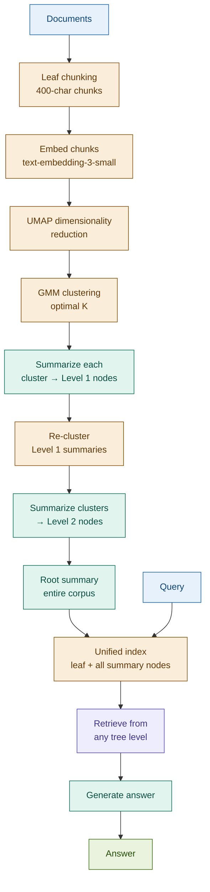

# RAPTOR

## What it is

RAPTOR (Recursive Abstractive Processing for Tree-Organized Retrieval) builds a hierarchical tree of document summaries that enables retrieval at any level of abstraction — from specific leaf chunks up to document-wide thematic summaries. The construction process clusters semantically similar leaf chunks using Gaussian Mixture Models (GMM) over UMAP-reduced embeddings, summarizes each cluster with an LLM, then applies the same clustering and summarization recursively to the summary layer — building a tree until a single root summary represents the entire corpus. At retrieval time, queries can match nodes at any tree level: a specific clause query matches a leaf node; a thematic query matches a high-level summary node.

The key innovation from Sarthi et al. (ICLR 2024): flat retrieval can only match at one granularity. RAPTOR's tree collapses this constraint — a single query traverses all abstraction levels simultaneously and returns the most relevant node wherever it lives in the tree.

## Source

Sarthi et al., "RAPTOR: Recursive Abstractive Processing for Tree-Organized Retrieval." ICLR 2024.
URL: https://arxiv.org/abs/2401.18059

## When to use it

- **Long documents with hierarchical structure**: annual reports, regulatory handbooks, fund prospectuses, and legal agreements all have natural section hierarchies. RAPTOR's tree mirrors this structure, enabling both detail and summary retrieval from a single index.
- **Multi-level summarisation needed**: when users ask both "What is the net interest margin?" (leaf-level) and "What are the main themes in this annual report?" (root-level), flat retrieval cannot serve both. RAPTOR can.
- **Thematic retrieval across multiple documents**: a query about risk themes across a corpus of fund prospectuses needs to match summary-level nodes, not individual clauses. RAPTOR's intermediate and root nodes are purpose-built for this.
- **Static or slowly-changing document corpora**: regulatory handbooks, filed annual reports, and finalized prospectuses change infrequently. The high indexing cost is amortised over many queries.
- **Cross-document synthesis**: when the question requires integrating information from multiple sections or documents, RAPTOR's summary nodes pre-compute these integrations at index time.

## When NOT to use it

- **Short documents**: RAPTOR's multi-level construction adds significant overhead for documents that fit in a single context window. Standard chunking is sufficient.
- **Flat or tabular information**: structured data like financial tables, time series, or key-value pairs do not benefit from semantic clustering and summarisation. A columnar retrieval approach is more appropriate.
- **Real-time or frequent re-indexing needed**: tree construction requires multiple LLM calls per clustering level. Documents that update frequently (live feeds, real-time prices) make the indexing cost prohibitive.
- **Tight latency budgets at query time**: while collapsed-tree retrieval is fast, full tree-traversal retrieval adds latency. For sub-100ms SLAs, simpler retrieval is preferred.

## Architecture

**Two retrieval modes**:
- **Collapsed tree**: embed all nodes (leaf + summary) into a flat vector store; retrieve top-k from the combined set. Simple, fast, covers all abstraction levels.
- **Tree traversal**: start at root, retrieve the most relevant node at each level, recurse down. More targeted but adds latency per level.

## Key components

| Component | Purpose | Default implementation |
|-----------|---------|----------------------|
| Leaf chunker | Splits documents into base-level chunks for embedding | `RecursiveCharacterTextSplitter` chunk_size=400 |
| UMAP reducer | Reduces embedding dimensions before clustering (GMM degrades in high dimensions) | `umap-learn` with `n_components=2`, `metric='cosine'` |
| GMM clusterer | Soft clustering that allows chunks to belong to multiple clusters | `sklearn.mixture.GaussianMixture`; BIC-optimal K selection |
| Cluster summariser | Generates an LLM summary of each cluster's combined text | `claude-haiku-4-5-20251001` — one call per cluster |
| Tree builder | Applies cluster → summarise recursively until a root is reached | Custom loop; stops when cluster count < threshold |
| Unified index | Embeds all nodes (leaf + summaries) into a single vector store | Chroma with `text-embedding-3-small` |
| Generator | Final answer from retrieved nodes at mixed abstraction levels | `claude-sonnet-4-6` |

## Step-by-step

1. **Chunk documents** — split into leaf chunks (400 chars, 60 overlap). These are the base layer of the tree.
2. **Embed leaf chunks** — compute embeddings for all leaf chunks. Store these as the leaf level of the tree.
3. **Reduce dimensions** — apply UMAP to reduce embeddings to 2D (or low-D). GMM clustering degrades in high-dimensional space; UMAP is required.
4. **Cluster leaf chunks** — fit a Gaussian Mixture Model. Use BIC to select the optimal number of clusters K. Assign each chunk to its most probable cluster.
5. **Summarise clusters** — call the LLM once per cluster, passing all chunk texts. Each summary becomes a Level 1 tree node.
6. **Recurse** — embed the Level 1 summary nodes, re-reduce with UMAP, re-cluster, re-summarise. Repeat until the cluster count falls below a minimum (e.g., 2–3 clusters) — this produces the root node.
7. **Build unified index** — embed all nodes (leaf + all summary levels) and insert into a single Chroma vector store. Tag each node with its tree level and cluster ID as metadata.
8. **Retrieve** — at query time, use collapsed-tree retrieval: query the unified index for top-k nodes regardless of level. Thematic queries will naturally surface summary nodes; specific queries will surface leaf nodes.
9. **Generate** — pass the retrieved nodes (labelled with their tree level) to the generator. The model sees both specific evidence and thematic context.

## Fintech use cases

- **Annual report thematic analysis**: "What are the main risk themes in the 10-K?" — flat retrieval returns specific risk factor sentences; RAPTOR's Level 2 summary node returns a synthesised overview of all risk themes. Both specific figures and thematic summaries are available from the same index.
- **Regulatory corpus with nested rules**: a compliance team querying Basel III needs to ask both "What is the exact CET1 formula?" (leaf) and "What is the overall philosophy of the Basel III capital framework?" (root). RAPTOR serves both from one index.
- **Multi-document fund prospectus analysis**: "What risk themes are common across all three fund prospectuses?" — this query cannot be answered by leaf-level retrieval alone. RAPTOR's corpus-level summary nodes pre-compute cross-document thematic integration.
- **Earnings call cross-period synthesis**: indexing multiple quarters of earnings transcripts with RAPTOR allows queries like "How has management's tone on credit risk evolved?" — the summary nodes capture per-quarter themes; the root node integrates them.

## Tradeoffs

| Dimension | Rating | Notes |
|-----------|--------|-------|
| Retrieval quality | ★★★★★ | Matches at any abstraction level; thematic + specific queries both served |
| Answer quality | ★★★★★ | Multi-level context gives the generator both detail and synthesis |
| Indexing cost | ★☆☆☆☆ | Multiple LLM calls per clustering level; UMAP + GMM are compute-intensive |
| Query latency | ★★★☆☆ | Collapsed-tree retrieval is fast; tree traversal adds per-level latency |
| Complexity | ★★★★☆ | UMAP + GMM + recursive tree construction is non-trivial to implement and debug |

## Common pitfalls

- **UMAP + GMM is non-deterministic**: clustering results vary between runs. The tree structure and summary content will differ on each index rebuild. Set random seeds for reproducibility in production.
- **Summary quality depends on LLM**: poor cluster summaries propagate upward — a bad Level 1 summary produces a misleading Level 2 node. Validate summary quality on held-out queries before deploying. Use a capable model even for intermediate summaries.
- **Tree can grow very deep for large corpora**: with many chunks, recursive clustering may produce 4–5 levels. Monitor tree depth and set a maximum level cap to prevent runaway indexing cost.
- **Optimal K selection is sensitive**: BIC-optimal K can produce very few or very many clusters depending on the embedding distribution. Inspect cluster assignments manually on a corpus sample and tune the minimum cluster size threshold.
- **Indexing is a one-time cost — plan for it**: for a 100-page regulatory document, expect 50–200 LLM calls for tree construction. Treat index building as a batch job, not a real-time operation. Cache the built index.

## Related patterns

- **10 Parent Document Retrieval**: Parent Document retrieves child chunks but returns the parent for generation — a two-level hierarchy (child/parent). RAPTOR builds an N-level hierarchy with LLM-generated summaries at each level. Use Parent Document for simple context expansion; use RAPTOR when multiple abstraction levels are genuinely needed.
- **11 Sentence Window Retrieval**: Sentence Window expands horizontally (neighbouring sentences). RAPTOR expands vertically (upward through summary levels). They operate at opposite ends of the granularity spectrum and compose cleanly: build a RAPTOR tree, then apply Sentence Window at the leaf level for maximum precision.
- **24 Graph RAG**: Graph RAG builds an explicit relationship graph between entities; RAPTOR builds an implicit thematic hierarchy through clustering. For corpora with rich entity relationships, Graph RAG may be more appropriate. For thematic summarisation without explicit entity extraction, RAPTOR is simpler.
