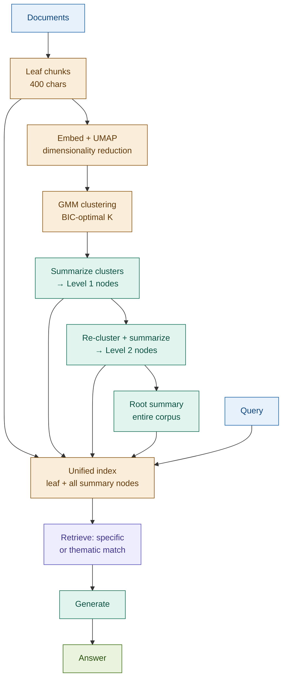

# 12: RAPTOR — Hierarchical Tree Retrieval

---

## The Problem: Flat Retrieval Has One Granularity

A flat vector index embeds all chunks at the same level. A query either matches a specific detail *or* a broad theme — never both from the same index.

**Query:** *"What are the main risk themes in this annual report?"*

Flat retrieval returns individual risk factor sentences — specific, but not synthesised. There are no nodes in the index that capture the risk *themes* across the whole document. The query has no good match.

Retrieve from both details and high-level themes.

---

## The Solution: Build a Tree, Retrieve at Any Level

Cluster semantically similar leaf chunks. Summarise each cluster. Recurse: cluster the summaries, summarise again. Stop when a root node represents the whole corpus.

```
Leaf chunks (specific facts, figures, clauses)
  │
  ├── Cluster A ──→ Summary A  (section-level theme)
  │     ├── chunk 1
  │     └── chunk 2         ╮
  │                          ├─→ Cluster AB ──→ Root summary
  ├── Cluster B ──→ Summary B ╯  (document theme)
        ├── chunk 3
        └── chunk 4

Query → unified index (leaves + all summaries) → match at any level
```

---

## Architecture



---

## Fintech: 10-K Filing with Section-Level Summaries

**Query A (specific):** *"What was net interest income in Q3?"* → retrieves leaf chunk with the figure

**Query B (thematic):** *"What are the main risk themes this year?"* → retrieves Level 2 summary node synthesising all risk sections

| Tree level | Contains | Serves |
|-----------|---------|--------|
| Leaf nodes | Specific figures, clause text | Detail queries |
| Level 1 summaries | Section-level themes | Section queries |
| Level 2 / Root | Cross-section synthesis | Thematic queries |

One index, three levels of retrieval precision. No separate pipelines for detail vs synthesis.

---

## Tradeoffs

| Dimension | Rating | Notes |
|-----------|--------|-------|
| Retrieval quality | ★★★★★ | Matches at any abstraction level |
| Answer quality | ★★★★★ | Detail + synthesis context in one retrieval |
| Indexing cost | ★☆☆☆☆ | Multiple LLM calls per level; UMAP + GMM compute required |
| Query latency | ★★★☆☆ | Collapsed-tree retrieval is fast once built |
| Complexity | ★★★★☆ | UMAP + GMM + recursive construction is non-trivial |

**When to skip**: short documents, frequently-updated corpora, or when only one granularity of query is needed.

→ **Module 14: Multi-Vector RAG** — RAPTOR builds vertical structure (abstraction levels). Multi-Vector adds horizontal: multiple representations of the same chunk.
