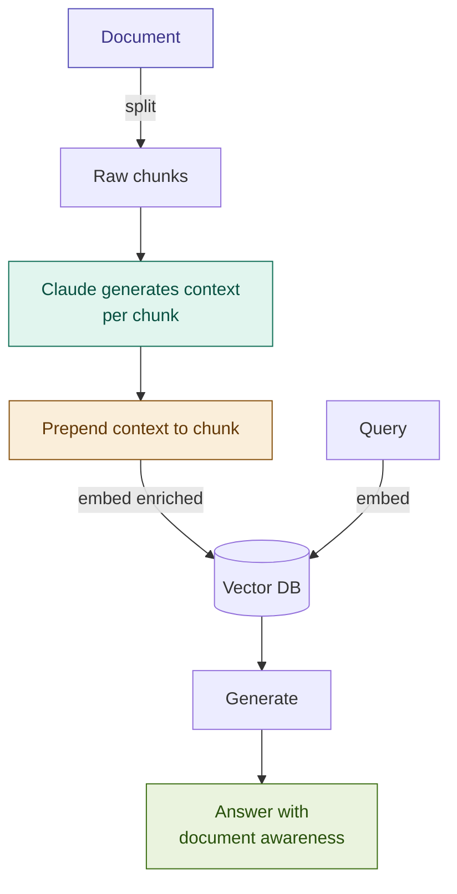

# Contextual RAG

> **Anthropic innovation** — published November 2024. This pattern directly addresses the most common embedding failure mode in production RAG: chunks that are semantically orphaned from the document that contains them.

## What it is

Contextual RAG fixes a fundamental flaw in how chunks are embedded. In standard chunking, a 400-character excerpt like *"The penalty rate shall be calculated at 2% above the base rate"* is embedded in isolation — the vector has no knowledge that this clause belongs to a mortgage agreement, applies only to late payments under Section 7, and cross-references the "Base Rate" defined in Article 2. When a user asks about late payment penalties, the embedding may not match because the chunk lacks the context that connects it to the query.

The fix is applied at index time, before embedding: for each chunk, Claude reads the full document and generates a short situating summary — 50–100 tokens that describe where the chunk sits in the document, what section it belongs to, and what broader topic it contributes to. This context string is prepended to the chunk text before embedding. The resulting vector encodes both the chunk's content *and* its document-level meaning. Retrieval recall increases dramatically, particularly for clauses with pronouns, cross-references ("as defined above"), and implicit dependencies on earlier definitions.

Anthropic's internal testing reported a **49% reduction in retrieval failures** when combining Contextual RAG with BM25 (Hybrid RAG), compared to standard dense retrieval alone.

## Source

Anthropic, "Introducing Contextual Retrieval", Technical Blog, 2024.
URL: https://www.anthropic.com/news/contextual-retrieval

## When to use it

- The corpus contains **multi-section documents** where clause meaning depends on earlier definitions or section headings — loan agreements, regulatory frameworks, terms and conditions.
- Retrieval is failing on queries that use different vocabulary from the document but refer to the same concept — the embedding is syntactically distant despite semantic equivalence.
- Chunks contain **pronouns, implicit references, or cross-references** ("the aforementioned obligation", "as specified in Clause 3", "subject to the conditions above") that are meaningless without document context.
- You are building a **multi-document corpus** where the same phrase ("termination event", "material adverse change") appears across documents with different meanings and needs to be disambiguated at retrieval time.
- The indexing pipeline runs **offline or on a schedule** — the per-chunk LLM call adds significant index-time cost but zero query-time overhead.

## When NOT to use it

- Documents are **short and self-contained** (< 10 pages): chunks within a short document are rarely contextually ambiguous, and the context generation cost is hard to justify.
- Chunks are already **well-scoped** with rich metadata: if your splitter already preserves section titles, document IDs, and structural context as metadata, embedding that metadata alongside the chunk achieves a similar effect at lower cost.
- **Cost is a hard constraint**: context generation requires one LLM call per chunk at index time. For a 500-chunk corpus with `claude-haiku`, this costs ~$0.05; for 500,000 chunks it costs ~$50. Prompt caching reduces this significantly (see Pitfalls), but evaluate before committing.
- Real-time ingestion pipelines where **index latency matters**: each new document requires N LLM calls before chunks are searchable.

## Architecture

## Key components

| Component | Purpose | Default implementation |
|-----------|---------|----------------------|
| Document chunker | Splits source document into raw chunks | `RecursiveCharacterTextSplitter(chunk_size=500)` |
| Context generator | Calls Claude to situate each chunk in the document | `claude-haiku-4-5-20251001` (cost-efficient; context generation is not a reasoning task) |
| Context template | Prompt instructing Claude what to include in the context | Structured prompt with doc title, section scope, cross-references |
| Chunk enricher | Prepends generated context to raw chunk text before embedding | `context + "\n\n" + chunk_text` |
| Prompt cache | Caches the full document body across all per-chunk calls | Anthropic `cache_control: ephemeral` on the document content block |
| Vector store | Stores enriched chunk embeddings | `Chroma` + `OpenAIEmbeddings(model="text-embedding-3-small")` |

## Step-by-step

1. **Chunk the document**: split with `RecursiveCharacterTextSplitter` as in Naive RAG. Store raw chunk text.
2. **Build the context prompt**: construct a prompt that provides Claude with (a) the full document and (b) the specific chunk to situate. Mark the full document as a cached content block — it is identical across all N chunk calls and caching eliminates ~90% of input token cost.
3. **Generate context per chunk**: call Claude once per chunk. The response is a 50–100 token description: which section the chunk belongs to, what concept it elaborates, and which cross-references are relevant.
4. **Prepend and embed**: concatenate `generated_context + "\n\n" + raw_chunk`. Embed this enriched string — the vector now encodes document-level positioning.
5. **Store enriched chunks**: insert into the vector store with the enriched text as `page_content`. Store the raw chunk separately in metadata for the generation step (so the LLM does not see the context header twice).
6. **Query normally**: at query time, no changes — embed the query, retrieve from the vector store, assemble the raw chunks for the prompt.

## Fintech use cases

- **Multi-policy compliance search**: a corpus of 20 regulatory policies where "capital requirement" means something different in each. Without context, chunk embeddings are indistinguishable. With context, each chunk's embedding carries the policy name and Article number, enabling disambiguation at retrieval time.
- **Cross-regulation analysis**: queries that span EMIR, MiFID II, and Basel III simultaneously ("what collateral requirements apply to OTC derivatives?") retrieve the correct clause from each regulation when embeddings carry document-level context.
- **Prospectus and offering document Q&A**: IPO prospectuses contain risk factors that cross-reference earlier definitions. A chunk about "Material Adverse Effect" is uninterpretable without the context that it refers to the definition in the Conditions section and triggers the MAC clause in the purchase agreement. Context generation makes this link explicit in the embedding.
- **Loan agreement clause navigation**: "What are the consequences of missing a scheduled payment under Section 7?" — a direct hit. Without context, the "Section 7" reference in a payment obligations chunk is meaningless to the embedding model. With context, it knows this chunk is from Section 7 of a mortgage loan agreement, and retrieval is precise.

## Tradeoffs

| Dimension | Rating | Notes |
|-----------|--------|-------|
| Retrieval quality | ★★★★★ | Anthropic reported 49% reduction in retrieval failures; strongest single improvement for multi-document corpora |
| Latency (query) | ★★★★★ | Zero query-time overhead — all work is done at index time |
| Latency (index) | ★★★☆☆ | One LLM call per chunk; 500 chunks × ~1s/call = ~8 min without parallelisation |
| Cost | ★★☆☆☆ | Per-chunk LLM cost is the primary constraint; prompt caching reduces this by ~85–90% for a batch indexing run |
| Complexity | ★★★☆☆ | Context prompt design requires careful thought; caching setup adds configuration overhead; otherwise straightforward |
| Fintech relevance | ★★★★★ | Cross-reference-dense regulatory and contract documents are exactly the failure mode this pattern targets |

## Common pitfalls

- **Context template design is critical**: a vague prompt ("describe this chunk") produces generic context that adds noise, not signal. The prompt must instruct Claude to include: (1) document title and type, (2) section/article number, (3) the main concept elaborated, (4) any cross-references resolved. Test on 10–20 chunks before full indexing.
- **Not using prompt caching**: without `cache_control: ephemeral` on the document content block, every chunk call re-processes the full document — wasting 95%+ of input tokens and making indexing 10–20× more expensive. Always cache the document. See the Anthropic caching docs.
- **Token bloat in enriched chunks**: if the generated context is too verbose (> 150 tokens), the enriched chunk exceeds the embedding model's effective context window and the context benefits are diluted. Target 50–100 tokens per context string.
- **Embedding the context header at query time**: do not prepend document context to the user's query before embedding. The query is naturally context-free — embedding it without enrichment is correct. Only the indexed chunks are enriched.
- **Storing only the enriched chunk**: the LLM prompt for generation should use the raw chunk text (without the context header), not the enriched version. Sending context + chunk + context again doubles the context content and confuses the generation step.

## Related patterns

- **10 Parent Document**: solves a related but different problem. Parent Document fixes *what is returned to the LLM* (richer context at generation time). Contextual RAG fixes *what is embedded* (richer context at retrieval time). They are fully complementary: use Contextual RAG to enrich child chunk embeddings, then return parent sections at generation time — the highest-quality indexing + retrieval stack before adding reranking.
- **03 Hybrid RAG**: Anthropic's own blog post explicitly recommends combining Contextual RAG with BM25 (Hybrid RAG). Contextual embeddings improve dense recall; BM25 provides exact-match precision. Together they produced the 49% failure reduction figure. This is the production-recommended combination.
- **14 Multi-Vector RAG**: a different approach to the same problem — generate multiple embeddings per chunk (full text, summary, hypothetical questions) rather than enriching the single embedding. Use Multi-Vector when queries are diverse; use Contextual RAG when the primary failure mode is cross-reference blindness.
- **02 Advanced RAG**: context-enriched chunks pair naturally with Advanced RAG's post-retrieval reranking — better candidates from retrieval + better ranking = compounding quality improvement.
