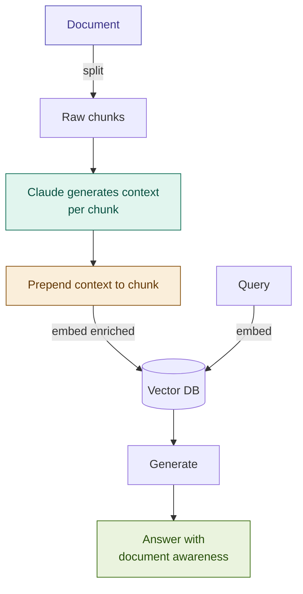

# 13: Contextual RAG — Anthropic's Breakthrough

---

## The Problem: Orphaned Chunks

Standard RAG embeds every chunk in isolation. Consider this fragment:

> *"The penalty rate shall be calculated at 2% above the base rate."*

The embedding model sees those 14 words — nothing else.

It does not know:
- Which document this came from
- That "base rate" is defined three sections earlier
- That this clause only applies to late payments under Section 7
- Whether "the requirement" means Basel III CET1 or a loan covenant

**Result:** the query *"What are the late payment penalties?"* may retrieve the wrong chunk — or miss this one entirely.

---

## The Solution: Situate Every Chunk Before Embedding

For each chunk, Claude reads the full document and generates a short context:

```
[Context]
This chunk is from a Meridian Bank mortgage loan agreement, Section 7 (Payment
Obligations). It defines the penalty interest rate that applies when a scheduled
payment is missed, referencing the Base Rate defined in Article 2.

[Chunk]
The penalty rate shall be calculated at 2% above the base rate...
```

The **enriched text** is what gets embedded — not the raw chunk.
The embedding now encodes document position, section identity, and resolved references.

---

## Architecture



**Index time:** one Claude call per chunk — zero overhead at query time.

---

## The Numbers

Anthropic published this pattern in November 2024 with measured results:

| Retrieval setup | Failure rate reduction |
|----------------|----------------------|
| Standard dense only | baseline |
| Contextual RAG (dense) | **35% fewer failures** |
| Contextual RAG + BM25 (Hybrid) | **49% fewer failures** |

This is not a theoretical improvement — it was measured on real production corpora.

**Prompt caching cuts index cost by ~85–90%.** The full document is cached once; each per-chunk call pays only for the chunk itself.

---

## Fintech Demo: Multi-Policy Compliance Search

**Query:** *"What are the consequences of missing a scheduled payment?"*

| Retrieval | Result |
|-----------|--------|
| Standard chunks | Returns fragments from multiple documents — "penalty", "default", "grace period" — with no document attribution |
| Contextual RAG | Returns the specific clause from the loan policy, attributed to Section 7, with cross-references resolved |

The same phrase appears in 4 different documents with different meanings.
Context-enriched embeddings disambiguate them.

---

## Tradeoffs

| Dimension | Rating | Notes |
|-----------|--------|-------|
| Retrieval quality | ★★★★★ | 49% fewer failures with Hybrid RAG — strongest single indexing improvement |
| Query latency | ★★★★★ | Zero overhead — all work done at index time |
| Index cost | ★★☆☆☆ | One LLM call per chunk; prompt caching cuts this ~85–90% |
| Complexity | ★★★☆☆ | Context template design is critical; caching setup adds configuration |

**When to skip it:** short self-contained docs, hard cost constraints, real-time ingestion.

---

## What's Next

We have now improved *how chunks are indexed*.

The next improvements are on the *query side* — generating better queries,
reasoning about what to retrieve, and knowing when to stop.

→ **Module 06: HyDE** — query-side embedding improvement
