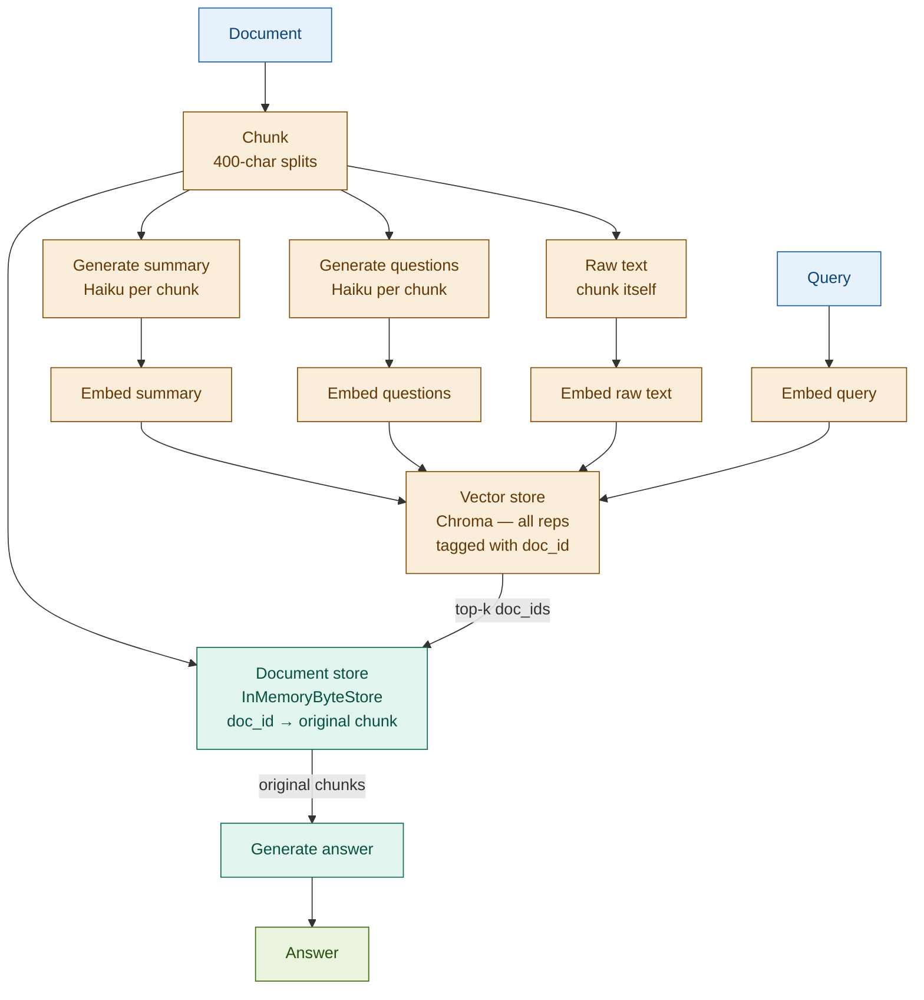

# Multi-Vector RAG

## What it is

Multi-Vector RAG indexes multiple representations of the same document chunk — a summary, a set of hypothetical questions the chunk answers, and optionally the raw text — so that different query styles all retrieve the same underlying source content. The core mechanism: each representation is embedded separately and stored in a vector index tagged with a shared document ID; at query time, the retriever matches any representation, then looks up the original chunk via the document store and returns it for generation. The generator always receives the full original chunk, regardless of which representation matched the query.

The key innovation: a single document chunk answers both "What is the net interest margin?" (raw-text match) and "Give me a thematic overview of this earnings report section" (summary match) and "What questions does this section answer?" (hypothetical-question match). One embedding cannot serve all three simultaneously — Multi-Vector creates one embedding per representation and lets each query find its natural match.

## Source

LangChain MultiVectorRetriever documentation, 2023.
URL: https://python.langchain.com/docs/modules/data_connection/retrievers/multi_vector

## When to use it

- **Diverse query types against the same corpus**: when users ask both specific lookup questions ("What is the CET1 ratio?") and open-ended thematic questions ("Summarise the capital position") — one representation cannot optimise for both.
- **Documents that are naturally answerable as Q&A**: regulatory guidance, product fact sheets, and FAQ-structured policy documents all have implicit questions embedded in their structure. Pre-generating those questions improves recall for question-style queries.
- **Multi-aspect financial reports**: an earnings report covers revenue, credit quality, guidance, and risk — each aspect attracts different query styles. Summary embeddings serve overview queries; raw-text embeddings serve metric lookups.
- **When HyDE is not enough**: HyDE generates a hypothetical document at query time; Multi-Vector pre-generates hypothetical questions at index time. For stable corpora, the index-time approach is more consistent and requires no per-query LLM call.
- **High-value static documents**: compliance handbooks, filed prospectuses, and annual reports that are queried frequently justify the indexing cost of generating multiple representations.

## When NOT to use it

- **Simple semantic search is sufficient**: if all queries are of the same style (all keyword lookups, or all thematic), a single embedding per chunk performs comparably at lower cost.
- **Storage is constrained**: indexing N representations per chunk multiplies vector storage by N. With a corpus of 10,000 chunks and 3 representations each, the index holds 30,000 vectors.
- **Indexing speed is critical or documents update frequently**: generating summaries and hypothetical questions requires one LLM call per representation per chunk. For frequently-updated or real-time corpora, this overhead is prohibitive.

## Architecture

The vector store holds all representations; the document store holds originals. The two are linked by `doc_id`. Retrieval hits any representation; generation always uses the original chunk.

## Key components

| Component | Purpose | Default implementation |
|-----------|---------|----------------------|
| Chunker | Splits documents into base chunks that all representations refer to | `RecursiveCharacterTextSplitter` chunk_size=400 |
| Summary generator | Produces a 2-3 sentence LLM summary per chunk — matches thematic/overview queries | `claude-haiku-4-5-20251001` — one call per chunk |
| Question generator | Produces 3-5 hypothetical questions per chunk — matches question-style queries | `claude-haiku-4-5-20251001` — one call per chunk |
| Vector store | Holds all representations (summary + questions + raw text) tagged with `doc_id` | Chroma with `text-embedding-3-small` |
| Document store | Maps `doc_id` to original chunk text — the retriever's lookup table | `InMemoryByteStore` (LangChain) |
| MultiVectorRetriever | Queries the vector store, de-duplicates doc_ids, looks up originals in document store | `langchain.retrievers.MultiVectorRetriever` |
| Generator | Final answer from original chunks returned by the retriever | `claude-sonnet-4-6` |

## Step-by-step

1. **Chunk documents** — split into base chunks (400 chars, 60 overlap). Each chunk gets a unique `doc_id` (UUID). These are the originals that will always be returned for generation.
2. **Store originals** — insert all chunks into `InMemoryByteStore` keyed by `doc_id`. This is the retriever's lookup table, not the search index.
3. **Generate summaries** — call the LLM once per chunk: "Summarise this text in 2-3 sentences." Each summary is a new `Document` with `metadata={"doc_id": chunk_id}`.
4. **Generate hypothetical questions** — call the LLM once per chunk: "List 3-5 questions that this text answers." Each question set is a new `Document` with the same `doc_id`.
5. **Optionally include raw text** — create a `Document` from the chunk itself with `doc_id` metadata. This catches exact-term queries that neither the summary nor questions would match.
6. **Index all representations** — embed all generated documents (summaries + questions + optionally raw text) and insert into Chroma. The vector store now holds N × chunks vectors.
7. **Build MultiVectorRetriever** — wire the Chroma vector store and the `InMemoryByteStore` together. Set `id_key="doc_id"` so the retriever can translate vector hits back to originals.
8. **Retrieve** — at query time, the retriever embeds the query, searches the vector store for top-k representations, de-duplicates by `doc_id`, and fetches the original chunks from the byte store.
9. **Generate** — pass original chunks (not the matched representations) to the generator. The model receives full, unprocessed source text regardless of which representation triggered the match.

## Fintech use cases

- **Regulatory document Q&A**: Basel III guidance is structured as principles and rules. A compliance analyst asks both "What is the exact CET1 formula?" (raw-text match) and "What does Basel III say about capital buffers generally?" (summary match). Multi-Vector serves both from one index without specialised routing.
- **Multi-aspect financial report retrieval**: an earnings report has revenue figures, segment commentary, credit quality data, and forward guidance. Analysts phrase queries differently for each aspect. Hypothetical questions pre-index the question forms that analysts use; summaries index the thematic content; raw text indexes the figures.
- **Investment product brochure search**: a wealth management platform surfaces products by feature query ("What investment products have capital protection?"), by description ("funds with monthly income"), or by FAQ question ("How is the fund's performance measured?"). Multi-Vector pre-generates all three representations for each product brochure, so any query style retrieves the right product.
- **Policy document retrieval by intent or clause**: a credit operations team may search a lending policy by clause reference ("Section 3.2 conditions") or by intent ("what are the conditions for early repayment?"). Hypothetical questions capture intent; raw text captures clause references.

## Tradeoffs

| Dimension | Rating | Notes |
|-----------|--------|-------|
| Retrieval quality | ★★★★☆ | Significantly improves recall across diverse query styles; still bounded by representation quality |
| Indexing cost | ★★☆☆☆ | N LLM calls per chunk (N = number of representation types); treat as a batch job |
| Storage | ★★☆☆☆ | Vector store grows N× per chunk; document store holds full originals separately |
| Complexity | ★★★★☆ | Two storage layers (vector store + document store), representation generation pipeline, `MultiVectorRetriever` wiring |

## Common pitfalls

- **Storage multiplier compounds with corpus size**: with 3 representations per chunk and 5,000 chunks, the vector store holds 15,000 vectors. Plan storage capacity before scaling.
- **Representation quality is the ceiling**: a poor summary propagates to retrieval — queries that should match a chunk won't if the summary misses the key themes. Validate summary and question quality on a held-out query set before deploying.
- **Hypothetical questions can drift from actual content**: the LLM may generate questions that are plausible but not grounded in the chunk's actual content. Use a grounding instruction ("generate only questions this exact text answers") and spot-check outputs on domain samples.
- **De-duplication is implicit**: if the same `doc_id` matches via both summary and question representations, `MultiVectorRetriever` returns the original chunk once. The k parameter controls unique source chunks returned, not total representation hits — understand this to tune retrieval coverage correctly.
- **Generation uses originals, not representations**: this is a feature, not a bug, but it can surprise: the model never sees the generated summary or questions. The generator sees the raw chunk. Ensure chunks are self-contained enough to support generation without the representation that triggered the match.

## Related patterns

- **13 Contextual RAG**: Contextual RAG enriches each chunk with a prepended context prefix before embedding — one enhanced embedding per chunk. Multi-Vector creates multiple distinct embeddings per chunk. The two compose cleanly: apply Contextual RAG to enrich the raw-text representation, then generate summaries and questions on top of the enriched chunk.
- **12 RAPTOR**: RAPTOR builds vertical hierarchy (leaf → cluster summary → root). Multi-Vector adds horizontal diversity (multiple representations at the same level). For large corpora needing both thematic synthesis and query-style diversity, combine both: build a RAPTOR tree first, then apply Multi-Vector to each node.
- **06 HyDE**: HyDE generates a hypothetical document from the query at query time; Multi-Vector pre-generates hypothetical questions from documents at index time. HyDE is query-side; Multi-Vector is index-side. They address the same semantic mismatch problem from opposite directions.
