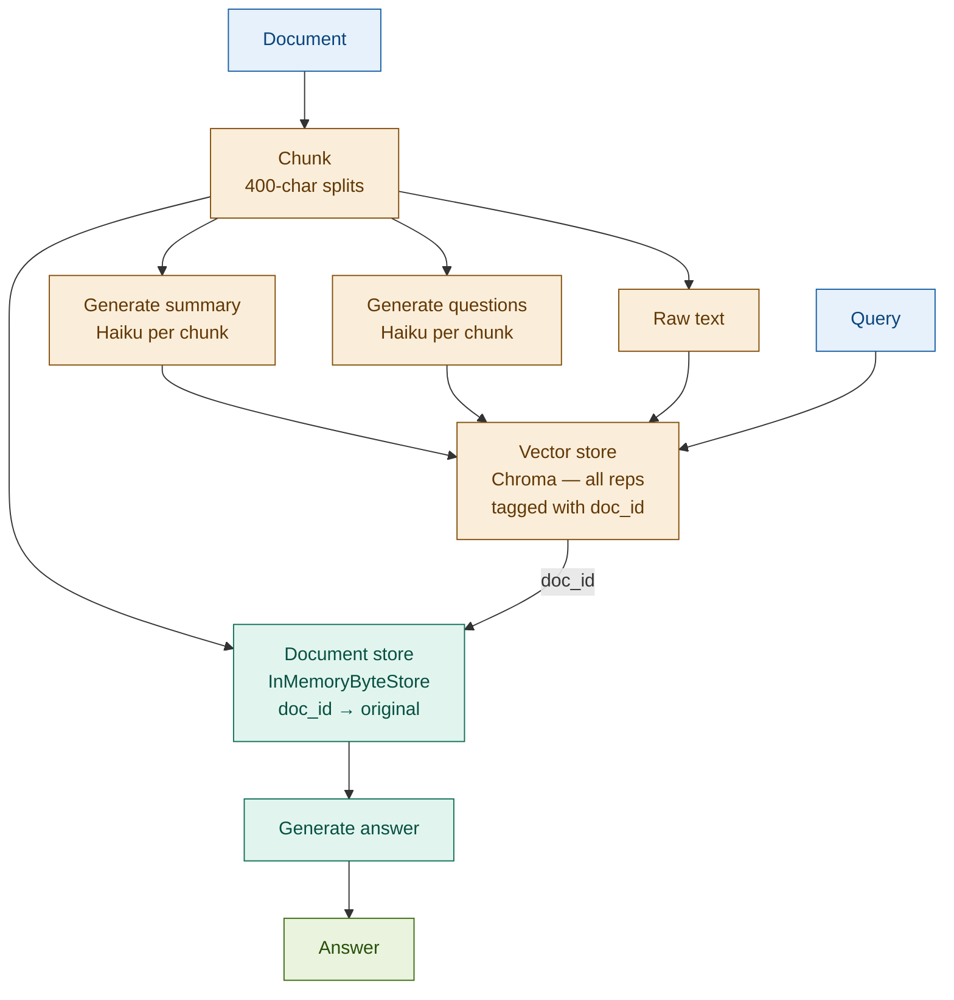

# 14: Multi-Vector RAG — Multiple Representations, One Chunk

---

## The Problem: One Embedding Cannot Serve All Query Styles

A single embedding is a compromise. The same regulatory clause gets asked about in three ways — none of which embed close to the clause itself.

| Query style | Example | What it needs |
|-------------|---------|---------------|
| Exact lookup | *"What is the CET1 minimum ratio?"* | Raw text with the figure |
| Thematic | *"Summarise the capital adequacy section"* | A summary embedding |
| Question-based | *"What questions does this section answer?"* | Hypothetical question embeddings |

One chunk. Three query styles. One embedding misses two of them.

---

## The Solution: Index Three Representations, Return One Chunk

Generate multiple embeddings per chunk at index time. Each representation is a different lens on the same content. At query time, whichever lens matches the query returns the original chunk for generation.

```
Original chunk
  │
  ├── Summary        → embed → vector store ──┐
  ├── Questions      → embed → vector store ──┼─→ any match → doc_id → original chunk
  └── Raw text       → embed → vector store ──┘
                                                          ↓
                                                    Generate answer
```

The generator always receives the original chunk — not the summary, not the questions. Retrieval precision; generation completeness.

---

## Architecture



---

## Fintech: Regulatory Guidance Searchable as Q&A or Summary

A Basel III handbook is queried by compliance analysts in different modes on the same day.

| Query | Representation that matches | Returned content |
|-------|----------------------------|-----------------|
| *"What is the CET1 minimum?"* | Raw text (contains the figure) | Full clause with ratio and definition |
| *"Summarise capital buffer rules"* | Summary (thematic language) | Full clause with all buffer tiers |
| *"What questions does this section answer?"* | Hypothetical questions | Full clause covering the coverage scope |

Three representations. One source chunk. No routing logic required.

---

## Tradeoffs

| Dimension | Rating | Notes |
|-----------|--------|-------|
| Retrieval quality | ★★★★☆ | Improved recall across query styles; bounded by representation quality |
| Indexing cost | ★★☆☆☆ | N LLM calls per chunk; treat as a batch job, not real-time |
| Storage | ★★☆☆☆ | Vector store grows N× per chunk; 3 reps × 5,000 chunks = 15,000 vectors |
| Complexity | ★★★★☆ | Two storage layers + representation pipeline + MultiVectorRetriever wiring |

**Key insight: different query styles match different representations — the generator always sees the original.**

→ **Module 19: Speculative RAG** — Multi-Vector adds representations at index time. Speculative RAG generates multiple candidate answers at query time and selects the best.
