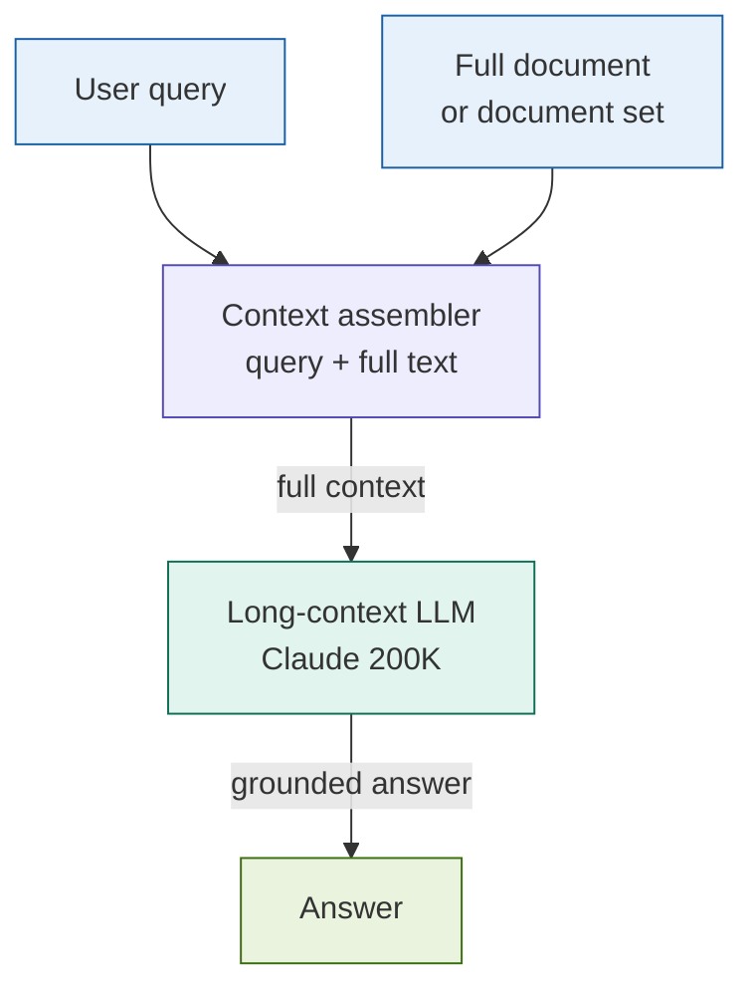

# Long-Context RAG

## What it is

Long-Context RAG skips chunking and retrieval entirely by placing a complete document — or a small set of complete documents — directly into the LLM's context window alongside the query. Rather than selecting which fragments to retrieve, the model reads the full text and reasons holistically over it. This is made practical by a new generation of frontier models with context windows of 100K tokens and above: Claude (200K), GPT-4 Turbo (128K), and Gemini 1.5 (up to 1M tokens). For documents that fit within these limits, Long-Context RAG eliminates the entire class of failures that arise from chunking — missed cross-references, broken reasoning chains, truncated tables, and relevance mismatches at chunk boundaries.

The pattern is deceptively simple: load the document, prepend the query, call the model. That simplicity is also its primary value — there is no retrieval pipeline to build, tune, or maintain.

## Source

**"Lost in the Middle: How Language Models Use Long Contexts"**
Nelson F. Liu, Kevin Lin, John Hewitt, Ashwin Paranjape, Michele Bevilacqua, Fabio Petroni, Percy Liang. ACL 2024.
arXiv:2307.03172. URL: https://arxiv.org/abs/2307.03172

This paper established the core empirical finding that motivates and constrains the pattern: LLMs with long context windows attend disproportionately to text at the beginning and end of the context, and systematically underperform on information buried in the middle. Understanding this effect is mandatory for production use.

Model context window references:
- Claude 3+ (Anthropic, 2024): 200K tokens. URL: https://www.anthropic.com/claude
- GPT-4 Turbo (OpenAI, 2023): 128K tokens.
- Gemini 1.5 Pro (Google, 2024): 1M tokens.

## When to use it

- The document or document set fits in the model's context window (≤ 180K tokens for Claude, leaving headroom for the system prompt and answer).
- The query requires reasoning across the entire document — annual report risk synthesis, full contract clause analysis, complete regulatory rulebook Q&A — where chunking would sever the reasoning chain.
- Cross-document consistency checking: two agreements, a prospectus and its supplement, a policy and its amendment — the model must see both in full to detect contradictions.
- The corpus is small and fixed (a single filing, a single contract) rather than a continuously growing knowledge base.
- Simplicity is a constraint: there is no engineering team to maintain an indexing pipeline, and the document set changes infrequently.
- **Fintech trigger**: full 10-K or 20-F analysis where risk factors, MD&A, and financial statements must be read together to produce a coherent answer.

## When NOT to use it

- The corpus contains many documents or grows continuously — you cannot fit a regulatory library, a ticketing system, or a document management system in a single context window.
- Cost is a binding constraint. Long-context calls are priced per input token; a 150-page document costs roughly 10–50× more per query than a targeted 5-chunk retrieval call.
- The query is narrow and the relevant content is concentrated — if a user asks for a single clause number, retrieval provides the same answer at a fraction of the cost.
- The document substantially exceeds the model's context window; truncating it reintroduces the same failure mode as chunking, but without the precision of targeted retrieval.

## Architecture

No retriever. No vector store. No chunking. The document is the context.

## Key components

| Component | Purpose | Default implementation |
|-----------|---------|----------------------|
| Document loader | Read and decode source files (PDF, TXT, HTML) | `pathlib.Path.read_text()` for plain text; `pypdf` for PDFs |
| Token counter | Verify document fits within the model's context limit before calling | `anthropic.count_tokens()` or `tiktoken` |
| Context assembler | Concatenate system prompt + document text + user query in the correct order | Python string concatenation with section delimiters |
| Long-context LLM | Reason holistically over the full document | `claude-sonnet-4-6` (200K window) via `anthropic.messages.create` |
| Position-aware ordering | Mitigate "lost in the middle" by placing the most relevant sections at the top and bottom of the context | Sort retrieved or identified sections by importance score before assembly |

## Step-by-step

1. **Load the full document.** Read the source file. Do not chunk. Preserve section headers and formatting — they are navigation signals the LLM uses to locate relevant passages.
2. **Count tokens.** Verify the document + system prompt + query fits within the model's context limit. Leave at least 10K tokens of headroom for the answer. If it does not fit, consider RAPTOR (summarise and compress) or Contextual RAG (chunk with position context) instead.
3. **Assemble the context.** Place the document between clear delimiters (`<document>...</document>`). Put the query at the end — not the beginning. Position the most salient content (if known) near the start or end of the document block to exploit the recency and primacy effects.
4. **Call the long-context model.** Use `claude-sonnet-4-6` with `max_tokens` set to the answer budget. Pass the assembled context as the user message.
5. **Inspect for lost-in-the-middle failures.** For multi-section documents, verify the answer references content from the middle of the document, not only the opening and closing sections.
6. **Mitigate if needed.** If middle-section content is being missed, reorder the document to bring the most relevant sections to the front, or use a structured extraction prompt that names each section explicitly.

These steps correspond to notebook cells 3–5.

## Fintech use cases

- **Full 10-K annual report analysis:** "Summarise all risk factors in this 10-K filing and categorise them by type (market, credit, operational, regulatory)." The risk factors section references the MD&A and footnotes; chunking breaks these cross-references. With the full filing in context, the model can synthesise across sections coherently.
- **Complete contract review:** An ISDA Master Agreement with its Credit Support Annex and Schedule must be read as a unit — the Schedule overrides the boilerplate, and the CSA references definitions in the body. Long-Context RAG is the only pattern that handles all three documents simultaneously without ambiguity about which version of a term governs.
- **Regulatory rulebook Q&A:** A Basel III framework document defines terms that are used in later sections. A question about "the leverage ratio buffer" requires reading the definition section and the buffer section together. Chunking both sections separately loses the definitional link.
- **Multi-document deal analysis:** A leveraged buyout involves a credit agreement, an intercreditor agreement, and an equity commitment letter. A question about "what happens if the borrower breaches the leverage covenant" requires reasoning across all three simultaneously.

## Tradeoffs

| Dimension | Rating | Notes |
|-----------|--------|-------|
| Answer quality | ★★★★★ | No chunk boundary failures; holistic reasoning over complete document |
| Simplicity | ★★★★★ | No indexing pipeline, no retriever, no vector store to maintain |
| Cost | ★☆☆☆☆ | Input tokens priced per token; a 100-page document costs 10–50× a targeted retrieval call |
| Latency | ★★☆☆☆ | Time-to-first-token scales with context length; streaming mitigates perceived latency |
| Scalability | ★☆☆☆☆ | Only viable for single documents or very small sets; not a general-purpose pattern |

## Common pitfalls

- **"Lost in the middle" is real and measurable.** Liu et al. (2024) showed that GPT-3.5 and GPT-4 performance drops significantly for information positioned in the middle of a long context. Claude shows the same effect at reduced magnitude. For documents longer than ~50K tokens, assume the model is less reliable on middle-section content and verify empirically.
- **Cost scales with document size, every call.** Unlike retrieval-based patterns where indexing is a one-time cost, long-context calls pay full input-token cost on every query. A 200-page 10-K at ~150K tokens costs roughly $1.50 per query at current Claude pricing. At scale, this compounds rapidly.
- **Token limit headroom is mandatory.** Always count tokens before calling. A document that is 195K tokens leaves only 5K for the system prompt, query, and answer — a 400-page filing will silently truncate, reintroducing the failure mode you are trying to eliminate.
- **Not a replacement for retrieval at corpus scale.** Long-Context RAG works for one document at a time. It cannot answer questions that span a large document library. For that, use Contextual RAG or RAPTOR to compress, then retrieve.
- **Structured output requires explicit section targeting.** For multi-section extraction (e.g., "extract all financial covenants"), instruct the model to enumerate sections explicitly. An open-ended "find all covenants" prompt applied to a 200-page document often misses content — especially from the middle.
- **Context window limits change.** Model providers update context limits frequently. Hard-coding a token budget against a specific model's documented limit is fragile; always call `count_tokens()` at runtime and check against the actual deployed model's limit minus a safety margin.

## Related patterns

- **12 RAPTOR** — When a document set is too large to fit in context, RAPTOR recursively summarises it into a compressed tree that can be retrieved or stuffed into context. RAPTOR is the fallback when Long-Context RAG hits the context limit.
- **13 Contextual RAG** — Contextual RAG prepends per-chunk context at index time, making chunk-based retrieval more accurate. It is the right choice when documents are too large for long-context but too important for plain chunking. Contextual RAG and Long-Context RAG address the same chunking failure from opposite directions.
- **25 Multimodal RAG** — When documents contain charts, tables as images, or scanned PDFs, long-context vision models (Claude 3 Sonnet, GPT-4V) can process both the text and visual elements in a single context. Long-Context RAG is the natural foundation for multimodal document analysis.
