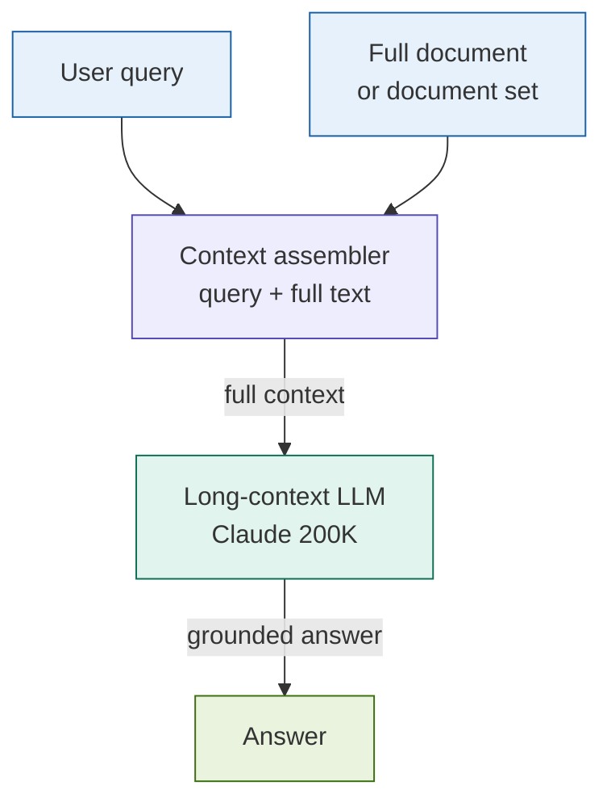

# 15: Long-Context RAG -- Skip Retrieval, Use Full Context

---

## The Problem

Chunking breaks documents at the wrong boundaries.

- Risk factors in a 10-K reference the MD&A three sections away
- An ISDA Schedule overrides boilerplate defined elsewhere in the body
- A Basel III buffer requirement is defined in one section, applied in another

Every retrieval pattern so far solves this by retrieving *better* chunks. Long-Context RAG asks a different question: **what if we stopped chunking at all?**

---

## The Concept

Place the entire document directly into the LLM's context window alongside the query. No chunking. No indexing. No retrieval. The model reads everything and answers from complete information.

```
Full document (100-200 pages)
  +
User query
  |
  v
[ 200K-token context window ]
  |
  v
Answer -- grounded in the complete text
```

This is made practical by a new generation of frontier models:

| Model | Context window |
|-------|---------------|
| Claude 3+ | 200K tokens (~150K words) |
| GPT-4 Turbo | 128K tokens |
| Gemini 1.5 Pro | 1M tokens |

A standard 10-K filing runs 80--120 pages (~60--90K tokens). It fits.

---

## Architecture



No retriever node. No vector store. No chunk boundaries to tune.

---

## Key Insight

> **When the document fits, retrieval is unnecessary.**

Every retrieval pattern adds complexity to work around the limitations of chunking. Long-Context RAG eliminates those limitations by eliminating chunking. The result is the simplest possible RAG pipeline and, for documents that fit in context, often the highest-quality answers.

The catch: you pay for every token on every query.

**One warning to know**: the "lost in the middle" effect (Liu et al., ACL 2024). LLMs attend more strongly to content at the beginning and end of long contexts. For documents longer than ~50K tokens, information buried in the middle is retrieved less reliably. Mitigation: place the most important sections at the top of the document block.

---

## Fintech Use Case: Complete 10-K Analysis

**Scenario**: An analyst asks for all risk factors in an annual filing, categorised by type.

With chunked retrieval:
- Risk factors section is split across 3--5 chunks
- Cross-references to MD&A land in different chunks
- Footnotes that quantify the risks are never retrieved alongside the risk statement
- Answer is incomplete by construction

With Long-Context RAG:
- Full filing in context (~70K tokens for a typical 10-K)
- Model reads risk factors, MD&A, and footnotes as a unit
- Answer synthesises all three sources coherently
- Regulatory citations include section numbers from the actual filing

**Other fintech cases**: complete ISDA contract review; full Basel III rulebook Q&A; multi-document deal analysis (credit agreement + intercreditor + equity commitment letter).

---

## Tradeoffs

| Dimension | Rating | Notes |
|-----------|--------|-------|
| Answer quality | ★★★★★ | No chunk boundaries; holistic reasoning over complete document |
| Simplicity | ★★★★★ | No indexing, no retriever, no vector store |
| Cost | ★☆☆☆☆ | Full input-token cost on every query; ~$1.50 per 10-K at current pricing |
| Latency | ★★☆☆☆ | Time-to-first-token scales with context size; streaming helps |
| Scalability | ★☆☆☆☆ | One document at a time; not viable for large corpora |

**The honest position**: Long-Context RAG is the right default for single-document analysis where cost is acceptable. It is the wrong default for anything at corpus scale.

---

## When to Use It

| Use | Avoid |
|-----|-------|
| Single document Q&A (10-K, contract, rulebook) | Large document libraries |
| Cross-section reasoning within one document | Cost-sensitive, high-query-volume systems |
| Small fixed document sets (2--3 agreements) | Documents exceeding the context window |
| No engineering team to maintain a retrieval pipeline | Narrow queries where retrieval is sufficient |
