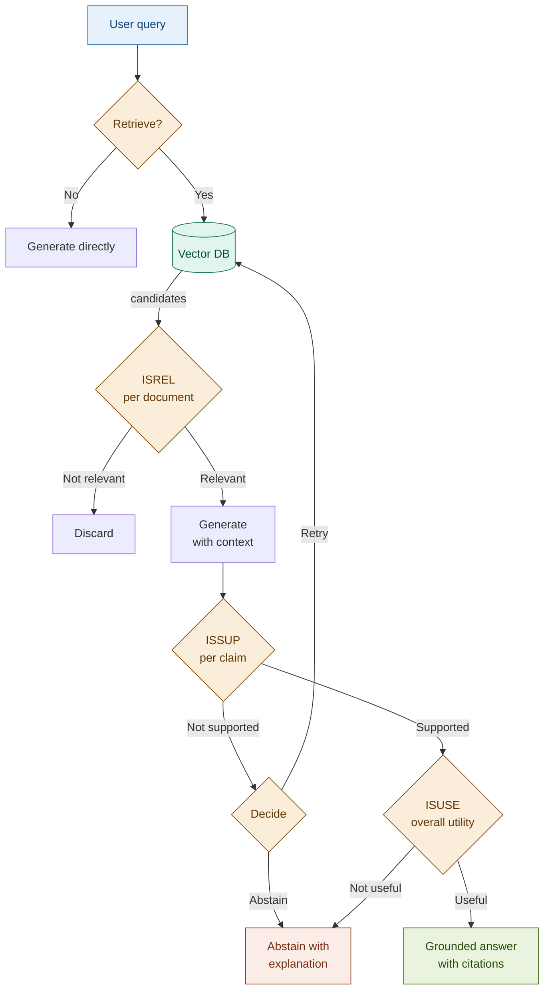

# Self-RAG

> **The core shift**: standard RAG pipelines retrieve and generate unconditionally. Self-RAG teaches the model to reflect at each step — is retrieval needed? Is this document relevant? Is my answer actually supported? — and act on those judgments before committing to a response.

## What it is

In a standard RAG pipeline, retrieval always happens, every retrieved document enters the context, and the generated answer is delivered regardless of whether it is grounded. There is no feedback loop. Self-RAG breaks this by making the language model its own critic.

The model generates four special reflection tokens interleaved with its output:

| Token | Question | Effect |
|-------|----------|--------|
| `Retrieve` | Should I retrieve documents for this query? | Skips retrieval for self-contained queries; triggers it for queries needing specific facts |
| `ISREL` | Is this retrieved document relevant? | Filters out low-relevance documents before they enter the context |
| `ISSUP` | Does my generated answer cite this document faithfully? | Detects hallucination at the claim level |
| `ISUSE` | Is my overall answer useful to the user? | End-to-end quality gate before delivery |

In the original paper, these are learned special tokens produced by a fine-tuned model during generation. In practice, the same behavior is achievable through prompted LLM calls — each reflection point becomes a structured judgment call with an explicit verdict and rationale. This requires no fine-tuning and produces interpretable, auditable traces.

The pipeline branches on each judgment. A document that fails ISREL is discarded. An answer that fails ISSUP is flagged or regenerated. An answer that fails ISUSE triggers a retry or an explicit abstain. The system does not deliver an answer it cannot support.

## Source

Asai et al., "Self-RAG: Learning to Retrieve, Generate, and Critique through Self-Reflection", ICLR 2024.
URL: https://arxiv.org/abs/2310.11511

## When to use it

- **High-stakes answers where false positives have real cost**: compliance interpretations, regulatory thresholds, legal clause readings — environments where a fabricated number or misattributed requirement causes regulatory or financial harm.
- **Queries where not all retrieved documents are relevant**: when the vector store contains documents of mixed quality or coverage, and cosine similarity alone cannot distinguish signal from noise, ISREL filtering prevents noise from contaminating the generation context.
- **Auditability is a hard requirement**: regulated environments need answers with machine-readable grounding proofs — not just a reference list, but a per-claim citation trace that an auditor can verify.
- **Mixed query types flowing through a single pipeline**: a compliance chatbot receives both simple definitional questions ("What does CET1 stand for?") and complex reasoning questions ("How does our CET1 ratio requirement interact with the countercyclical buffer?"). Self-RAG routes them appropriately.

## When NOT to use it

- **Latency-critical paths**: each reflection token is an LLM call. A full Self-RAG pass adds 1–4 additional calls over baseline RAG — unacceptable for real-time trading interfaces, customer-facing chat with sub-second expectations, or any system where total query time is measured in milliseconds.
- **Corpora where all retrieved documents are relevant**: if retrieval is over a small, curated, high-precision index where every returned chunk is reliably relevant (e.g., a narrow product FAQ), the ISREL step adds cost with no filtering benefit.
- **Simple, direct lookups**: "What is Section 3.2 of the Basel III accord?" already scopes the retrieval precisely. Self-RAG's overhead is unjustified for queries with a single, unambiguous answer in a known location.

## Architecture

**Decision router**: when ISSUP fails, the system chooses between retrying with broader retrieval, abstaining with an explanation, or delivering the answer with explicit flags on unsupported claims. The retry path must have a circuit breaker to prevent infinite loops.

## Key components

| Component | Purpose | Default implementation |
|-----------|---------|----------------------|
| Retrieval critic (`Retrieve`) | Decides whether the query needs document retrieval | Prompted LLM call — `claude-haiku-4-5-20251001` (fast binary judgment) |
| Vector store | Holds indexed corpus documents | `Chroma` with `text-embedding-3-small` |
| Relevance critic (`ISREL`) | Rates each retrieved document: RELEVANT / PARTIAL / NOT_RELEVANT | Prompted LLM call — `claude-sonnet-4-6` (nuanced evaluation) |
| Generation LLM | Produces the answer from filtered, relevant documents | `claude-sonnet-4-6` |
| Answer critic (`ISSUP`) | Verifies each claim in the answer against the retrieved documents | Prompted LLM call — `claude-sonnet-4-6` |
| Utility judge (`ISUSE`) | End-to-end quality gate — rates answer usefulness 1–5 | Prompted LLM call — `claude-haiku-4-5-20251001` |
| Decision router | Branches on ISSUP verdict: deliver / flag / retry / abstain | Python control flow with retry counter (max 2) |
| Reflection tracer | Records all four judgments with rationales | `ReflectionTrace` dataclass — the audit artifact |

## Step-by-step

1. **Retrieve?** — call the LLM with the query; return YES (retrieval needed) or NO (generate directly). Simple factual definitions and general concepts go direct; entity-specific thresholds and regulatory clauses require retrieval.
2. **Retrieve** — run similarity search over the vector store; retrieve `k` candidates (default: 5).
3. **ISREL per document** — for each candidate, call the LLM: is this relevant to the query? Filter to RELEVANT and PARTIAL only. If none pass, proceed to abstain.
4. **Generate** — call the LLM with the original query + filtered documents. Instruct it to answer only from provided context and to state each key fact as a separate sentence for later claim extraction.
5. **ISSUP per claim** — extract key claims from the answer; verify each one against the retrieved documents. Flag claims that are NOT_SUPPORTED.
6. **Decide** — if all claims are supported: proceed to ISUSE. If critical claims fail: route to retry (with circuit breaker) or abstain.
7. **ISUSE** — rate the overall answer usefulness 1–5. Scores below threshold trigger retry or abstain.
8. **Deliver** — return the final answer with its `ReflectionTrace` logged alongside it.

## Fintech use cases

- **AML typology matching**: "Is this transaction pattern consistent with known money laundering typologies?" The ISREL step ensures only relevant typology documents enter the context; ISSUP verifies that each typology cited in the answer is actually present in the retrieved source, not hallucinated from training data.
- **Regulatory compliance interpretation**: when a compliance officer asks about a specific capital requirement or reporting threshold, ISSUP provides per-claim grounding — the 4.5% CET1 minimum must be traceable to the retrieved Basel III text, not inferred from training knowledge.
- **Audit-trail generation**: financial audits require answers that can be examined claim by claim. The `ReflectionTrace` artifact provides exactly this — each assertion is tagged with its support verdict and the source document that supports it.
- **Risk assessment with verification**: "Does our HQLA composition satisfy LCR requirements?" is answerable only if the retrieved regulatory text actually addresses the question. ISREL filters ensure the answer is built from relevant clauses; the abstain path fires if the corpus has a genuine coverage gap.

## Tradeoffs

| Dimension | Rating | Notes |
|-----------|--------|-------|
| Retrieval quality | ★★★★★ | ISREL filtering removes noise; retrieval bypass prevents context pollution on simple queries |
| Answer grounding | ★★★★★ | ISSUP provides explicit per-claim grounding — strongest guarantee of any non-agentic pattern |
| Latency | ★☆☆☆☆ | 3–5 additional LLM calls per query; adds 2–5s over baseline RAG |
| Cost | ★★☆☆☆ | Multiple LLM calls; mitigated by using Haiku for binary judgments, Sonnet for nuanced evaluation |
| Complexity | ★★★☆☆ | Decision router, retry logic, circuit breaker, and abstain path all required; not optional |
| Fintech relevance | ★★★★★ | Per-claim citation grounding and the abstain path are critical in regulated environments |

## Common pitfalls

- **Recursive critique loops**: if the retry path is unbounded, ISSUP failures on every retrieval attempt produce an infinite loop. Always implement a retry counter (max 2–3) with a forced abstain on exhaustion.
- **Over-critical ISREL rejection**: if the ISREL prompt is too strict, it filters out documents that are partially relevant, producing an empty context that forces abstain on queries the corpus could answer. Calibrate ISREL on a representative sample — a rejection rate above 60% usually indicates the prompt is miscalibrated.
- **Treating ISSUP as binary**: claims are often partially supported — a figure is mentioned in a slightly different context, or the document implies the claim without stating it. Use three-way classification (SUPPORTED / PARTIALLY_SUPPORTED / NOT_SUPPORTED) to avoid discarding answers that are substantially grounded.
- **Skipping the abstain path**: when no documents pass ISREL or no claims pass ISSUP, the system must say "I cannot ground an answer from the available sources" — not generate anyway. The abstain path is not a failure mode; it is the hallucination prevention mechanism.
- **Using Sonnet for all four reflection calls**: the `Retrieve?` and `ISUSE` judgments are simpler binary/rating tasks. Use `claude-haiku` for these; reserve `claude-sonnet` for the nuanced ISREL and ISSUP evaluations where the model must reason about document content.

## Related patterns

- **17 Corrective RAG (CRAG)**: CRAG also detects low-relevance retrieval but responds by triggering a web search fallback. Self-RAG responds by filtering and grading — it does not automatically seek new sources. CRAG is better when the corpus has genuine coverage gaps; Self-RAG is better when the corpus is authoritative and noise filtering is the priority. They compose: run Self-RAG's ISREL step first; if it fails, trigger CRAG's web search.
- **20 Adaptive RAG**: routes queries to different pipeline configurations before retrieval begins. Self-RAG embeds the routing inside the generation loop. Adaptive RAG is faster (one routing call, not three reflection calls); Self-RAG is more auditable per-claim. Use Adaptive RAG at the intake layer and Self-RAG within the retrieval branch that needs the strongest grounding guarantees.
