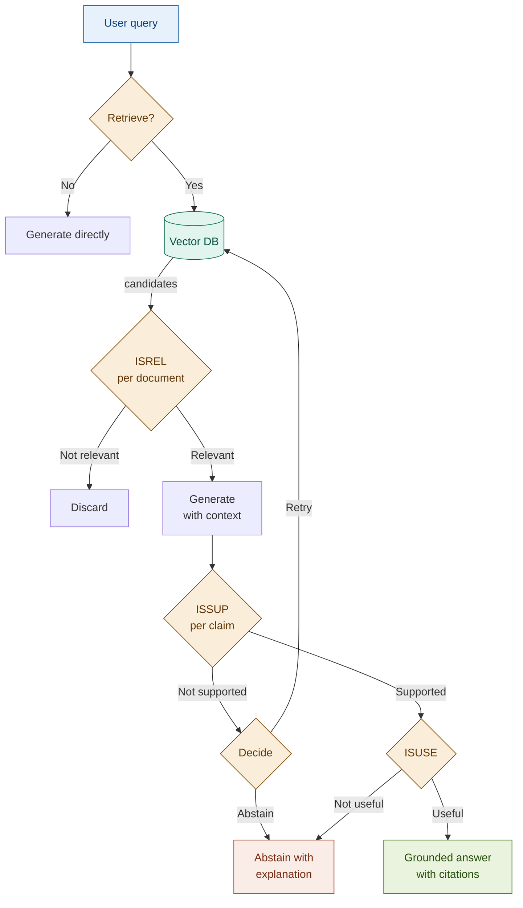

# 16: Self-RAG — RAG That Thinks Before It Speaks

---

## The Problem: RAG Is Unconditionally Trusting

Standard RAG always retrieves, always uses every result, always generates — no questions asked.

Three failures this causes:
1. Retrieval fires when it shouldn't.
2. Irrelevant documents silently contaminate the context.
3. The answer states things the documents never said.

Self-RAG fixes all three by making the model reflect at each step.

---

## The Solution: Four Reflection Tokens

| Token | Question | On failure |
|-------|----------|-----------|
| `Retrieve` | Does this query need documents? | Skip retrieval |
| `ISREL` | Is this document relevant? | Discard it |
| `ISSUP` | Is this claim supported by the docs? | Flag / retry / abstain |
| `ISUSE` | Is the answer useful? | Retry or abstain |

Each is a structured LLM judgment call — verdict plus rationale. No fine-tuning required.

**The abstain path is mandatory.** When evidence is insufficient, the system says so.

---

## Architecture

---

## Fintech: Compliance Q&A with Verification

**Query:** *"Is this transaction pattern consistent with known money laundering typologies?"*

ISREL filters out a credit risk document that scored well on cosine similarity — the model recognises it addresses default risk, not transaction patterns, and discards it before generation.

ISSUP then checks each claim in the answer. A claim about "wire-stripping" is flagged NOT_SUPPORTED because it does not appear in the retrieved typology documents.

The `ReflectionTrace` — every verdict and rationale — is the compliance audit artifact.

---

## Tradeoffs

| Dimension | Rating | Notes |
|-----------|--------|-------|
| Answer grounding | ★★★★★ | Per-claim ISSUP — strongest hallucination guard of any non-agentic pattern |
| Retrieval quality | ★★★★★ | ISREL removes noise before it contaminates generation |
| Latency | ★☆☆☆☆ | 2–3× baseline — three to five LLM calls per query |
| Cost | ★★☆☆☆ | Haiku for binary judgments; Sonnet for ISREL and ISSUP |

→ **Module 17: Corrective RAG** — Self-RAG reflects. Corrective RAG acts on that reflection.
