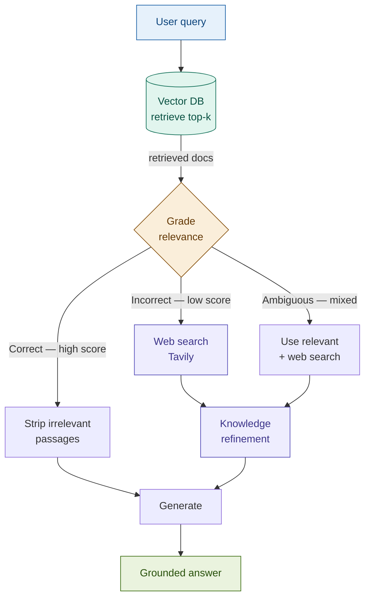

# Corrective RAG (CRAG)

> **The key move**: instead of trusting that retrieval found something useful, CRAG grades the retrieved documents first. If they score below threshold, it doesn't try harder with the same corpus — it reaches outside it, triggers a web search, and corrects the knowledge before generating.

## What it is

Every RAG pipeline has a retrieval quality assumption baked in: that the vector store contains useful documents for the queries it receives. This assumption breaks when the corpus is stale, incomplete, or was never built for the current query type. When it breaks, the pipeline either hallucinates from bad context or delivers a confidently wrong answer.

CRAG adds an explicit quality check between retrieval and generation. A relevance grader scores the retrieved documents and routes the request along one of three paths:

| Path | Condition | Action |
|------|-----------|--------|
| **Correct** | At least one document scores high relevance | Strip irrelevant passages, generate from good content |
| **Incorrect** | All documents score below threshold | Discard corpus results, trigger web search, generate from web |
| **Ambiguous** | Mixed scores — some relevant, some not | Use relevant corpus passages + supplement with web search |

The grader is an LLM call that returns a relevance score for each retrieved document. The routing logic is deterministic: the score decides which path fires. The web search result goes through a knowledge refinement step — extracting the factual content from web-formatted text — before generation.

This is the key contrast with Self-RAG: Self-RAG filters and flags bad retrieval. CRAG acts on it — it goes and finds better information.

## Source

Yan et al., "Corrective Retrieval Augmented Generation", ICLR 2024.
URL: https://arxiv.org/abs/2401.15884

## When to use it

- **Factual queries where the internal corpus may be stale**: regulatory thresholds, reporting requirements, and market rules change. A query about current Dodd-Frank swap dealer thresholds should reach for the current regulation — not a document indexed six months ago.
- **Domains with frequent external updates**: news, regulatory amendments, market events, earnings announcements — any domain where the "correct" answer is more likely to be found on the web than in a static index.
- **Queries that span your corpus boundary**: a compliance team may have internal policy docs but not the full regulatory text. CRAG bridges the gap rather than confabulating from incomplete context.
- **When retrieval failure has high cost**: in fintech, serving a stale capital requirement or an outdated reporting threshold has regulatory consequences. CRAG's fallback reduces the risk of confident errors on time-sensitive facts.

## When NOT to use it

- **Private or confidential data only**: if the corpus contains non-public information and the query must stay within it, a web search fallback is a compliance and data governance violation. CRAG is only appropriate when external search is permissible for the query type.
- **No web access in the deployment environment**: air-gapped systems, regulated environments with network restrictions, or deployments without a Tavily (or equivalent) API key. In these cases, implement the grading step without the web fallback — degrade to a Self-RAG-style abstain path instead.
- **Latency-critical paths**: CRAG adds one grading call (always) and potentially a full web search round-trip (on fallback). For paths that cannot absorb 1–3 additional seconds, CRAG is not appropriate.
- **The corpus is authoritative and complete**: if the internal index is curated, current, and known to cover the query population, CRAG's web fallback adds cost and noise. Use Self-RAG's filtering approach instead.

## Architecture

**Knowledge refinement**: raw web search results contain navigation text, ads, and unstructured HTML artefacts. The refinement step calls the LLM to extract the factual content relevant to the query from each web result before it enters the generation context.

## Key components

| Component | Purpose | Default implementation |
|-----------|---------|----------------------|
| Retriever | Fetches top-k documents from the internal corpus | `Chroma` with `text-embedding-3-small` |
| Relevance grader | Scores each retrieved document: Correct / Ambiguous / Incorrect | Prompted LLM call — `claude-haiku-4-5-20251001` (fast scoring) |
| Decision router | Routes to generate, web search, or both based on grader output | Python control flow on grade verdict |
| Web search tool | Executes web queries when corpus retrieval is insufficient | Tavily API (`tavily-python`); mock fallback if key absent |
| Knowledge refiner | Extracts factual content from raw web results | Prompted LLM call — `claude-haiku-4-5-20251001` |
| Generation LLM | Produces the final answer from refined context | `claude-sonnet-4-6` |

## Step-by-step

1. **Retrieve** — fetch top-k documents from the vector store using the user's query.
2. **Grade each document** — call the LLM for each retrieved document: is this relevant to the query? Return a score: Correct (clearly relevant), Ambiguous (partially relevant or uncertain), Incorrect (not relevant).
3. **Route** — based on the aggregate grade:
   - All Correct or majority Correct → strip Incorrect passages, proceed to generation
   - Any Incorrect or all Ambiguous → trigger web search in addition to or instead of corpus results
4. **Web search** (if triggered) — query Tavily with the user's original question. Retrieve the top results.
5. **Knowledge refinement** — for each web result, call the LLM to extract the factual content relevant to the query. Discard navigation, boilerplate, and tangential text.
6. **Generate** — call the generation LLM with the refined context (corpus passages that passed grading + refined web content if fallback fired). Answer grounded in the best available sources.

## Fintech use cases

- **Real-time regulatory lookups**: "What is the current Dodd-Frank reporting threshold for swap dealers?" — internal policy docs may not reflect the most recent CFTC amendments. CRAG grades the internal results; if they score low or are flagged as stale, it searches for the current regulatory text before generating.
- **Market news Q&A**: queries about recent earnings, rate decisions, or credit events are unlikely to be in any static corpus. CRAG's web fallback is the designed path for these queries — the grader recognises that internal documents don't cover time-sensitive events.
- **Compliance Q&A needing verified current regulation**: when a compliance team needs to confirm whether a specific rule is still in effect or has been amended, CRAG provides a mechanism to check against current public sources rather than relying on a potentially outdated internal index.
- **Fact-checking generated summaries**: CRAG can be applied not just to answering questions but to verifying claims in generated output — grade each claim against retrieved documents; for low-confidence claims, trigger web search verification.

## Tradeoffs

| Dimension | Rating | Notes |
|-----------|--------|-------|
| Retrieval quality | ★★★★★ | Best-path routing ensures the answer comes from the highest-quality available source |
| Answer grounding | ★★★★☆ | Web results introduce less structured content than internal docs; knowledge refinement mitigates this |
| Latency | ★★☆☆☆ | Grading adds one call per retrieved doc; web fallback adds a full search round-trip — 1–3s overhead |
| Cost | ★★★☆☆ | Grading calls are cheap (Haiku); web search has API cost (Tavily); refinement adds another call |
| Complexity | ★★★☆☆ | More branches than Self-RAG; the web search + refinement path needs its own error handling |
| Fintech relevance | ★★★★★ | Stale corpus is the primary failure mode for regulatory and market queries in production |

## Common pitfalls

- **Grading threshold too strict**: if the grader marks Ambiguous too aggressively, the web fallback fires constantly — defeating the purpose of the internal corpus and adding latency and cost on every query. Calibrate the threshold on a representative sample; a fallback rate above 30% on a well-maintained corpus suggests miscalibration.
- **Web search noise entering generation**: Tavily returns structured snippets, but they can still include irrelevant content. Skipping the knowledge refinement step and passing raw web results directly to generation produces lower-quality answers than plain retrieval. The refinement step is not optional.
- **Not restricting web search scope**: an unrestricted web search for "capital requirements" will return retail finance articles alongside regulatory documents. Pass domain-specific context to the search query (e.g., append "site:sec.gov OR site:cftc.gov" or "CFTC regulatory text") to improve result quality.
- **Treating the Incorrect path as failure**: a corpus miss is not an error — it is expected for time-sensitive or out-of-scope queries. Log when the fallback fires; a high fallback rate is a signal to update the index, not a sign that CRAG is broken.
- **No Tavily key handling**: in environments where web search is not available, the code must degrade gracefully — route to the abstain path rather than throwing an exception. Always test the no-key path in CI.

## Related patterns

- **16 Self-RAG**: Self-RAG grades retrieval and filters or abstains. CRAG grades retrieval and corrects it — actively seeking better sources. They address the same problem with different responses: Self-RAG is the right choice when the corpus is authoritative and you want to filter noise; CRAG is the right choice when the corpus may be incomplete and you want to fill gaps. They can be composed: run Self-RAG's ISREL step first; if the aggregate score is low, trigger CRAG's web search fallback.
- **20 Adaptive RAG**: Adaptive RAG decides which retrieval strategy to use before retrieval begins. CRAG decides whether to supplement or replace retrieval after it completes. Adaptive RAG is a pre-retrieval router; CRAG is a post-retrieval corrector. In a production pipeline, Adaptive RAG routes query types and CRAG handles the cases where the chosen retrieval path didn't deliver.
- **22 Agentic RAG**: Agentic RAG extends CRAG's fallback logic into a full planning and tool-use loop — not just one web search, but multiple tool calls, result synthesis, and multi-step reasoning. CRAG is the simpler, single-step corrective mechanism; Agentic RAG is CRAG plus planning.
