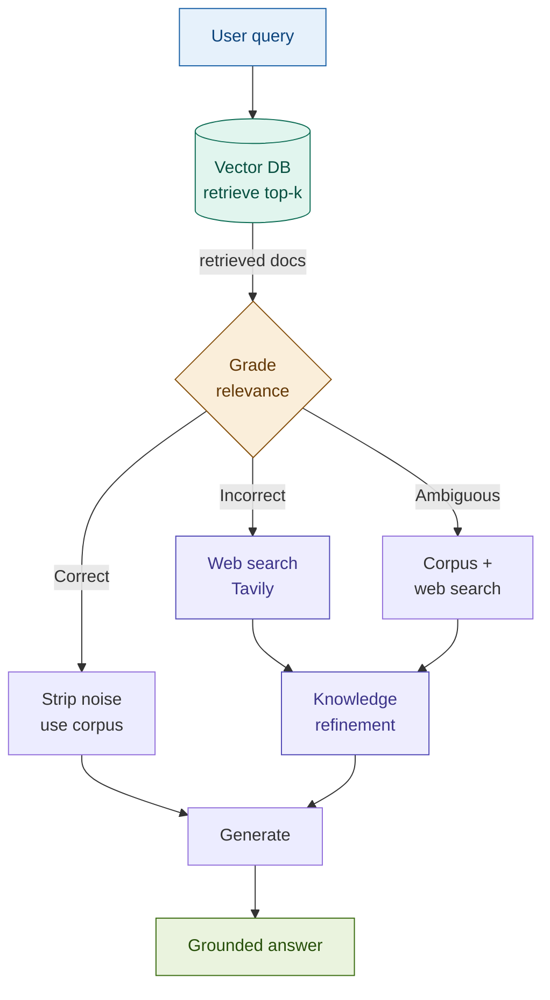

# 17: Corrective RAG — When Internal Retrieval Fails, Go External

---

## The Problem: Retrieval Can Be Wrong or Stale

A RAG pipeline assumes the corpus has what the query needs. This breaks two ways:

1. **Irrelevant retrieval** — cosine similarity returns topically adjacent docs that don't answer the question.
2. **Stale retrieval** — the index was built months ago; the correct answer has since changed.

When either happens, the pipeline generates from bad context with full confidence.

---

## The Solution: Grade First, Search If Needed

CRAG adds a relevance grader between retrieval and generation.

```
Retrieve → Grade each doc → Route:
  • Correct  (high relevance) → strip noise, generate
  • Incorrect (low relevance) → web search → refine → generate
  • Ambiguous (mixed)         → keep good docs + web search → generate
```

The grader is a fast LLM call returning Correct / Ambiguous / Incorrect per document. The routing is deterministic on the score. The web fallback goes through a knowledge refinement step — extracting facts from raw web text — before reaching the generation prompt.

**The contrast with Self-RAG**: Self-RAG reflects and abstains. CRAG acts — it goes and finds better information.

---

## Architecture



Knowledge refinement strips navigation text and boilerplate from web results. Skipping it sends raw HTML artefacts into the generation context.

---

## Fintech: Market News Query with Web Fallback

**Query:** *"What is the current Dodd-Frank reporting threshold for swap dealers?"*

Internal corpus (static regulatory docs from last year):

| Doc | Grade | Reason |
|-----|-------|--------|
| Dodd-Frank overview (2023) | Incorrect | Does not contain current threshold — document predates 2024 CFTC amendment |
| Swap dealer registration guide | Ambiguous | Mentions thresholds but not the current figure |

→ Fallback fires — Tavily fetches current CFTC regulatory text → refined → answer generated from verified language, not the stale doc.

The most practical self-correction pattern for time-sensitive financial queries.

---

## Tradeoffs

| Dimension | Rating | Notes |
|-----------|--------|-------|
| Retrieval quality | ★★★★★ | Best-path routing — answer comes from best available source |
| Answer grounding | ★★★★☆ | Web results less structured than internal docs; refinement mitigates |
| Latency | ★★☆☆☆ | Grading adds one call per doc; web fallback adds 1–3s round-trip |
| Cost | ★★★☆☆ | Grading cheap (Haiku); web search has Tavily API cost |

**When to skip**: private data environments, no web access, well-maintained current corpus.

→ **Module 20: Adaptive RAG** — now let's tie it all together with adaptive routing that decides the right strategy before retrieval even begins.
