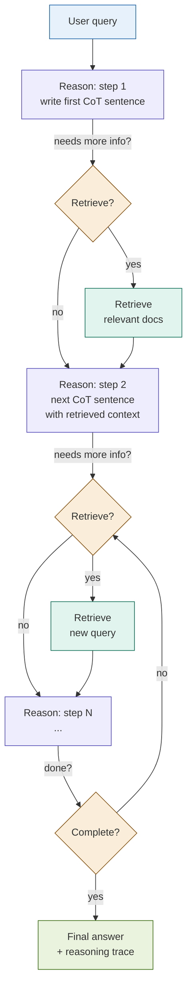

# IRCoT (Interleaved Retrieval + Chain-of-Thought)

## What it is

IRCoT interleaves chain-of-thought reasoning with retrieval so that each step of the reasoning process can fetch exactly the information it needs, informed by what has already been reasoned. In standard RAG, retrieval happens once before reasoning begins — the model then reasons from a fixed context regardless of what direction the reasoning takes. IRCoT breaks this into an alternating loop: the model writes one reasoning step, that step determines whether new information is needed and what to search for, retrieval happens (or is skipped), and the model writes the next reasoning step with updated context. Retrieval and reasoning inform each other iteratively rather than sequentially.

The pattern was formalised by Trivedi et al. (ACL 2023) for knowledge-intensive multi-step questions, but its structure applies naturally to fintech workflows where a decision is reached through a sequence of sub-questions: eligibility → product rules → client history → regulatory threshold → final determination.

## Source

**"Interleaving Retrieval with Chain-of-Thought Reasoning for Knowledge-Intensive Multi-Step Questions"**
Harsh Trivedi, Nirmal Trivedi, Tushar Khot, Ashish Sabharwal, Sameer Singh. ACL 2023.
arXiv:2212.10509. URL: https://arxiv.org/abs/2212.10509

## When to use it

- The question requires multiple distinct sub-questions, each of which may need different retrieved context.
- The answer to an early reasoning step determines what to retrieve next — retrieval is conditional on reasoning, not fixed upfront.
- Different steps of the reasoning chain draw on different documents or knowledge sources (e.g., step 1 needs a client profile, step 2 needs a product rulebook, step 3 needs a regulatory threshold).
- The query is complex enough that a single retrieval pass would produce a context that is either too broad (wastes tokens) or too narrow (misses later sub-questions).
- **Fintech trigger**: multi-step eligibility or suitability assessments where each criterion check may require a different document lookup.

## When NOT to use it

- Simple, single-step queries where one retrieval pass is sufficient — the loop overhead adds latency and cost with no quality gain.
- Latency is a hard constraint — each reasoning-retrieval cycle adds one embedding call and one LLM call to the total.
- The question is self-contained within a single document — use Long-Context RAG instead.
- The reasoning chain is highly predictable and fixed — a pre-defined multi-hop retrieval sequence (Module 23) is cheaper and more reliable than a dynamic loop.

## Architecture

## Key components

| Component | Purpose | Default implementation |
|-----------|---------|----------------------|
| CoT step generator | Produce one reasoning sentence given the query, prior steps, and any retrieved context | Claude (Haiku for steps, Sonnet for final answer) |
| Retrieval trigger detector | Decide whether the latest reasoning step requires a retrieval before proceeding | LLM call: classify the step as "retrieval needed" / "continue reasoning" / "done" |
| Retrieval query formulator | Extract or generate the retrieval query implied by the latest reasoning step | Extracted from the reasoning step text or generated by a separate LLM prompt |
| Context manager | Accumulate retrieved passages across all steps without exceeding the context budget | Deduplicating list of retrieved chunks; cap at `MAX_CONTEXT_CHUNKS` |
| Loop controller | Enforce a hard ceiling on reasoning steps; detect termination | `MAX_STEPS` constant; termination when detector returns "done" |

## Step-by-step

1. **Initialise the reasoning trace.** Set the accumulated context to empty, the step counter to zero, and the reasoning history to the user's query.
2. **Generate one reasoning step.** Ask the LLM to produce the next sentence of a chain-of-thought answer, given the query, all prior reasoning steps, and all retrieved context so far.
3. **Detect retrieval need.** Ask the LLM (or a rule-based classifier) whether the latest reasoning step implies a need for new information. Output: `retrieve` / `continue` / `done`.
4. **Formulate and execute retrieval (if triggered).** Extract the implicit search query from the reasoning step — either by prompting the LLM to restate it as a retrieval query, or by using the reasoning step text directly. Retrieve top-k documents and add them (deduplicating) to the accumulated context.
5. **Repeat from step 2** with the updated context, until the detector returns `done` or `MAX_STEPS` is reached.
6. **Synthesise the final answer.** Pass the complete reasoning trace and all retrieved context to a synthesis prompt. The final answer must be grounded in retrieved documents and trace the reasoning chain.

Steps 2–5 correspond to notebook cells 3–4.

## Fintech use cases

- **Multi-step credit risk assessment:** A credit decision involves sequential sub-questions — what is the applicant's income tier? what does the policy say for that tier? what is their DTI ratio? does it meet the threshold? Each step may retrieve a different section of the lending policy or a different client record field. IRCoT retrieves the income policy in step 2, the DTI threshold in step 3, and the override rules in step 4, rather than guessing all three upfront.
- **Financial product suitability assessment:** "Is this client eligible for a Tier-3 structured product?" requires: verify client classification → look up Tier-3 eligibility criteria → check client's risk tolerance score → verify investment history horizon → check regulatory suitability rules. Each sub-check may need a different document.
- **Sequential regulatory compliance check:** A Basel III compliance assessment iterates through capital ratio checks, leverage ratio checks, LCR checks, and G-SIB surcharge checks. Each check may require the corresponding section of the regulatory document plus the institution's reported figures.
- **Complex derivatives eligibility:** Determining whether a client qualifies for an OTC derivatives product requires checking ISDA documentation, internal credit policies, and the client's current collateral position — three separate retrieval targets that follow a logical sequence.

## Tradeoffs

| Dimension | Rating | Notes |
|-----------|--------|-------|
| Answer quality | ★★★★☆ | High for multi-step questions; no gain over standard RAG for simple queries |
| Reasoning transparency | ★★★★★ | Full step-by-step trace with retrieval provenance at each step |
| Latency | ★★☆☆☆ | N reasoning steps × (1 LLM call + 0-1 retrieval call) per step |
| Cost | ★★☆☆☆ | Grows linearly with number of reasoning steps |
| Complexity | ★★★★☆ | Loop controller, trigger detector, and context manager all require tuning |

## Common pitfalls

- **Over-retrieval on simple sub-questions.** The trigger detector may retrieve for every step even when prior context is sufficient. Result: inflated cost and a bloated context window that degrades later reasoning steps. Mitigation: tune the trigger detector with examples of steps that should *not* trigger retrieval.
- **Under-retrieval from poor query formulation.** If the retrieval query formulator re-uses the reasoning step text verbatim, the query may be too discursive to retrieve precisely. A dedicated reformulation prompt ("restate this as a short search query") significantly improves precision.
- **Reasoning drift.** Each step is conditioned on the last, so early errors compound. If step 2 draws a wrong conclusion, steps 3–5 may reason from false premises and retrieve documents that reinforce the error. Mitigation: include the original query in every step prompt to re-anchor the reasoning.
- **Infinite loops.** Without a hard `MAX_STEPS` ceiling, a poorly calibrated detector can keep finding "more information needed" indefinitely. Always enforce a ceiling (typically 5–8 steps for fintech use cases).
- **Context window overflow.** Accumulating retrieved chunks across many steps can exhaust the context budget. Cap the number of retained chunks (`MAX_CONTEXT_CHUNKS`) and implement a recency-weighted eviction policy for long reasoning chains.
- **Cost opacity.** Unlike a fixed RAG pipeline where cost is predictable, IRCoT cost varies with query complexity. A simple query may take 2 steps; a complex one may take 8. Build per-query cost tracking into the loop controller for production use.

## Related patterns

- **08 FLARE** — FLARE triggers retrieval when generation confidence is low, based on token-level uncertainty signals. IRCoT triggers retrieval based on explicit reasoning step content. FLARE is sentence-level and implicit; IRCoT is step-level and explicit. For fintech, IRCoT's explicit trace is preferred where auditability matters.
- **23 Multi-Hop RAG** — Multi-Hop RAG follows a fixed retrieval chain (document A → extract entity → retrieve document B). IRCoT's chain is dynamic — each step decides whether to retrieve and what to retrieve. Multi-Hop is faster and more predictable; IRCoT is more flexible for open-ended reasoning.
- **22 Agentic RAG** — Agentic RAG gives the LLM a full tool-use loop with arbitrary actions. IRCoT constrains the loop to alternating reasoning-retrieval cycles, making it more predictable and auditable than a fully agentic system. IRCoT is the right choice when you want agentic-style reasoning with a constrained, inspectable action space.
