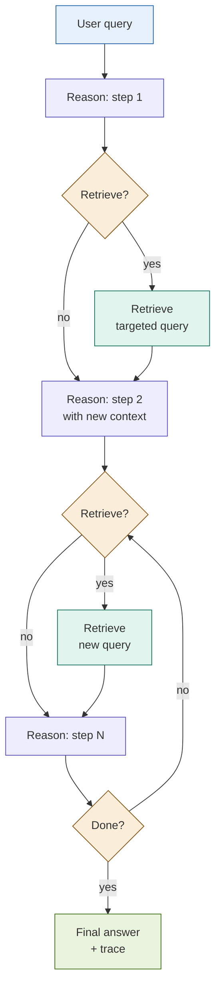

# 18: IRCoT -- Reason, Then Retrieve, Then Reason Again

---

## The Problem

Standard RAG retrieves once, then reasons from a fixed context.

That works for single-step questions. It breaks for multi-step ones.

**Example**: "Is this client eligible for a Tier-3 structured product?"

Step 1 needs: client classification rules
Step 2 needs: Tier-3 eligibility criteria
Step 3 needs: the client's risk tolerance score
Step 4 needs: regulatory suitability requirements

A single upfront retrieval cannot know which of these to fetch — because each sub-question only becomes apparent after the previous one is answered.

---

## The Concept

Interleave chain-of-thought reasoning steps with targeted retrieval. Each reasoning step produces one inference. That inference determines whether new information is needed and what to search for. Retrieval happens only when the reasoning explicitly requires it.

```
Query
  |
  v
[Reason: step 1]  -- "The client is classified as retail..."
  |
  v
Need more info? YES
  |
  v
[Retrieve: "retail client Tier-3 eligibility rules"]
  |
  v
[Reason: step 2]  -- "Retail clients need min. 2y investment history..."
  |
  v
Need more info? YES
  |
  v
[Retrieve: "client investment history records"]
  |
  v
[Reason: step 3]  -- "Client has 3y history, meets threshold."
  |
  v
Need more info? NO --> Final answer
```

Retrieval and reasoning inform each other iteratively. The reasoning trace tells you exactly what was retrieved and why.

---

## Architecture



---

## Key Insight

> **Retrieve only when reasoning needs it.**

Every other pattern decides what to retrieve before reasoning starts. IRCoT lets the reasoning decide. Each step has three possible outcomes:

- **Continue** -- the current context is sufficient; reason further
- **Retrieve** -- a specific gap has been identified; fetch targeted documents
- **Done** -- the reasoning chain is complete; synthesise the answer

The retrieval trigger is explicit and inspectable. In an audit, you can point to the exact reasoning step that triggered each retrieval call and explain why.

---

## Fintech Use Case: Multi-Step Compliance Analysis

**Query**: "Does this loan application comply with all underwriting requirements?"

| Step | Reasoning | Retrieval triggered? |
|------|-----------|---------------------|
| 1 | "Applicant has a 680 FICO score. I need the minimum FICO threshold for this product." | Yes -- loan policy §2 |
| 2 | "Policy requires 660+ for standard loans. FICO passes. Now check DTI." | Yes -- applicant DTI data |
| 3 | "DTI is 38%. I need the maximum DTI allowed under fair lending guidelines." | Yes -- fair lending §4 |
| 4 | "Max DTI is 43%. Passes. Final determination: application is compliant." | No -- done |

**Why this matters**: Three different document sections were retrieved at three different points, each driven by the specific gap the reasoning identified. A single upfront retrieval would have needed to guess all three sections in advance -- and might have missed the fair lending rule entirely.

---

## Tradeoffs

| Dimension | Rating | Notes |
|-----------|--------|-------|
| Answer quality | ★★★★☆ | High for multi-step; no benefit over standard RAG for simple queries |
| Reasoning transparency | ★★★★★ | Full step-by-step trace; every retrieval is justified in the trace |
| Latency | ★★☆☆☆ | N steps × (1 LLM call + 0-1 retrieval call); grows with complexity |
| Cost | ★★☆☆☆ | Unpredictable -- simple queries: 2 steps; complex: 6-8 steps |
| Complexity | ★★★★☆ | Trigger detector + query formulator + loop controller all need tuning |

---

## When to Use IRCoT

**Use it when**:
- The query requires 3+ distinct sub-questions answered in sequence
- Each sub-question may need a different document or section
- An audit trail of reasoning steps with retrieval provenance is required

**Avoid it when**:
- Simple queries where one retrieval suffices -- loop overhead is pure cost
- Latency is a hard constraint
- The reasoning chain is fixed and predictable -- use Multi-Hop RAG instead
