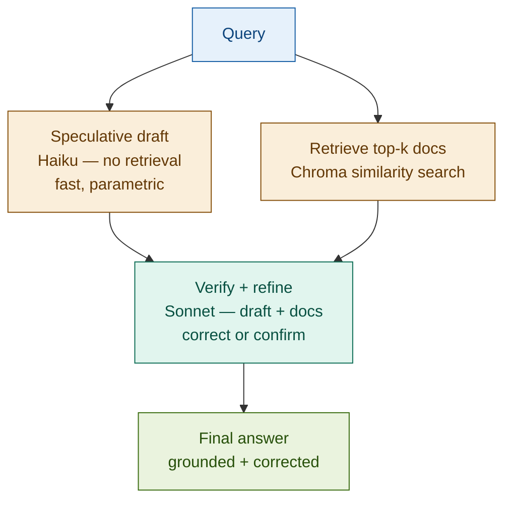

# Speculative RAG

## What it is

Speculative RAG generates a draft answer directly from the query using a small, fast model — before any retrieval occurs — then retrieves documents to verify and refine that draft with a larger model. The split is deliberate: parametric generation is fast but error-prone; retrieval is accurate but adds latency. By running draft generation and retrieval in parallel, then using the retrieved documents as a verification layer, Speculative RAG achieves lower end-to-end latency on queries where the model has reliable prior knowledge, while using retrieval as a corrective backstop for errors and hallucinations.

The core insight: most repeated queries in a production system have answers the model already knows approximately — standard settlement rules, common capital ratios, widely-cited regulatory thresholds. For these, retrieval is not needed to generate; it is only needed to verify. Deferring retrieval to the verification step, rather than blocking generation on it, eliminates retrieval latency from the critical path.

## Source

Wang et al., "Speculative RAG: Enhancing Retrieval Augmented Generation through Drafting." 2024.
URL: https://arxiv.org/abs/2407.08223

## When to use it

- **Latency-critical applications**: when the first response must arrive quickly — trading desk tools, real-time compliance checks, customer-facing chatbots where perceived speed matters.
- **High-volume repeated queries**: FAQ-style systems where the same question patterns appear thousands of times per day. The model's parametric knowledge is reliable for well-established facts; retrieval validates rather than informs.
- **LLM with strong domain priors**: when the model has been trained or fine-tuned on the target domain (regulatory standards, common financial ratios, settlement conventions). Speculative accuracy is higher and verification catches the residual errors.
- **Known query patterns with stable answers**: standard regulatory thresholds (T+2 settlement, CET1 minimum), common product definitions, and established market conventions change infrequently — the model's priors remain valid across time.
- **Two-tier answer quality**: where a fast approximate answer is acceptable as an initial response, immediately followed by a verified final answer (progressive disclosure UX pattern).

## When NOT to use it

- **Novel or rare queries**: if the model has weak priors on a query (unusual market events, recently published regulations, bespoke instrument structures), the speculative draft will be unreliable and the verifier adds cost without benefit. Use standard RAG instead.
- **High-stakes answers where retrieval accuracy is mandatory**: audit opinions, regulatory filings, trade confirmations — any output where an error has material legal or financial consequences. Do not speculate; retrieve first.
- **Highly volatile information**: live prices, intraday rates, real-time news. The model's parametric knowledge is always stale for time-sensitive data; speculation will be wrong more often than it is right.

## Architecture

Draft generation and retrieval run in parallel. The verifier receives both and produces the final answer. The draft is never returned to the user directly — it is always subject to verification.

## Key components

| Component | Purpose | Default implementation |
|-----------|---------|----------------------|
| Speculative drafter | Generates a draft answer from the query using only parametric knowledge — no retrieval | `claude-haiku-4-5-20251001` — fast and cheap |
| Retriever | Fetches top-k documents relevant to the query | Chroma with `text-embedding-3-small`, k=5 |
| Verifier / refiner | Receives query + draft + retrieved docs; confirms, corrects, or supplements the draft | `claude-sonnet-4-6` — larger model for reliability |
| Draft comparator | Measures the delta between draft and final answer for evaluation and observability | String comparison; semantic similarity |

## Step-by-step

1. **Receive query** — standard user query, no special preprocessing required.
2. **Generate speculative draft** — call the small model (Haiku) with only the query and a prompt: "Answer based on your training knowledge; be explicit about any uncertainty." No documents are passed. This call is fast.
3. **Retrieve documents** — simultaneously (or immediately after the draft call), embed the query and retrieve top-k documents from the vector store. This is standard dense retrieval.
4. **Verify and refine** — call the large model (Sonnet) with three inputs: (a) the original query, (b) the speculative draft, and (c) the retrieved documents. The prompt instructs the verifier to: confirm the draft if the documents support it; correct specific errors if the documents contradict it; supplement missing details from the documents.
5. **Return final answer** — the verifier's output is the response. The draft is retained for observability (was it correct? did it need correction?) but never returned directly to the user.
6. **Evaluate correction rate** — track the fraction of queries where the draft was materially changed by the verifier. High correction rates indicate the drafter is unreliable for this query distribution and the speculative path adds cost without latency benefit.

## Fintech use cases

- **Standard settlement rule FAQ**: "What are the T+2 settlement rules for equities?" is asked thousands of times per day across operations teams. The model's prior knowledge is correct for this stable regulatory standard; retrieval verifies and catches any recent amendments. Speculative path delivers the answer in ~600ms vs ~1200ms for standard RAG.
- **High-volume regulatory ratio lookups**: "What is the minimum CET1 ratio under Basel III?" The model knows the answer; retrieval confirms it against the current handbook and surfaces any phase-in schedules. Useful for compliance chatbots serving large analyst populations.
- **Fast first-response with compliance check**: a wealth management chatbot drafts a product explanation immediately, then verifies it against the approved product brochure. The user sees a fast response; compliance-critical accuracy is guaranteed by the verification layer.
- **Draft financial summaries with fact-check**: an earnings report assistant speculates the headline metrics for a well-known company from prior-quarter context, retrieves the current quarter's actual tables, and the verifier corrects the figures. The user sees a near-instant initial summary that is accurate by the time they finish reading the first sentence.

## Tradeoffs

| Dimension | Rating | Notes |
|-----------|--------|-------|
| Latency | ★★★★★ | Draft + retrieval in parallel eliminates retrieval from the critical path for common queries |
| Quality | ★★★☆☆ | Depends heavily on verifier capability; weak verifiers let draft errors through |
| Risk | ★★☆☆☆ | Speculative draft can hallucinate confidently; verification is not infallible |
| Complexity | ★★★☆☆ | Two model calls + parallel coordination + correction-rate monitoring required |

## Common pitfalls

- **Confident hallucination fools the verifier**: when the draft is incorrect but well-formed and fluent, the verifier may accept it rather than challenge it. Use explicit verification prompts: "Check every specific figure, ratio, and threshold against the provided documents." Test on known-wrong drafts to calibrate verifier sensitivity.
- **Verifier passivity**: the verifier supplements rather than corrects — appending retrieved content to the draft without removing erroneous content. This produces answers that are both wrong (from the draft) and correct (from retrieval) simultaneously. Prompt engineering must explicitly instruct the verifier to override conflicting content, not append it.
- **Two model calls even for simple queries**: even when the draft is correct, the verifier still runs. For very simple queries (single-fact lookups), standard RAG with a small model may be faster and cheaper than the speculative path. Profile your query distribution before adopting this pattern.
- **Stale parametric knowledge**: the model's priors reflect its training cutoff. For regulatory standards that have been amended recently, the speculative draft will be outdated. Maintain a staleness flag per document and route post-cutoff queries directly to standard RAG.
- **Correction rate drift**: if the underlying regulatory documents change (new rules, amended thresholds), the draft correction rate will rise. Monitor correction rates over time as a signal that the model's priors are diverging from the current knowledge base.

## Related patterns

- **16 Self-RAG**: Self-RAG reflects on whether to retrieve at all (Retrieve? token) and whether the retrieved content is relevant (IsRel). Speculative RAG always retrieves — but uses retrieval for verification rather than generation. Self-RAG skips retrieval when unnecessary; Speculative RAG always retrieves but deprioritises it on the latency-critical path.
- **17 Corrective RAG**: CRAG detects irrelevant retrievals and falls back to web search. Speculative RAG uses retrieval to correct a draft. Both are correction-oriented; CRAG corrects the retrieval, Speculative RAG corrects the generation. They can compose: use CRAG's relevance grader inside the Speculative RAG verifier step.
- **20 Adaptive RAG**: Adaptive classifies query complexity and routes to the appropriate strategy. Speculative RAG is a natural route within Adaptive: simple/common queries use the speculative path; complex or novel queries use full standard RAG. Pair them to get the latency benefit on easy queries without sacrificing quality on hard ones.
