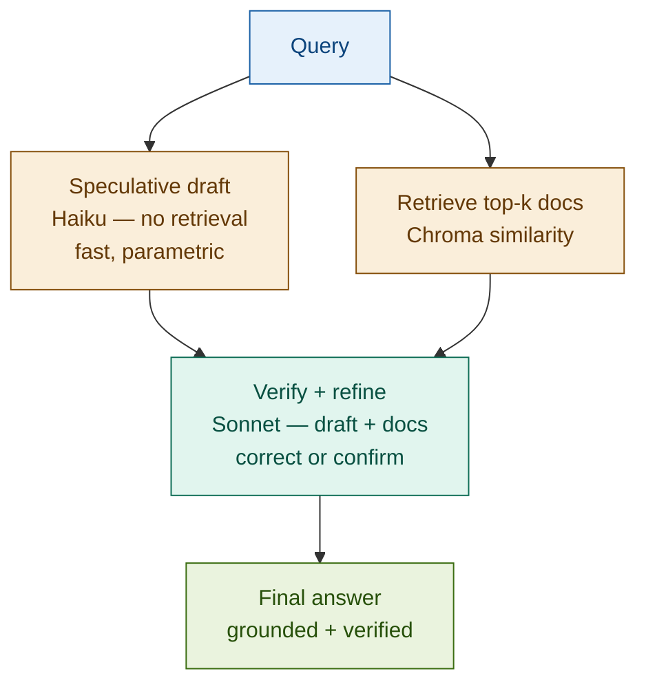

# 19: Speculative RAG — Answer Fast, Verify Later

---

## The Problem: Retrieval Is on the Critical Path

Standard RAG blocks generation until retrieval completes. For common, stable queries this is unnecessary — the model already knows the answer.

| Query | Model's prior knowledge | Retrieval role |
|-------|------------------------|----------------|
| *"What is the T+2 settlement rule?"* | Correct — stable standard | Confirmation only |
| *"What is the minimum CET1 ratio?"* | Correct — published threshold | Confirmation only |
| *"What are the new margin rules from last week?"* | Unknown — post-training | Essential |

Waiting for retrieval on the first two rows adds 400–800ms for no accuracy gain.

---

## The Solution: Speculate Immediately, Verify in Parallel

Generate an answer from parametric knowledge while retrieval runs. The verifier receives both and corrects any errors. The draft is never returned directly — only the verified answer is.

```
Query
  │
  ├── Speculative draft  (Haiku, no docs, ~300ms) ──┐
  │                                                   ├─→ Verify → Final answer
  └── Retrieve top-k docs (~400ms) ──────────────────┘
        (parallel)
```

**Common query**: draft is correct → verifier confirms → answer in ~400ms (retrieval time)
**Novel query**: draft is wrong → verifier corrects using docs → answer is still accurate

---

## Architecture



---

## Fintech: Trading Desk FAQ at Sub-Second Latency

A trading desk operations tool handles hundreds of settlement and margin queries per hour. Latency directly impacts workflow throughput.

| Scenario | Standard RAG | Speculative RAG |
|----------|-------------|----------------|
| T+2 settlement (stable rule) | 1,100ms | 420ms — draft confirmed |
| CDS margin schedule (stable) | 980ms | 380ms — draft confirmed |
| New clearing rule (post-training) | 1,050ms | 950ms — draft corrected |

For the 80% of queries on stable rules, Speculative RAG cuts latency in half. Novel queries fall back to near-standard RAG performance.

---

## Tradeoffs

| Dimension | Rating | Notes |
|-----------|--------|-------|
| Latency | ★★★★★ | Draft + retrieval in parallel removes retrieval from critical path |
| Quality | ★★★☆☆ | Depends on verifier capability; weak verifiers pass draft errors through |
| Risk | ★★☆☆☆ | Confident hallucination can fool the verifier — test on known-wrong drafts |
| Complexity | ★★★☆☆ | Two model calls + parallel coordination + correction-rate monitoring |

**Key insight: reduces latency for common queries while maintaining accuracy — the draft is a speed optimisation, not a source of truth.**

→ **Module 21: Modular RAG** — Speculative RAG optimises latency within a fixed pipeline. Modular RAG decomposes the pipeline itself into interchangeable components.
