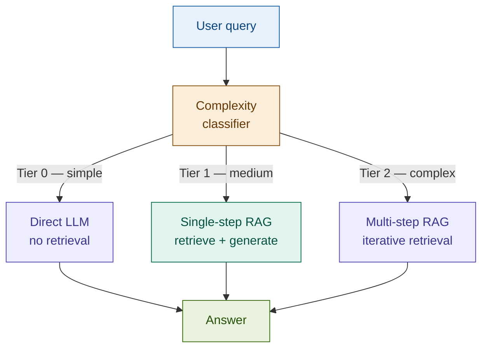

# Adaptive RAG

> **The synthesis insight**: every RAG pattern we've built so far is optimised for a specific query type. Adaptive RAG asks a different question — instead of picking one strategy for all queries, what if the system classified each query first and routed it to the strategy it actually needs? The right tool for the right query, every time.

## What it is

Production RAG systems receive heterogeneous queries. A financial assistant fields questions ranging from "What does LIBOR stand for?" (answerable directly, no retrieval needed) to "What are our CET1 capital requirements?" (single-step retrieval over internal policy) to "How does our current HQLA composition compare to the LCR minimum given the new countercyclical buffer announcement?" (multi-step: retrieve internal policy, retrieve Basel III, retrieve latest regulatory update, synthesise).

A single retrieval strategy applied uniformly to all three cases wastes resources on the simple query, under-serves the complex one, and adds unnecessary latency throughout.

Adaptive RAG inserts a complexity classifier before the retrieval step. The classifier routes each query to one of three tiers:

| Tier | Complexity | Strategy | When |
|------|-----------|----------|------|
| **0** | Simple | No retrieval — direct LLM answer | Definitional questions, acronyms, general concepts the LLM knows reliably |
| **1** | Medium | Single-step RAG — standard retrieve + generate | Specific facts, policy clauses, regulatory thresholds in the internal corpus |
| **2** | Complex | Multi-step RAG — iterative retrieval + synthesis | Cross-document reasoning, comparisons, queries requiring multiple sources |

The classifier is a lightweight LLM call (or a fine-tuned small model). The routing is deterministic on its output. The downstream strategies are the same patterns already in the system — the classifier decides which one fires.

This is the synthesis pattern for the workshop: it doesn't introduce new retrieval mechanics. It orchestrates the ones we've already built.

## Source

Jeong et al., "Adaptive-RAG: Learning to Adapt Retrieval-Augmented Large Language Models through Question Complexity", NAACL 2024.
URL: https://arxiv.org/abs/2403.14403

## When to use it

- **Diverse query types entering a single pipeline**: a unified financial assistant that handles customer service questions, compliance lookups, and market research queries cannot be optimised for any one type without degrading the others. Adaptive RAG lets each type get the strategy it needs.
- **Multi-domain knowledge bases**: when the corpus spans internal policies, regulatory documents, and time-sensitive market data, no single retrieval configuration is best for all domains. The classifier routes to the appropriate strategy per domain.
- **Cost and latency are jointly constrained**: over-serving simple queries with multi-step RAG wastes tokens and adds latency. Adaptive RAG ensures tier-0 queries never touch the vector store and tier-1 queries don't trigger expensive iterative retrieval.
- **The system already runs multiple RAG strategies**: if Hybrid RAG, Corrective RAG, and simple RAG are all already deployed, Adaptive RAG is the natural orchestration layer — it replaces manual routing with a learned classifier.

## When NOT to use it

- **Uniform query distribution**: if all incoming queries are the same type (e.g., a dedicated compliance clause lookup tool), a single well-tuned strategy outperforms the overhead of classification.
- **A single strategy already performs well**: Adaptive RAG adds a classifier call to every query. If the baseline single-strategy system meets quality and latency requirements, the marginal gain doesn't justify the added complexity.
- **Classifier accuracy cannot be validated**: the routing decision is only as good as the classifier. If you cannot hold out a representative query sample to measure routing accuracy, you cannot safely deploy Adaptive RAG — misclassification silently degrades quality.

## Architecture

**What each tier maps to in this workshop's patterns:**

| Tier | Strategy | Workshop pattern |
|------|----------|-----------------|
| 0 | Direct LLM | No RAG — model's training knowledge |
| 1 | Single-step | Naive RAG (01), Hybrid RAG (03), Contextual RAG (13) |
| 2 | Multi-step | Corrective RAG (17) + iterative retrieval; or Agentic RAG (22) |

The classifier doesn't know about specific patterns — it outputs a tier. The router maps tiers to strategies.

## Key components

| Component | Purpose | Default implementation |
|-----------|---------|----------------------|
| Complexity classifier | Assigns each query a tier (0 / 1 / 2) based on the reasoning required | Prompted LLM call — `claude-haiku-4-5-20251001`; or a fine-tuned small classifier for high-volume production |
| Strategy router | Maps tier to the appropriate pipeline and executes it | Python control flow; `langgraph` for more complex branching |
| Tier-0 path | Direct LLM generation, no retrieval | `claude-sonnet-4-6` with no context injection |
| Tier-1 path | Single-step retrieval + generation | `Chroma` vector store + `claude-sonnet-4-6` |
| Tier-2 path | Multi-step retrieval — iterative retrieval with intermediate reasoning | Multiple `similarity_search` calls; intermediate answers used to refine subsequent queries |
| Routing logger | Records the tier assigned and time per tier for calibration and monitoring | Python dict or structured log entry |

## Step-by-step

1. **Receive query** — accept the user's natural language question.
2. **Classify complexity** — call the classifier with the query. It returns tier 0, 1, or 2 and a rationale.
3. **Route to strategy**:
   - Tier 0 → call the LLM directly with the original query, no context injection
   - Tier 1 → retrieve top-k chunks from the vector store, generate with context
   - Tier 2 → retrieve an initial set of documents; use the LLM to generate a sub-question or intermediate answer; retrieve again based on the intermediate result; synthesise a final answer from all retrieved content
4. **Generate** — produce the answer within the routed strategy's constraints.
5. **Log** — record the tier, routing rationale, and latency. Use the log to monitor classifier drift and update the classifier prompt or training data when the tier distribution shifts.

## Fintech use cases

- **Unified financial assistant**: a single interface for retail banking customers routes balance and transaction questions (tier 0 — no retrieval), account policy questions (tier 1 — internal docs), and complex questions like "How will the new LCR rules affect my business credit line?" (tier 2 — policy + regulatory + market data). Each query gets the right depth of retrieval without the user knowing the routing exists.
- **Customer service triage**: inbound queries are pre-classified. Tier-0 queries (FAQ-level) are resolved instantly at near-zero cost. Tier-1 queries go to the standard policy lookup pipeline. Tier-2 queries are flagged for escalation or routed to the multi-step research pipeline.
- **Regulatory query routing**: a compliance team's research tool distinguishes between "What is Regulation W?" (tier 0 — standard regulatory concept), "What are our Regulation W limits on affiliate transactions?" (tier 1 — internal policy), and "How do our Regulation W exposures compare to peer banks based on the latest regulatory filings?" (tier 2 — multi-source cross-document analysis).

## Tradeoffs

| Dimension | Rating | Notes |
|-----------|--------|-------|
| Retrieval quality | ★★★★★ | Each query gets the strategy best suited to its complexity — no over-serving or under-serving |
| Answer quality | ★★★★★ | Tier-2 multi-step retrieval handles complex reasoning that single-step RAG gets wrong |
| Latency | ★★★☆☆ | Classifier adds one call to every query; tier-0 is faster than any retrieval strategy; tier-2 is slower |
| Cost | ★★★★☆ | Tier-0 queries are cheap; tier-2 are expensive — the average cost depends on the tier distribution |
| Complexity | ★★★★☆ | Multiple pipelines to maintain; classifier requires calibration; routing logic must be tested |
| Fintech relevance | ★★★★★ | Fintech assistants have the most diverse query populations of any domain — the fit is natural |

## Common pitfalls

- **Classifier accuracy is not measured**: if you deploy without a held-out evaluation set, you don't know your misclassification rate. A 20% error rate means 1 in 5 queries gets the wrong strategy — silently. Always evaluate on at least 50 representative queries per tier before deploying.
- **Boundary queries between tiers**: queries at the tier-1/tier-2 boundary are the hardest to classify correctly. "What is the maximum DTI ratio for a jumbo loan and how does it compare to conventional loan limits?" sounds like tier 1 but requires two retrievals. When in doubt, route up: a tier-2 answer to a tier-1 query is slightly expensive but correct; a tier-1 answer to a tier-2 query may be incomplete.
- **Maintaining multiple downstream strategies**: each tier's pipeline is a separate system — it has its own prompt, retrieval config, and failure modes. As the system evolves, all three tiers must be updated consistently. Use a shared generation prompt template and per-tier retrieval config to minimise divergence.
- **Classifier drift over time**: query distributions shift. A classifier calibrated on last quarter's queries may misclassify this quarter's. Log tier assignments in production and review the distribution monthly.

## Related patterns

- **21 Modular RAG**: Modular RAG decomposes the pipeline into interchangeable components (retriever, reranker, reader) and recombines them. Adaptive RAG selects between complete pipeline configurations. They are complementary: Adaptive RAG is the router; Modular RAG is the toolkit it routes between.
- **22 Agentic RAG**: Agentic RAG is the natural extension of Adaptive RAG's tier-2 path — instead of a fixed multi-step retrieval loop, the agent plans dynamically, uses tools, and decides when it has enough information. Adaptive RAG's tier-2 is a simplified, bounded version of Agentic RAG. When tier-2 queries grow in complexity and variety, the natural upgrade is to replace the tier-2 path with an agentic loop.
- **17 Corrective RAG**: CRAG can be slotted into Adaptive RAG's tier-1 or tier-2 paths as the retrieval strategy. The Adaptive RAG classifier decides whether to retrieve; CRAG decides whether the retrieval was good enough and corrects it if not. They compose cleanly: classification before retrieval, correction after.
