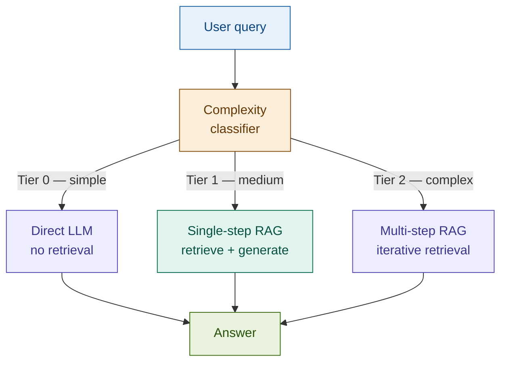

# 20: Adaptive RAG — The Right Tool for the Query

---

## The Problem: One Strategy Cannot Serve All Queries

Every RAG pattern we've built is optimised for a specific query type. A fintech knowledge base receives all of them simultaneously:

| Query | What it needs |
|-------|--------------|
| "What does LCR stand for?" | Nothing — the LLM already knows this |
| "What is our minimum liquidity buffer under internal policy?" | Single-step retrieval — internal corpus |
| "How does our HQLA composition compare to the Basel III minimum given the countercyclical buffer announcement?" | Multi-step — policy + regulation + cross-document synthesis |

Routing all three through the same pipeline wastes resources on the first, under-serves the third, and adds unnecessary latency throughout.

---

## The Solution: Classify First, Then Route

Adaptive RAG inserts a complexity classifier before retrieval. The classifier assigns each query a tier. The router executes the appropriate strategy.

```
Query → Classifier (Haiku) → Tier 0 / 1 / 2 → Strategy → Answer
```

| Tier | Complexity | Strategy | Cost |
|------|-----------|----------|------|
| 0 | Simple | Direct LLM — no retrieval | Cheapest |
| 1 | Medium | Single-step RAG | Moderate |
| 2 | Complex | Multi-step iterative retrieval | Most expensive |

The classifier doesn't introduce new retrieval mechanics — it decides which pattern fires. This is the synthesis pattern: every module we've built becomes a possible routing target.

---

## Architecture



---

## Fintech: One System, Three Query Types

A compliance assistant receives queries spanning definitional, policy-specific, and cross-document complexity — all through the same interface.

| Query | Tier | Routing decision |
|-------|------|-----------------|
| "What does Basel III stand for?" | 0 | Direct LLM — no retrieval needed |
| "What is our internal LCR minimum buffer threshold?" | 1 | Single-step — internal policy corpus |
| "How does our HQLA composition compare to the Basel III minimum given the new countercyclical buffer?" | 2 | Multi-step — policy + regulation + synthesis |

The user sees one assistant. The classifier decides which pipeline answers each question.

---

## Tradeoffs

| Dimension | Rating | Notes |
|-----------|--------|-------|
| Retrieval quality | ★★★★★ | Each query gets the strategy it needs — no over- or under-serving |
| Answer quality | ★★★★★ | Tier-2 multi-step handles complex reasoning single-step gets wrong |
| Latency | ★★★☆☆ | Classifier adds one call to every query; tier-0 is faster than any retrieval |
| Cost | ★★★★☆ | Tier-0 is cheap; average cost tracks tier distribution |
| Complexity | ★★★★☆ | Three pipelines to maintain; classifier needs calibration |

**When to skip**: uniform query type (all compliance lookups, all definitional), or a single strategy already meets targets.

→ **Module 22: Agentic RAG** — Adaptive routes to strategies. Agentic builds strategies on the fly.
