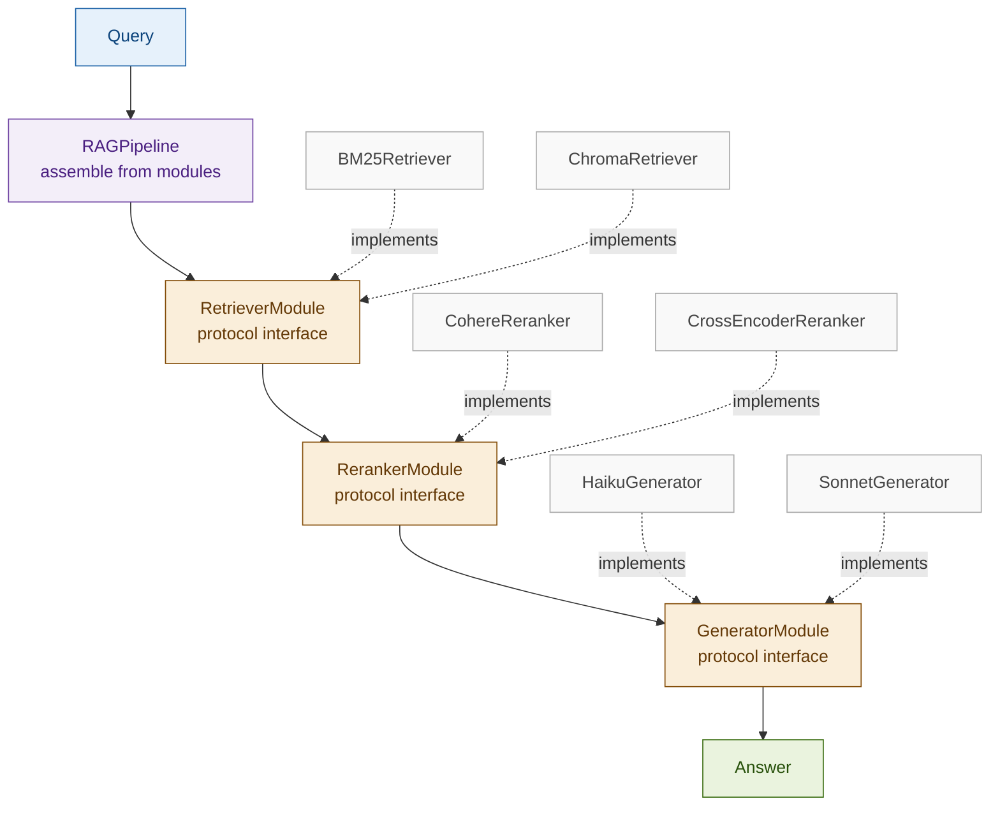

# Modular RAG

## What it is

Modular RAG decomposes a RAG pipeline into independent, swappable components — retriever, reranker, and generator — each defined by a strict interface that any concrete implementation must satisfy. Rather than a monolithic chain of function calls, the pipeline is assembled by injecting dependencies: swap the retriever from dense to BM25, swap the reranker from Cohere to a cross-encoder, or swap the generator from Haiku to Sonnet, without touching any other component. The core insight is that a RAG system is not a single algorithm but a composition of separable concerns, each of which can be developed, tested, deployed, and replaced independently.

This is the architectural pattern that underlies all production RAG deployments at scale. Every other pattern in this workshop — Hybrid RAG, Contextual RAG, Self-RAG, Corrective RAG — can be expressed as a concrete module implementation that plugs into a Modular RAG framework.

## Source

Gao et al., "Modular RAG: Transforming RAG Systems into LEGO-like Reconfigurable Frameworks." 2024.
URL: https://arxiv.org/abs/2407.21059

## When to use it

- **Production systems requiring independent upgrades**: when you need to deploy a new retriever without touching the generator, or vice versa — module boundaries enforce this.
- **A/B testing pipeline components**: swap a dense retriever for a hybrid retriever on 10% of traffic to measure retrieval quality impact without a full pipeline rewrite.
- **Multi-team ownership**: retrieval team owns the `RetrieverModule`, generation team owns the `GeneratorModule` — interface compliance is the contract between teams.
- **Compliance-enforced substitutability**: regulated environments where a component vendor changes require full pipeline re-certification; module isolation limits the blast radius.
- **Benchmarking configurations**: systematically compare all combinations of `{BM25, Dense} × {Cohere reranker, cross-encoder} × {Haiku, Sonnet}` with the same pipeline harness.
- **Long-lived codebases**: when the system will outlive its initial component choices. Models improve, embedding APIs deprecate, vector stores migrate — modular interfaces absorb these changes.

## When NOT to use it

- **Prototypes and single-use scripts**: the interface overhead adds 2–3× the code for no benefit if the pipeline will never change.
- **Single-query research notebooks**: when you need an answer, not a framework. Build the pattern first, modularise when it goes to production.
- **When the abstraction leaks badly**: if every concrete module needs to pass metadata that the interface doesn't model, the interface is wrong — fix the design or use a simpler approach.

## Architecture

Dashed arrows show that concrete implementations satisfy the protocol. The pipeline holds only protocol references — it has no knowledge of which concrete class is injected.

## Key components

| Component | Purpose | Default implementation |
|-----------|---------|----------------------|
| `RetrieverModule` | Protocol defining `retrieve(query, k) → list[RetrievedChunk]` | `ChromaRetriever` — dense similarity search |
| `RerankerModule` | Protocol defining `rerank(query, chunks, top_n) → list[RetrievedChunk]` | `LLMReranker` — Haiku scores each chunk 1–5 |
| `GeneratorModule` | Protocol defining `generate(query, chunks) → str` | `AnthropicGenerator` — Sonnet with citation grounding |
| `RAGPipeline` | Assembles modules via constructor injection; runs `retrieve → rerank → generate` | Dataclass holding one instance of each protocol |
| `RetrievedChunk` | Shared data contract between modules: `text`, `score`, `metadata` | `TypedDict` — no external dependency |
| `PipelineResult` | Output contract: `answer`, `chunks_retrieved`, `chunks_reranked`, `latency_ms` per stage | `dataclass` |

## Step-by-step

1. **Define shared types** — `RetrievedChunk` and `PipelineResult` as typed dicts or dataclasses. Every module input and output uses these types; no module should invent its own.
2. **Define protocols** — `RetrieverModule`, `RerankerModule`, `GeneratorModule` as `typing.Protocol` classes with single abstract methods. Any class satisfying the method signature automatically implements the protocol — no inheritance required.
3. **Implement concrete modules** — each module is a class that satisfies one protocol. Inject its dependencies (LLM client, vectorstore, model name) via `__init__`. The pipeline never sees these internals.
4. **Assemble the pipeline** — `RAGPipeline(retriever=..., reranker=..., generator=...)`. The pipeline's `run(query)` method calls `retrieve → rerank → generate` in sequence, recording latency per stage.
5. **Run a query** — call `pipeline.run(query)` and receive a `PipelineResult`. The caller does not know which concrete modules were used.
6. **Swap a module** — construct a new pipeline with one component replaced. All other components are reused unchanged. Run the same query and compare `PipelineResult` values.
7. **Benchmark configurations** — build all desired `(retriever, reranker, generator)` combinations, run the same query set through each, and compare quality and latency metrics across configurations.

## Fintech use cases

- **A/B testing retrievers in a compliance chatbot**: a Basel III Q&A service runs `ChromaRetriever` on 90% of traffic and `BM25Retriever` on 10%. Module isolation means the reranker and generator are identical across both arms — any quality difference is attributable to retrieval alone.
- **Multi-team ownership of a trading desk FAQ**: the data engineering team deploys and versions the `RetrieverModule`; the ML team deploys and evaluates the `RerankerModule`; the product team controls the `GeneratorModule` prompt style. Teams ship independently without coordination overhead.
- **Compliance-enforced model substitution**: a regulated entity must replace a third-party LLM vendor within 30 days. Because the generator is behind a `GeneratorModule` interface, swapping the implementation is a one-class change with no downstream effects.
- **Risk-tiered generation**: the same retriever and reranker serve all queries, but the generator module is selected by risk level — `HaikuGenerator` for informational lookups, `SonnetGenerator` for calculations that feed trade decisions, with the switch made at pipeline assembly time.

## Tradeoffs

| Dimension | Rating | Notes |
|-----------|--------|-------|
| Flexibility | ★★★★★ | Any component swappable with zero pipeline changes |
| Maintainability | ★★★★★ | Module boundaries enforce separation; each component testable in isolation |
| Initial complexity | ★★★★☆ | Protocol definitions + shared types add upfront code before first query runs |
| Latency | ★★★☆☆ | No inherent overhead — same operations, cleaner structure |
| Observability | ★★★★☆ | Per-stage latency and chunk counts fall naturally out of pipeline structure |

## Common pitfalls

- **Interface design is the hardest part**: if `RetrievedChunk` doesn't carry the metadata a downstream module needs (e.g. a source URL for citation), every module has to work around it. Design the shared types before writing any concrete implementation.
- **Over-abstracting small systems**: a three-function script with `retrieve`, `rerank`, `generate` is already modular enough. Add protocols only when the system has multiple concrete implementations or multiple teams.
- **Debugging across module boundaries**: a wrong answer requires tracing which module introduced the error. Always log inputs and outputs at each module boundary — `PipelineResult` per-stage data is the minimum.
- **Protocol drift**: as requirements grow, teams add parameters to their concrete modules that aren't in the protocol. If `ChromaRetriever.retrieve()` accepts `filter_metadata` but the protocol doesn't, the pipeline can't use it — the protocol must evolve with requirements.
- **Testing concrete modules in isolation but not together**: unit-testing each module with mocks passes; integration-testing the assembled pipeline catches boundary mismatches (e.g. `score` field type mismatch between retriever output and reranker input).

## Related patterns

- **20 Adaptive RAG**: Adaptive classifies queries and routes to different pipeline strategies. In a Modular RAG framework, each Adaptive route is a different pipeline configuration assembled from the same module library — the two patterns compose naturally.
- **22 Agentic RAG**: Agentic RAG wraps retrieval as a tool callable by an LLM agent. The tool implementation is itself a `RAGPipeline` — a modular pipeline provides the clean interface the tool registry needs.
- **03 Hybrid RAG**: A `HybridRetriever` that fuses BM25 and dense scores is one concrete implementation of `RetrieverModule`. Modular RAG is the framework; Hybrid RAG is a module that plugs into it.
- **17 Corrective RAG**: A `CorrectiveRetriever` that detects irrelevant chunks and falls back to web search is another `RetrieverModule` implementation — CRAG's logic is fully encapsulated behind the retriever interface.
