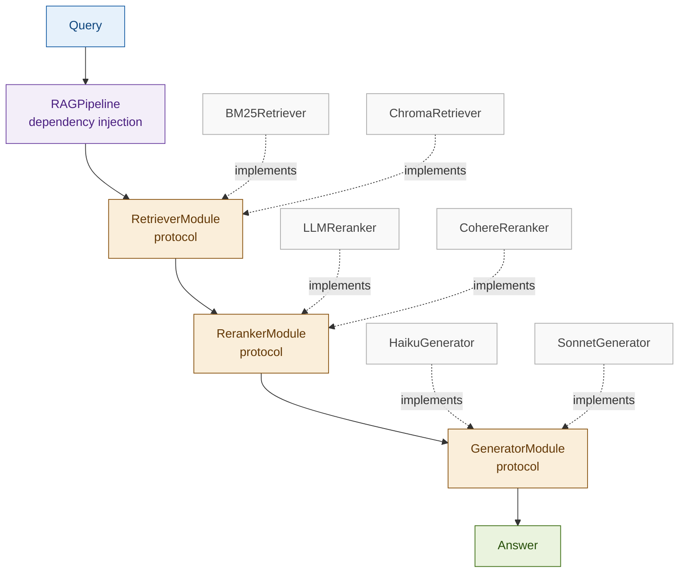

# 21: Modular RAG — Composable Architecture

---

## The Problem: Monolithic Pipelines Can't Evolve

A single function chain is fast to build but expensive to change. Improving retrieval requires rewriting generation logic. A/B testing one component means forking the whole pipeline.

| Need | Monolithic pipeline | Modular pipeline |
|------|--------------------|--------------------|
| Swap retriever (BM25 → dense) | Edit shared code paths | Replace one class |
| A/B test reranker | Fork entire pipeline | Inject different implementation |
| Multi-team ownership | Coordination required | Interface is the contract |
| Upgrade model vendor | Touches everything | One module changes |

---

## The Solution: Protocol Interfaces + Dependency Injection

Define each stage as a protocol. Inject concrete implementations. The pipeline holds references to interfaces — it never knows which class is running.

```
Query
  │
  ▼
┌─────────────────────────────────────────────────────┐
│ RAGPipeline                                         │
│                                                     │
│  [RetrieverModule] → [RerankerModule] → [Generator] │
│   BM25Retriever        LLMReranker      Sonnet      │
│   ChromaRetriever      CohereReranker   Haiku       │
│        ↕                    ↕              ↕        │
│     (swappable)         (swappable)   (swappable)   │
└─────────────────────────────────────────────────────┘
  │
  ▼
Answer + per-stage latency
```

---

## Architecture



---

## Fintech: Basel III Compliance Pipeline — Component Swap

A compliance team runs the same query set through four pipeline configurations to identify the best production stack before deployment.

| Configuration | Retriever | Reranker | Generator | Quality | Latency |
|---------------|-----------|----------|-----------|---------|---------|
| A (baseline) | Chroma | LLM reranker | Haiku | 3.2/5 | 820ms |
| B | BM25 | LLM reranker | Haiku | 3.5/5 | 680ms |
| C | Chroma | LLM reranker | Sonnet | 4.1/5 | 1,050ms |
| D (selected) | BM25 | LLM reranker | Sonnet | 4.3/5 | 890ms |

Same pipeline harness, same queries, four component combinations — configuration D selected for production.

---

## Tradeoffs

| Dimension | Rating | Notes |
|-----------|--------|-------|
| Flexibility | ★★★★★ | Any component swappable with zero pipeline changes |
| Maintainability | ★★★★★ | Module boundaries enforce separation; each component unit-testable |
| Initial complexity | ★★★★☆ | Protocol definitions + shared types add upfront code |
| Latency | ★★★☆☆ | No inherent overhead — same operations, cleaner structure |

**Key insight: production systems need the flexibility to iterate on components without rewriting the pipeline. Modular RAG is what that looks like in code.**

→ **Module 22: Agentic RAG** — Modular RAG fixes the pipeline structure and makes components swappable. Agentic RAG removes the fixed structure entirely: the agent decides which tools to call, in what order, based on what the query needs.
