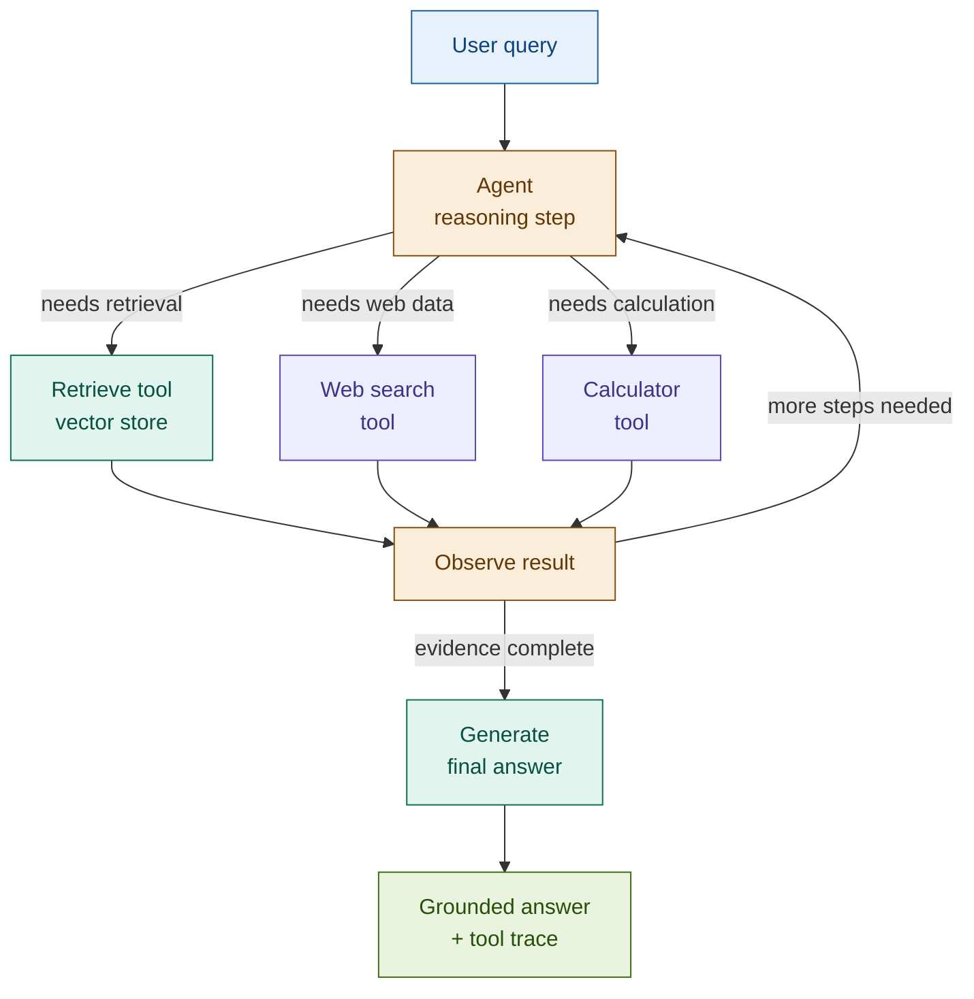

# Agentic RAG

> **The capstone insight**: every RAG pattern we've built retrieves first, then generates. Agentic RAG inverts the dependency — the LLM reasons first, decides what to retrieve, retrieves it, reasons again, decides whether more retrieval is needed, and only generates when it judges the evidence complete. Retrieval is no longer a fixed preprocessing step. It is a tool the agent calls as many times as the query requires.

## What it is

Agentic RAG implements a reasoning loop — the ReAct (Reasoning + Acting) pattern — in which an LLM agent plans its own retrieval strategy at runtime. The agent is given a set of tools (a vector retriever, a web search, a calculator, a structured data query) and decides which tools to call, in what order, and when to stop.

Each iteration of the loop follows the same structure: the agent reasons about what it knows and what it still needs, selects a tool, observes the result, and updates its reasoning. This continues until the agent determines it has enough information to generate a final answer — or until a maximum-step stopping condition fires.

The key innovation (from rag_patterns.json): retrieval is no longer a fixed preprocessing step applied uniformly to every query. It is a tool call inside a reasoning loop. The agent decides whether to retrieve at all, from which source, and how many times.

This is the capstone pattern: it generalises Adaptive RAG's routing and Multi-hop RAG's iterative retrieval into a single, unbounded, plan-execute-observe loop. Where Adaptive RAG routes between fixed strategies and Multi-hop follows a predetermined two-pass structure, Agentic RAG plans dynamically — each step is informed by the result of the last.

## Source

LangGraph Agentic RAG tutorial, Anthropic + LangChain, 2024.
URL: https://langchain-ai.github.io/langgraph/tutorials/rag/langgraph_agentic_rag/

ReAct: Yao et al., "ReAct: Synergizing Reasoning and Acting in Language Models", ICLR 2023.
URL: https://arxiv.org/abs/2210.03629

## When to use it

- **Complex multi-step queries requiring multiple sources**: "Analyse whether this client's portfolio is aligned with their stated ESG preferences and risk tolerance" requires retrieving the client profile, ESG ratings, portfolio holdings, and regulatory constraints — in an order that depends on what each step reveals. No fixed retrieval sequence handles this correctly.
- **Exploratory analysis where the retrieval path is unknown in advance**: compliance investigations, fraud analysis, and scenario modelling all have query paths that branch based on intermediate results. The agent determines the path at runtime; a pre-defined pipeline cannot.
- **Tool orchestration beyond retrieval**: when answering a question requires not just retrieval but also computation (position sizing, VaR calculation), structured queries (SQL against a risk database), or external lookups (market data, regulatory filings), the agent orchestrates all of these from a single loop.
- **Adaptive RAG tier-2 queries that grow in complexity**: when the multi-step path in Adaptive RAG is no longer predictable or bounded, Agentic RAG is the natural upgrade. The classifier still routes; the agent handles the complexity.

## When NOT to use it

- **Simple lookups and definitional queries**: a single retrieve-and-generate call answers these. Adding an agent loop multiplies cost and latency by 3–10× for no quality gain.
- **Latency-critical applications**: each reasoning step is a full LLM call. A query that triggers five tool calls takes 5× the latency of a single-step RAG. Real-time trading systems, instant payment approvals, and sub-second APIs cannot absorb this.
- **Cost-sensitive, high-volume pipelines**: at scale, the unbounded tool call count makes cost unpredictable. Agentic RAG without a strict step budget is not suitable for consumer-facing applications handling thousands of queries per minute.

## Architecture

**How this extends the patterns already built:**

| Previous pattern | Agentic RAG equivalent |
|-----------------|----------------------|
| Adaptive RAG tier-2 (fixed 2-pass) | Unbounded reasoning loop — N passes, determined at runtime |
| Multi-hop RAG (pre-defined sub-question) | LLM-generated sub-questions at each step, branching on observations |
| Corrective RAG (grade → fallback) | Agent decides whether retrieval was sufficient and re-retrieves if not |
| Hybrid RAG (fixed BM25 + dense) | Agent selects the appropriate retrieval tool per step |

## Key components

| Component | Purpose | Default implementation |
|-----------|---------|----------------------|
| Agent (reasoning loop) | Plans the next action based on accumulated observations; decides when to stop | `claude-sonnet-4-6` with ReAct-style system prompt; or LangGraph `StateGraph` with a `ToolNode` |
| Tool registry | Defines the tools the agent can call and their schemas | LangGraph `@tool` decorated functions; passed as `tools=` to the agent |
| Retrieve tool | Semantic search over the internal corpus | `Chroma.similarity_search` wrapped as a `@tool` |
| Web search tool | External information retrieval for queries beyond the corpus | Tavily API or mock fallback |
| Stopping condition | Prevents infinite loops by capping the number of reasoning steps | `max_steps` counter in the LangGraph state; or a `should_continue` conditional edge |
| Tool call trace | Logs every tool invoked, the input, and the observation — the audit trail | LangGraph message history; `AIMessage.tool_calls` |

## Step-by-step

1. **Receive query** — accept the user's natural language question.
2. **Initialise agent state** — set up the message history with the system prompt, tool schemas, and the user query.
3. **Reasoning step** — the agent LLM generates either a tool call (with arguments) or a final answer. If it generates a final answer, go to step 6.
4. **Execute tool** — call the selected tool with the generated arguments. Append the tool result to the message history as a `ToolMessage`.
5. **Observe and iterate** — the agent reads the tool result and generates the next reasoning step (back to step 3). The stopping condition fires if `step_count >= max_steps`.
6. **Generate final answer** — the agent produces its final response, grounded in the accumulated tool observations. The tool call trace is attached to the result.
7. **Log** — record the number of steps, tools called, and total latency. Flag queries that hit the step cap — they indicate the stopping condition saved a runaway loop.

## Fintech use cases

- **Multi-source portfolio analysis**: the workshop demo query — "Analyse whether this client's portfolio is aligned with their stated ESG preferences and risk tolerance" — requires the agent to retrieve the client risk profile, retrieve the portfolio holdings, retrieve ESG ratings for each holding, and synthesise a gap analysis. The retrieval order depends on what each step reveals; no static sequence handles this correctly.
- **Complex compliance checks**: a regulatory compliance agent given a query about counterparty exposure limits calls the internal policy retriever, then the regulatory database, then a position calculator — iterating until it has covered all applicable rules. The agent decides which rules apply based on intermediate results, not a pre-defined checklist.
- **Fraud investigation**: a fraud analysis agent retrieves transaction records, then calls a pattern-matching tool on suspicious sequences, then retrieves the client's historical profile for comparison, then searches for regulatory precedents. Each step is conditioned on the last finding.

## Tradeoffs

| Dimension | Rating | Notes |
|-----------|--------|-------|
| Retrieval quality | ★★★★★ | Agent retrieves exactly what is needed for each sub-problem — no over- or under-retrieval |
| Answer quality | ★★★★★ | Multi-step reasoning with evidence accumulation handles queries no static pipeline can answer |
| Flexibility | ★★★★★ | Any tool can be added to the registry; the agent routes to it without pipeline changes |
| Latency | ★☆☆☆☆ | Each reasoning step is a full LLM call; 5–10 steps is normal for complex queries |
| Cost | ★☆☆☆☆ | Unbounded tool calls make cost unpredictable without a hard step budget |
| Complexity | ★★★★☆ | LangGraph state management, tool schema design, and stopping condition tuning all require careful engineering |

## Common pitfalls

- **Infinite loops without a stopping condition**: an agent that retrieves, finds partial information, retrieves again, and finds more partial information can loop indefinitely. Always set `max_steps` (typically 8–12 for complex fintech queries) and handle the cap explicitly — return what was accumulated rather than failing silently.
- **Tool selection errors that compound**: if the agent calls the wrong tool at step 2, step 3's retrieval is conditioned on bad context. Errors propagate. Mitigate with clear tool descriptions, narrow tool scopes, and a tool call trace that makes misrouting visible.
- **Runaway cost on production queries**: without a token budget and step cap, a single complex query can make 10+ LLM calls. Log tool call counts per query. Set alerts at 8+ calls. A distribution with a long right tail (some queries at 15+ calls) is a signal to refine stopping conditions or tool descriptions.
- **Tool schema ambiguity**: if two tools have similar descriptions, the agent will guess between them. Each tool's description must make its scope unambiguous — especially when the corpus spans multiple domains (internal policy vs. regulatory DB vs. market data).

## Related patterns

- **20 Adaptive RAG**: Adaptive RAG routes to pre-defined strategy tiers; Agentic RAG is what tier-2 becomes when the multi-step path is no longer fixed. They compose naturally: the Adaptive classifier decides whether to invoke the agent; the agent handles execution. Agentic RAG is Adaptive RAG's tier-2 path, fully generalised.
- **23 Multi-Hop RAG**: Multi-Hop RAG executes a predetermined two-pass retrieval with a fixed sub-question structure. Agentic RAG generalises this: sub-questions are generated dynamically, passes are unbounded, and the agent decides when enough hops have been made. Multi-Hop is a bounded, predictable special case of Agentic RAG.
- **17 Corrective RAG**: CRAG's grade-and-fallback logic can be implemented as two tools in the agent's registry — a retrieval tool and a web search tool — with the agent deciding when to invoke the fallback based on reasoning rather than a fixed threshold. Agentic RAG subsumes CRAG when the routing decision is complex enough to require reasoning rather than a score comparison.
