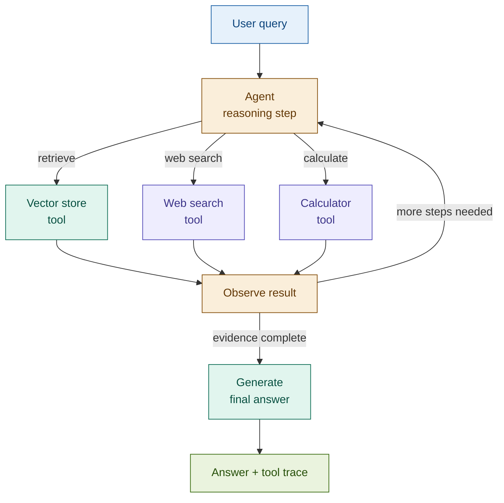

# 22: Agentic RAG — The Most Powerful Pattern

---

## The Problem: Pipelines Have a Ceiling

Every RAG pattern we've built has a fixed structure: retrieve, maybe grade, maybe rerank, generate. This works until the query doesn't fit the structure.

| Fixed-pipeline failure | What the query actually needs |
|-----------------------|-------------------------------|
| Single-step RAG on a multi-source question | Retrieve from three different corpora in sequence |
| Pre-defined 2-pass multi-hop | Five hops — the number isn't known in advance |
| Corrective RAG with web fallback | Web search *and* a regulatory database *and* a calculator |

When the retrieval path depends on what each step reveals, no pre-defined pipeline is right. You need a system that plans as it goes.

---

## The Solution: Give the LLM Tools and Let It Decide

Agentic RAG implements the ReAct loop: the agent reasons about what it knows, calls a tool, observes the result, reasons again, and repeats until it judges the evidence complete.

```
Query → [Reason → Choose tool → Execute → Observe] × N → Final answer
```

Retrieval is no longer preprocessing. It is a tool — one of several the agent can call, in any order, as many times as needed. The agent decides:

- **Which tool** — vector store, web search, calculator, structured query
- **When to stop** — when evidence is sufficient, or when `max_steps` fires
- **What to say** — a final answer grounded in all accumulated observations

This is the generalisation of every pattern in the workshop. Adaptive RAG routes between strategies. Agentic RAG builds the strategy dynamically.

---

## Architecture



---

## Fintech: Complex Compliance Research

**Query:** *"Analyse whether this client's portfolio is aligned with their stated ESG preferences and risk tolerance."*

No static pipeline handles this — the retrieval order depends on each intermediate finding.

| Step | Tool called | Observation |
|------|-------------|-------------|
| 1 | retrieve_client_profile | Risk tolerance: moderate; ESG mandate: exclude fossil fuels |
| 2 | retrieve_portfolio_holdings | Holdings include 3 energy sector positions |
| 3 | retrieve_esg_ratings | Two holdings rated below ESG threshold |
| 4 | calculate_exposure | Energy sector exposure: 18% — above 15% policy limit |
| 5 | *(agent stops)* | Evidence complete — generates gap analysis |

The agent determined the number of steps, the tool sequence, and the stopping point. The caller received a grounded gap analysis with a full tool trace.

---

## Tradeoffs

| Dimension | Rating | Notes |
|-----------|--------|-------|
| Retrieval quality | ★★★★★ | Agent retrieves exactly what each sub-problem needs |
| Answer quality | ★★★★★ | Multi-step reasoning handles queries no static pipeline can answer |
| Flexibility | ★★★★★ | Add any tool to the registry — no pipeline restructuring needed |
| Latency | ★☆☆☆☆ | Each step is a full LLM call; 5–10 steps is typical |
| Cost | ★☆☆☆☆ | Unbounded tool calls — always set `max_steps` |
| Complexity | ★★★★☆ | State management, tool schemas, and stopping conditions require engineering |

**When to use**: queries where the retrieval path is unknown in advance. **When to skip**: simple lookups, real-time systems, cost-sensitive high-volume pipelines.

→ **You now have 22 patterns in your toolkit. Let's discuss selection.**
