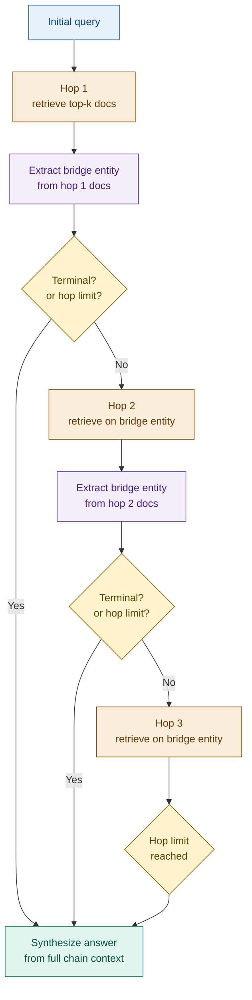

# Multi-Hop RAG

## What it is

Multi-Hop RAG answers questions that cannot be resolved from a single retrieved document because the answer requires connecting information spread across multiple documents via a chain of intermediate steps. Each retrieval step surfaces a *bridge entity* — a named concept, identifier, or entity found in the retrieved text that is not in the original query but is necessary to reach the next piece of the reasoning chain. That bridge entity seeds the next retrieval hop. The chain continues — retrieve, extract bridge, retrieve again — until a terminal condition is met: either the full answer can be synthesised from the accumulated context, or a hard hop limit is reached.

The distinguishing characteristic is that each hop is *conditional on the previous one*. The retrieval query for hop 2 is not known at query time — it is derived from what hop 1 retrieved. This sequential dependency is what separates Multi-Hop RAG from multi-query approaches (which issue all queries upfront) and from standard RAG (which retrieves once).

## Source

Khattab et al., "Demonstrate-Search-Predict: Composing Retrieval and Language Models for Knowledge-Intensive NLP." 2022.
URL: https://arxiv.org/abs/2212.14024

Foundational benchmark: Yang et al., "HotpotQA: A Dataset for Diverse, Explainable Multi-hop Question Answering." EMNLP 2018.
URL: https://arxiv.org/abs/1809.09600

## When to use it

- **Questions requiring information from multiple documents**: "What sanctions regulations apply to the parent company of TechCorp?" — the parent company is not in the question; it is found in hop 1 and used as the seed for hop 2.
- **Entity relationship chains span documents**: corporate hierarchies, supply chains, regulatory cross-references — structures where the data is distributed across documents by design.
- **Investigative queries**: "What jurisdiction governs the counterparty who issued the derivative referenced in this ISDA schedule?" — answering this requires traversing a chain of document references.
- **KYC and UBO resolution**: the beneficial owner of an entity may be several layers of corporate structure away from the query entity — each layer is a hop.
- **Regulatory citation chains**: a rule references an amendment, the amendment references a superseded standard, the standard specifies the threshold — the answer is only at the end of the chain.

## When NOT to use it

- **Single-document answers**: if the answer to the query is contained in a single well-indexed document, one retrieval hop is sufficient — Multi-Hop RAG adds latency and complexity without benefit.
- **Latency-critical applications**: each hop adds a retrieval call plus an LLM call for bridge extraction. Three hops on a 500ms retrieval pipeline adds 1.5 seconds before generation. Use Speculative RAG or standard RAG for sub-second response requirements.
- **When bridge entity extraction is unreliable**: if the document corpus uses inconsistent naming, abbreviations, or aliases (e.g. "Goldman" vs "Goldman Sachs" vs "GS Group"), bridge entity extraction will produce bad seeds and the chain will derail. Fix entity normalisation first, or use Graph RAG instead.
- **Queries with fan-out, not chain structure**: "What are all the regulations that mention T+2?" is a breadth query, not a chain — multi-query RAG or ensemble retrieval is more appropriate.

## Architecture

Each hop produces a `HopResult` — the retrieved documents, the extracted bridge entity, and the reasoning for why this entity bridges to the next step. The synthesiser receives the complete chain of `HopResult` objects.

## Key components

| Component | Purpose | Default implementation |
|-----------|---------|----------------------|
| Entity extractor | Identifies bridge entities in retrieved documents — the named concepts that link one hop to the next | Haiku with a structured extraction prompt; returns `{entity, entity_type, reasoning}` |
| Hop controller | Manages the hop loop: issues retrieval, calls entity extractor, checks terminal condition, enforces hop limit | Python loop with `MAX_HOPS = 3`; terminates if extractor signals answer found or limit reached |
| Path tracker | Records the full reasoning chain — query, docs, bridge entity, reasoning — for each hop | `list[HopResult]` dataclass; passed to synthesiser and retained for observability |
| Answer synthesiser | Generates the final answer from the full accumulated chain context | Sonnet with the complete path context and an instruction to trace its reasoning across hops |
| Retriever | Fetches top-k documents for any query (initial or bridge entity) | Chroma dense retrieval; same interface as standard RAG |

## Step-by-step

1. **Receive initial query** — the multi-hop query as posed by the user. Extract any seed entities mentioned explicitly (e.g. "TechCorp Ltd") — these anchor hop 1.
2. **Hop 1 — retrieve on the initial query** — standard dense retrieval against the document corpus. Collect top-k documents.
3. **Extract bridge entity from hop 1 docs** — call the entity extractor with the original query and the retrieved documents. The extractor identifies the key entity in the documents that the query is ultimately asking about but that is not yet resolved. It also signals whether the answer is already available (terminal) or a further hop is needed.
4. **Check terminal condition** — if the extractor signals the answer is found, or if `hop_count >= MAX_HOPS`, proceed directly to synthesis. Otherwise continue.
5. **Hop N — retrieve on the bridge entity** — form a new retrieval query from the bridge entity extracted in the previous hop. Retrieve top-k new documents. Append to the path.
6. **Repeat steps 3–5** — extract bridge entity from hop N docs, check terminal condition, issue hop N+1 if needed. Each iteration appends a `HopResult` to the path tracker.
7. **Synthesise answer from the full chain** — pass the complete sequence of `HopResult` objects to the synthesiser. The synthesiser generates the final answer and is instructed to cite which hop provided each piece of information.

## Fintech use cases

- **KYC / UBO resolution**: "What sanctions rules apply to the beneficial owner of Alpha Holdings?" — Hop 1 retrieves Alpha Holdings docs and extracts the parent entity (Beta Capital). Hop 2 retrieves Beta Capital docs and extracts the UBO (a named individual). Hop 3 retrieves the sanctions screening database for that individual. The synthesiser assembles the full ownership-to-sanctions chain.
- **Counterparty exposure chains**: a credit risk system needs to determine which regulatory capital rules govern a trading counterparty. Hop 1 identifies the counterparty's legal entity from the trade confirmation. Hop 2 retrieves the parent group's jurisdiction of incorporation. Hop 3 retrieves the capital requirements applicable to that jurisdiction. The answer cannot be derived without traversing all three hops.
- **Regulatory cross-reference resolution**: a compliance analyst asks which capital ratio applies after a specific Basel IV phase-in amendment. Hop 1 retrieves the amendment text and extracts the standard it modifies. Hop 2 retrieves the original standard and extracts the ratio threshold being amended. Hop 3 retrieves the implementation timeline. The synthesiser produces a complete answer with version-traced citations.
- **Supply chain finance due diligence**: "What credit rating applies to the buyer behind this receivable?" — Hop 1 retrieves the receivable and extracts the buyer entity. Hop 2 retrieves the buyer's credit file and extracts the current rating agency opinion.

## Tradeoffs

| Dimension | Rating | Notes |
|-----------|--------|-------|
| Answer quality | ★★★★☆ | Connects multi-document reasoning chains that standard RAG cannot resolve; quality depends on bridge extraction accuracy |
| Latency | ★★☆☆☆ | Sequential hops: each adds one retrieval call + one LLM call; three hops on a 500ms pipeline adds ~1.5s before generation |
| Complexity | ★★★★☆ | Hop loop + terminal detection + path tracking + hop limit enforcement; significantly more state than standard RAG |
| Robustness | ★★★☆☆ | One failed bridge extraction derails the whole chain; fallback to standard RAG on extraction failure improves reliability |

## Common pitfalls

- **Infinite loop without a hard hop limit**: if the entity extractor never signals terminal and the corpus contains circular references (entity A → entity B → entity A), the loop will not terminate. Always enforce `MAX_HOPS` as an unconditional ceiling, not just a soft suggestion.
- **Bridge entity extraction accuracy is load-bearing**: a wrong bridge entity sends subsequent hops in the wrong direction, and the synthesiser receives a chain of irrelevant documents with no signal that the path diverged. Test the extractor in isolation on known entity chains before integrating into the loop.
- **Entity naming inconsistency**: if the same entity appears as "Goldman Sachs", "Goldman", "GS", and "The Goldman Sachs Group, Inc." across documents, bridge-entity-based retrieval will miss most occurrences. Normalise entity names before indexing, or use Graph RAG where entity resolution is part of the index structure.
- **Context window overflow on long chains**: each hop appends documents to the synthesiser's context. Three hops of five documents each can exceed context limits for long documents. Truncate or summarise each hop's documents before appending to the chain, rather than passing full text.
- **Treating every multi-document question as multi-hop**: a question like "Compare the leverage ratios of Bank A and Bank B" requires two retrievals but not a chain — the hops are independent, not sequential. Use parallel retrieval (multi-query) for fan-out questions; reserve multi-hop for genuine chain dependencies.

## Related patterns

- **24 Graph RAG**: Graph RAG explicitly models entity relationships in a knowledge graph — entity resolution and link traversal are handled by the graph structure rather than by LLM-based bridge extraction. For well-defined entity hierarchies (corporate ownership trees, regulatory citation graphs), Graph RAG is more reliable. Multi-Hop RAG is more flexible when the graph structure is implicit in unstructured text.
- **22 Agentic RAG**: an Agentic RAG agent can implement multi-hop reasoning as a sequence of tool calls, where each tool call is a retrieval. The agent has more flexibility — it can decide when to hop, when to stop, and which retrieval strategy to use at each step. Multi-Hop RAG is a more constrained, interpretable form of the same idea: fixed loop, explicit path tracking, hard hop limit.
- **05 Multi-Query RAG**: Multi-Query decomposes a question into parallel sub-queries issued simultaneously. Multi-Hop RAG issues queries sequentially, where each query depends on the previous result. Use Multi-Query for independent sub-questions; use Multi-Hop for chain-dependent sub-questions.
