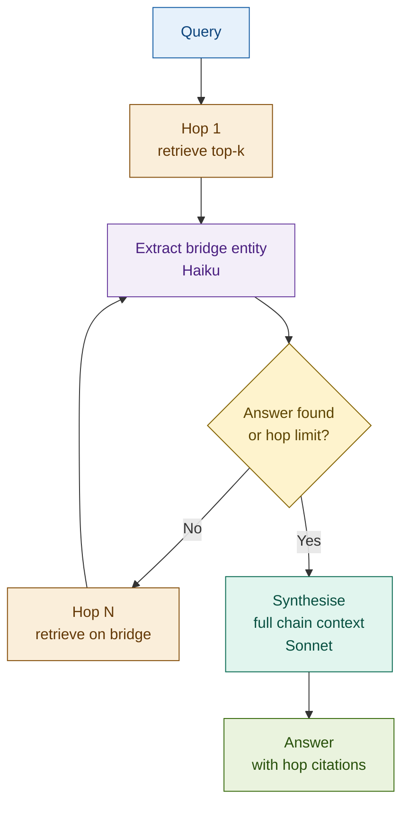

# 23: Multi-Hop RAG — Connect the Dots Across Documents

---

## The Problem: Some Questions Span Multiple Documents

Standard RAG retrieves once. For questions where the answer requires connecting information across documents, that single retrieval is insufficient — the bridge between documents is not in the query; it is in the first retrieved document.

| Query | Can standard RAG answer? | Why not |
|-------|--------------------------|---------|
| *"What capital rules apply to TechCorp's parent?"* | No | Parent entity not in query; must be retrieved first |
| *"Which sanctions list covers the UBO of Alpha Holdings?"* | No | UBO identity requires two ownership hops |
| *"What threshold does the Basel IV amendment set?"* | No | Amendment references original standard; threshold is there |

---

## The Solution: Retrieve → Extract Bridge → Retrieve Again

Each retrieved document contains a bridge entity — a named concept that is the seed for the next hop. Extract it, retrieve on it, repeat until the answer is reachable.

```
Query: "What sanctions apply to the UBO of Alpha Holdings?"
  │
  ├── Hop 1: retrieve "Alpha Holdings"
  │     → docs mention parent: Beta Capital Group
  │
  ├── Hop 2: retrieve "Beta Capital Group"
  │     → docs name UBO: individual person J. Smith
  │
  ├── Hop 3: retrieve "J. Smith" + sanctions database
  │     → docs confirm OFAC designation
  │
  └── Synthesise: Alpha Holdings → Beta Capital → J. Smith → OFAC listed
```

Hard hop limit (default: 3) prevents infinite loops. If no answer by limit, synthesise from accumulated context.

---

## Architecture



---

## Fintech: KYC — UBO Resolution Chain

A compliance system must determine whether sanctions regulations apply to the beneficial owner of a counterparty. The answer requires traversing three hops of corporate ownership structure.

| Hop | Query | Document surfaced | Bridge entity found |
|-----|-------|-------------------|---------------------|
| 1 | Alpha Holdings | Corporate registration | Parent: Beta Capital Group |
| 2 | Beta Capital Group | Group structure filing | UBO: J. Smith (78% equity) |
| 3 | J. Smith + sanctions | OFAC SDN list | Designation confirmed |
| — | Synthesise | Full chain | *"Alpha Holdings is ultimately owned by J. Smith, who is OFAC-designated"* |

Standard RAG on hop 1 alone returns the corporate registration — the sanctions connection is invisible without traversing the chain.

---

## Tradeoffs

| Dimension | Rating | Notes |
|-----------|--------|-------|
| Answer quality | ★★★★☆ | Resolves multi-document chains standard RAG cannot; depends on bridge extraction accuracy |
| Latency | ★★☆☆☆ | Sequential — each hop adds retrieval + LLM call; 3 hops ≈ 3× standard RAG latency |
| Complexity | ★★★★☆ | Hop loop + terminal detection + path tracking + hard hop limit required |
| Robustness | ★★★☆☆ | One bad bridge extraction derails the chain; fallback to standard RAG on failure |

**Key insight: some questions can't be answered from a single retrieval — the bridge between documents is not in the query, it's in what the first hop returns.**

→ **Module 24: Graph RAG** — Multi-Hop RAG follows linear paths through documents by extracting bridge entities at each step. Graph RAG maps the full network of entity relationships upfront, enabling traversal without extracting bridges at query time.
