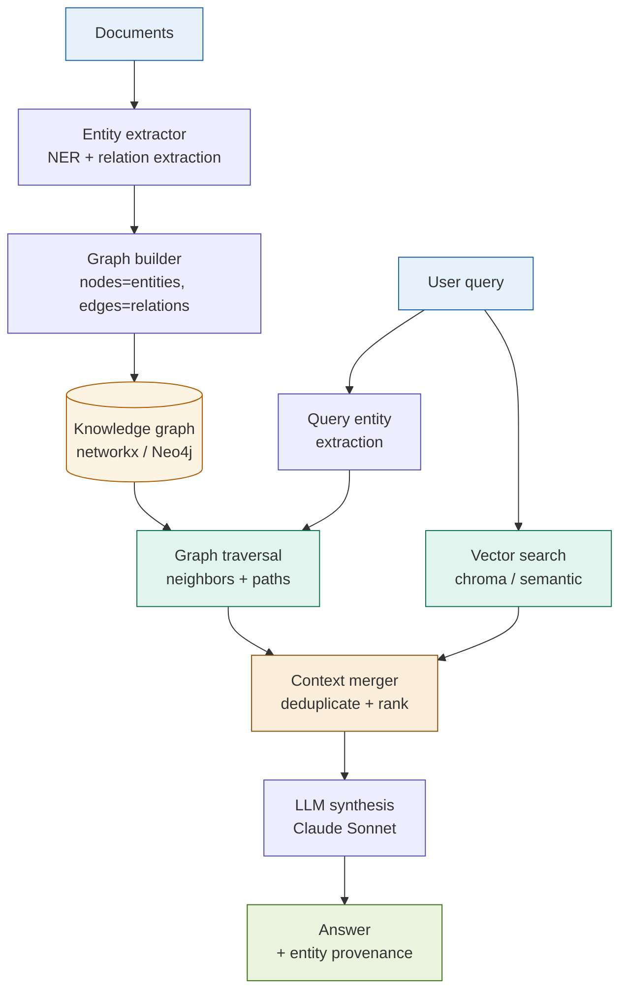

# Graph RAG

## What it is

Graph RAG extracts entities and relationships from a document corpus into a knowledge graph, then combines graph traversal with vector search to answer queries that require understanding connections between entities. Standard vector search retrieves chunks that are semantically similar to the query — it cannot reason about relationships between entities mentioned in different chunks. Graph RAG makes those relationships first-class citizens: entities become nodes, relationships become edges, and a query can simultaneously ask "which chunks are relevant?" and "which entities are related to this entity and what do those relationships mean?" The combined retrieval produces richer context than either approach alone.

The pattern was formalised by Edge et al. (Microsoft Research, 2024) for query-focused summarisation over large corpora. Their key finding was that global, thematic questions — "What are the main risks across all our documents?" — are impossible to answer from local chunk retrieval alone. A knowledge graph captures the global structure; vector search provides local precision.

## Source

**"From Local to Global: A Graph RAG Approach to Query-Focused Summarization"**
Darren Edge, Ha Trinh, Newman Cheng, Joshua Bradley, Alex Chao, Apurva Mody, Steven Truitt, Jonathan Larson. Microsoft Research, 2024.
arXiv:2404.16130. URL: https://arxiv.org/abs/2404.16130

## When to use it

- The query requires understanding relationships between entities: "Which counterparties are exposed to this entity?" or "What regulatory obligations apply to this instrument type?"
- Documents contain a dense network of named entities (organisations, regulations, instruments, people) whose relationships carry meaning beyond the text in any single chunk.
- Questions are global or thematic rather than local: "What are the main exposure themes across all counterparty agreements?"
- Different documents reference the same entities using different names or abbreviations — graph entity disambiguation consolidates them.
- **Fintech trigger**: counterparty risk analysis, KYC/UBO resolution, regulatory obligation mapping, financial instrument relationship networks.

## When NOT to use it

- Documents contain few named entities or entity relationships are not the point (narrative text, research summaries) — graph construction cost is not justified.
- The corpus is small enough that all documents fit in a long-context window — use Long-Context RAG instead.
- Query latency is a hard constraint — graph traversal adds a non-trivial overhead on top of vector search.
- The team cannot maintain a graph schema that evolves with the document domain — an unmaintained graph degrades retrieval quality faster than a stale vector index.

## Architecture

## Key components

| Component | Purpose | Default implementation |
|-----------|---------|----------------------|
| Entity extractor | Extract named entities (organisations, instruments, regulations, persons) and their relationships from each chunk | Claude Haiku with a structured extraction prompt; output: JSON list of `{entity, type, related_entity, relation_type}` |
| Graph builder | Accumulate extracted triples into a graph; merge duplicate entity mentions using normalised names | `networkx.DiGraph`; entity normalisation via lowercased canonical name; deduplication on `(source, relation, target)` triples |
| Graph traversal | Given query entities, walk the graph to find related nodes and the paths connecting them | BFS up to `MAX_HOPS=2`; returns nodes, edges, and path descriptions |
| Vector retriever | Standard dense retrieval for chunks that are semantically relevant to the query | ChromaDB + `text-embedding-3-small`; `k=5` chunks |
| Context merger | Combine graph-traversal context (entity relationships) with vector-search context (relevant passages) without redundancy | Deduplicate on chunk text; graph context prepended as a structured relationship summary |
| LLM synthesiser | Generate the final answer grounded in both graph relationships and retrieved passages | Claude Sonnet; system prompt requires citing both entity relationships and source passages |

## Step-by-step

1. **Index-time: extract entities and relations.** For each chunk in the corpus, prompt the entity extractor to return a JSON list of entity triples: `{subject, subject_type, predicate, object, object_type}`. Use Claude Haiku — this is a high-volume, low-latency extraction step.
2. **Index-time: build the graph.** Accumulate all triples into a `networkx.DiGraph`. Normalise entity names (lowercase, strip punctuation). Merge duplicate edges: if the same `(subject, predicate, object)` triple appears in multiple chunks, store all source chunk IDs on the edge for provenance.
3. **Query-time: extract query entities.** Parse the user query for named entities using the same extraction prompt. These are the graph entry points.
4. **Query-time: traverse the graph.** Starting from each query entity, perform BFS up to `MAX_HOPS=2`. Collect all reachable nodes, their edge labels (relation types), and the paths taken. Format as a relationship summary string.
5. **Query-time: run vector search in parallel.** Embed the query and retrieve the top-k most semantically similar chunks from ChromaDB.
6. **Merge contexts.** Combine the graph relationship summary and the retrieved chunks into a single context block. Deduplicate on chunk text. Place the graph summary first — it provides the structural scaffold that the LLM uses to interpret the retrieved passages.
7. **Synthesise the answer.** Pass the merged context to Claude Sonnet with a prompt that requires the answer to cite specific entity relationships from the graph and specific passages from the retrieved chunks.

Steps 2–3 correspond to notebook cells 3–4.

## Fintech use cases

- **Counterparty network risk assessment:** Given a query entity (e.g., "Lehman Brothers"), traverse the knowledge graph to find all directly and indirectly connected counterparties, their exposure types (CDS, repo, unsecured lending), and the jurisdiction of each relationship. The graph makes the contagion path visible; vector search retrieves the exposure amounts from the relevant contract sections.
- **Regulatory obligation mapping:** Build a graph from Basel III, FINRA, and internal policy documents where nodes are entities (instruments, institution types, activities) and edges are obligations (requires, prohibits, triggers, exempts). A query like "What obligations apply to a retail client holding a Tier-3 structured note?" traverses the obligation graph to find all applicable rules and retrieves the supporting text for each.
- **Financial statement relationship extraction:** Extract entity relationships from earnings reports, 10-K filings, and subsidiary disclosures. Graph edges encode consolidation relationships (subsidiary-of, guarantor-for, pledged-as-collateral). A query about group-level exposure traverses consolidation links that would be invisible to pure vector search.
- **Complex derivatives eligibility network:** Nodes are client types, instrument types, and regulatory frameworks; edges are eligibility conditions. The graph answers "Can this client class trade this instrument class under these regulations?" by traversing three node types simultaneously.

## Tradeoffs

| Dimension | Rating | Notes |
|-----------|--------|-------|
| Answer quality (relational queries) | ★★★★★ | Uniquely captures entity relationships; vector search alone cannot answer "who is connected to whom and how" |
| Answer quality (simple queries) | ★★★☆☆ | No improvement over standard RAG for single-entity lookups; graph traversal adds overhead for no gain |
| Graph construction cost | ★☆☆☆☆ | Entity extraction requires one LLM call per chunk; a 1,000-chunk corpus = 1,000 Haiku calls at index time |
| Retrieval quality | ★★★★★ | Combined graph + vector context is the most information-dense retrieval output of any pattern |
| Query latency | ★★☆☆☆ | Graph traversal is fast (in-memory networkx); combined with vector search, latency is dominated by LLM synthesis |
| Complexity | ★★★★★ | Entity extractor + graph builder + traversal + vector search + merger: five subsystems, all requiring domain-specific tuning |

## Common pitfalls

- **Garbage graph from poor entity extraction.** The graph is only as good as the extraction prompt. Generic NER (spaCy, off-the-shelf models) misses domain-specific entities (CUSIP identifiers, legal entity types, regulatory instrument classes). Use a domain-specific extraction prompt with examples from your corpus. Validate a sample of 20 extractions before building the full graph.
- **Entity disambiguation failures.** "Goldman" and "Goldman Sachs" and "Goldman Sachs Group Inc." are the same entity. Without normalisation, they become three disconnected nodes. Build a normalisation layer: lowercase, remove legal suffixes ("Inc.", "Ltd.", "plc"), apply an alias dictionary for known synonyms in your domain.
- **Schema design is a product decision, not a technical one.** The relation types you extract define what questions the graph can answer. A schema with only `OWNS` and `IS_SUBSIDIARY_OF` cannot answer questions about regulatory obligations. Define the schema by enumerating the 10 most important query types for your domain before writing any code.
- **Graph staleness.** Unlike a vector index (which can be updated incrementally by re-embedding new chunks), a graph requires re-running entity extraction and re-building edges for any document that changes. Build a versioning strategy: store the source chunk IDs on each edge so that when a chunk is updated, all edges sourced from it can be invalidated and re-extracted.
- **Over-traversal.** BFS with `MAX_HOPS=3` on a dense financial entity graph can return hundreds of nodes, overwhelming the context window. Cap at `MAX_HOPS=2` and `MAX_GRAPH_NODES=20`. For deeper traversal, use a dedicated graph database (Neo4j) with query-time filtering rather than in-memory BFS.
- **Forgetting to use the graph context in synthesis.** If the synthesis prompt does not explicitly instruct the LLM to use entity relationship information, it will default to the passage text and ignore the graph context. Make the graph relationship summary a named section in the prompt ("## Entity Relationships") and require the answer to reference it.

## Related patterns

- **23 Multi-Hop RAG** — Multi-Hop RAG follows a predetermined retrieval chain using bridge entities (retrieve document A, extract entity, retrieve document B). Graph RAG generalises this: the entire entity network is pre-built at index time, so any traversal path is available at query time without a linear hop-by-hop loop. Use Multi-Hop when the chain is known and fixed; use Graph RAG when the network is large and queries are open-ended.
- **12 RAPTOR** — RAPTOR builds a hierarchical tree of document summaries to enable both detail and thematic retrieval. Graph RAG builds a network of entity relationships to enable relational retrieval. Both address the "can't see the forest for the trees" problem with chunk-level vector search, but RAPTOR's forest is a hierarchy; Graph RAG's forest is a relationship network. For corpora that have both hierarchical structure and dense entity relationships, they can be combined.
- **22 Agentic RAG** — An agentic system can use graph traversal as one of its tools alongside vector search, web search, and computation. If you have Graph RAG already built, wrapping it as an Agentic RAG tool makes it available for arbitrary reasoning chains rather than a fixed query-time pattern. This is the natural production evolution for mature Graph RAG deployments.
