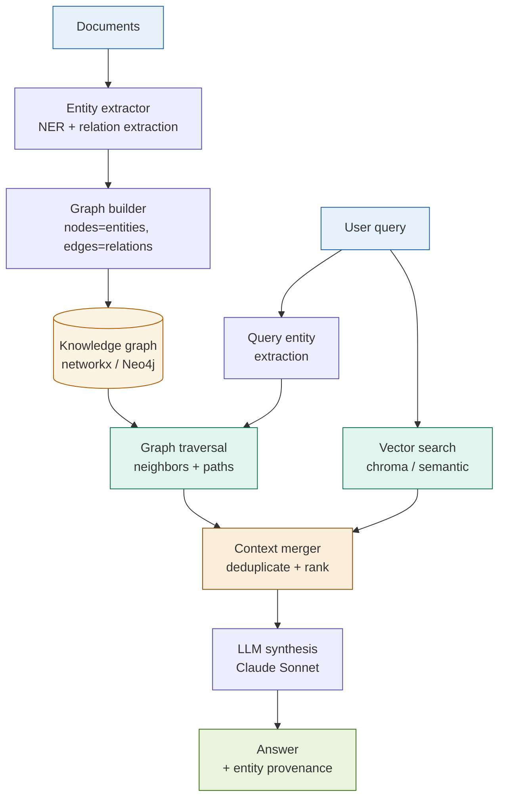

# 24: Graph RAG — Knowledge Graphs Meet Vector Search

---

## The Problem

Vector search retrieves chunks that are *similar* to a query. It cannot answer questions about *relationships between entities*.

**Example**: "Which counterparties are exposed to Acme Bank, and through what instruments?"

A vector search finds chunks that mention "Acme Bank". It does not know:
- That Delta Fund holds CDS on Acme Bank
- That Delta Fund is a subsidiary of Sigma Holdings
- That Sigma Holdings has $2B in unsecured exposure through three separate agreements

These relationships are distributed across dozens of chunks and multiple documents. Vector similarity cannot assemble them. A knowledge graph can.

---

## The Concept

Extract entities and relationships from your corpus into a graph. At query time, combine graph traversal (for relationship context) with vector search (for passage context).

```
Documents
    │
    ▼
[Extract entities + relationships]  ← one LLM call per chunk
    │
    ▼
Knowledge graph  (nodes = entities, edges = relationships)
    │
    ├─────────────────────────────┐
    ▼                             ▼
[Graph traversal]         [Community summaries]    [Vector search]
 Neighbors + paths        Global themes + clusters  Relevant passages
    │                             │                      │
    └─────────────────── Context merger ─────────────────┘
                                  │
                                  ▼
                        LLM synthesis → Answer + entity provenance
```

Two retrieval paths run in parallel: graph traversal for relational context, vector search for passage context. The merger combines them.

---

## Architecture



---

## Key Insight

> **Captures relationships that pure vector search misses.**

Standard retrieval asks: *Which chunks are similar to this query?*

Graph RAG asks two questions simultaneously:
1. *Which chunks are similar to this query?* (vector search)
2. *Which entities are related to the entities in this query, and how?* (graph traversal)

The answer to question 2 is structurally invisible to embeddings. An entity relationship ("Delta Fund holds CDS referencing Acme Bank") may not appear in any single chunk — it is assembled from edges across multiple documents. The graph makes it retrievable.

---

## Fintech Use Case: Counterparty Exposure Network

**Query**: "What are the downstream exposures if Acme Bank defaults?"

| Step | Retrieval path | What it finds |
|------|----------------|---------------|
| 1 | Graph traversal (hop 1) | Delta Fund: CDS referencing Acme Bank, notional $500M |
| 2 | Graph traversal (hop 1) | Sigma Corp: repo agreement, Acme Bank collateral, $200M |
| 3 | Graph traversal (hop 2) | Sigma Corp is subsidiary of Gamma Holdings; exposure consolidates upward |
| 4 | Vector search | Policy §7 on CDS settlement triggers; repo close-out netting procedures |
| 5 | Merge + synthesise | Full exposure map with instrument types, amounts, and applicable policy clauses |

**Why this matters**: Steps 1–3 are graph-only results. No vector search over the individual contract chunks would surface the consolidated Gamma Holdings exposure — that relationship only exists as an edge in the graph.

---

## Tradeoffs

| Dimension | Rating | Notes |
|-----------|--------|-------|
| Answer quality (relational) | ★★★★★ | No other pattern answers "who is connected to whom and how" |
| Answer quality (simple queries) | ★★★☆☆ | No improvement over standard RAG for single-entity lookups |
| Graph construction cost | ★☆☆☆☆ | One LLM call per chunk at index time — expensive for large corpora |
| Retrieval quality | ★★★★★ | Graph + vector is the richest context of any pattern |
| Latency | ★★☆☆☆ | Traversal is fast; synthesis latency dominates |
| Complexity | ★★★★★ | Five subsystems — extractor, builder, traversal, vector, merger |

---

## When to Use Graph RAG

**Use it when**:
- Queries require entity relationships ("connected to", "exposed through", "obligated by")
- Documents contain a dense network of named entities across many files
- Global or thematic questions span the full corpus, not a single document

**Avoid it when**:
- Documents have few named entities or relationships are not the point
- Corpus fits in a long-context window — use Long-Context RAG instead
- Latency is a hard constraint
- The team cannot maintain the graph schema as the domain evolves
