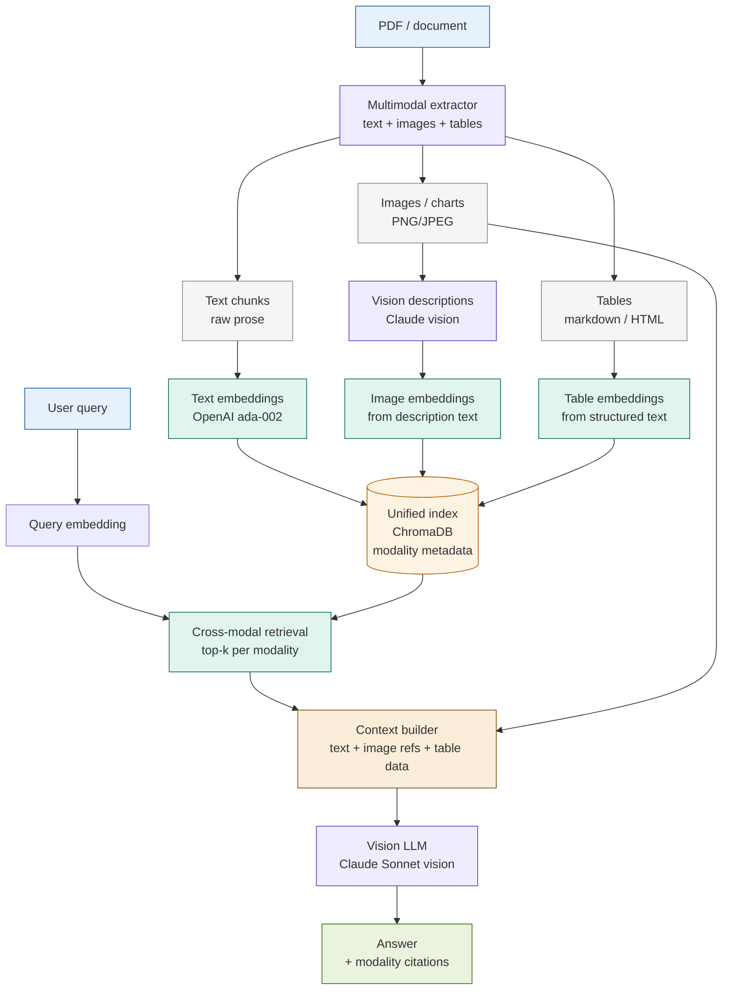

# Multimodal RAG

## What it is

Multimodal RAG extends standard retrieval-augmented generation to documents that contain images, charts, tables, and figures alongside text. Standard RAG indexes and retrieves text chunks; it discards or ignores visual content entirely. Multimodal RAG treats each modality — text, image, table — as a first-class indexable element. At index time, images and charts are processed through a vision-language model (VLM) to generate text descriptions that can be embedded and retrieved alongside raw text. Tables are parsed into structured representations that preserve their relational content. At query time, retrieval spans all modalities, and a vision LLM synthesises the final answer from both textual passages and visual elements.

The pattern is motivated by a fundamental limitation of text-only RAG on real-world financial documents: annual reports, earnings releases, prospectuses, and regulatory filings derive significant meaning from charts, tables, and diagrams. A question like "What was the trend in non-performing loans over the last four quarters?" cannot be answered from text alone if the answer exists only in a bar chart on page 12 of the 10-K.

## Source

**"MMRet: Multi-Modal Retrieval with Vision-Language Models"**
Chen et al., 2024.
arXiv:2407.01004. URL: https://arxiv.org/abs/2407.01004

## When to use it

- Documents contain charts, figures, or diagrams that carry meaning not present in surrounding text (e.g., a revenue trend chart where the text only says "see Figure 3").
- Tables are structurally important and prose extraction would lose row/column relationships (e.g., a regulatory capital table with 20 rows and 6 column headers).
- The query explicitly or implicitly asks about visual content: "What does the chart show?", "According to the table...", "What are the figures for...?"
- The document is a scan or image-heavy PDF where text extraction alone produces incomplete or garbled output.
- **Fintech trigger**: earnings report Q&A (revenue/cost trend charts), prospectus table analysis (fee schedules, risk factor summaries), trading dashboard screenshot interpretation, regulatory disclosure tables (capital ratios, liquidity metrics).

## When NOT to use it

- Documents are purely text-based with no meaningful visual content — the extraction overhead adds cost and latency for no retrieval gain.
- The visual content in the document is decorative (logos, borders, stock photos) rather than informational — vision description calls waste tokens.
- Response latency is a hard constraint — vision LLM calls are significantly more expensive and slower than text embedding lookups.
- The corpus is large and visual content changes frequently — re-indexing images requires re-running vision description generation, which is expensive at scale.

## Architecture

## Key components

| Component | Purpose | Default implementation |
|-----------|---------|----------------------|
| Multimodal extractor | Parse a PDF or document into separate streams: text chunks, image bytes, table structures | `unstructured` library for PDFs; base64 encoding for images; markdown serialisation for tables |
| Vision descriptor | Generate a text description of each image or chart for embedding and retrieval | Claude Haiku vision: prompt requests a structured description including chart type, axes, key values, and trends |
| Text/image embedder | Produce vector representations for all modality types from their text form | OpenAI `text-embedding-3-small`; applied to raw text, vision descriptions, and table markdown equally |
| Unified index | Store embeddings with modality metadata (`text`, `image`, `table`) for retrieval filtering | ChromaDB with `modality` and `source_page` metadata fields on each document |
| Cross-modal retriever | Retrieve top-k results per modality or across all modalities combined | Similarity search with optional `where={"modality": "image"}` filter for modality-specific queries |
| Context builder | Assemble the synthesis context: text passages as strings, images as base64 for vision input, table data as markdown | Separates retrieved chunks by modality; images are included as vision content blocks in the API call |
| Vision LLM synthesiser | Answer the query from a mixed context of text, images, and tables | Claude Sonnet with vision; system prompt instructs citation of specific charts and table rows |

## Step-by-step

1. **Extract text, images, and tables from the source document.** Use the `unstructured` library (or PyMuPDF for PDFs) to split the document into its constituent modalities. Text chunks follow standard chunking rules. Images are extracted as byte arrays (PNG/JPEG). Tables are serialised to markdown.
2. **Generate vision descriptions for images and charts.** For each extracted image, call Claude Haiku with a vision prompt asking for: chart type, axis labels and ranges, key data series, notable trends, and any text or numbers visible in the image. Store the description alongside the image bytes.
3. **Embed all modalities into a unified vector space.** Embed text chunks with `text-embedding-3-small`. Embed image vision descriptions with the same model (not the raw image bytes — embedding the description text produces a vector that responds to natural language queries). Embed table markdown similarly.
4. **Store in the unified index with modality metadata.** Each ChromaDB document carries `modality` (`text`, `image`, `table`), `source_page`, and for images, a reference ID that links back to the stored image bytes.
5. **At query time, run cross-modal retrieval.** Embed the user query and retrieve top-k documents from the unified index. Optionally retrieve top-k per modality separately to guarantee modality diversity in the context (prevents all-text results when images are relevant).
6. **Build the synthesis context.** Text and table results are included as strings. Image results are resolved back to their bytes and included as base64 vision content blocks in the API request.
7. **Call the vision LLM with mixed-modality context.** Claude Sonnet processes the combined context — text blocks and image blocks in the same messages array. The system prompt requires the answer to cite specific elements: "According to Figure 2..." or "As shown in the table on page 4...".

Steps 2–4 correspond to notebook cell 3; steps 5–7 to cells 4–5.

## Fintech use cases

- **Earnings report chart Q&A:** A quarterly earnings PDF contains revenue trend charts, operating margin waterfall charts, and segment breakdown pie charts. The text may say only "revenue increased — see Figure 1." Multimodal RAG extracts Figure 1, generates a vision description (bar chart, quarterly revenue, Q1–Q4 2024, $1.2B → $1.8B growth), embeds it, and retrieves it for queries about revenue trends. The answer cites the chart directly rather than hedging with "no data found."
- **Prospectus table extraction:** Fund prospectuses contain multi-page fee tables, risk factor tables, and portfolio composition tables. Table parsing preserves column headers and row relationships that prose extraction would flatten. A query about management fees retrieves the structured table row: `| Equity fund | 0.75% | 12b-1: 0.25% | Total: 1.00% |` — not a garbled linearisation.
- **Trading dashboard screenshot analysis:** Operations teams capture screenshots of trading dashboards showing P&L attribution, position limits, and VaR figures. These screenshots contain no extractable text. Multimodal RAG describes the dashboard visually ("heat map showing 15 trading desks, 3 desks in red exceeding daily limit") and makes this operational data queryable.
- **Regulatory disclosure comparison:** Basel III Pillar 3 reports contain dense capital adequacy tables (CET1, AT1, Tier 2 by risk category) across multiple reporting periods. Table-aware retrieval preserves the row/column structure so a query comparing two periods returns aligned data, not interleaved prose fragments.

## Tradeoffs

| Dimension | Rating | Notes |
|-----------|--------|-------|
| Answer quality (visual queries) | ★★★★☆ | Uniquely answers questions whose evidence exists only in charts, tables, or figures |
| Answer quality (text queries) | ★★★☆☆ | No improvement over standard RAG; vision extraction adds overhead with no text-query benefit |
| Extraction complexity | ★★★★☆ | PDF extraction quality varies by document type; scanned PDFs need OCR; image quality affects vision descriptions |
| Vision LLM cost | ★★☆☆☆ | Each image description call costs ~5–10× a text embedding; large image-heavy corpora are expensive to index |
| Retrieval quality | ★★★★☆ | Cross-modal retrieval works well when vision descriptions are accurate; degrades if descriptions miss key chart values |
| Complexity | ★★★★☆ | Three extraction pipelines (text/image/table) + vision description + unified index + vision synthesis |

## Common pitfalls

- **PDF extraction quality varies dramatically.** Native (digitally-created) PDFs yield clean text and crisp image extractions. Scanned PDFs require OCR (Tesseract, AWS Textract) and produce noisier text. Image-heavy presentations may have text embedded as images. Always inspect extraction output on a sample before building the full index — garbage extraction produces unretriavable content regardless of the retrieval quality.
- **Vision descriptions must be structured, not prose.** A vision description prompt that asks "describe this image" produces narrative text that embeds poorly. A prompt that asks for "chart type, axis labels with units, numerical values at key points, trend direction" produces a structured description that embeds into a vector that responds to numerical queries ("revenue in Q3"). Invest in the description prompt.
- **Table parsing is the hardest extraction problem.** Multi-row headers, merged cells, and footnotes in financial tables regularly confuse off-the-shelf table parsers. The `unstructured` library handles common cases; for production use with complex regulatory tables, consider dedicated table extraction tools (Camelot, pdfplumber) or a vision LLM call directly on the table image.
- **Vision model calls are expensive at index time.** At current Claude Haiku vision pricing, describing 100 chart images costs ~$0.50–1.00. For a corpus of 50 earnings PDFs averaging 20 charts each (1,000 charts), expect $5–10 in vision description costs. Index once, retrieve many times — but plan for re-indexing costs when documents are updated.
- **Context window budget with mixed modality.** Each image in the synthesis call consumes tokens proportional to its pixel dimensions (Claude charges by tile). A high-resolution chart can consume 1,000–2,000 tokens. Cap the number of images in the synthesis context (`MAX_IMAGES=3`) and resize images before encoding to control token spend.
- **Modality diversity in retrieval.** If all retrieved documents are text chunks and the answer is in a chart, the query fails silently — the LLM answers from text alone and the chart is never consulted. Enforce modality diversity: retrieve top-k/2 text + top-k/4 images + top-k/4 tables rather than top-k from the unified index. This guarantees chart and table evidence is always considered.

## Related patterns

- **15 Long-Context RAG** — For image-heavy PDFs where the full document fits in the context window, passing the entire document to a vision LLM (Claude's 200K window supports mixed text + image content) avoids the extraction and indexing overhead entirely. Long-Context RAG is simpler; Multimodal RAG scales to corpora that exceed the context window. Use Long-Context for single documents; use Multimodal RAG for corpus-scale visual retrieval.
- **13 Contextual RAG** — The vision description step in Multimodal RAG is analogous to contextual prepending in Contextual RAG: both enrich an element with document-level context before embedding. The Contextual RAG principle (prepend context to each chunk) applies directly to image descriptions — include the document title, section heading, and figure caption in the vision description prompt to anchor the embedding.
- **14 Multi-Vector RAG** — Multi-Vector RAG indexes multiple representations of the same chunk (summary + raw + hypothetical questions). Multimodal RAG applies the same principle across modalities: the same information (e.g., a quarterly revenue figure) may be retrievable from the text section, the chart description, and the table row. Building cross-modal links between representations of the same underlying data improves recall.
